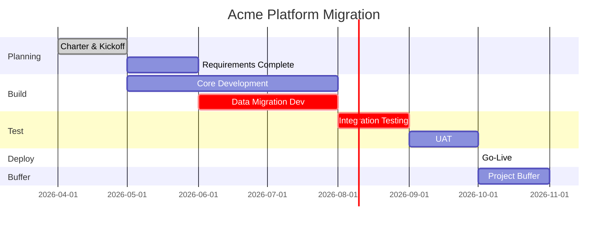

# Schedule Baseline — Acme Corp Platform Migration

## TL;DR
7-month baseline with 5 phases, 18 milestones, and 1.2-month project buffer. Critical path runs through data migration and integration testing. P80 completion: Month 8.2. [SCHEDULE]

## 1. Milestone Summary

## 2. Critical Path

| Activity | Duration | Float | On CP? |
|----------|:--------:|:-----:|:------:|
| Requirements gathering | 4 weeks | 2 weeks | No |
| Architecture design | 3 weeks | 0 | **Yes** [SCHEDULE] |
| Data migration development | 8 weeks | 0 | **Yes** |
| Core API development | 10 weeks | 1 week | No |
| Integration testing | 4 weeks | 0 | **Yes** |
| UAT | 3 weeks | 1 week | No |
| Production deployment | 1 week | 0 | **Yes** |

**Critical Path Length: 24 weeks** (Architecture → Data Migration → Integration → Deploy)

## 3. Schedule Confidence

| Level | Completion Date | Buffer Used |
|:-----:|:---------------:|:-----------:|
| P50 | Month 7.0 (Oct 2026) | 0% |
| P80 | Month 8.2 (Nov 2026) | 100% project buffer |
| P90 | Month 9.0 (Dec 2026) | + management reserve |
| Baseline | Month 7.0 | — |

## 4. Key Dependencies

| Predecessor | Successor | Type | Lag |
|-------------|-----------|:----:|:---:|
| Architecture design | Data migration dev | FS | 0 |
| Data migration dev | Integration testing | FS | 0 |
| Core API development | Integration testing | FS | 0 |
| Integration testing | UAT | FS | 1 week |
| UAT sign-off | Production deployment | FS | 0 |

## 5. Resource-Leveled Allocation

| Month | FTE Required | Available | Delta |
|:-----:|:-----------:|:---------:|:-----:|
| 4 | 4 | 6 | +2 [METRIC] |
| 5-6 | 7 | 6 | -1 (contractor needed) |
| 7-8 | 8 | 8 | 0 |
| 9 | 6 | 8 | +2 |
| 10 | 3 | 8 | +5 (ramp down) |

*PMO-APEX v1.0 — Sample Output · Schedule Baseline*
