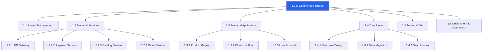

# WBS — Acme Corp E-Commerce Platform

## TL;DR
4-level WBS with 6 level-1 deliverables, 22 work packages. Estimated total: 42 FTE-months. 100% rule validated. [PLAN]

## 1. WBS Tree

## 2. Work Package Summary

| WP ID | Name | Owner | Effort | Dependencies |
|-------|------|-------|:------:|-------------|
| 1.1.1 | Project planning & monitoring | PM | 6 FTE-mo | None [PLAN] |
| 1.2.1 | API Gateway development | Backend Lead | 3 FTE-mo | 1.4.1 |
| 1.2.2 | Payment service integration | Backend Dev | 4 FTE-mo | 1.2.1 |
| 1.2.3 | Catalog service | Backend Dev | 3 FTE-mo | 1.4.1 |
| 1.2.4 | Order management service | Backend Dev | 4 FTE-mo | 1.2.2, 1.2.3 |
| 1.3.1 | Product pages (UI) | Frontend Dev | 3 FTE-mo | 1.2.3 |
| 1.3.2 | Checkout flow (UI) | Frontend Dev | 3 FTE-mo | 1.2.2 |
| 1.3.3 | User account management | Frontend Dev | 2 FTE-mo | 1.2.1 |
| 1.4.1 | Database schema design | Data Eng | 2 FTE-mo | None |
| 1.4.2 | Legacy data migration | Data Eng | 3 FTE-mo | 1.4.1 |
| 1.4.3 | Search index setup | Data Eng | 1 FTE-mo | 1.4.1 |
| 1.5.1 | Test strategy & automation | QA Lead | 4 FTE-mo | 1.2.1 [METRIC] |
| 1.6.1 | CI/CD pipeline & deployment | DevOps | 2 FTE-mo | None |
| 1.6.2 | Production go-live | DevOps + PM | 2 FTE-mo | 1.5.1 |
| **Total** | | | **42 FTE-mo** | |

## 3. Scope Boundaries

| In Scope | Out of Scope |
|----------|-------------|
| Core e-commerce platform (catalog, cart, checkout) | Mobile native app (Phase 2) |
| Payment integration (Stripe) | Multi-currency support |
| User account management | Social login (Phase 2) |
| Legacy data migration | Historical data > 3 years |
| Search functionality (Elasticsearch) | AI-powered recommendations |

*PMO-APEX v1.0 — Sample Output · Scope WBS*
