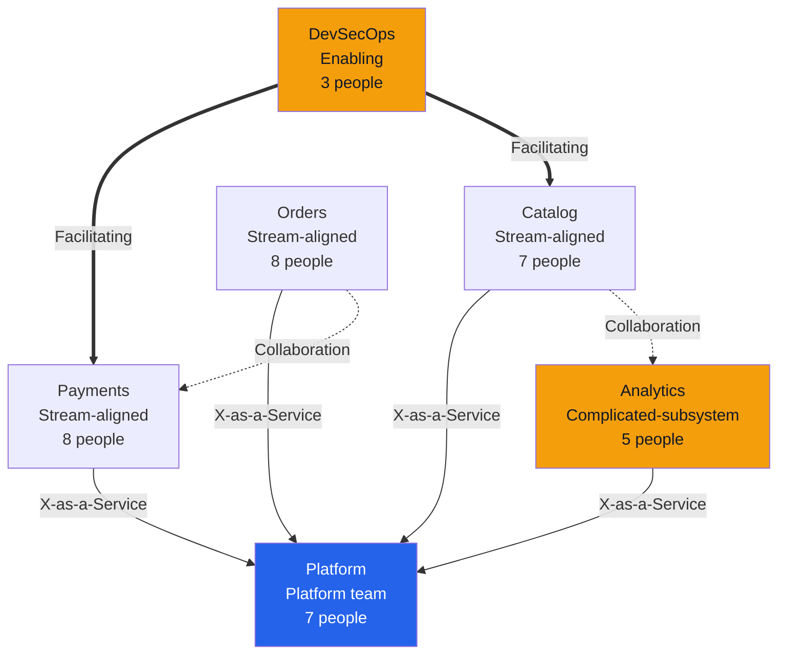

# 02 Team Topology Design — Acme Corp Digital Platform

> **Proyecto:** Acme Corp Digital Platform | **Fecha:** 15 de marzo de 2026
> **Tipo:** Agile-Transformation | **Modo:** supervisado

---

## Executive Summary

Team topology designed for 38-person engineering organization using Team Topologies framework. 4 stream-aligned teams, 1 platform team, 1 enabling team. Cognitive load assessment identifies 1 overloaded team requiring boundary adjustment. Interaction mode matrix defines 2 collaboration engagements and 3 X-as-a-Service relationships. [PLAN]

---

## Team Classification

| Team | Type | Size | Domain | Services Owned | Evidence |
|------|------|:----:|--------|:--------------:|---------|
| Payments | Stream-aligned | 8 | Payment processing | 3 | [PLAN] |
| Catalog | Stream-aligned | 7 | Product catalog + search | 4 | [PLAN] |
| Orders | Stream-aligned | 8 | Order lifecycle + fulfillment | 5 | [PLAN] |
| Analytics | Complicated-subsystem | 5 | ML recommendations + analytics | 2 | [PLAN] |
| Platform | Platform | 7 | CI/CD, infra, observability | 6 | [PLAN] |
| DevSecOps Enablers | Enabling | 3 | Security practices adoption | 0 (capability, not services) | [PLAN] |

---

## Cognitive Load Assessment

| Team | Domains | Services | Tech Stacks | Dependencies | On-Call | Overall Load | Evidence |
|------|:-------:|:--------:|:-----------:|:------------:|:------:|:------------:|---------|
| Payments | 1 | 3 | 2 | 1 | 1 | **Low** | [METRIC] |
| Catalog | 2 | 4 | 3 | 2 | 2 | **Medium** | [METRIC] |
| Orders | 2 | 5 | 3 | 3 | 3 | **HIGH** | [METRIC] |
| Analytics | 1 | 2 | 2 | 1 | 1 | **Low** | [METRIC] |
| Platform | 1 | 6 | 4 | 0 | 3 | **Medium** | [METRIC] |

> **Action required:** Orders team is overloaded (High on 3 dimensions). Recommend splitting fulfillment into separate stream-aligned team when headcount allows. [PLAN]

---

## Interaction Mode Matrix

| Team Pair | Current Mode | Target Mode | Timeline | Evidence |
|-----------|-------------|-------------|----------|---------|
| Payments ↔ Platform | X-as-a-Service | X-as-a-Service | Stable | [PLAN] |
| Catalog ↔ Analytics | Collaboration | X-as-a-Service | Sprint 8 (API stabilization) | [PLAN] |
| Orders ↔ Payments | Collaboration | X-as-a-Service | Sprint 10 (order-payment API) | [PLAN] |
| All ↔ DevSecOps Enablers | Facilitating | Complete by Sprint 12 | Time-boxed | [PLAN] |
| All ↔ Platform | X-as-a-Service | X-as-a-Service | Stable | [PLAN] |

---

## Team Topology Map

---

*PMO-APEX v1.0 — Team Topology Design · Acme Corp Digital Platform*
