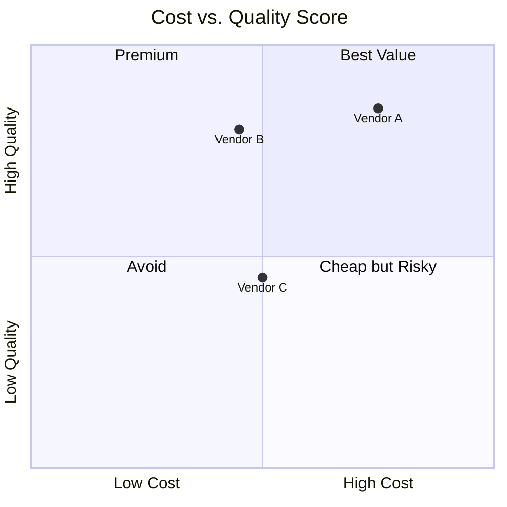

# Vendor Cost Analysis — Acme Corp Development Outsourcing

## TL;DR
Three vendors compared for 6-month backend development engagement. Vendor B (nearshore) recommended: lowest TCO at 28 FTE-months equivalent, best quality track record, acceptable timezone overlap. [METRIC]

## 1. Vendor Proposals (Direct Costs)

| Dimension | Vendor A (Local) | Vendor B (Nearshore) | Vendor C (Offshore) |
|-----------|:----------------:|:-------------------:|:------------------:|
| Team size | 4 developers | 5 developers | 6 developers |
| Duration | 6 months | 6 months | 7 months |
| Direct FTE-months | 24 | 30 | 42 |
| Rate premium vs. internal | +15% | -10% | -40% |
| Timezone overlap | 100% | 75% | 25% |

## 2. Total Cost of Ownership

| Cost Category | Vendor A | Vendor B | Vendor C |
|--------------|:--------:|:--------:|:--------:|
| Direct delivery | 24 FTE-mo | 30 FTE-mo | 42 FTE-mo |
| Management overhead (15%) | 3.6 | 4.5 | 6.3 |
| Onboarding (2-4 weeks) | 2.0 | 2.5 | 4.0 |
| Quality rework (est.) | 1.0 | 1.5 | 5.0 |
| Communication overhead | 0.5 | 1.5 | 4.0 |
| Exit/transition | 1.0 | 1.5 | 2.0 |
| **Total TCO** | **32.1** | **41.5** | **63.3** |
| **TCO (rate-adjusted)** | **36.9** | **28.0** | **31.7** |

[METRIC] — Rate-adjusted TCO accounts for rate differentials across vendors.

## 3. Value-Adjusted Comparison

## 4. Recommendation

| Criterion | Vendor A | Vendor B | Vendor C |
|-----------|:-------:|:-------:|:-------:|
| TCO (rate-adjusted) | 3rd | **1st** | 2nd |
| Quality track record | **1st** | 2nd | 3rd |
| Communication ease | **1st** | 2nd | 3rd |
| Scalability | 3rd | **1st** | **1st** |
| **Overall Rank** | **2nd** | **1st** | **3rd** |

**Recommendation: Vendor B (Nearshore)** — Best balance of cost, quality, and communication. [PLAN]

**Risk:** Timezone overlap at 75% requires structured async communication protocol. [SUPUESTO]

*PMO-APEX v1.0 — Sample Output · Vendor Cost Analysis*
