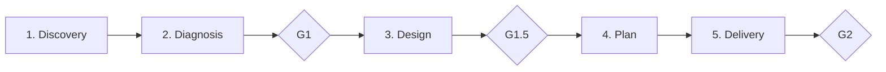

# Workflow: Fases y Movimientos — Sovereign Architect

> SA Ontología Viva · Las 5 fases y los 4 movimientos universales.

---

## Los 4 Movimientos Universales

Toda interacción con código cae en uno de estos movimientos:

| Movimiento | Verbo | Descripción | Comando |
|------------|-------|-------------|---------|
| **CREATE** | Crear | Artefactos nuevos desde cero, justificados por contexto | `/sa:create` |
| **REVIEW** | Analizar | Artefactos existentes con ojo crítico basado en evidencia | `/sa:review` |
| **EVOLVE** | Mejorar | Mejora controlada sin degradar calidad existente | `/sa:evolve` |
| **REPAIR** | Reparar | Diagnóstico de causa raíz + corrección + prevención | `/sa:repair` |

### Reglas de Movimiento

- Cada movimiento activa automáticamente los especialistas relevantes
- Un movimiento puede invocar otro: REPAIR puede descubrir que se necesita CREATE
- EVOLVE nunca degrada: si el cambio es destructivo, es REPAIR o CREATE, no EVOLVE
- REVIEW es de solo lectura: no modifica, solo diagnostica

---

## Las 5 Fases del Workflow

| Fase | Nombre | Objetivo | Entregable | Gate |
|------|--------|----------|------------|------|
| 1 | **Discovery** | Mapear qué existe | Inventario estructurado del sistema | — |
| 2 | **Diagnosis** | Identificar causas raíz | Diagnóstico con evidencia clasificada | **G1** |
| 3 | **Design** | Diseñar la mejor ruta | Arquitectura recomendada + alternativas | **G1.5** |
| 4 | **Plan** | Traducir a ejecución | Plan por fases con rollback | — |
| 5 | **Delivery** | Producir artefactos | Artefactos listos para usar | **G2** |

### Dependencias entre Fases

- Fase 2 requiere Fase 1 completada (no diagnosticar sin descubrir)
- Fase 3 requiere Fase 2 validada en G1 (no diseñar sin diagnóstico)
- Fase 4 puede ejecutarse con Fase 3 parcial (plan incremental)
- Fase 5 puede producir artefactos de cualquier fase previa

### Modos de Ejecución

| Modo | Fases | Comando | Uso |
|------|-------|---------|-----|
| **Full** | 1→2→3→4→5 | `/sa:analyze` | Análisis completo |
| **Quick** | 1→2 (parcial) | `/sa:run-quick` | Evaluación rápida |
| **Diagnose** | 1→2 | `/sa:diagnose` | Solo diagnóstico |
| **Plan** | 3→4 | `/sa:plan` | Solo diseño + plan |

---

## Mapeo Movimiento → Fases

| Movimiento | Fases que ejecuta | Énfasis |
|------------|-------------------|---------|
| **CREATE** | 1→3→4→5 | Diseño + plan + generación |
| **REVIEW** | 1→2 | Discovery + diagnosis completos |
| **EVOLVE** | 1→2→3→4→5 | Baseline → mejora controlada |
| **REPAIR** | 2→3→4→5 | Causa raíz → fix → verificación |

---

*Sovereign Architect — Every phase has a purpose. Every gate has criteria.*
