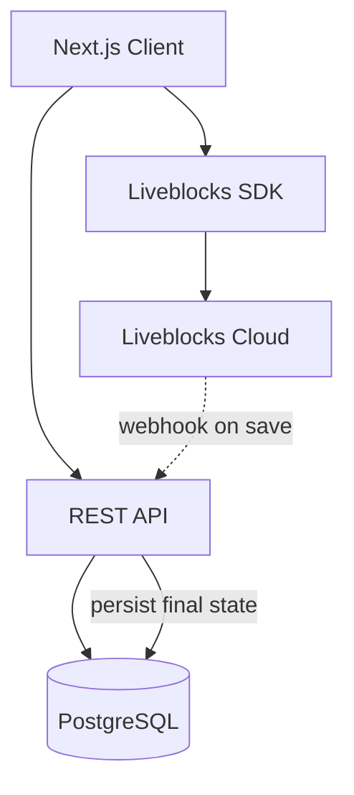

# Architecture Design — Sample Output

## Context
A team needs to add real-time collaboration to an existing document editor. The current architecture is a Next.js frontend with a PostgreSQL-backed REST API. The team has 4 engineers and a 6-week timeline.

## Output

### Constraint Map

| Constraint Type | Details |
|----------------|---------|
| **Technical** | Existing REST API (Express), PostgreSQL 15, Next.js 14, no WebSocket infrastructure `[HECHO]` |
| **Organizational** | 4 engineers, 1 has WebSocket experience, 6-week deadline `[STAKEHOLDER]` |
| **Business** | Must support 50 concurrent editors per document, real-time cursor presence `[STAKEHOLDER]` |
| **Operational** | Current infra is AWS ECS, no sticky sessions configured `[HECHO]` |

### Options Matrix

| Dimension | Option A: Yjs + WebSocket | Option B: Liveblocks (SaaS) | Option C: Firebase Realtime DB |
|-----------|--------------------------|----------------------------|-------------------------------|
| Complexity | 4/5 — CRDT implementation | 2/5 — SDK integration | 3/5 — Data model restructuring |
| Risk | Medium — team must learn CRDTs | Low — vendor handles complexity | Medium — vendor lock-in on data layer |
| Time to ship | 5-6 weeks | 2-3 weeks | 3-4 weeks |
| Scalability | High — self-hosted, tunable | High — vendor-managed | Medium — Firebase concurrent limits |
| Maintainability | High — open source, full control | Medium — dependent on vendor roadmap | Low — deeply coupled to Firebase |
| Team fit | Low — 1/4 engineers have WS experience | High — React hooks familiar to all | Medium — Firebase SDK learning curve |
| Cost (year 1) | ~$200/mo infrastructure | ~$800/mo at projected usage | ~$400/mo at projected usage |

### Recommendation

**Option B (Liveblocks)** for initial launch — ships within timeline with lowest risk. Plan migration to **Option A (Yjs)** in Q3 when team has bandwidth to invest in self-hosted CRDT infrastructure.

### ADR-007: Real-Time Collaboration Strategy

**Context**: Product requires real-time collaborative editing with cursor presence. Team has limited WebSocket experience and a 6-week window.

**Decision**: Adopt Liveblocks SaaS for initial release. Encapsulate behind a collaboration adapter interface to enable future migration.

**Consequences**:
- (+) Ships within 3 weeks, freeing 3 weeks for polish and edge cases
- (+) Reduced operational burden — no WebSocket server management
- (-) Monthly SaaS cost (~$800/mo)
- (-) Vendor dependency for a core feature
- (neutral) Adapter interface adds ~2 days of work but enables future migration

**Alternatives rejected**:
- Yjs + WebSocket: Exceeds timeline given team experience gap
- Firebase: Introduces data layer coupling that conflicts with existing PostgreSQL strategy

### Component Diagram

