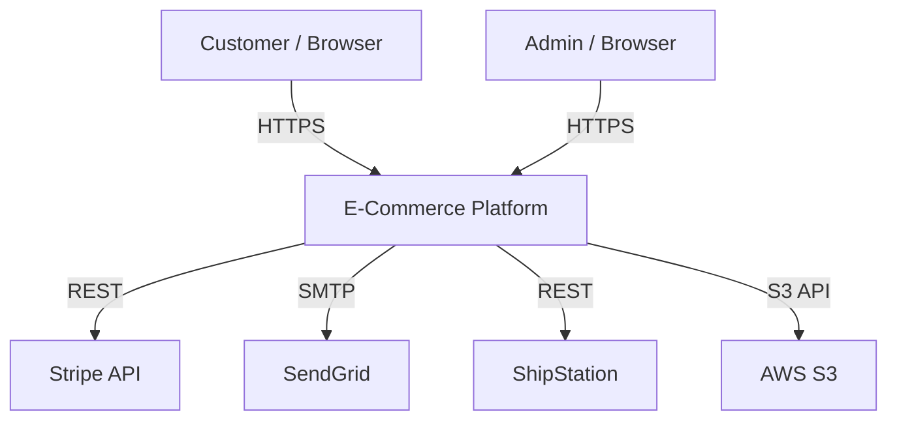

# Architecture Mapper — Sample Output

## Context
Mapping the architecture of an e-commerce platform monorepo.

## Output

### C4 Level 1 — System Context

### C4 Level 2 — Containers

| Container | Technology | Role | Evidence |
|-----------|-----------|------|----------|
| Web Frontend | Next.js 14 | SSR storefront | `apps/web/` `[HECHO]` |
| Admin Dashboard | React + Vite | Internal tooling | `apps/admin/` `[HECHO]` |
| API Gateway | Express.js | Request routing, auth | `services/gateway/` `[HECHO]` |
| Order Service | NestJS | Order lifecycle | `services/orders/` `[HECHO]` |
| Inventory Service | NestJS | Stock management | `services/inventory/` `[HECHO]` |
| PostgreSQL | v16 | Primary datastore | `docker-compose.yml` `[HECHO]` |
| Redis | v7.2 | Cache + sessions | `docker-compose.yml` `[HECHO]` |
| RabbitMQ | v3.12 | Async messaging | `docker-compose.yml` `[HECHO]` |

### Architectural Pattern
**Modular monolith transitioning to microservices** `[INFERENCIA]`
- Services share a database (monolith trait) but communicate via RabbitMQ (microservice trait)
- No API gateway service mesh — direct HTTP calls between services observed
