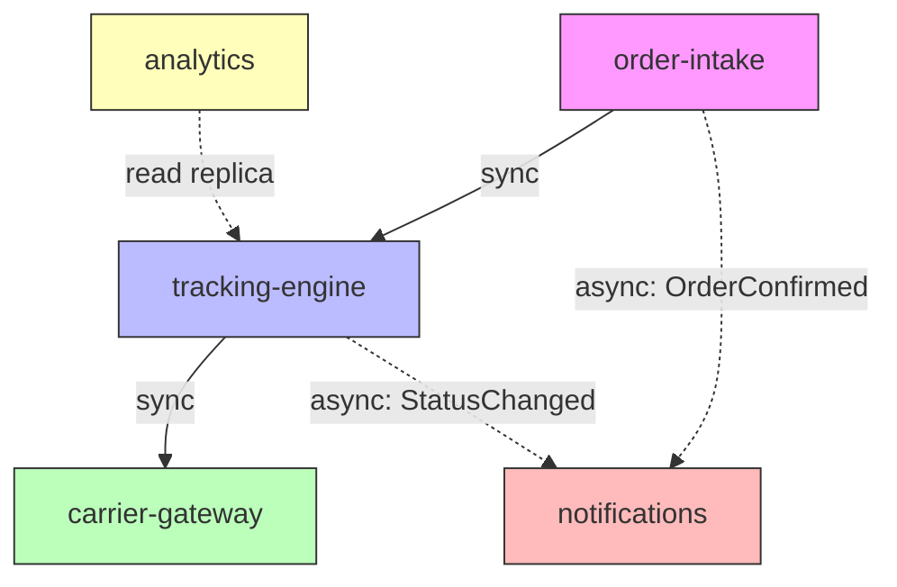

# Component Designer — Sample Output

## Context
A logistics SaaS company needs to design the component architecture for their shipment tracking platform. The system handles order intake, carrier integration, real-time tracking, customer notifications, and analytics.

## Output

### Component Catalog

| Component | Responsibility | Public Interface | Owned Data | Dependencies |
|-----------|---------------|-----------------|------------|-------------|
| **order-intake** | Receives and validates shipment orders from clients | `OrderService` (create, cancel, getStatus) | orders, line_items | notifications (async) |
| **carrier-gateway** | Abstracts carrier APIs behind a unified interface | `CarrierAdapter` (book, track, cancel) | carrier_credentials, rate_cache | — (leaf component) |
| **tracking-engine** | Processes tracking events and maintains shipment state machine | `TrackingService` (getPosition, getETA, getHistory) | tracking_events, shipment_states | carrier-gateway (sync), notifications (async) |
| **notifications** | Delivers alerts via email, SMS, webhook | `NotificationService` (send, getDeliveryStatus) | notification_log, templates | — (leaf component) |
| **analytics** | Aggregates operational metrics and SLA reporting | `AnalyticsQuery` (getSLAReport, getCarrierPerformance) | aggregated_metrics | tracking-engine (read replica) |

### Dependency Rules
1. `order-intake` → `tracking-engine`: synchronous call to initiate tracking.
2. `tracking-engine` → `carrier-gateway`: synchronous call to poll carrier APIs.
3. `tracking-engine` → `notifications`: asynchronous event (`ShipmentStatusChanged`).
4. `order-intake` → `notifications`: asynchronous event (`OrderConfirmed`).
5. `analytics` reads from `tracking-engine`'s read replica — no runtime dependency.
6. **No component may depend on `analytics`** (analytics is a terminal consumer).

### Component Topology



### Interface Contract Example — TrackingService

```typescript
interface TrackingService {
  getPosition(shipmentId: string): Promise<GeoPosition>;
  getETA(shipmentId: string): Promise<ETAEstimate>;
  getHistory(shipmentId: string, options?: PaginationOptions): Promise<TrackingEvent[]>;
}

interface GeoPosition {
  latitude: number;
  longitude: number;
  timestamp: ISO8601String;
  accuracy: 'GPS' | 'CELL' | 'CARRIER_REPORTED';
}
```

### Versioning Strategy
- All public interfaces follow semantic versioning (MAJOR.MINOR.PATCH).
- Breaking changes require a new major version and a 90-day deprecation window for the old version.
- Consumer-driven contract tests run in CI for every interface change.
