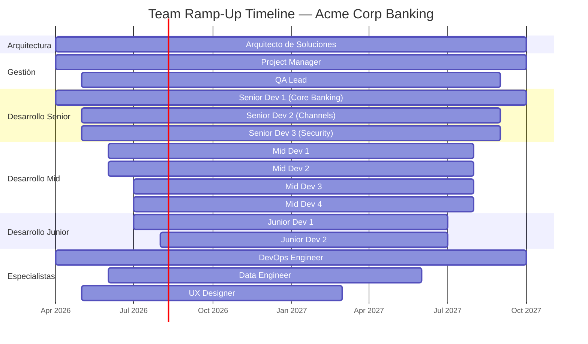
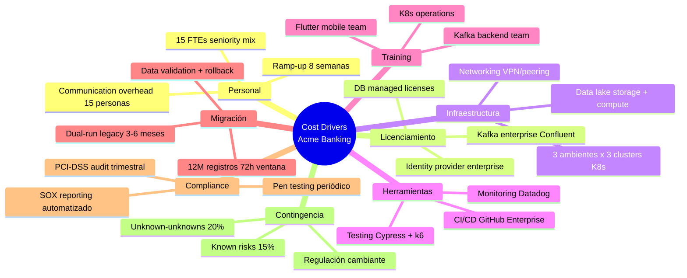

# 06 Cost Drivers: Acme Corp Banking Modernization

**Generated:** 12 de marzo de 2026 | **Variante:** Técnica (full) | **Fase:** Post-Discovery

---

## S1: Scope Decomposition & Effort Drivers

### WBS — 5 Epics, 15 Features

| Epic | Feature | Complejidad | Effort Drivers |
|---|---|---|---|
| **E1: Core Banking Migration** | F1.1 Account Management Rewrite | Complex (10+d) | Integración con 3 sistemas legacy, migración de 12M registros |
| | F1.2 Transaction Engine Modernization | Complex (10+d) | Concurrencia alta (8K TPS), regulación PCI-DSS |
| | F1.3 Interest Calculation Service | Medium (3-10d) | Lógica de negocio compleja, 47 reglas de cálculo |
| **E2: Digital Channels** | F2.1 Mobile Banking App | Complex (10+d) | iOS + Android nativo, biometría, curva de aprendizaje Flutter |
| | F2.2 Web Portal Redesign | Medium (3-10d) | Migración de Angular 8 a Angular 17, accesibilidad WCAG 2.1 |
| | F2.3 API Gateway & BFF | Medium (3-10d) | Rate limiting, OAuth2/OIDC, 23 endpoints |
| **E3: Data Platform** | F3.1 Data Lake Implementation | Complex (10+d) | 3 fuentes heterogéneas, PII masking, compliance SOX |
| | F3.2 Real-Time Analytics Pipeline | Medium (3-10d) | Kafka + Flink, 15 event types, latencia <500ms |
| | F3.3 Reporting & BI Layer | Simple (<3d) | 12 dashboards predefinidos, conexión a data lake |
| **E4: Security & Compliance** | F4.1 IAM Modernization | Complex (10+d) | SSO federation, MFA, 4 identity providers |
| | F4.2 Fraud Detection Engine | Complex (10+d) | ML models, real-time scoring, 200ms SLA |
| | F4.3 Audit & Regulatory Reporting | Medium (3-10d) | SOX, PCI-DSS, reportes trimestrales automatizados |
| **E5: DevOps & Infrastructure** | F5.1 CI/CD Pipeline | Simple (<3d) | GitOps, 4 ambientes, blue-green deployment |
| | F5.2 Kubernetes Platform | Medium (3-10d) | 3 clusters (dev/staging/prod), service mesh Istio |
| | F5.3 Observability Stack | Simple (<3d) | OpenTelemetry, Grafana, alerting PagerDuty |

### Dependency Map

- F1.1 → F2.3 (API Gateway depende de Account Management)
- F3.1 → F3.2 → F3.3 (Data pipeline secuencial)
- F4.1 → F2.1, F2.2 (Channels dependen de IAM)
- F5.1, F5.2 → todos los demás epics (infra es prerrequisito)

---

## S2: Sizing Methods (Magnitud, no Valor)

### T-Shirt Sizing

| Epic | T-Shirt | FTE-Meses |
|---|---|---|
| E1: Core Banking Migration | XL | 45-60 |
| E2: Digital Channels | L | 30-40 |
| E3: Data Platform | L | 25-35 |
| E4: Security & Compliance | L | 25-35 |
| E5: DevOps & Infrastructure | M | 15-20 |
| **TOTAL** | **L-XL** | **140-190** |

### Triangulación de Magnitud

| Método | Resultado | Divergencia |
|---|---|---|
| T-shirt sizing | 140-190 FTE-meses | baseline |
| Three-point (PERT) | 155-175 FTE-meses | -3% a +5% |
| Reference-class (banca similar, LatAm) | 130-200 FTE-meses | -7% a +5% |
| COCOMO II (~280 KSLOC estimadas) | 145-185 FTE-meses | +3% a -3% |

**Magnitud triangulada: 150-180 FTE-meses** (divergencia <10% entre métodos).

---

## S3: Team Composition Modeling

### Modelo de Equipo por Fase

| Rol | Cantidad | Dedicación | Fases Activas |
|---|---|---|---|
| Arquitecto de Soluciones | 1 | 100% | Todas |
| Project Manager | 1 | 100% | Todas |
| QA Lead | 1 | 100% | F2-F5 |
| Senior Developer | 3 | 100% | F1-F5 |
| Mid Developer | 4 | 100% | F2-F5 |
| Junior Developer | 2 | 100% | F2-F5 |
| DevOps Engineer | 1 | 50% → 100% | F1 (50%), F2-F5 (100%) |
| Data Engineer | 1 | 100% | F2-F4 |
| UX Designer | 1 | 100% → 50% | F1-F2 (100%), F3 (50%) |

### Ramp-Up

- Semanas 1-2: 50% productividad (onboarding, accesos, contexto)
- Semana 4: 80% productividad (dominio parcial)
- Semana 8: 100% productividad (dominio completo)

### Gantt — Ramp-Up del Equipo



---

## S4: Cost Driver Taxonomy

### Taxonomía Completa — 8 Categorías

| # | Categoría | Driver | Magnitud | Fase(s) | Owner |
|---|---|---|---|---|---|
| 1 | **Personal** | 15 FTEs × seniority mix (3S/4M/2J + 3 especialistas) | Crítico | Todas | PM |
| 2 | **Personal** | Ramp-up 8 semanas a productividad completa | Alto | F1 | PM |
| 3 | **Licenciamiento** | Kafka enterprise tier (Confluent) | Alto | F2-F5 | Arquitecto |
| 4 | **Licenciamiento** | Identity provider enterprise (Okta/Auth0) | Medio | F2-F5 | Security Lead |
| 5 | **Infraestructura** | 3 ambientes × 3 clusters K8s + DB managed | Crítico | F1-F5 | DevOps |
| 6 | **Infraestructura** | Storage para data lake (S3/GCS + compute Spark) | Alto | F2-F4 | Data Engineer |
| 7 | **Herramientas** | CI/CD (GitHub Enterprise), monitoring (Datadog), testing (Cypress/k6) | Medio | Todas | DevOps |
| 8 | **Training** | Capacitación Flutter (equipo mobile), Kafka (equipo backend) | Medio | F1 | Tech Lead |
| 9 | **Migración** | 12M registros, ventana de migración 72h, rollback plan | Crítico | F3 | DBA + Arquitecto |
| 10 | **Migración** | Dual-run de sistemas legacy (3-6 meses paralelo) | Alto | F3-F4 | PM |
| 11 | **Compliance** | PCI-DSS audit + penetration testing trimestral | Alto | F3-F5 | Security Lead |
| 12 | **Compliance** | SOX reporting automatizado + auditoría externa | Medio | F4 | Compliance |
| 13 | **Contingencia** | Known risks: integración legacy, performance bajo carga | Alto (15%) | Todas | PM |
| 14 | **Contingencia** | Unknown-unknowns: regulación cambiante, vendor changes | Alto (20%) | Todas | PM |
| 15 | **Oportunidad** | Costo de NO hacer: $X/año en incidentes operacionales legacy | Crítico | Pre-proyecto | Sponsor |

### Mindmap — Taxonomía de Cost Drivers



---

## S5: Risk-Adjusted Timeline Ranges

### PERT por Epic

| Epic | Optimista | Probable | Pesimista | PERT |
|---|---|---|---|---|
| E1: Core Banking Migration | 10 mo | 14 mo | 20 mo | 14.3 mo |
| E2: Digital Channels | 6 mo | 9 mo | 14 mo | 9.3 mo |
| E3: Data Platform | 5 mo | 8 mo | 12 mo | 8.2 mo |
| E4: Security & Compliance | 5 mo | 7 mo | 11 mo | 7.3 mo |
| E5: DevOps & Infrastructure | 3 mo | 4 mo | 6 mo | 4.2 mo |

### Monte Carlo Summary (10,000 runs)

| Percentil | Duración Total | Interpretación |
|---|---|---|
| **P50** | 16 meses | 50% de probabilidad de completar |
| **P80** | 20 meses | 80% de probabilidad — recomendado para planning |
| **P95** | 24 meses | 95% de probabilidad — worst reasonable case |

### Critical Path

E5 (Infra) → E1 (Core Banking) → E4 (Security) → E2 (Digital Channels)

E3 (Data) corre en paralelo con E1 una vez que la infra base existe.

**Buffer recomendado:** 20% sobre critical path = 3.2 meses adicionales incluidos en P80.

---

## S6: Magnitude Framing

### Clasificación

**Magnitud del proyecto: Grande (150-500 FTE-meses)**

Estimación triangulada: **150-180 FTE-meses**

Comparable a: un equipo de 12-15 personas trabajando durante 12-15 meses.

### Escenarios por Magnitud

| Escenario | FTE-Meses | Equipo | Duración |
|---|---|---|---|
| Optimista | 140-155 | 12 personas | 12-13 meses |
| Probable | 155-175 | 14 personas | 12-14 meses |
| Pesimista | 175-200 | 14 personas | 14-16 meses |

### Margen de Innovación (5%)

| Concepto | FTE-Meses |
|---|---|
| Estimación base (probable) | 155-175 |
| Contingencia known risks (15%) | 23-26 |
| Contingencia unknown-unknowns (20%) | 31-35 |
| **Margen de innovación (5%)** | **8-9** |
| **Total con márgenes** | **217-245** |

> El margen de innovación (5%) NO es contingencia. Es inversión deliberada en excelencia: mejoras de UX no previstas, optimizaciones de performance, experiencia "wow" para usuarios finales. Es la declaración de que la excelencia no es accidental.

### Sensitivity Analysis

| Driver | Impacto si cambia +20% | Ranking |
|---|---|---|
| Integración legacy (7 sistemas) | +18 FTE-meses | 1 (mayor impacto) |
| Migración de datos (12M registros) | +12 FTE-meses | 2 |
| Compliance PCI-DSS / SOX | +8 FTE-meses | 3 |
| Team ramp-up (stack nuevo) | +6 FTE-meses | 4 |
| Licenciamiento enterprise | +3 FTE-meses (indirecto) | 5 |

---

## S7: Costing Governance & Disclaimers

### Re-Estimation Triggers

- Cambio de alcance >10% en features
- Cambio en composición de equipo (>2 personas)
- Cambio de stack tecnológico
- Materialización de riesgo categoría "Crítico"
- Post cada phase gate (F1→F2, F2→F3, etc.)

### Cognitive Bias Mitigation

| Sesgo | Mitigación Aplicada |
|---|---|
| Optimism bias | Three-point estimation + Monte Carlo |
| Anchoring | Triangulación con 4 métodos independientes |
| Planning fallacy | Reference-class forecasting (proyectos banca LatAm) |
| Scope creep | WBS baseline + change control triggers |

### Separación Costeo vs Cobro

Este documento identifica QUE RECURSOS se necesitan (costeo). Lo que se le cobra al cliente (cobro) es una decisión comercial separada que depende de modelo de negocio, margen deseado, estrategia competitiva, y negociación. Este skill NO participa en esa decisión.

```
DISCLAIMER DE COSTEO
═══════════════════
Este análisis identifica conductores de costo e inductores de esfuerzo.
NO constituye una cotización, presupuesto ni compromiso financiero.
Los valores finales requieren: (1) validación de tarifas vigentes,
(2) negociación comercial, (3) aprobación de alcance definitivo.
Costear ≠ Cobrar. Este documento informa lo primero.
```

---
**Autor:** Javier Montaño | **Generado por:** cost-estimation skill v6.0 | **Fecha:** 12 de marzo de 2026
