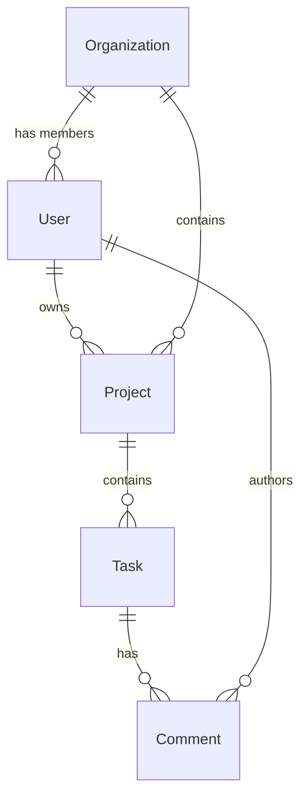

# Data Model Analyzer — Sample Output

## Context
Analyzing a Prisma-based schema for a SaaS application.

## Output

### Entity Summary

| Entity | Fields | Relations | Indexes | Issues |
|--------|--------|-----------|---------|--------|
| User | 12 | 4 | 3 | None `[HECHO]` |
| Organization | 8 | 3 | 2 | Missing index on `slug` `[INFERENCIA]` |
| Project | 15 | 6 | 2 | 3 nullable fields without defaults `[HECHO]` |
| Task | 18 | 5 | 1 | Missing composite index on `(projectId, status)` `[INFERENCIA]` |
| Comment | 6 | 2 | 1 | Polymorphic via string `targetType` — no FK `[HECHO]` |

### ER Diagram (excerpt)

### Migration Health
- 87 migrations over 14 months (6.2/month — moderate velocity) `[HECHO]`
- 3 irreversible migrations detected (data deletions) `[HECHO]`
- 2 migrations mix schema and data changes — recommend separating `[INFERENCIA]`

### Normalization: 3NF with intentional denormalization
- `Task.assigneeName` duplicates `User.name` — denormalized for query performance `[HECHO]`
- Recommendation: Use a view or materialized column instead of manual sync
