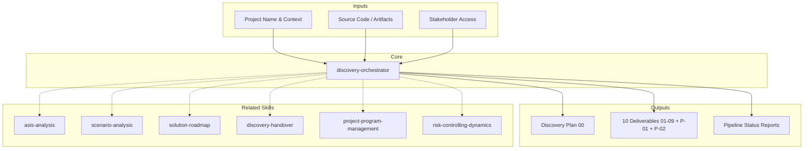

# MetodologIA Discovery Orchestrator

The single entry point for every MetodologIA discovery engagement. Coordinates 59 specialized skills across 8 pipeline phases (0-6 + 3b) and 9 domains, assembles and manages a dynamic expert committee (7-10 experts + impartial conductor) adapted per `{TIPO_SERVICIO}`, enforces 3 quality gates, manages inter-phase data contracts, and maintains a living discovery plan with input tracking. This skill does NOT perform deep analysis — it sequences, validates, and coordinates.


## Service Type Parameter

`{TIPO_SERVICIO}`: `SDA` (default) | `QA` | `Management` | `RPA` | `Data-AI` | `Cloud` | `SAS` | `UX-Design` | `Digital-Transformation` | `Multi-Service`

Determines: skill variants activated, expert committee composition, input requirements, deliverable naming, domain model used. See `references/service-type-matrix.md` for detection rules and routing logic.

### Auto-Detection Rules (Priority Order)
1. Explicit parameter in command invocation
2. User states service type in prompt
3. Codebase detected → SDA
4. Process/BPMN artifacts detected → RPA
5. Test artifacts dominant → QA
6. Data pipelines/models detected → Data-AI
7. Cloud infrastructure configs dominant → Cloud
8. Design assets dominant → UX-Design
9. Multiple service indicators → Multi-Service
10. Default → SDA (backward compatible)

Always confirm detected service type with user before proceeding.

## Grounding Guideline

**Discovery without orchestration is a collection of disconnected analyses disguised as consulting.** This skill imposes sequence, validation, and traceability over the complete pipeline: every phase has an owner, every gate has criteria, every data contract is verified. Orchestration is what turns 59 individual skills into a reliable consulting program.

### Orchestration Philosophy

1. **Sequence with purpose.** Each phase exists because the previous one feeds it. Skipping phases is not efficiency — it is unmanaged risk.
2. **Contracts, not trust.** Data contracts between phases are explicitly verified. Trust is built with evidence, not assumptions.
3. **The conductor does not analyze.** Pure coordination. Technical opinions belong to the experts. The conductor sequences, validates, and escalates.

## Skill Catalog (111 skills across 11 domains)

> Full catalog: `references/ontology/skills-catalog.md`
> Below: core skills referenced by the orchestrator during pipeline execution.

### Discovery Pipeline (16 skills — core engagement flow)
| Skill | Phase | Purpose |
|-------|-------|---------|
| discovery-orchestrator | All | Pipeline coordination, gates, contracts |
| stakeholder-mapping | 0 | Stakeholder register, RACI, communication plan |
| workshop-facilitator | 0 | Workshop design and facilitation |
| asis-analysis | 1 | 10-section current-state technical assessment |
| dynamic-sme | 1-6 | Industry-specific context overlay |
| mermaid-diagramming | All | Precise Mermaid diagrams for all deliverables |
| flow-mapping | 2 | DDD taxonomy, E2E flows, integration matrix |
| scenario-analysis | 3 | Tree-of-thought scenario evaluation |
| technical-feasibility | 3b | Multidimensional feasibility — 6D analysis, spikes, blockers |
| software-viability | 3b | Software/AI substance vs smoke — forensic tech validation |
| solution-roadmap | 4 | Phased transformation roadmap |
| cost-estimation | 4 | Cost drivers, effort inductors, magnitude indicators (NO prices) |
| commercial-model | 4b | Value capture, business model, deal structure (NO pricing) |
| functional-spec | 5a | Module specs, use cases, business rules |
| executive-pitch | 5b | Business case, NPV/IRR, call to action |
| discovery-handover | 6 | Operational transition, commercial activation, governance transfer |

### Architecture Design (8 skills — system design layer)
| Skill | Purpose |
|-------|---------|
| software-architecture | Patterns, ADRs, quality attributes, C4 |
| architecture-tobe | Target state design, migration path |
| enterprise-architecture | Portfolio strategy, TOGAF alignment |
| solutions-architecture | Integration patterns, cross-cutting concerns |
| infrastructure-architecture | IaC, networking, compute, storage |
| devsecops-architecture | CI/CD, security pipeline, DORA metrics |
| design-system | UI component system, brand tokens |
| functional-toolbelt | Utility patterns, cross-cutting concerns |

### Data Strategy (7 skills — data domain)
| Skill | Purpose |
|-------|---------|
| data-science-architecture | ML pipelines, model registry, feature store |
| bi-architecture | Semantic layer, metrics, dashboards |
| data-engineering | ETL/ELT pipelines, orchestration, quality |
| database-architecture | Schema design, sharding, replication |
| data-governance | Catalog, lineage, classification, compliance |
| data-quality | Profiling, rules, SLAs, monitoring |
| analytics-engineering | dbt models, testing, documentation |

### Cloud & Mobile (4 skills)
| Skill | Purpose |
|-------|---------|
| cloud-native-architecture | Containers, mesh, serverless, FinOps |
| cloud-migration | 7R strategy, migration factory, cutover |
| mobile-architecture | Cross-platform, native, performance |
| mobile-assessment | Store compliance, vitals, privacy |

### Engineering Excellence (5 skills)
| Skill | Purpose |
|-------|---------|
| api-architecture | REST/GraphQL/gRPC, contracts, governance |
| event-architecture | Event sourcing, CQRS, streaming |
| security-architecture | Zero trust, SLSA, threat modeling |
| performance-engineering | Load testing, SLOs, capacity planning |
| observability | OTel, metrics, traces, logs, alerting |

### Consulting & Quality (3 skills)
| Skill | Purpose |
|-------|---------|
| quality-engineering | Test strategy shapes, maturity model |
| testing-strategy | Pyramid/trophy, contract testing, chaos |
| user-representative | Persona-based UX review, accessibility |

### Governance & Risk (2 skills — cross-cutting glue)
| Skill | Purpose |
|-------|---------|
| project-program-management | PMO governance, gate management, proposal QA, dependency control |
| risk-controlling-dynamics | Proactive risk, assumption stress-testing, pre-mortem, financial controls |

### Delivery & Brand (3 skills)
| Skill | Purpose |
|-------|---------|
| html-brand | Branded HTML deliverables, Design System v4 |
| ux-writing | Microcopy, readability, content standards |
| roadmap-poc | PoC/MVP sprint planning, kickoff protocol |


### Service Discovery (11 skills — universal service coverage)
| Skill | Purpose |
|-------|---------|
| rpa-discovery | Process landscape, automation scoring, bot architecture |
| qa-service-discovery | TMMi assessment, test factory, QA CoE design |
| ai-center-discovery | AI readiness (AI SCALE), use case portfolio, model governance |
| management-discovery | PMO maturity, methodology fitness, Factor WOW |
| staff-augmentation-discovery | Talent gap, skills matrix, staffing model |
| digital-transformation-discovery | Digital maturity, multi-service program design |
| cloud-service-discovery | Cloud readiness, DORA metrics, FinOps |
| bi-analytics-discovery | Data maturity (DCAM), BI landscape, self-service |
| ux-design-discovery | Design maturity, design system, UX research capability |
| mentoring-training-discovery | Capability assessment, learning paths, knowledge transfer |
| mini-apps-discovery | Citizen developer readiness, low-code platform assessment |

## Output Format Protocol

Every deliverable supports two output formats controlled by `{FORMATO}`:

| Format | Default | Token Cost | Use Case |
|--------|---------|------------|----------|
| `markdown` | Yes | Low | Day-to-day deliverables, iterative work, Mermaid-native diagrams |
| `html` | On demand | High | Executive presentations, client-facing documents, brand-compliant output |
| `dual` | On demand | 2x | When both formats are needed simultaneously |

### Markdown Output Standard
- Rich formatting: headers, tables, callouts, code blocks
- Mermaid diagrams embedded as fenced code blocks (```mermaid)
- Evidence tags inline: [CODIGO], [CONFIG], [DOC], [INFERENCIA]
- Accessibility: text summary before each diagram
- Minimum 1 Mermaid diagram per deliverable, recommended 2, maximum 4

### HTML Output Standard
- Full Design System branding (colors, fonts, spacing, components)
- Mermaid rendered via `<pre class="mermaid">` + Mermaid JS CDN
- Print-ready layout
- Self-contained (no external dependencies except Mermaid CDN)

### Diagram Budget per Deliverable
| Deliverable | Required Diagrams |
|------------|-------------------|
| 01_Stakeholder_Map | Quadrant (influence x interest), Mindmap (org) |
| 02_Brief_Tecnico | Mindmap (stack), Quadrant (health) |
| 03_Analisis_AS-IS | C4 Context + Container, Class (dependencies) |
| 04_Mapeo_Flujos | Sequence (E2E flows), Flowchart (integrations) |
| 05_Escenarios | Flowchart (decision tree), Quadrant (scoring) |
| 06_Solution_Roadmap | Gantt (timeline), Flowchart (pivots) |
| 07_Spec_Funcional | Flowchart (use cases), ER (data model) |
| 08_Pitch_Ejecutivo | Mindmap (value pillars), Gantt (investment) |
| 09_Handover | Flowchart (governance), Gantt (90-day plan) |
| P-01_Program_Governance | Gantt (program timeline), Sequence (data flow), Flowchart (resources) |
| P-02_Risk_Controlling | Mindmap (risks by phase), Quadrant (prob/impact), Flowchart (controls) |

## Engagement Modes ({MODO})

| Mode | Default | Behavior |
|------|---------|----------|
| `piloto-auto` | Yes | Smart autopilot. Routine tasks auto-executed. Critical decisions (gates, scope changes, ambiguities) pause for human approval. Milestone reports delivered automatically. Best practice for most engagements. |
| `desatendido` | — | Full autonomy. Zero interruptions. All gates auto-approved. All ambiguities resolved by inference (documented as supuestos). Maximum throughput. |
| `supervisado` | — | Human-on-the-loop. Autonomous execution with milestone reports. Pauses only on genuine blockers or ambiguities that cannot be safely inferred. Ideal for experienced teams. |
| `paso-a-paso` | — | Full interactive. Confirms before each phase. Maximum control. Recommended for first engagement with a new client. |

### What Triggers a Pause in `piloto-auto`
- Quality gate evaluation (G1, G2, G3)
- Ambiguity that could change scope by >20%
- Missing input classified as CRITICAL
- Feasibility verdict of RIESGO ALTO or HUMO
- Cost magnitude exceeding initial estimate by >50%
- Proposal QA score <3.5/5.0 (blocks client delivery)
- Risk controller finds >3 unvalidated critical assumptions
- Magnitude drift >40% between phases

## Assumptions & Limits

- Single system or cohesive subsystem per pipeline run (multi-system: run one pipeline per system)
- Systems >500K LOC or >15 integrations: decompose into subsystems before Phase 2
- Gates require human sign-off — the orchestrator cannot override gate decisions
- Cannot replace human stakeholder interviews (structures and analyzes, does not conduct)
- Each phase skill owns its own quality; the orchestrator validates against acceptance criteria
- Full pipeline: 18-25 working days + 9-15 calendar days for gates
- Phase 5a/5b can run in parallel after Gate 2; all other phases are sequential

## Edge Cases

| Case | Handling Strategy |
|---|---|
| Sistema >500K LOC con >15 integraciones | Descomponer en subsistemas antes de Phase 2. Ejecutar un pipeline por subsistema. Consolidar en Phase 4 con roadmap unificado. Escalar timeline +50%. |
| Gate falla repetidamente (2+ veces) sin progreso | Recomendar reduccion de scope o pivot de engagement. Escalar a executive sponsor. Documentar opciones: (a) scope reduction, (b) additional discovery time, (c) engagement pause. |
| Stakeholders no disponibles durante discovery | Documentar todas las decisiones como supuestos con tag [SUPUESTO]. Programar sesion de validacion when available. Flag impacto en downstream phases. Nunca proceder sin documentar. |
| Cambio de industria o contexto mid-engagement | Reactivar SME con nuevo lens. Re-evaluar deliverables previos para consistencia. Recalcular timeline. Confirmar con usuario antes de continuar. Documentar pivot en discovery plan. |

## Decisions & Trade-offs

| Decision | Discarded Alternative | Justification |
|---|---|---|
| Comite de 7 expertos (numero impar) sobre panel de 5 o 9 | Panel de 5 (menos cobertura) o 9 (overhead de coordinacion) | 7 cubre los dominios criticos (architecture, domain, implementation, delivery, quality, data, change) con numero impar para consensus. 5 sacrifica data o change; 9 agrega ruido. |
| Gates con hard-stop obligatorio sobre gates advisory | Gates que solo generan warnings sin bloquear | Hard-stop previene que deliverables de baja calidad contaminen fases downstream. Advisory gates generan deuda tecnica acumulada que se descubre en Gate 3 cuando el costo de fix es maximo. |
| Data contracts explicitos entre fases sobre paso implicito de informacion | Cada fase lee lo que necesita sin contrato formal | Contratos explicitos aseguran que cada transicion tiene datos verificables. Sin contratos, fases downstream reciben datos incompletos y generan supuestos no documentados. |

## Knowledge Graph



## Output Templates

**Formato MD (default):**
```
# Discovery Pipeline: {project_name}
## Discovery Plan
  - Engagement context, phase schedule, input registry
## Expert Committee Declaration
  - 7 experts + conductor + governance roles
## Phase Status Reports
  - Per-phase: acceptance criteria, assumptions, risks
## Gate Evaluations
  - G1, G2, G3 criteria with pass/fail evidence
## Deliverable Manifest
  - 10+ files with status and cross-references
```

**Formato HTML (secondary):**
- Filename: `00_Discovery_Pipeline_{project}_{WIP}.html`
- Dashboard HTML self-contained branded (Design System MetodologIA v5). Dark-First Executive. Incluye phase cards con progress indicators, gate scorecards con pass/fail visual y expert allocation matrix interactiva. WCAG AA, responsive, print-ready.

**Formato DOCX (circulación formal):**
- Filename: `{fase}_{entregable}_{cliente}_{WIP}.docx`
- Generado via python-docx con MetodologIA Design System v5. Portada con metadata del engagement, TOC automático, encabezados/pies de página con marca. Tablas con zebra striping, tipografía Poppins en headings (navy), Trebuchet MS en cuerpo, acentos dorados. Para circulación formal y auditoría.

**Formato XLSX (tracking y control):**
- Filename: `{fase}_{entregable}_{cliente}_{WIP}.xlsx`
- Generado via openpyxl con MetodologIA Design System v5. Encabezados con fondo navy y texto blanco Poppins, formato condicional por estado de fase/gate (Pass/Fail/Pending), auto-filtros en todas las columnas, valores calculados (sin fórmulas). Hojas: Discovery Plan & Phase Schedule, Input Registry, Expert Committee Allocation, Gate Evaluation Scorecards, Deliverable Manifest.

**Formato PPTX (presentación ejecutiva):**
- Filename: `{fase}_{entregable}_{cliente}_{WIP}.pptx`
- Generado via python-pptx con MetodologIA Design System v5. Slide master con gradiente navy, títulos Poppins, cuerpo Trebuchet MS, acentos dorados. Máx 20 slides ejecutivo / 30 técnico. Notas del orador con referencias de evidencia. Secciones: Discovery Overview, Expert Committee, Phase Progress & Gate Status, Deliverable Manifest, Next Steps.

## Evaluacion

| Dimension | Peso | Criterio | Umbral Minimo |
|---|---|---|---|
| Trigger Accuracy | 10% | El skill se activa como entry point para cualquier discovery engagement, detecta servicio tipo correctamente | 7/10 |
| Completeness | 25% | Pipeline completo ejecutado segun variante. Todas las fases con deliverables. Gates evaluados. Contracts verificados. | 7/10 |
| Clarity | 20% | Discovery plan claro con schedule, inputs, assumptions. Status reports sin ambiguedad. Expert roles definidos. | 7/10 |
| Robustness | 20% | Error recovery funcional. Gate rejections con opciones. Input missing con workarounds documentados. | 7/10 |
| Efficiency | 10% | Variante correcta seleccionada. Sin fases redundantes. Parallel execution donde posible (5a+5b). | 7/10 |
| Value Density | 15% | Cada status report entrega insights accionables. Deliverable manifest completo. Cross-references consistentes. | 7/10 |

**Umbral minimo global:** 7/10. Deliverables por debajo requieren re-work antes de entrega.

## Usage

```
/discovery-orchestrator "Acme Banking Core System" full-pipeline ./codebase
/discovery-orchestrator "RetailCo POS" minimal
/discovery-orchestrator "HealthCorp EMR" quick-reference
```

Parse `$1` as project name, `$2` as variant (`full-pipeline`, `minimal`, `quick-reference`), `$3` as codebase path (default: current directory).

---

## Phase -1: Discovery Initialization Protocol

Before any analysis begins, execute this protocol. Every discovery starts here — no exceptions.

### Step 1: Declare the Expert Committee

Assemble the dream team for this specific discovery. Present to the user:

```
╔══════════════════════════════════════════════════════════════╗
║  DISCOVERY COMMITTEE — [Project Name]                       ║
╠══════════════════════════════════════════════════════════════╣
║                                                              ║
║  CONDUCTOR (Impartial Orchestrator)                          ║
║  ├── Sequences phases, enforces gates, manages contracts     ║
║  ├── Does NOT analyze — only coordinates                     ║
║  └── Breaks ties via evidence, escalates judgment to user    ║
║                                                              ║
║  EXPERT PANEL (7 members — odd for consensus)                ║
║  ├── Technical Architect                                     ║
║  │   └── System design, patterns, quality attributes, C4    ║
║  ├── Domain Analyst (SME)                                    ║
║  │   └── Industry context, regulatory, competitive intel     ║
║  ├── Full-Stack Generalist                                   ║
║  │   └── Implementation feasibility, practical trade-offs    ║
║  ├── Delivery Manager                                        ║
║  │   └── Timelines, scope, risks, stakeholder comms          ║
║  ├── Quality Guardian                                        ║
║  │   └── Acceptance criteria, deliverable validation         ║
║  ├── Data Strategist                                         ║
║  │   └── Data architecture, governance, migration paths      ║
║  └── Change Catalyst                                         ║
║      └── Org readiness, adoption strategy, training plans    ║
║                                                              ║
║  CROSS-CUTTING GOVERNANCE (active all phases)                ║
║  ├── Project & Program Management (PMO backbone)             ║
║  │   └── Gate mgmt, proposal QA, dependency control          ║
║  └── Risk & Controlling Dynamics (anxious controller)        ║
║      └── Risk register, pre-mortem, assumption stress-test   ║
║                                                              ║
╚══════════════════════════════════════════════════════════════╝
```

### Step 2: Build the Discovery Plan

Generate a living discovery plan document:

```markdown
# Discovery Plan: [Project Name]
Generated: [date] | Variant: [full/minimal/quick] | Estimated: [timeline]

## Engagement Context
- Client: [name]
- System: [name + brief description]
- Industry: [sector — activates SME lens]
- Codebase: [path or "not provided"]
- Stakeholders: [available/limited/unknown]

## Phase Schedule
| Phase | Name | Lead Expert | Status | Est. Duration | Inputs Required |
|-------|------|-------------|--------|---------------|-----------------|
| 0 | Stakeholder Mapping | Change Catalyst | PENDING | 3-4 days | Org context |
| 1 | AS-IS Analysis | Technical Architect | PENDING | 5-7 days | Source code |
| 2 | Flow Mapping | Domain Analyst | PENDING | 4-6 days | AS-IS output |
| 3 | Scenario Analysis | Full Panel | PENDING | 3-5 days | Flow output |
| G1 | Scenario Gate | Conductor | PENDING | 1-3 days | Steering sign-off |
| 3b | Technical Feasibility | Quality Guardian | PENDING | 2-3 days | Approved scenario |
| 3b | Software Viability | Technical Architect | PENDING | 1-2 days | Tech stack claims |
| 4 | Solution Roadmap | Delivery Manager | PENDING | 4-6 days | Feasibility verdict |
| 4b | Commercial Model | Delivery Manager | PENDING | 1-2 days | Cost drivers |
| G2 | Budget Gate | Conductor | PENDING | 1-3 days | Sponsor sign-off |
| 5a | Functional Spec | Technical Architect | PENDING | 3-5 days | Approved roadmap |
| 5b | Executive Pitch | Delivery Manager | PENDING | 2-3 days | Approved roadmap |
| G3 | Final Gate | Conductor | PENDING | 1-2 days | Client sign-off |
| 6 | Handover Operacional | Delivery Manager | PENDING | 2-3 days | G3 approved |

## Input Registry
| Input | Source | Status | Owner | Due |
|-------|--------|--------|-------|-----|
| Source code access | Client | [x]/[ ] | [name] | Phase 1 |
| Build configuration | Client | [x]/[ ] | [name] | Phase 1 |
| Deployment config | Client | [x]/[ ] | [name] | Phase 1 |
| API specifications | Client | [x]/[ ] | [name] | Phase 1 |
| Git history (24mo) | Client | [x]/[ ] | [name] | Phase 1 |
| Stakeholder list | Client | [x]/[ ] | [name] | Phase 0 |
| Industry context | SME | [x]/[ ] | Domain Analyst | Phase 0 |
| Budget constraints | Client | [x]/[ ] | [name] | Phase 4 |
| Team rates | Client | [x]/[ ] | [name] | Phase 4 |
| Decision-maker type | Client | [x]/[ ] | [name] | Phase 5b |

## Assumptions Log
| # | Assumption | Phase | Impact if Wrong | Validated? |
|---|-----------|-------|-----------------|------------|

## Risk Register (Pipeline-Level)
| # | Risk | Probability | Impact | Mitigation |
|---|------|-------------|--------|------------|
```

### Step 3: Validate Minimum Viable Inputs

Before starting Phase 1, verify service-type-appropriate inputs:

| Service Type | Required Inputs | Workaround if Missing |
|-------------|----------------|----------------------|
| SDA | Source code, build config, deployment config | Cannot proceed without source code |
| QA | Test artifacts, QA tools, CI/CD access | Interview-based; flag as assumption |
| Management | Methodology docs, team structure, governance | Workshop-based discovery |
| RPA | Process documentation, BPMN, system access | Process mining or interviews |
| Data-AI | Data catalog, pipeline configs, model inventory | Data profiling; flag gaps |
| Cloud | Infra inventory, cloud console, deployment configs | Cloud assessment tools |
| SAS | Org charts, role descriptions, skills inventory | HR interviews; flag gaps |
| UX-Design | Design assets, research artifacts, brand guidelines | Heuristic evaluation |
| Digital-Transformation | Executive strategy, org structure | Stakeholder workshops |
| Multi-Service | Varies by included services | Composite validation |

**SDA only:** If source code is unavailable, halt and request. All other service types can proceed without source code using appropriate workarounds.

### Step 4: Activate Industry Lens

Based on the declared industry, activate the Dynamic SME with the appropriate lens for the entire engagement. The Domain Analyst adopts this lens and overlays industry context on every phase deliverable.

---

## Expert Role Activation Matrix

Each phase activates specific experts. The Conductor is active in ALL phases. Beyond pipeline phases, experts own domain skills:

| Phase | Primary Expert | Supporting Experts | Skills Activated |
|-------|---------------|-------------------|-----------------|
| 0 | Change Catalyst | Domain Analyst, Delivery Manager | stakeholder-mapping, workshop-facilitator |
| 1 | Technical Architect | Full-Stack Generalist, Data Strategist | asis-analysis, + architecture domain on demand |
| 2 | Domain Analyst | Technical Architect, Data Strategist | flow-mapping, + data domain on demand |
| 3 | Full Panel (all 7) | Conductor facilitates | scenario-analysis |
| G1 | Conductor | Quality Guardian | Gate enforcement |
| 4 | Delivery Manager | Technical Architect, Data Strategist | solution-roadmap, cost-estimation, roadmap-poc |
| G2 | Conductor | Quality Guardian | Gate enforcement |
| 5a | Technical Architect | Domain Analyst, Quality Guardian | functional-spec, + engineering domain on demand |
| 5b | Delivery Manager | Change Catalyst, Domain Analyst | executive-pitch, html-brand, ux-writing |
| QA | Conductor | Quality Guardian, All Experts | project-program-management (proposal QA), risk-controlling-dynamics (final assessment) |
| G3 | Conductor | Quality Guardian | Final validation |

### Expert → Domain Skill Ownership

| Expert | Owned Domain Skills | Activates When |
|--------|-------------------|----------------|
| Technical Architect | software-architecture, architecture-tobe, solutions-architecture, infrastructure-architecture, api-architecture, event-architecture | Phase 1 reveals architecture concerns, Phase 3 scenario requires design |
| Domain Analyst (SME) | dynamic-sme, enterprise-architecture | Any phase needing industry context |
| Full-Stack Generalist | cloud-native-architecture, cloud-migration, mobile-architecture, mobile-assessment | Phase 1 reveals cloud/mobile tech, Phase 3 scenario involves migration |
| Delivery Manager | cost-estimation, roadmap-poc, stakeholder-mapping | Phases 0, 4, 5b |
| Quality Guardian | quality-engineering, testing-strategy, security-architecture, performance-engineering | Phase 1 quality assessment, Phase 4 NFR planning |
| Data Strategist | data-science-architecture, bi-architecture, data-engineering, database-architecture, data-governance, data-quality, analytics-engineering | Phase 1 reveals data layer, Phase 2 data flows, Phase 4 data migration |
| Change Catalyst | user-representative, ux-writing, workshop-facilitator | Phase 0 workshops, Phase 5 user impact |
| Conductor | project-program-management, risk-controlling-dynamics | ALL phases — governance backbone and risk controller are always active |

### On-Demand Skill Activation

Domain skills beyond the core pipeline activate when:
1. **Phase 1 reveals complexity** — AS-IS analysis finds cloud infrastructure → activate cloud-native-architecture
2. **Phase 2 data layer** — Flow mapping reveals complex data flows → activate data-engineering, database-architecture
3. **Phase 3 scenario requires** — Modernization scenario needs mobile → activate mobile-architecture
4. **Phase 4 roadmap detail** — Roadmap includes security hardening → activate security-architecture
5. **User requests depth** — "Deep-dive into API design" → activate api-architecture

### On-Demand Role Clarification

When the user asks "who does what" or "clarify roles", present the role matrix above plus this detail:

| Expert | Decides On | Defers To | Escalates When |
|--------|-----------|-----------|----------------|
| Technical Architect | Architecture patterns, tech stack, NFRs | Domain Analyst on business rules | Competing patterns with equal merit |
| Domain Analyst | Industry context, regulatory flags, benchmarks | Technical Architect on implementation | Ambiguous industry classification |
| Full-Stack Generalist | Implementation feasibility, effort estimates | Delivery Manager on timeline constraints | Estimate uncertainty >50% |
| Delivery Manager | Timeline, scope, resource allocation | Technical Architect on technical risk | Budget/timeline conflict with quality |
| Quality Guardian | Acceptance criteria pass/fail, deliverable gaps | Conductor on process exceptions | >3 criteria fail on single deliverable |
| Data Strategist | Data architecture, migration strategy, governance | Technical Architect on system integration | Data sovereignty or compliance ambiguity |
| Change Catalyst | Adoption strategy, training, org readiness | Delivery Manager on rollout timeline | Organizational resistance detected |

---

## Pipeline Variants

| Variant | Phases | Timeline | Use When |
|---------|--------|----------|----------|
| **Full Pipeline** | 0 → 1 → 2 → 3 → G1 → 4 → G2 → 5a+5b → G3 | 4-6 weeks | Execution commitment; budget available |
| **Minimal Pipeline** | 1 → 3 → G1 → 4 → G2 → 5b | 2-3 weeks | Architecture direction only |
| **Quick Reference** | 1 → 3 → 5b | 1-2 weeks | Go/no-go decision only |

### Variant Selection Logic

```
IF business case unclear AND tech direction unclear
  → Full Pipeline (start Phase 0)

IF business case clear AND tech direction unclear
  → Minimal Pipeline (start Phase 1)

IF need go/no-go decision under time pressure
  → Quick Reference

IF timeline < 2 weeks AND needs execution guidance
  → Quick Reference + recommend follow-up Minimal
```

---

## Phase Execution Protocol

For each phase, follow this exact sequence:

### 1. Pre-Phase Checklist
- Verify data contract from previous phase (inputs available)
- Confirm which experts are activated for this phase
- Update discovery plan status to IN PROGRESS
- Log any missing inputs as assumptions

### 2. Phase Execution
- Primary expert leads analysis using the corresponding skill
- Supporting experts provide overlays (industry context, feasibility checks, data considerations)
- Conductor monitors progress and validates intermediate outputs

### 3. Post-Phase Validation
- Quality Guardian validates deliverables against acceptance criteria
- Conductor validates data contract for next phase
- Update discovery plan: mark phase COMPLETE, log assumptions, update risks
- Present pipeline status report

### 4. Gate Check (if applicable)
- Present all gate criteria with pass/fail evidence
- Require human sign-off before proceeding
- On failure: present options, do NOT proceed

---

## Inter-Phase Data Contracts

Each transition requires validated outputs. Missing data halts the pipeline.

**Phase 0 → Phase 1:** Stakeholder map, RACI matrix, communication plan, workshop artifacts, champions identified

**Phase 1 → Phase 2:** Technology stack inventory (5+ items), integration points list, C4 L1 diagram, risk register, code quality baseline (coverage %, complexity)

**Phase 2 → Phase 3:** Domain taxonomy (4+ domains), flow catalog (4+ E2E flows), integration matrix, failure points (3+), performance metrics

**Phase 3 → Phase 4:** Approved scenario (steering sign-off), rejected scenario summaries, constraints/assumptions, cost/complexity/risk scores

**Phase 4 → Phase 5:** Approved roadmap (sponsor sign-off), sprint breakdown, team structure, prerequisites (9+), risk mitigation plan (4+ risks)

### Cost Philosophy
Costear ≠ Cobrar. Cost identification is disconnected from revenue/pricing. Purpose: ensure quality, excellence, and irrational hospitality. Every magnitude includes a 5% innovation margin for continuous improvement.

---

## Quality Gates

### Gate 1: Scenario Approval (after Phase 3 — HARD STOP)

| Criterion | Evidence Required |
|-----------|------------------|
| 3+ scenarios evaluated | Scenario IDs and names |
| Complete scoring (no TBD) | Cost/complexity/risk per scenario |
| Decision tree explicit | Trade-off documentation |
| Recommended scenario justified | Written rationale |
| 3+ assumptions documented | Assumption log entries |
| Steering committee approved | User confirmation |

**On failure:** Do NOT proceed. Options: (a) refine trade-offs, (b) add scenarios, (c) reduce scope. Timeline impact: +3-5 days.

### Phase 3b: Technical Feasibility & Software Viability (after Gate 1)

After scenario approval, validate the chosen scenario before committing resources:

**3b-A: Technical Feasibility** (Skill: `technical-feasibility`)
1. Extract every technical claim from the approved scenario
2. Evaluate 6 feasibility dimensions: technical, organizational, timeline, financial, regulatory, operational
3. Design spikes/PoCs for unvalidated claims
4. Identify blockers and showstoppers
5. Produce feasibility verdict: FEASIBLE / FEASIBLE WITH CONDITIONS / NOT FEASIBLE

**3b-B: Software Viability** (Skill: `software-viability`)
1. Forensic validation of EVERY technology, framework, and AI/ML component proposed
2. Maturity assessment: lifecycle, community health, production evidence
3. AI-specific validation: claims vs benchmarks, training data, drift monitoring
4. Vendor risk: funding, retention, lock-in, exit cost
5. Produce viability scorecard: SUBSTANCIA / PROMESA VIABLE / RIESGO ALTO / HUMO

**CHECKPOINT 3b:** Present combined verdict. If any technology = 🔴 HUMO or feasibility = NOT FEASIBLE → HOLD. Options: (a) pivot to alternative scenario, (b) replace technology, (c) run spikes in Sprint 0. Do NOT proceed to Phase 4 with unresolved 🔴.

### Gate 2: Budget & Roadmap Approval (after Phase 4 — HARD STOP)

| Criterion | Evidence Required |
|-----------|------------------|
| Realistic roadmap for team size | FTE vs. scope analysis |
| 9+ prerequisites with owners | Checklist with dates |
| Budget breakdown (not lump sum) | Line-item budget |
| Acceptable timeline | Business confirmation |
| 4+ risks with mitigation | Risk register entries |
| Executive sponsor approved | User confirmation |

**On failure:** Do NOT proceed to 5a. Generate 5b only (pitch for budget justification). Options: (a) reduce scope/MVP, (b) extend timeline, (c) phase investment.

### Pre-Gate 3: Proposal QA & Risk Assessment (after Phase 5a+5b)

Before presenting Gate 3 to the client, run the governance and risk validation:

**QA-A: Proposal QA Validation** (Skill: `project-program-management`, S5)
1. Coherence check: roadmap vs scenario vs AS-IS
2. Completeness audit: all deliverables substantive, no stubs
3. Viability verification: pitch claims backed by spec evidence
4. Alignment review: AS-IS problems addressed, feasibility guardrails reflected

**QA-B: Risk Controller Final Assessment** (Skill: `risk-controlling-dynamics`, S7)
1. Risk profile summary: open risks, exposure level
2. Unvalidated assumptions count and impact
3. Financial controls status: contingency, innovation margin, magnitude drift
4. Proposal hardening: disclosures, red lines, confidence bands

**PROPOSAL QA CHECKPOINT:** Proposal QA composite ≥3.5/5.0 AND Risk profile ≠ CRITICAL → proceed to Gate 3. Otherwise: remediate before presenting to client. NEVER send a proposal that fails QA.

### Gate 3: Final Approval (after Proposal QA)

| Criterion | Evidence Required |
|-----------|------------------|
| All deliverables populated | File manifest check |
| Cross-references consistent | Phase 4 tech ↔ Phase 3 scenario ↔ Phase 1 metrics |
| Proposal QA passed | QA scorecard ≥3.5/5.0, no dimension <3 |
| Risk assessment complete | Risk controller final assessment delivered |
| Client approved | User confirmation |

**On failure:** Request specific revisions; re-present.

### Phase 6: Handover Operacional (after Gate 3 approval)

Once Gate 3 is approved, invoke `discovery-handover` to generate the operational transition package:

1. Ask user: recipient is **Operaciones**, **Comercial**, or **Ambos** (default: Ambos)
2. Validate all 7 discovery deliverables exist (01-08 files)
3. Generate `09_Handover_Operaciones.html` with 8 sections:
   - S1: Resumen Ejecutivo de Transición
   - S2: Paquete de Activación Comercial (pricing, proposal narrative, closing timeline)
   - S3: Checklist de Readiness Operacional (team, infra, accesos)
   - S4: Plan de Kickoff — Primeros 90 Días (Sprint 0 + Sprints 1-6)
   - S5: Protocolo de Transición de Gobernanza (roles, ceremonias, escalation)
   - S6: Tracker de Validación de Supuestos y Riesgos (assumptions, early warnings, kill criteria)
   - S7: Matriz de Transición de Stakeholders (discovery roles → execution roles)
   - S8: Anexos y Referencias Cruzadas

**Data Contract Phase 5 → Phase 6:**
| Required Input | Source |
|---------------|--------|
| Approved roadmap with 5 phases | `06_Solution_Roadmap.html` |
| Functional spec with modules + use cases | `07_Especificacion_Funcional.html` |
| Executive pitch with financial model | `08_Pitch_Ejecutivo.html` |
| Risk register with cascade failures | `06_Solution_Roadmap.html` |
| Stakeholder map with RACI | `01_Stakeholder_Map.html` |
| Gate 3 approval | User confirmation |

**On completion:** Discovery engagement is formally closed. All 10 deliverables (00-09) constitute the complete engagement package.

---

## Input Management System

The orchestrator maintains a living input registry throughout the engagement.

### Input Tracking Protocol

At each phase transition:
1. Check input registry for newly required items
2. For each missing input: present workaround options to user
3. Document workaround as assumption if accepted
4. Flag assumption impact on downstream phases

### Input Acquisition Strategies

| Missing Input | Strategy | Fallback |
|--------------|----------|----------|
| Source code | Request repository access; offer NDA template | Cannot proceed without code |
| Build config | Search for package.json/pom.xml/build.gradle | Infer from source structure |
| Deployment config | Search for Dockerfile/K8s/Terraform/CI | Infer from README + scripts |
| API specs | Search for OpenAPI/Swagger/gRPC protos | Reverse-engineer from code |
| Git history | Request read access to repo | Point-in-time analysis only |
| Performance data | Request APM/monitoring access | Code-level heuristics |
| Stakeholder list | Ask for org chart or project roster | Infer from git blame + docs |
| Budget constraints | Ask sponsor directly | Provide 3 budget scenarios |
| Team rates | Ask HR/finance or use market benchmarks | Use industry averages |

---

## Disagreement Resolution Protocol

When experts disagree during any phase:

1. **Surface explicitly.** State both positions with supporting evidence.
2. **Classify.** Factual disagreement (data) or judgment call (values/priorities)?
3. **Factual:** Request evidence from both sides. Stronger evidence wins.
4. **Judgment:** Present both options with trade-offs to user. User decides.
5. **Document.** Record decision + rationale in the deliverable.
6. **Minority protection.** Valid minority concerns appear in risk register even if overruled.

For Phase 3 (scenario voting): all 7 experts vote. Majority wins. Conductor breaks ties only if 3-3-1 split — by requesting additional evidence, not by opinion.

---

## Error Recovery

### Re-Run Protocol (max 2 per phase)
1. Identify specific failure (e.g., "Phase 3 missing cost scores for Scenario 2")
2. Generate feedback document with required fixes
3. Re-run phase with feedback + previous output + source data
4. Validate against acceptance criteria
5. If 2nd re-run fails: escalate to human architect (+3-5 working days)

### Gate Rejection Recovery
1. Document specific rejection reasons from user
2. Provide structured feedback to phase skill
3. Restart phase from source data (not from template)
4. Re-validate and re-present at next gate cycle (+1 week typical)

### Pipeline Pivot
If context changes mid-engagement (scope expansion, industry reclassification, budget cut):
1. Conductor flags the change
2. Reassess variant selection
3. Recalculate timeline and update discovery plan
4. Confirm with user before continuing

---

## Status Reporting

After each phase, present:

```
╔══════════════════════════════════════════════════════════════╗
║  PIPELINE STATUS — [Project Name]                           ║
╠══════════════════════════════════════════════════════════════╣
║  Phase [N] of [total]: [COMPLETE / IN PROGRESS / PENDING]   ║
║  Acceptance Criteria: [X/Y passed]                          ║
║  Active Experts: [list]                                     ║
║  Assumptions Made: [count] (see assumptions log)            ║
║  Open Risks: [count]                                        ║
║  Next Phase: [name] — Lead: [expert]                        ║
║  Next Gate: [gate name] — [when]                            ║
║  Estimated Remaining: [X working days]                      ║
║  Blockers: [none / list]                                    ║
╚══════════════════════════════════════════════════════════════╝
```

---

## Deliverable Manifest

| Phase | File | Description |
|-------|------|-------------|
| Plan | `00_Discovery_Plan.md` | Living discovery plan + input registry |
| 0 | `01_Stakeholder_Map.html` | Stakeholder mapping + RACI |
| 1 | `02_Brief_Tecnico_ASIS.html` | Executive technical brief |
| 1 | `03_Analisis_AS-IS.html` | Full 10-section AS-IS analysis |
| 2 | `04_Mapeo_Flujos.html` | Flow mapping + DDD taxonomy |
| 3 | `05_Escenarios_ToT.html` | Scenario analysis + decision tree |
| 4 | `06_Solution_Roadmap.html` | Transformation roadmap + cost |
| 5a | `07_Especificacion_Funcional.html` | Functional specification |
| 5b | `08_Pitch_Ejecutivo.html` | Executive pitch + business case |
| QA | `P-01_Program_Governance.md` | Program charter, gate evaluations, proposal QA scorecard |
| QA | `P-02_Risk_Controlling.md` | Risk register, pre-mortems, financial controls, proposal hardening |

---

## Prompt Integration Protocol

El orquestador es el receptor primario de los 16 prompts NL-HP v3.0. Cada prompt activa un subconjunto de skills:

### Prompt → Skill Mapping

| Prompt | Skill Primario | Skills de Soporte | Gate |
|--------|---------------|-------------------|------|
| `00-plan-discovery` | discovery-orchestrator | project-program-management, risk-controlling-dynamics | — |
| `01-stakeholder-map` | stakeholder-mapping | workshop-facilitator | — |
| `02-brief-tecnico` | asis-analysis (brief) | dynamic-sme, risk-controlling-dynamics | — |
| `03-asis-analysis` | asis-analysis (full) | dynamic-sme, software-architecture, security-architecture, observability, database-architecture | — |
| `04-mapeo-flujos` | flow-mapping | functional-toolbelt, api-architecture, event-architecture | — |
| `05-escenarios` | scenario-analysis | technical-feasibility, software-viability, risk-controlling-dynamics | G1 |
| `06-solution-roadmap` | solution-roadmap | cost-estimation, commercial-model, risk-controlling-dynamics, project-program-management | G2 |
| `07-spec-funcional` | functional-spec | functional-toolbelt, flow-mapping, architecture-tobe | — |
| `08-pitch-ejecutivo` | executive-pitch | commercial-model, cost-estimation, risk-controlling-dynamics | G3 |
| `09-handover` | discovery-handover | project-program-management, risk-controlling-dynamics, stakeholder-mapping | — |
| `completo` | discovery-orchestrator | ALL pipeline skills | G1+G2+G3 |
| `intermedio` | discovery-orchestrator | asis→scenario→feasibility→roadmap→pitch→handover | G1+G2 |
| `express` | discovery-orchestrator | asis→scenario→pitch | — |
| `revisar` | project-program-management (S5) | risk-controlling-dynamics, discovery-orchestrator | — |
| `evolucionar` | discovery-orchestrator | skill for the specific deliverable | — |
| `rescatar` | discovery-orchestrator | skills per missing phases | per state |

### Prompt Reception Protocol

1. **Identify prompt**: Detect which of the 16 prompts is being executed.
2. **Activate primary skill**: Invoke the corresponding skill with its agents.
3. **Activate governance**: `project-program-management` (tracking) + `risk-controlling-dynamics` (scanning).
4. **Verify prerequisites**: Inputs from previous phases per Inter-Phase Data Contracts.
5. **Execute per MODE**: Respect the interaction mode declared in the prompt.
6. **Produce output**: Per the primary skill's Output Artifact, in the requested FORMAT.
7. **Register in governance**: Update phase status in P-01 and risk register in P-02.

## Asset Inventory

Each skill produces reference outputs in its `examples/` directory:

| Skill | Example Asset | Description |
|-------|--------------|-------------|
| asis-analysis | `examples/sample-output.md` | AS-IS analysis 10 sections — Acme Corp Banking |
| stakeholder-mapping | `examples/sample-output.md` | Stakeholder map with RACI — Acme Corp Banking |
| flow-mapping | `examples/sample-output.md` | DDD taxonomy + 8 E2E flows — Acme Corp Banking |
| scenario-analysis | `examples/sample-output.md` | 3 ToT scenarios with 6D scoring — Acme Corp Banking |
| technical-feasibility | `examples/sample-output.md` | 6D feasibility with spikes — Acme Corp Banking |
| software-viability | `examples/sample-output.md` | Viability forensics with scorecard — Acme Corp Banking |
| solution-roadmap | `examples/sample-output.md` | 5-phase roadmap with Monte Carlo — Acme Corp Banking |
| cost-estimation | `examples/sample-output.md` | Cost drivers + magnitudes — Acme Corp Banking |
| commercial-model | `examples/sample-output.md` | Commercial model with deal canvas — Acme Corp Banking |
| functional-spec | `examples/sample-output.md` | Modules + 8 UC + 6 BR — Acme Corp Banking |
| executive-pitch | `examples/sample-output.md` | Business case C-level — Acme Corp Banking |
| discovery-handover | `examples/sample-output.md` | Handover package with 90d plan — Acme Corp Banking |
| project-program-management | `examples/sample-output.md` | P-01 Governance dashboard — Acme Corp Banking |
| risk-controlling-dynamics | `examples/sample-output.md` | P-02 Risk register + pre-mortem — Acme Corp Banking |

**Usage**: The examples/ serve as quality benchmarks. Each prompt's output must match or exceed the depth and structure of the corresponding example.

## Trade-off Matrix

| Decision | Enables | Constrains | When to Use |
|---|---|---|---|
| **Full Pipeline** (all phases + gates) | Maximum confidence, auditable, complete | 4-6 weeks, high investment | High-stakes engagements, execution commitment |
| **Minimal Pipeline** (skip Phase 0, 2, 5a) | Faster delivery, lower cost | Less depth in stakeholder/flow analysis | Architecture direction only |
| **Quick Reference** (3 phases only) | Rapid go/no-go decision | Insufficient for execution planning | Time-pressured decisions |
| **Auto-gating** (unattended mode) | Maximum throughput | Risk of missed blockers | Experienced teams, low-complexity systems |
| **Full governance** (step-by-step mode) | Maximum control and learning | Slow, high interaction cost | First engagement with new client |

## Edge Cases

| Scenario | Response |
|----------|----------|
| Client unsure where to start | Run Phase 0 if business unclear; Phase 1 if tech unclear; both parallel if both unclear |
| System >500K LOC | Recommend subsystem decomposition before Phase 2 |
| No test suite in codebase | Flag coverage CRITICAL (0%); escalate in risk register; recommend test buildout |
| Gate fails repeatedly (2+) | Recommend scope reduction or engagement pivot; escalate to executive sponsor |
| Stakeholders unavailable | Document all decisions as assumptions; schedule validation when available |
| Industry change mid-engagement | Reactivate SME with new lens; re-evaluate prior deliverables for consistency |
| Budget not approved at G2 | Generate Phase 5b only for budget justification pitch |
| Multiple competing architectures | Activate all experts for consensus; document as additional scenarios in Phase 3 |
| Vendor lock-in detected in Phase 1 | Flag in risk register; add migration cost estimates; include unlock scenario in Phase 3 |

## Validation Gate

- [ ] Discovery plan generated with complete input registry before Phase 1
- [ ] Expert committee declared and presented to user
- [ ] Industry SME lens activated for engagement
- [ ] All phases in selected variant completed with validated outputs
- [ ] Inter-phase data contracts satisfied at every transition
- [ ] Quality gates enforced — no gates skipped without user override
- [ ] Error recovery protocol followed for any failed phase
- [ ] Deliverables cross-referenced and internally consistent
- [ ] Assumptions tracked and validated throughout pipeline
- [ ] Status reports presented after each phase completion
- [ ] Disagreements documented with resolution rationale
- [ ] Deliverable manifest complete with all generated files

## Output Artifact

**Primary:** `D-01_Discovery_Pipeline_{project}.md` (o `.html` si `{FORMATO}=html|dual`) — Pipeline orchestration plan, phase sequencing, expert allocation, progress tracking.

**Diagramas incluidos:**
- Pipeline Gantt chart (timeline completo)
- Phase dependency graph
- Expert allocation matrix

---
**Autor:** Javier Montaño | **Última actualización:** 12 de marzo de 2026
