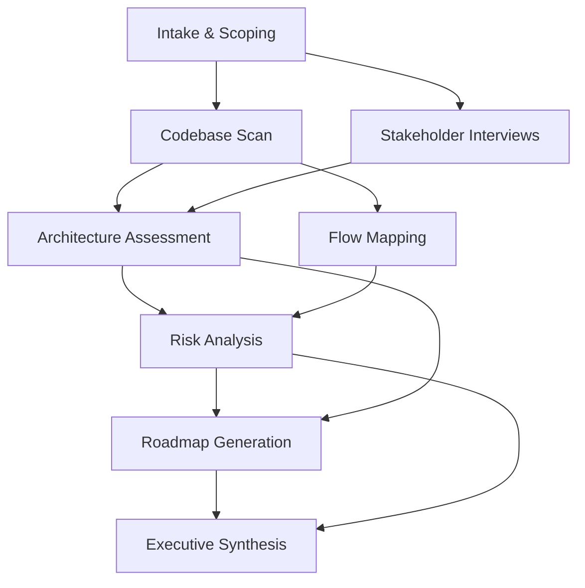

# Discovery Orchestrator — Sample Output

## Context

A logistics company wants a full technical assessment of their order management
system before investing in a modernization initiative. Timeline: 2 weeks.

## Output

### Pipeline Configuration

### Phase Schedule

| Phase | Skill | Duration | Inputs | Gate |
|-------|-------|----------|--------|------|
| P1 | Intake & Scoping | Day 1 | Request brief, repo access | G0: Scope approved |
| P2a | Codebase Scan | Days 2-3 | Repository | — |
| P2b | Stakeholder Interviews | Days 2-4 | Interview guide | — |
| P3 | Architecture Assessment | Days 4-6 | Scan results, interview notes | G1: Architecture understood |
| P4 | Flow Mapping | Days 4-6 | Codebase, scan results | — |
| P5 | Risk Analysis | Days 7-8 | Architecture + Flows | G2: Risks catalogued |
| P6 | Roadmap Generation | Days 9-10 | All prior deliverables | — |
| P7 | Executive Synthesis | Days 11-12 | All deliverables | G3: Package review |

### Gate Criteria

| Gate | Criteria | Approval |
|------|----------|----------|
| G0 | Scope document signed, access granted, stakeholders identified | Tech Lead |
| G1 | Architecture diagram reviewed, component inventory complete, no major gaps | Architect |
| G2 | All high/critical risks have mitigation strategies, no unacknowledged blockers | Tech Lead + Architect |
| G3 | Cross-deliverable consistency verified, executive summary reviewed | Sponsor |

### Deliverable Inventory

| ID | Deliverable | Skill Used | Status |
|----|-------------|-----------|--------|
| D-001 | Architecture Assessment Report | architecture-assessment | Pending |
| D-002 | Flow Inventory + Diagrams | flow-mapping | Pending |
| D-003 | Risk Register | risk-controlling | Pending |
| D-004 | Migration Roadmap | solution-roadmap | Pending |
| D-005 | Executive Summary | executive-pitch | Pending |
