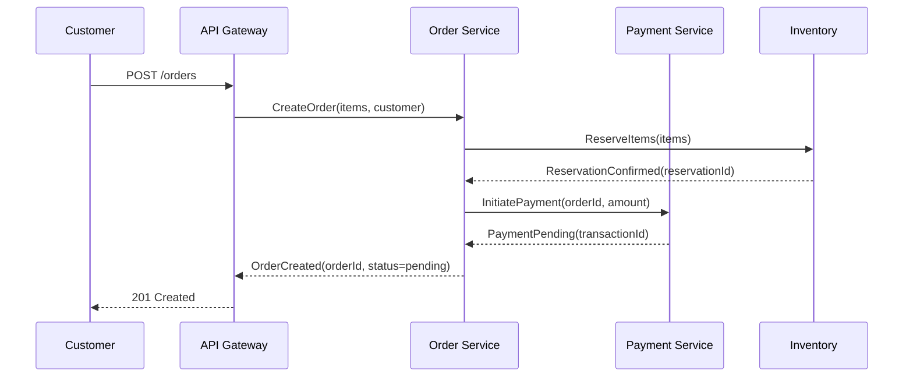

# Flow Mapping — Sample Output

## Context

A mid-size e-commerce platform needs to understand its order processing flow
before migrating from a monolith to microservices. The team suspects there are
undocumented integrations with the legacy warehouse system.

## Output

### Flow Inventory

| Flow ID | Name | Trigger | Systems | Status |
|---------|------|---------|---------|--------|
| F-001 | Order Placement | Customer checkout | Web, API Gateway, Order Service, Payment | Mapped |
| F-002 | Payment Processing | Order created event | Payment Service, Stripe, Ledger | Mapped |
| F-003 | Inventory Reservation | Payment confirmed | Inventory, Warehouse API | Gap found |
| F-004 | Fulfillment Dispatch | Inventory reserved | Warehouse, Shipping, Notification | Mapped |

### Sequence Diagram — F-001 Order Placement

### Gap Analysis

| Finding | Severity | Flow | Description |
|---------|----------|------|-------------|
| GAP-01 | High | F-003 | Warehouse API has no documented error contract. Failures return raw 500 with no retry guidance. |
| GAP-02 | Medium | F-002 | Payment webhook has no idempotency key. Duplicate deliveries could double-charge. |
| GAP-03 | Low | F-004 | Shipping notification uses fire-and-forget. No confirmation that customer was notified. |
