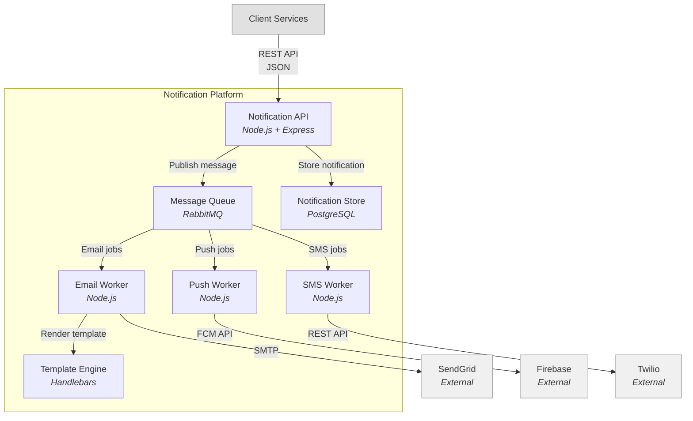
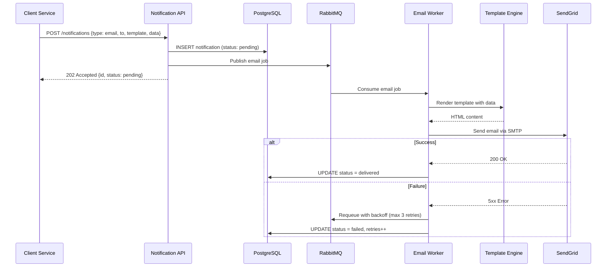
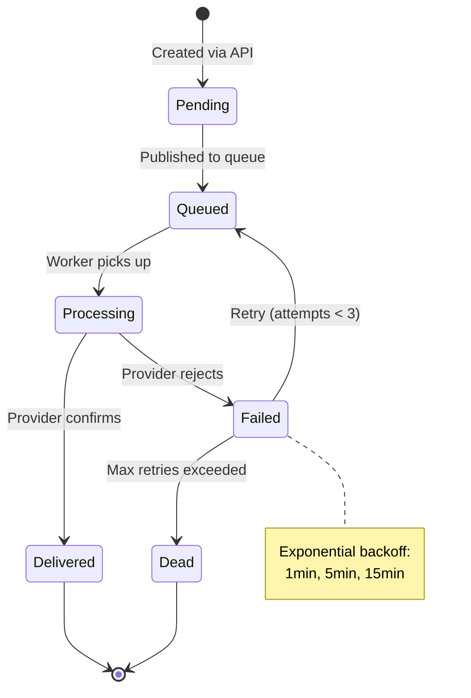

# Mermaid Diagramming — Sample Output

## Context
Generating architecture diagrams for a notification service that sends emails, push notifications, and SMS messages.

## Output

### C4 Container Diagram — Notification Platform

### Sequence Diagram — Send Email Notification

### State Diagram — Notification Lifecycle

### Diagram Evidence
- Container diagram: `[CODIGO]` — verified against `docker-compose.yml` and service registry.
- Sequence diagram: `[CODIGO]` — traced from `notificationController.ts` and `emailWorker.ts`.
- State diagram: `[INFERENCIA]` — deduced from database status enum and worker retry logic.
