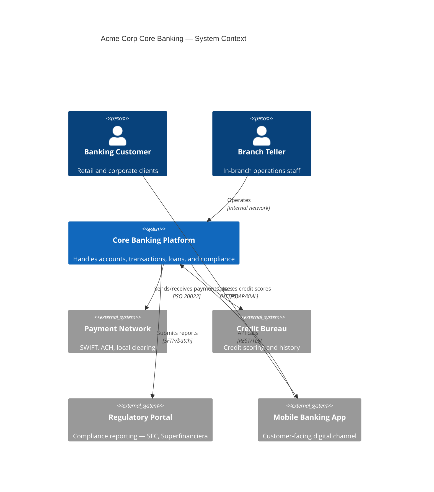
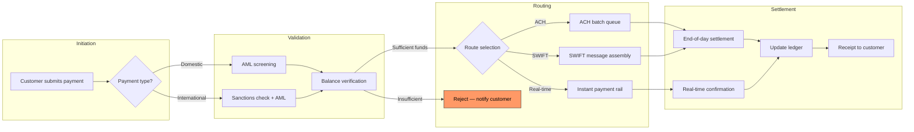
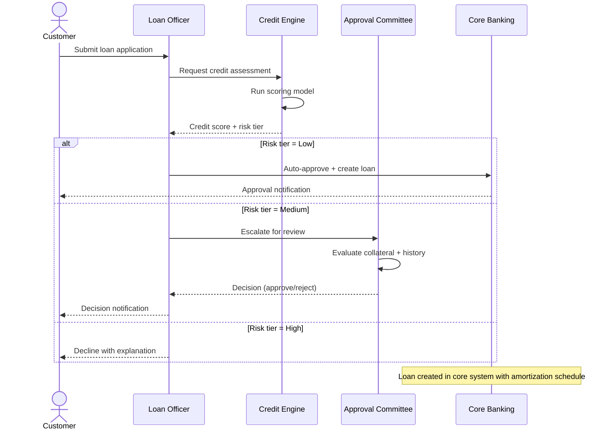
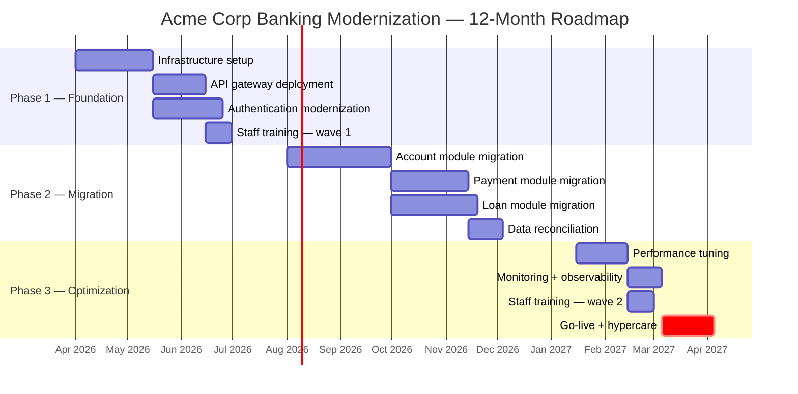
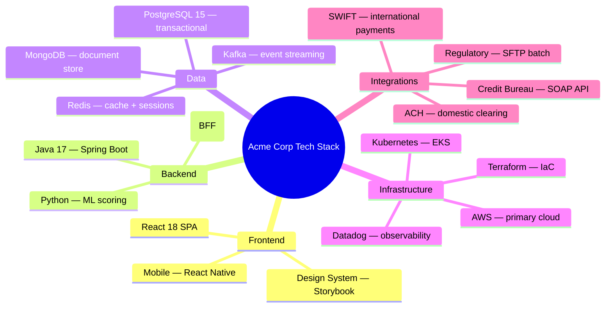
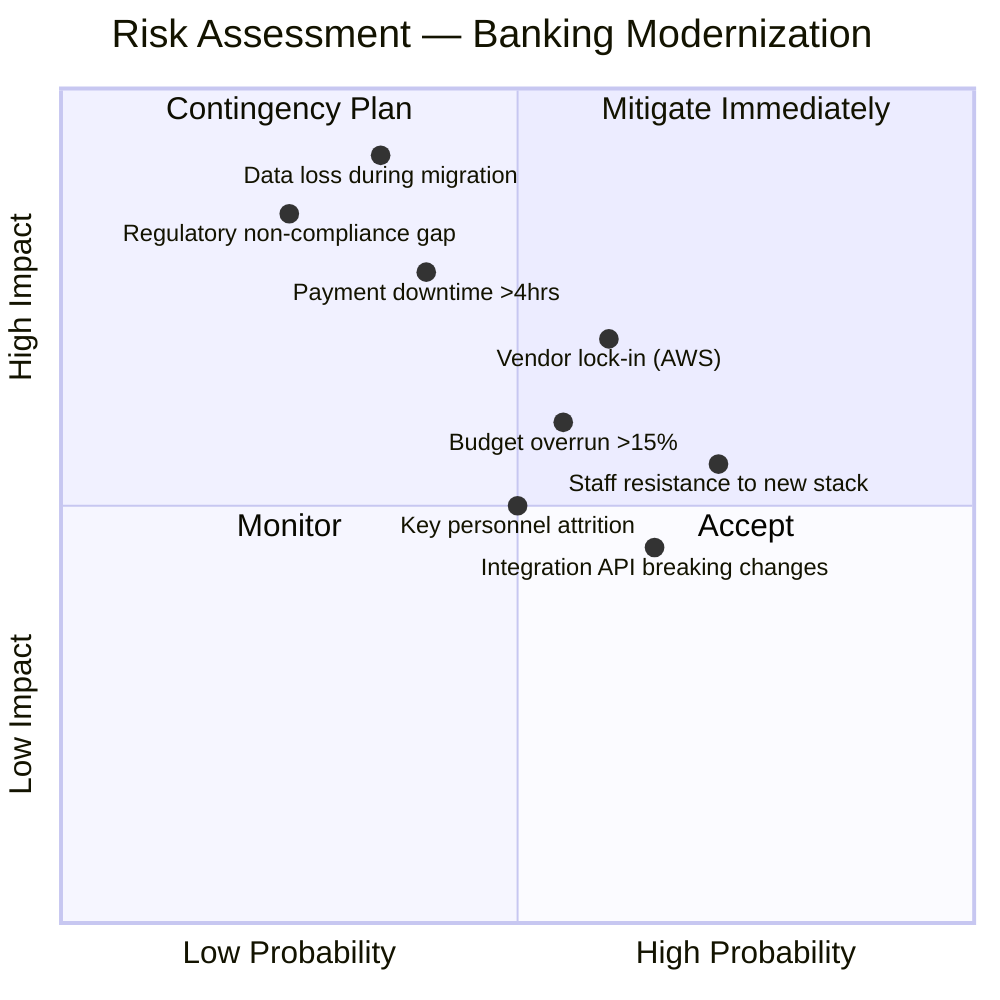

# Acme Corp Banking Modernization — Diagram Samples

Deliverable diagrams generated by the Mermaid Diagramming Engine for the Acme Corp core banking modernization discovery.

---

## Figure 1: System Context — Core Banking Platform

> **Figure 1**: High-level context diagram showing Acme Corp's core banking system and its external dependencies — customers, regulators, payment networks, and partner systems.

*Source: [DOC] Acme Corp architecture documentation, stakeholder interviews*

---

## Figure 2: Payment Processing Flow

> **Figure 2**: Flowchart depicting the end-to-end payment processing pipeline from initiation through validation, routing, and settlement.

*Source: [DOC] Payment operations manual v3.2, [CÓDIGO] payment-service module*

---

## Figure 3: Loan Origination — Actor Interactions

> **Figure 3**: Sequence diagram showing the interaction between customer, loan officer, credit engine, and approval committee during loan origination.

*Source: [DOC] Loan origination process documentation, [INFERENCIA] stakeholder workshop*

---

## Figure 4: Modernization Timeline

> **Figure 4**: Gantt chart showing the three-phase modernization roadmap — foundation (months 1-4), migration (months 5-9), and optimization (months 10-12).

*Source: [DOC] Solution roadmap v2, [INFERENCIA] PMO planning sessions*

---

## Figure 5: Technology Stack Overview

> **Figure 5**: Mindmap showing the current and target technology stack organized by layer — frontend, backend, data, infrastructure, and integrations.

*Source: [CÓDIGO] Repository analysis, [DOC] Technical brief*

---

## Figure 6: Risk Assessment Matrix

> **Figure 6**: Quadrant chart positioning the top modernization risks by probability (x-axis) and business impact (y-axis) to prioritize mitigation efforts.

*Source: [INFERENCIA] Risk workshop with CTO and compliance team*
