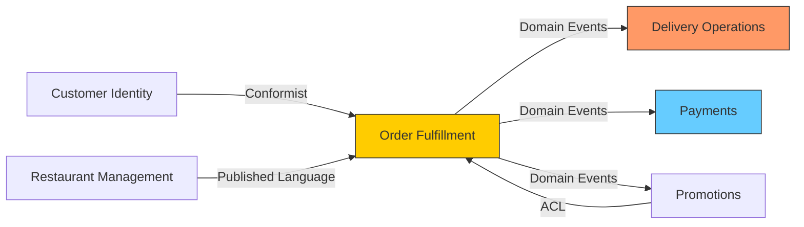

# Microservices Decomposer — Sample Output

## Context
A food delivery platform has a monolith handling restaurants, menus, orders, delivery tracking, payments, promotions, and customer support. The team wants to decompose it to enable independent scaling of the order and delivery tracking systems during peak hours.

## Output

### Bounded Contexts Identified

| Bounded Context | Core Entities | Ubiquitous Language | Team |
|----------------|---------------|-------------------|------|
| **Restaurant Management** | Restaurant, Menu, MenuItem, Schedule | "menu item", "availability window", "prep time" | Restaurant Platform |
| **Order Fulfillment** | Order, OrderItem, OrderStatus | "order placed", "accepted", "preparing", "ready" | Orders Squad |
| **Delivery Operations** | Delivery, Driver, Route, DeliveryStatus | "assignment", "pickup", "en route", "delivered" | Logistics Squad |
| **Payments** | Payment, Refund, PaymentMethod, Invoice | "charge", "capture", "refund", "settlement" | Payments Squad |
| **Promotions** | Promotion, Coupon, DiscountRule | "promotion", "redemption", "eligibility" | Growth Squad |
| **Customer Identity** | Customer, Address, Preferences | "customer", "address book", "dietary preference" | Platform Squad |

### Context Map



**Relationship Types**:
- Restaurant Management → Order Fulfillment: **Published Language** (menu/pricing data consumed via stable API).
- Order Fulfillment → Delivery Operations: **Domain Events** (`OrderReadyForPickup`, `OrderCancelled`).
- Order Fulfillment → Payments: **Domain Events** (`OrderConfirmed` triggers charge, `OrderCancelled` triggers refund).
- Promotions → Order Fulfillment: **Anti-Corruption Layer** (promotions service translates discount rules into a simple discount amount).

### Integration Patterns

| Source → Target | Pattern | Event/API | Consistency |
|----------------|---------|-----------|-------------|
| Order → Delivery | Async Event | `OrderReadyForPickup` | Eventually consistent |
| Order → Payments | Async Event + Saga | `OrderConfirmed` → `PaymentCharged` → `OrderPaid` | Saga with compensation |
| Restaurant → Order | Sync API | `GET /restaurants/{id}/menu` | Strong (cached 60s) |
| Promotions → Order | Sync API | `POST /promotions/validate` | Strong |
| Order → Customer | Sync API | `GET /customers/{id}` | Strong (cached 300s) |

### Saga: Order-Payment Flow

```
1. OrderService: Create order (status=PENDING_PAYMENT)
2. OrderService publishes: OrderConfirmed
3. PaymentService: Charge customer
   - Success → publishes PaymentCharged
   - Failure → publishes PaymentFailed
4a. OrderService receives PaymentCharged → status=CONFIRMED, publish OrderPaid
4b. OrderService receives PaymentFailed → status=CANCELLED, notify customer
```

### Decomposition Order

| Priority | Service | Rationale | Dependencies |
|----------|---------|-----------|-------------|
| 1 | Customer Identity | Leaf service, no downstream dependencies, enables auth isolation | None |
| 2 | Payments | High regulatory value in isolation, clear domain boundary | Customer Identity (sync) |
| 3 | Delivery Operations | Main scaling bottleneck during peaks, independent domain | Order Fulfillment (events) |
| 4 | Restaurant Management | Stable domain, fewer changes, enables restaurant team autonomy | None |
| 5 | Order Fulfillment | Core service, extract last to minimize temporary cross-DB queries | All others |
| 6 | Promotions | Coupled to orders; extract after Order Fulfillment is stable | Order Fulfillment (sync) |

### Database Splitting Strategy
- **Phase 1**: Logical separation — schema-per-service within the same PostgreSQL instance.
- **Phase 2**: Physical separation — migrate each schema to its own RDS instance as services stabilize.
- **Shared data during transition**: Read through API, never direct DB access. Temporary CDC for data sync.
