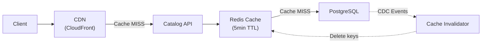

# Output Engineering — Sample Output

## Context
Demonstrating the output engineering pattern applied to a caching strategy recommendation.

## Output

---

**Title**: Caching Strategy Recommendation — Product Catalog Service
**Author**: JM Labs | **Date**: 2026-03-17 | **Version**: 1.0 | **Status**: Draft
**Audience**: Backend Tech Lead, Platform Architect
**Evidence**: 60% HECHO | 25% INFERENCIA | 15% SUPUESTO

---

### TL;DR

Introduce a two-layer cache (Redis L1 + CDN L2) for the product catalog API to reduce p99 latency from 800ms to under 100ms and cut database load by 85%. Estimated effort: 1.5 sprints. ROI: infrastructure cost reduction of $2,400/month from reduced RDS read replicas.

---

### Key Findings

- Current p99 latency of 800ms exceeds the 300ms SLO for catalog queries. `[HECHO]`
- 92% of catalog requests are reads with a 4-hour acceptable staleness window. `[HECHO]`
- PostgreSQL read replica is at 78% CPU during peak hours, trending toward capacity. `[HECHO]`
- Redis cluster with 5-minute TTL would absorb 85% of read traffic. `[INFERENCIA]`
- CDN caching of API responses would further reduce latency to < 50ms for repeat requests. `[INFERENCIA]`
- Team has Redis experience from the session store implementation. `[HECHO]`
- Cache invalidation via CDC (Debezium) is preferred over TTL-only for price-sensitive data. `[SUPUESTO]`

---

### Detailed Analysis

#### Current State
The product catalog API serves 50K requests/hour at peak, with 92% read traffic. All queries hit PostgreSQL through a read replica that is approaching capacity limits. Response times degrade during promotional events when traffic spikes 3x.

#### Proposed Architecture



#### Alternatives Considered

| Option | Latency | Complexity | Staleness Control | Verdict |
|--------|---------|------------|-------------------|---------|
| Redis only | ~80ms | Low | TTL-based | Good baseline |
| Redis + CDN | ~50ms | Medium | TTL + surrogate keys | **Selected** |
| Application cache (in-memory) | ~5ms | Low | No cluster consistency | Rejected — multi-pod inconsistency |
| Varnish proxy cache | ~30ms | High | VCL configuration | Rejected — operational overhead |

---

### Ghost Menu

```
Next steps for this artifact:
  /jm:impl-plan     → Generate implementation plan with file changes
  /jm:test-strategy  → Design test strategy for caching layer
  /jm:perf-budget   → Define performance budget with cache targets
  /jm:evidence-scan  → Upgrade [SUPUESTO] items to [HECHO]
  /jm:approve        → Mark as approved and remove {WIP} tag
```

---
