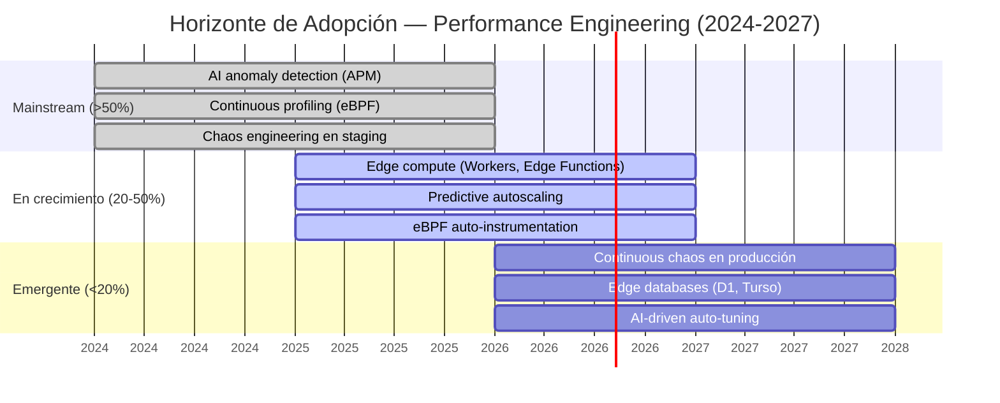

# State of the Art: Performance Engineering

## TL;DR

- **AI-driven performance optimization** usa ML para detección de anomalías, auto-tuning y predicción de degradación antes de que impacte usuarios.
- **Chaos engineering** madura hacia continuous chaos en producción con blast radius controlado y rollback automático.
- **eBPF observability** permite profiling de producción con overhead <2%, reemplazando agent-based monitoring tradicional.
- **Edge performance** evoluciona de CDN estático a compute at edge con Cloudflare Workers, Deno Deploy y edge databases.
- **Serverless performance patterns** resuelven cold starts y tail latency con provisioned concurrency, SnapStart y edge-optimized functions.

---

## 1. AI-Driven Performance Optimization

### Estado actual (2025-2026)

Las plataformas de APM y observabilidad integran ML para ir más allá de thresholds estáticos. La detección de anomalías, predicción de capacity, y auto-remediation son capacidades emergentes que cambian el modelo de operación.

### Capacidades y herramientas

| Capacidad | Herramienta | Madurez |
|-----------|-------------|---------|
| Anomaly detection | Datadog, Dynatrace, New Relic | Producción |
| Root cause analysis automático | Dynatrace Davis AI, Datadog Watchdog | Producción |
| Capacity prediction | Datadog Forecasts, custom ML models | Producción |
| Auto-tuning (JVM, DB) | AI-powered tuning advisors | En crecimiento |
| Predictive autoscaling | AWS Predictive Scaling, GCP Autoscaler ML | Producción |
| Performance regression detection | Datadog CI Visibility, Grafana Cloud | En crecimiento |

### Patrones emergentes

- **Predictive alerting:** En lugar de alertar cuando p95 > threshold, predecir cuándo lo superará en las próximas 2-4 horas basándose en tendencia. Tiempo de reacción proactivo en lugar de reactivo.
- **Automated capacity right-sizing:** Analizar utilización histórica de recursos y recomendar (o aplicar) right-sizing automático. Reduce over-provisioning en 20-40% sin afectar performance.
- **Intelligent load shedding:** Bajo saturación, ML clasifica requests por prioridad de negocio y descarta los de menor impacto. Mantiene el servicio para usuarios de alto valor cuando el sistema está al límite.
- **Performance regression in CI:** Detectar automáticamente que un commit degradó p95 comparando contra baseline estadístico, no contra un threshold hardcodeado. Reduce falsos positivos.
- **LLM-assisted troubleshooting:** Agentes AI que analizan métricas, logs y traces simultáneamente para sugerir root cause. Aceleran MTTR para on-call engineers.

### Impacto en la skill

S1 (Performance Baseline) debe recomendar anomaly detection como upgrade sobre thresholds estáticos. S3 (Capacity Planning) debe incluir predictive scaling como alternativa avanzada a autoscaling reactivo. S6 (SLOs) debe considerar predictive alerting para burn rate.

---

## 2. Chaos Engineering

### Evolución (2024-2026)

Chaos engineering ha madurado de "Chaos Monkey mata pods" a una disciplina formal con hipótesis, métricas de steady state, blast radius controlado y automated rollback.

### Plataformas actuales

| Plataforma | Enfoque | Entorno | Madurez |
|------------|---------|---------|---------|
| **Gremlin** | Enterprise, managed | Producción | Producción |
| **Litmus (CNCF)** | Kubernetes-native, open source | Staging/Prod | Producción |
| **Chaos Mesh (CNCF)** | Kubernetes, fault injection | Staging/Prod | Producción |
| **AWS FIS** | AWS-native, managed | AWS | Producción |
| **Steadybit** | Enterprise, collaborative | Multi-cloud | En crecimiento |
| **Harness Chaos** | CI/CD integrated | Multi-platform | En crecimiento |

### Tendencias clave

- **Continuous chaos in CI/CD:** Integrar experimentos de chaos en el pipeline de deployment. Cada release candidate pasa un "chaos gate" en staging antes de llegar a producción.
- **Chaos as verification:** No solo "¿sobrevive el sistema?" sino "¿se recupera dentro del SLO?". Medir recovery time contra SLO targets. Si recovery > error budget, la release no pasa.
- **Security chaos (GameDay):** Extender chaos engineering a escenarios de seguridad: ¿qué pasa si un secret rota?, ¿si un certificado expira?, ¿si un IAM policy se revoca?
- **Multi-service chaos:** Inyectar fallos en múltiples servicios simultáneamente para validar que los circuit breakers y bulkheads funcionan en cascada.
- **Automated blast radius control:** Monitorear métricas de negocio durante el experimento. Si el impacto excede un umbral, rollback automático del experimento en <30 segundos.
- **Observability-driven chaos:** Usar datos de distributed tracing para identificar las dependencias más críticas y diseñar experimentos de chaos específicamente para ellas.

### Impacto en la skill

S2 (Load Testing Strategy) debe incluir chaos experiments como complemento de load testing. S3 (Capacity Planning) debe validar que la capacidad incluye headroom para recovery de fault injection. El chaos maturity model del SKILL.md (4 niveles) sigue vigente.

---

## 3. eBPF Observability

### Estado actual (2025-2026)

eBPF (extended Berkeley Packet Filter) permite instrumentación del kernel de Linux sin modificar código de aplicación ni instalar agents pesados. Revoluciona el profiling en producción con overhead <2%.

### Ecosistema

| Herramienta | Capa | Caso de uso | Madurez |
|-------------|------|-------------|---------|
| **Cilium** | Networking | Network policy, service mesh sin sidecar | Producción |
| **Pixie (New Relic)** | Full-stack | Auto-instrumentation sin código, distributed tracing | Producción |
| **Parca** | Continuous profiling | CPU profiling always-on en producción | Producción |
| **Coroot** | Observability | Auto-discovery de servicios, SLO monitoring | En crecimiento |
| **Grafana Beyla** | Application | Auto-instrumentation HTTP/gRPC, zero-code | En crecimiento |
| **Tetragon (Cilium)** | Security | Runtime security observability | En crecimiento |

### Tendencias clave

- **Continuous profiling en producción:** Profiling siempre activo con overhead <1%. Flame graphs disponibles para cualquier ventana de tiempo, sin necesidad de reproducir el problema. Parca y Grafana Pyroscope lideran.
- **Sidecar-less service mesh:** Cilium reemplaza Istio/Envoy sidecars con eBPF en el kernel. Reduce latencia de mesh (no hay hop extra al sidecar) y consumo de recursos.
- **Auto-instrumentation zero-code:** Pixie y Beyla capturan métricas de HTTP, gRPC, SQL y DNS sin modificar la aplicación. Útil para legacy systems donde no se puede agregar OpenTelemetry SDK.
- **Network performance analysis:** Medir latencia de red entre servicios a nivel de kernel. Detectar retransmissions, connection resets, y DNS resolution delays sin packet capture completo.
- **Security + performance convergence:** eBPF permite monitorear syscalls y network activity para detectar tanto problemas de performance como amenazas de seguridad con el mismo framework.

### Impacto en la skill

S1 (Performance Baseline) debe recomendar continuous profiling con eBPF como alternativa a profiling on-demand para sistemas en producción. Para Java, async-profiler sigue siendo la opción principal; eBPF complementa con visibilidad de kernel.

---

## 4. Edge Performance

### Evolución (2024-2026)

Edge computing ha evolucionado de "CDN sirve archivos estáticos" a "compute at edge ejecuta lógica de aplicación lo más cerca posible del usuario". Edge databases y edge functions cambian la arquitectura de performance.

### Plataformas actuales

| Plataforma | Runtime | Edge DB | Diferenciador |
|------------|---------|---------|---------------|
| **Cloudflare Workers** | V8 isolates | D1 (SQLite), KV, Durable Objects | Cold start <5ms, 300+ PoPs |
| **Vercel Edge Functions** | V8 isolates | Vercel KV, Postgres Edge | Next.js native, streaming |
| **Deno Deploy** | V8 isolates, Deno runtime | Deno KV | TypeScript native, Web APIs |
| **AWS Lambda@Edge** | Node.js, Python | DynamoDB Global Tables | CloudFront integrated |
| **Fastly Compute** | Wasm | KV Store | Wasm runtime, <1ms cold start |
| **Akamai EdgeWorkers** | V8 | EdgeKV | Enterprise CDN |

### Tendencias clave

- **Edge databases:** D1 (Cloudflare), Turso (libSQL), Neon (Postgres edge), PlanetScale (MySQL edge). Datos near-user eliminan latencia de round-trip a origin. Trade-off: consistencia eventual vs. baja latencia.
- **Streaming SSR at edge:** Frameworks como Next.js y Remix renderizan HTML en el edge con streaming. Time-to-first-byte <50ms para cualquier usuario global.
- **Edge-first architecture:** Diseñar para edge por defecto, fallback a origin solo para operaciones que requieren strong consistency. Invierte el modelo tradicional (origin-first, cache at edge).
- **Smart routing at edge:** Canary deployments, A/B testing, y feature flags evaluados en el edge sin round-trip a origin. Personalización ultra-rápida.
- **Edge AI inference:** Modelos ML pequeños ejecutados en edge (Cloudflare Workers AI, Vercel AI SDK). Clasificación, embeddings, y personalización sin latencia de API central.

### Impacto en la skill

S5 (CDN & Edge Strategy) debe expandirse para incluir edge compute como capa de procesamiento, no solo de caching. S4 (Caching Architecture) debe considerar edge databases como nueva capa de cache con consistencia configurable.

---

## 5. Serverless Performance Patterns

### Estado actual (2025-2026)

Serverless ha resuelto muchos de sus problemas de performance iniciales (cold starts, tail latency). Los patrones de optimización permiten performance comparable a containers para la mayoría de workloads.

### Evolución de cold start mitigation

| Técnica | Plataforma | Reducción cold start | Trade-off |
|---------|------------|---------------------|-----------|
| **Provisioned concurrency** | AWS Lambda, Azure Functions | Elimina (warm instances) | Costo fijo |
| **SnapStart** | AWS Lambda (Java) | 90%+ (snapshot de estado) | Solo Java, eventual consistency cuidado |
| **Min instances** | Google Cloud Functions | Elimina (warm instances) | Costo fijo |
| **V8 isolates** | Cloudflare Workers, Deno | <5ms (no container boot) | Runtime limitado |
| **GraalVM native-image** | Cualquiera | 90%+ (AOT compilation) | Build time largo, reflection limitado |

### Tendencias clave

- **Function composition patterns:** Step Functions, Durable Functions, Temporal. Orquestar funciones sin el overhead de HTTP entre cada paso. Reduce latencia de workflows complejos.
- **Response streaming:** Lambda response streaming (AWS), streaming SSR. No esperar a que toda la respuesta esté lista — stream chunks al cliente. Mejora TTFB sin cambiar la duración total.
- **Power tuning automation:** AWS Lambda Power Tuning encuentra automáticamente el tamaño de memoria óptimo (RAM ↔ CPU ↔ costo ↔ duración). Elimina guesswork.
- **Serverless containers:** AWS Fargate, Google Cloud Run, Azure Container Apps. Performance de container con scaling de serverless. Best of both worlds para workloads compute-intensive.
- **Connection pooling for serverless:** RDS Proxy (AWS), PgBouncer, connection pooling externo. Serverless crea/destruye conexiones frecuentemente — sin pooling, el DB se satura.
- **Observability para serverless:** Distributed tracing con OpenTelemetry, cold start tracking, invocation cost tracking. Métricas específicas: init duration, billed duration, concurrent executions.

### Impacto en la skill

S3 (Capacity Planning) debe modelar serverless con métricas diferentes: concurrent executions, throttling rate, init duration. S6 (SLOs) debe incluir cold start como factor en p99 latency targets para funciones serverless.

---

## Horizonte de Adopción: Mapa Temporal

---

## Implicaciones para Discovery

Al evaluar el performance engineering de un cliente, considerar:

1. **Nivel de observabilidad actual:** Si no tienen APM, empezar por observabilidad básica antes de optimización. Sin métricas no hay baseline.
2. **eBPF readiness:** Requiere Linux kernel 5.x+. En Kubernetes, verificar que el control plane permite eBPF programs. No aplica para Windows workloads.
3. **Edge architecture viability:** Evaluar si los datos permiten eventual consistency. Si requieren strong consistency para toda operación, edge databases no aplican. Si tienen contenido estático o personalización ligera, edge es un quick win.
4. **Chaos maturity assessment:** La mayoría de organizaciones están en nivel 1 (manual staging). Evaluar readiness organizacional antes de proponer chaos en producción.
5. **Serverless performance assessment:** Cold starts importan solo si p99 es crítico. Para workloads con tráfico constante, provisioned concurrency elimina el problema. Para tráfico esporádico, evaluar si cold start está dentro del SLO.

---

**Autor:** Javier Montaño | **Fecha:** 13 de marzo de 2026 | **© Comunidad MetodologIA**
