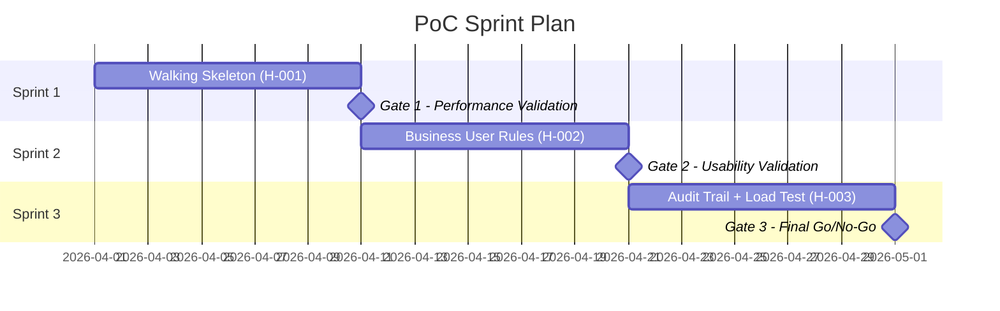

# Roadmap PoC — Sample Output

## Context

An insurance company wants to validate whether a rules engine (Drools) can replace
their hardcoded underwriting logic. Current system: 2,400 business rules embedded
in Java code, 200ms average decision time, 99.9% uptime requirement.

## Output

### Hypotheses

| ID | Hypothesis | Success Criteria | Failure Criteria |
|----|-----------|-----------------|------------------|
| H-001 | Drools can execute the top 50 underwriting rules within 200ms | p99 latency <= 200ms under production load | p99 latency > 300ms |
| H-002 | Business analysts can modify rules without developer intervention | 3 rule changes completed by analysts in Sprint 2 | Analysts require developer support for >50% of changes |
| H-003 | Rule engine maintains decision audit trail for regulatory compliance | Full decision trace available for any decision within 5 seconds | Audit trail incomplete or query time >30 seconds |

### Sprint Plan

### Team and Budget

| Role | Allocation | Sprints | Total |
|------|-----------|---------|-------|
| Senior Java Engineer | 100% | 1-3 | 6 FTE-weeks |
| Rules Engine Specialist | 50% | 1-2 | 2 FTE-weeks |
| Business Analyst (Tester) | 50% | 2-3 | 2 FTE-weeks |
| **Total** | | | **10 FTE-weeks** |

### Risk Register

| Risk | Probability | Impact | Mitigation | Contingency |
|------|------------|--------|-----------|-------------|
| Drools learning curve exceeds estimate | Medium | Medium | Engage vendor training for Sprint 0 | Extend Sprint 1 by 3 days |
| Rule translation errors from Java to DRL | High | High | Pair-review each translated rule | Maintain Java fallback for critical rules |
| Performance degradation with full rule set | Medium | Critical | Test with production-scale data from Sprint 1 | Evaluate alternative engine (Easy Rules) |

### Gate Decision Matrix

| Gate | Proceed | Pivot | Stop |
|------|---------|-------|------|
| G1 | p99 <= 200ms with 50 rules | p99 200-300ms (optimize) | p99 > 500ms |
| G2 | Analysts complete 3+ changes independently | Analysts need minimal developer support | Analysts cannot modify rules at all |
| G3 | All hypotheses validated | 2 of 3 validated (conditional proceed) | Fewer than 2 validated |
