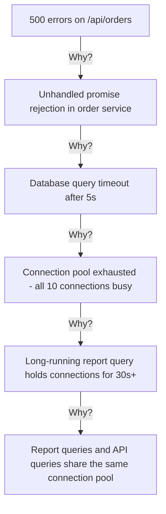

# Root Cause Analyzer — Sample Output

## Context
Investigating intermittent 500 errors on the `/api/orders` endpoint.

## Output

### Symptom
Users receive HTTP 500 errors on `GET /api/orders` approximately 5% of the time, increasing during peak hours `[HECHO]`.

### Causal Chain (5 Whys)

### Analysis

| Level | Finding | Evidence | Tag |
|-------|---------|----------|-----|
| Symptom | 500 errors, 5% of requests | Error logs `[HECHO]` | — |
| Proximate cause | Unhandled promise rejection | `orders/service.ts:89` `[HECHO]` | — |
| Contributing factor | No timeout on DB queries | `database/config.ts` `[HECHO]` | — |
| Contributing factor | Connection pool too small (10) | `database/config.ts:12` `[HECHO]` | — |
| **Root cause** | Report and API queries share connection pool | Architecture decision `[HECHO]` | — |

### Recommendations
- **Corrective**: Separate connection pools for reports and API queries
- **Mitigation**: Add error handling for promise rejections in order service
- **Mitigation**: Increase pool size to 25 and add query timeout of 10s
- **Preventive**: Add connection pool monitoring and alerting
