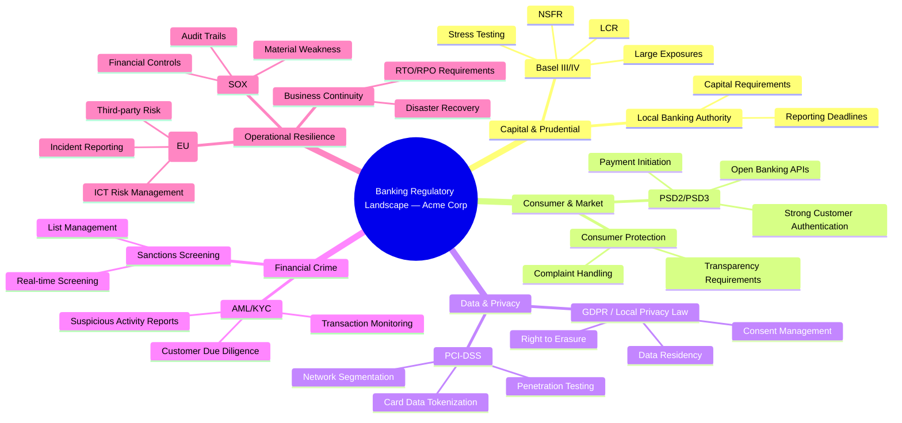

# SME Industry Context — Acme Corp Banking Modernization

**Proyecto:** Acme Corp — Core Banking Modernization
**Lente de industria:** Banking / Financial Services
**Fase:** Architecture Review
**Profundidad:** Standard
**Fecha:** 12 de marzo de 2026

---

## 1. Industry Context Brief

The global core banking modernization wave is entering its most critical phase. Regulatory pressure from Basel III/IV capital adequacy requirements, the expansion of PSD2/PSD3 open banking mandates across markets, and the rise of embedded finance are forcing mid-tier banks like Acme Corp to replace aging monolithic cores built on COBOL/AS400 stacks. The window for competitive differentiation through technology is narrowing — institutions that fail to modernize by 2028 risk becoming utility providers relegated to back-office settlement while fintechs and neobanks capture the customer relationship.

Acme Corp operates in a tier-2 banking segment where the pressure is acute: large enough to face full regulatory scrutiny (Basel III/IV reporting, stress testing, AML/KYC automation), but without the budget cushion of tier-1 institutions. The modernization must balance regulatory compliance continuity with the agility gains that justify the investment. The strategic question is not *whether* to modernize, but *how to sequence the migration* to minimize regulatory reporting disruption while delivering early business value through real-time payment capabilities and API-enabled product distribution.

## 2. Risk Overlay

| # | Risk | Probability | Impact | Mitigation |
|---|------|-------------|--------|------------|
| 1 | **Fraud migration during cutover** | Alta | Crítico | During the parallel-run phase between legacy and new core, fraud detection rules must operate across both systems simultaneously. Gaps in rule synchronization create a window where fraudulent transactions may slip through undetected. Implement unified fraud monitoring layer that sits above both cores during transition. |
| 2 | **Regulatory reporting disruption** | Media-Alta | Crítico | Core banking systems are the source of truth for Basel III/IV regulatory reports (LCR, NSFR, large exposures). Any data model mismatch between legacy and new core can produce inconsistent reports, triggering regulatory scrutiny. Mandate parallel reporting runs for 2 complete regulatory cycles before legacy decommission. |
| 3 | **Data sovereignty in cloud migration** | Media | Alto | If the new core leverages cloud infrastructure, banking regulators in most jurisdictions require that customer financial data remains within national borders. Multi-region cloud deployments must be architected with data residency controls from day one — retrofitting is prohibitively expensive. |
| 4 | **Core banking vendor lock-in** | Media | Alto | Modern core banking platforms (Temenos, Thought Machine, Mambu) offer rapid deployment but create deep dependency. API abstraction layers and contract-negotiated data portability clauses are essential. Evaluate total cost of exit, not just total cost of ownership. |
| 5 | **Real-time payment compliance** | Alta | Alto | Adoption of ISO 20022 messaging and real-time payment rails (instant payments, request-to-pay) requires the new core to support sub-second transaction processing with full audit trails. Legacy batch-oriented architectures cannot be incrementally adapted — this requires purpose-built real-time infrastructure. |

## 3. Benchmark Data

| Metric | Industry Benchmark | Acme Corp Implication |
|--------|-------------------|----------------------|
| **Core banking modernization timeline** | 18–36 months for mid-tier banks (tier-2, $10–50B assets). Full replacement averages 30 months; progressive migration (strangler fig pattern) averages 24 months with earlier value delivery. | Acme should plan for a 24-month progressive migration. Any timeline under 18 months for a full core replacement carries unacceptable risk of regulatory reporting gaps. |
| **Typical budget** | $15–40M for mid-tier bank core modernization (includes platform licensing, integration, data migration, parallel-run costs, and regulatory validation). Cloud-native cores trend toward lower end; on-premise toward upper end. | Budget planning should anchor at $25–30M for a cloud-native progressive migration. Reserve 15–20% contingency specifically for regulatory validation and extended parallel-run costs. |
| **Success rate** | ~40% of core banking modernizations complete on time and on budget. Primary failure modes: scope creep from regulatory changes (35%), data migration complexity underestimation (30%), organizational change resistance (20%), vendor capability gaps (15%). | Acme must invest in dedicated data migration workstream with its own timeline and success criteria. Regulatory change monitoring should be a standing agenda item in steering committee. |

## 4. Regulatory Flags

### Directly Applicable Regulations

- **SOX (Sarbanes-Oxley):** Financial controls and audit trails must remain intact throughout migration. The new core must provide equivalent or superior audit capabilities. Any gap in financial control documentation during transition is a material weakness finding.
- **PCI-DSS:** Card data handling in the new core must maintain PCI-DSS Level 1 compliance. Tokenization strategy must be defined before migration of card-related modules.
- **Basel III/IV:** Capital adequacy calculations, liquidity coverage ratio (LCR), and net stable funding ratio (NSFR) depend on accurate, timely data from the core. The new system must support the standardized approach and any internal models Acme uses.
- **AML/KYC (local banking authority):** Transaction monitoring and customer due diligence workflows must not be interrupted. The new core must integrate with existing AML platforms or provide equivalent capabilities from day one.

### Emerging Regulatory Considerations

- **PSD2/PSD3 Open Banking:** The new core should be API-first to support mandatory account access and payment initiation services. PSD3 proposals suggest expanding scope to include crypto-asset service providers.
- **DORA (Digital Operational Resilience Act):** If Acme operates in or serves EU markets, ICT risk management frameworks must be embedded in the new platform architecture, not bolted on post-deployment.

## 5. Competitive Landscape

Peer institutions in the tier-2 banking segment are pursuing three distinct modernization strategies. **Progressive modernizers** (approximately 45% of peers) are using the strangler fig pattern — wrapping legacy cores with API layers and progressively migrating domain by domain, starting with payments and lending. **Platform replacers** (approximately 30%) are adopting cloud-native core banking platforms (Thought Machine Vault, Temenos Transact SaaS, Mambu) for full replacement, accepting higher short-term risk for faster long-term agility. **Minimalists** (approximately 25%) are limiting investment to API facades over legacy cores, betting that the core itself can survive another 5–7 years with reduced feature development. Early evidence suggests progressive modernizers achieve the best risk-adjusted outcomes, delivering 60% of target capabilities within 12 months while maintaining regulatory compliance continuity.

## 6. "So What?" Summary

For Acme Corp, this is not a technology decision — it is a business survival decision with a regulatory compliance constraint. The core banking system is the gravitational center of every product, every regulatory report, and every customer interaction. A failed modernization does not just waste $25–30M; it creates regulatory exposure, competitive disadvantage, and organizational trauma that sets the institution back 3–5 years. The key insight: **sequence matters more than speed.** Acme should prioritize payment modernization (highest competitive impact, clearest regulatory mandate) and regulatory reporting continuity (highest risk if disrupted), deferring lower-risk domains like internal GL and back-office settlement to later phases. The strangler fig pattern with a 24-month horizon and 20% regulatory contingency budget provides the best risk-adjusted path.

## 7. Regulatory Landscape — Mindmap

---

**Lente aplicado:** Banking / Financial Services
**Supuestos declarados:** Acme Corp es un banco tier-2 con activos entre $10–50B. Opera en una jurisdicción con regulación bancaria madura. No tiene operaciones significativas en mercados emergentes. Los benchmarks provienen de fuentes públicas de la industria (Gartner, Celent, McKinsey Banking Practice reports públicos).
**Generado por:** Dynamic SME Skill v6.0
