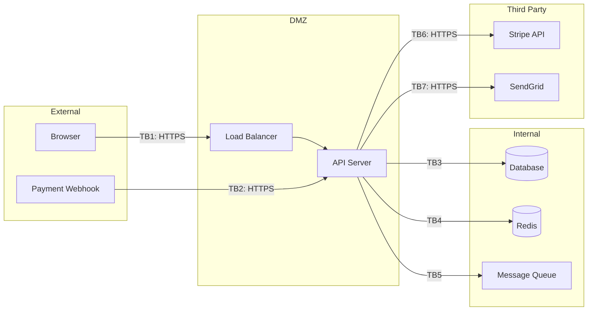
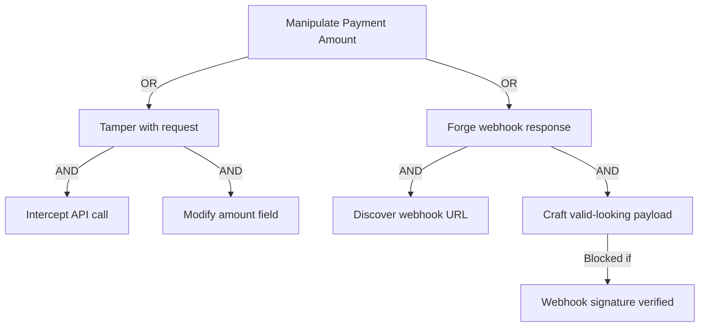

# Security Threat Modeler — Sample Output

## Context
STRIDE analysis for a web application with user authentication and payment processing.

## Output

### Trust Boundaries

### STRIDE Findings (excerpt)

| ID | Component | Category | Threat | Severity |
|----|-----------|----------|--------|----------|
| T1 | TB1 (User→API) | Spoofing | JWT token theft via XSS | High `[HECHO]` |
| T2 | TB2 (Webhook→API) | Spoofing | Forged webhook without signature verification | Critical `[HECHO]` |
| T3 | TB3 (API→DB) | Tampering | SQL injection in search endpoint | Critical `[HECHO]` |
| T4 | TB3 (API→DB) | Info Disclosure | Verbose error messages expose schema | Medium `[HECHO]` |
| T5 | API | Denial of Service | No rate limiting on authentication endpoints | High `[HECHO]` |
| T6 | API | Elevation | Missing authorization check on admin endpoint | Critical `[HECHO]` |

### Top Threat Tree: Unauthorized Payment Manipulation

