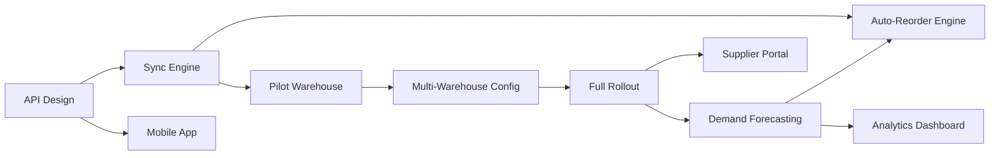

# Solution Roadmap — Sample Output

## Context

A retail company needs to modernize their inventory management system from a
desktop application to a cloud-native platform. 12 warehouses, 50K SKUs,
real-time stock visibility required.

## Output

### Phase Summary

| Phase | Horizon | Duration | Focus | Key Deliverable |
|-------|---------|----------|-------|----------------|
| P1 — Foundation | H1 (0-3mo) | 10-12 weeks | API layer + real-time sync for 1 warehouse | Live inventory API for pilot warehouse |
| P2 — Scale | H1 (3-6mo) | 10-14 weeks | Multi-warehouse rollout + mobile app | All 12 warehouses on platform |
| P3 — Intelligence | H2 (6-9mo) | 8-12 weeks | Demand forecasting + auto-reorder | Automated replenishment for top 100 SKUs |
| P4 — Ecosystem | H3 (9-12mo) | 10-14 weeks | Supplier portal + analytics dashboard | Self-service supplier integration |

### Dependency Graph

### Investment Profile

| Horizon | Cumulative Investment | Cumulative Value | Decision Point |
|---------|---------------------|-----------------|----------------|
| H1 End (Month 6) | 28-36 FTE-months | Real-time visibility across all warehouses | Proceed to H2 if pilot shows >15% stock accuracy improvement |
| H2 End (Month 9) | 38-50 FTE-months | Automated replenishment for top SKUs | Proceed to H3 if auto-reorder reduces stockouts by >20% |
| H3 End (Month 12) | 50-66 FTE-months | Full platform with supplier ecosystem | Evaluate platform for adjacent use cases |

### Risk-Adjusted Timeline

| Phase | Optimistic | Likely | Pessimistic | Risk Factor |
|-------|-----------|--------|-------------|-------------|
| P1 | 8 weeks | 11 weeks | 16 weeks | Legacy data quality unknown |
| P2 | 8 weeks | 12 weeks | 18 weeks | Warehouse connectivity varies |
| P3 | 6 weeks | 10 weeks | 15 weeks | ML model accuracy uncertainty |
| P4 | 8 weeks | 12 weeks | 16 weeks | Supplier adoption rate unknown |

### Critical Path

P1A (API Design) -> P1B (Sync Engine) -> P1C (Pilot) -> P2A (Multi-Warehouse) -> P2C (Rollout) -> P3A (Forecasting) -> P3B (Auto-Reorder)

Total critical path: 36-56 weeks. Sensitivity: A 2-week delay in P1B delays all subsequent phases.
