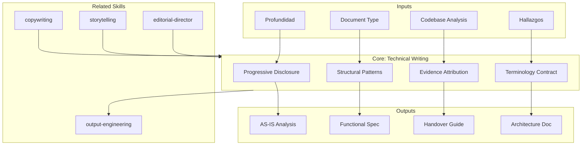

# Technical Writing — Documentation Precision & Progressive Disclosure

Ensures technical deliverables are precise, reproducible, and progressively disclosed. Owns terminology consistency, evidence attribution, structural patterns, and anti-pattern enforcement across all discovery documentation.

## Grounding Guideline

**Technical documentation is a knowledge contract.** Every assertion is verifiable. Every term is consistent. Every section builds on the previous one. The reader must be able to reproduce the analysis, validate the conclusions, and act on the recommendations without needing the author.

### Documentation Philosophy

1. **Progressive disclosure.** TL;DR → sections → details → appendix. The executive reads 2 pages, the architect reads 20, the implementer reads 50.
2. **Terminology as contract.** One term = one meaning across the entire discovery. Zero ambiguous synonyms.
3. **Traceable evidence.** Every data point carries a source tag. The reader can verify without asking.
4. **Information density.** Every sentence contributes new information. Zero filler, zero repetition.

## Inputs

- `$1` — Document type: `analysis`, `spec`, `handover`, `architecture`, `assessment` (default: `analysis`)
- `$2` — Depth: `ejecutivo`, `técnico`, `exhaustivo` (default: `técnico`)

Parse from `$ARGUMENTS`.

## Document Structure Patterns

### Progressive Disclosure Architecture

```
Level 0: TL;DR (3-5 bullets)
  ├── Level 1: Section summaries (1 paragraph each)
  │     ├── Level 2: Full sections with evidence
  │     │     ├── Level 3: Technical detail, code refs, configs
  │     │     └── Level 3: Diagrams, matrices, data tables
  │     └── Level 2: Cross-references to related deliverables
  └── Appendix: Raw data, methodology notes, glossary
```

### Section Template

```markdown
## [N]. Section Title

> **TL;DR**: [1-2 sentence summary with key metric]

[Analysis body — dense, evidence-tagged paragraphs]

| Finding | Evidence | Impact | Source |
|---------|----------|--------|--------|
| ... | ... | 🟢/🟡/🔴 | [TAG] |

💡 **Insight**: [Actionable interpretation of the data]

→ See [XX_Deliverable § Section] for related analysis
```

## Evidence Attribution System

| Tag | Meaning | Confidence |
|-----|---------|-----------|
| [CÓDIGO] | Verified in source code | High — directly observable |
| [CONFIG] | Found in configuration files | High — directly observable |
| [DOC] | Referenced in documentation | Medium — may be outdated |
| [INFERENCIA] | Deduced from patterns | Medium — requires validation |
| [SUPUESTO] | Assumption, explicitly declared | Low — must be validated |
| [STAKEHOLDER] | Reported by stakeholder | Medium — subjective, cross-validate |
| [BENCHMARK] | Industry standard reference | Medium — context-dependent |

### Attribution Rules

1. **Every quantitative claim** must have at least one evidence tag
2. **Mixed evidence** uses highest-confidence tag first: `[CÓDIGO][CONFIG]`
3. **Inferences** always state the reasoning: "X is inferred based on Y [INFERENCIA]"
4. **Assumptions** always state the validation path: "Assumption: X. Validate with: Y [SUPUESTO]"

## Terminology Consistency Protocol

```
1. First use: define the term in context
   "El monolito (aplicación principal desplegada como una unidad) presenta..."

2. Subsequent uses: use the defined term consistently
   ✅ "El monolito requiere..."
   ❌ "La aplicación legacy..." (undefined synonym)
   ❌ "El sistema principal..." (another synonym)

3. Glossary: maintain implicit glossary across deliverables
   - Same term = same meaning in 00 through 09
   - If a term evolves (AS-IS → TO-BE), explicitly note the transition
```

## Structural Patterns by Document Type

| Type | Structure | Key Sections | Mermaid Budget |
|------|-----------|-------------|---------------|
| Analysis (02-03) | Finding → Evidence → Impact | TL;DR, 10 sections, cross-refs | 2-4 diagrams |
| Spec (07) | Use Case → Rules → Acceptance | Actors, flows, business rules | 2-3 diagrams |
| Handover (09) | Phase → Tasks → Criteria | 90-day plan, RACI, risks | 1-2 diagrams |
| Architecture | Component → Interaction → Quality | C4, ADRs, quality attributes | 3-4 diagrams |
| Assessment | Dimension → Score → Evidence | Matrix, findings, recommendations | 1-2 diagrams |

## Anti-Pattern Enforcement

| Anti-Pattern | Rule | Fix |
|-------------|------|-----|
| Filler phrases | BLOCK | Delete entirely |
| Passive voice without agent | WARN | "Se implementó" → "El equipo implementó" or "El módulo X implementa" |
| Scores without justification | BLOCK | Every 🟢/🟡/🔴 needs evidence in same row |
| Tables without headers | BLOCK | Every table has labeled columns |
| Headings that skip levels | BLOCK | h1→h2→h3 only, no h1→h3 |
| Orphan sections (<2 sentences) | WARN | Expand or merge with parent |
| Acronyms without definition | BLOCK | Define on first use |

## Callout System

| Icon | Usage | When |
|------|-------|------|
| 💡 **Insight** | Actionable interpretation | After data/finding presentation |
| ⚖️ **Trade-off** | Decision with competing factors | Architecture/scenario choices |
| ⚠️ **Risk** | Identified risk with impact | Risk-bearing findings |
| 🔍 **Evidence** | Supporting data point | Deep technical evidence |

## Output Configuration

- **Language**: Spanish (Latin American, business register — simple, clear, concise, direct)
- **Attribution**: Expert committee of the MetodologIA Discovery Framework
- **Tagline**: *"Construido por profesionales, potenciado por la red agéntica de MetodologIA."*

## Validation Gate

| Criterion | Check |
|-----------|-------|
| TL;DR present | 3-5 bullets at document top |
| Evidence tags on all claims | [CÓDIGO], [CONFIG], [DOC], [INFERENCIA], [SUPUESTO] |
| Heading hierarchy valid | h1→h2→h3, no skips |
| Tables have headers | Every table labeled |
| Cross-references valid | → See format, target deliverable exists |
| Zero filler | No "cabe señalar", "es importante destacar" |
| Terminology consistent | Same terms across the document |
| Mermaid diagrams present | Minimum 1 per deliverable |

## Assumptions & Limits

- El input contiene datos tecnicos verificados o claramente etiquetados con nivel de confianza.
- Toda documentacion sigue el estandar markdown-excellence como baseline.
- Esta skill posee **precision documental y estructura**. NO posee persuasion narrativa (eso es copywriting) ni produccion de formato visual (eso es output-engineering).
- NUNCA producir precios. Solo FTE-meses, magnitudes, cost drivers.

## Edge Cases

| Caso Borde | Estrategia de Manejo |
|---|---|
| Codebase con cobertura parcial (<30% documentado) | Usar [INFERENCIA] y [SUPUESTO] extensivamente. Declarar limitacion de cobertura en TL;DR. Priorizar documentacion de modulos criticos sobre cobertura uniforme. Incluir "Coverage Disclaimer" al inicio. |
| Codebase multilenguaje (>3 lenguajes) | Documentar distribucion de lenguajes como hallazgo. Usar identificadores en idioma original del codigo. Crear seccion de "Language Map" con porcentajes y modulos por lenguaje. |
| Cero documentacion previa existente | Flaggear como hallazgo critico en TL;DR. Usar [CODIGO] y [CONFIG] como fuentes primarias. Recomendar Sprint 0 de documentacion. Producir glossario como primer entregable. |
| Terminologia inconsistente en el sistema existente | Crear tabla de reconciliacion de terminos. Documentar sinonimos encontrados y el termino canonico elegido. Aplicar termino canonico consistentemente con nota de mapeo. |

## Decisions & Trade-offs

| Decision | Justificacion | Alternativa Descartada |
|---|---|---|
| Progressive disclosure (TL;DR -> detalle -> apendice) | Multiples audiencias consumen el mismo documento a diferente profundidad. Reduce necesidad de documentos separados. | Documento monolitico: el ejecutivo nunca lo lee; el implementador pierde tiempo buscando detalle. |
| Terminologia como contrato (1 termino = 1 significado) | Elimina ambiguedad en documentacion tecnica. Evita errores de interpretacion en implementacion. | Sinonimos permitidos: genera confusion especialmente en equipos distribuidos. |
| Evidence tags obligatorios en toda afirmacion | Permite al lector verificar sin preguntar. Distingue hechos de inferencias. Reduce riesgo de decisiones basadas en supuestos no declarados. | Sin tags: imposible distinguir dato verificado de opinion. |
| Mermaid como formato de diagramas | Versionable en git, renderizable en markdown, editable sin herramientas especiales. | Imagenes estaticas: no versionables, dificiles de actualizar, rompen flujo de documentacion-as-code. |

## Knowledge Graph



## Output Templates

### Template 1: Technical Analysis Document (Markdown)

**Filename:** `{NN}_{Entregable}_{contexto}_{WIP|Aprobado}.md`

```markdown
# {NN}. {Titulo del Entregable}

## TL;DR
- {Hallazgo 1 con metrica clave}
- {Hallazgo 2 con metrica clave}
- {Hallazgo 3 con metrica clave}

## 1. {Seccion}

> **TL;DR**: {Resumen en 1-2 oraciones con metrica principal}

{Cuerpo de analisis con parrafos densos y evidence-tagged}

| Hallazgo | Evidencia | Impacto | Fuente |
|---|---|---|---|
| ... | ... | Alto/Medio/Bajo | [TAG] |

**Insight**: {Interpretacion accionable del dato}

> Ver [{XX}_Entregable Seccion] para analisis relacionado

## Glosario
| Termino | Definicion | Primera aparicion |
|---|---|---|
```

### Template 2: Handover Guide (Markdown)

**Filename:** `09_Handover_{contexto}_{WIP|Aprobado}.md`

```markdown
# Handover Guide: {project}

## TL;DR
{5 bullets: que se entrega, a quien, y como empezar}

## Plan de 90 Dias
### Fase 1: Quick Wins (Dias 1-30)
| Actividad | Responsable | Criterio de Exito | Dependencia |
|---|---|---|---|

### Fase 2: Estabilizacion (Dias 31-60)
...

### Fase 3: Aceleracion (Dias 61-90)
...

## RACI
| Actividad | Responsable | Aprobador | Consultado | Informado |
|---|---|---|---|---|

## Riesgos de Transicion
| Riesgo | Probabilidad | Impacto | Mitigacion |
|---|---|---|---|

## Transition Success Criteria
- [ ] {Measurable criterion 1}
- [ ] {Measurable criterion 2}
```

### Template 3: HTML (bajo demanda)

- Filename: `{NN}_{Entregable}_{contexto}_{WIP|Aprobado}.html`
- Estructura: HTML self-contained branded (Design System MetodologIA v5). Light-First Technical. Incluye tabla de evidencias con filtros por tag ([CÓDIGO], [CONFIG], [DOC], [INFERENCIA], [SUPUESTO]), índice de secciones con progressive disclosure, y callouts con iconografía semántica. WCAG AA, responsive, print-ready.

### Template 4: XLSX (bajo demanda)

- Filename: `{fase}_{entregable}_{contexto}_{WIP}.xlsx`
- Generado con openpyxl y MetodologIA Design System v5. Encabezados con fondo navy y texto Poppins blanco, formato condicional por tag de evidencia y nivel de impacto, auto-filtros en todas las columnas, valores calculados sin fórmulas. Hojas: Hallazgos con evidencia, Glosario de términos, Matriz de cross-references, Anti-patterns detectados.

### Template 5: PPTX (bajo demanda)

- Filename: `{fase}_{entregable}_{cliente}_{WIP}.pptx`
- Generado con python-pptx y MetodologIA Design System v5. Slide master con gradiente navy, títulos en Poppins, cuerpo en Trebuchet MS, acentos gold. Máx 20 slides versión ejecutiva / 30 versión técnica. Notas del orador con referencias de evidencia por slide. Slides sugeridos: portada, TL;DR de hallazgos clave, estructura de progressive disclosure (niveles 0-3), tabla de evidencias con tags, glosario de términos canónicos, cross-references activos, anti-patterns detectados, recomendaciones priorizadas.

## Evaluacion

| Dimension | Peso | Criterio |
|---|---|---|
| Trigger Accuracy | 10% | Se activa ante solicitudes de documentacion tecnica, AS-IS, spec, handover, o assessment |
| Completeness | 25% | TL;DR presente, evidence tags en toda afirmacion, jerarquia de headings valida, cross-refs activos |
| Clarity | 20% | Terminologia consistente; progressive disclosure funcional; cero frases de relleno |
| Robustness | 20% | Produce documentacion util con codebase parcial, sin documentacion previa, o con terminologia inconsistente |
| Efficiency | 10% | Genera estructura completa con parametros minimos (tipo + profundidad) |
| Value Density | 15% | Cada seccion aporta informacion nueva; cero repeticion entre niveles de disclosure |

**Umbral minimo: 7/10**

## Cross-References

- `metodologia-copywriting` — Transforma precision tecnica en prosa ejecutiva persuasiva
- `metodologia-storytelling` — Aporta arco narrativo a la estructura documental
- `metodologia-output-engineering` — Produce formatos finales (HTML, DOCX) desde el markdown tecnico
- `metodologia-editorial-director` — Coordina consistencia cross-entregable

## Edge Cases

- **Sparse codebase**: Rely more on [INFERENCIA] and [SUPUESTO] tags. Explicitly declare coverage limitations.
- **Multilingual codebase**: Document language distribution; use original-language identifiers.
- **No documentation**: Flag as finding. Use [CÓDIGO] and [CONFIG] as primary evidence sources.

## Limits

- This skill owns **documentation precision and structure**. It does NOT own narrative persuasion (that's metodologia-copywriting) or visual format production (that's metodologia-output-engineering).
- Follows markdown-excellence standard as baseline.
