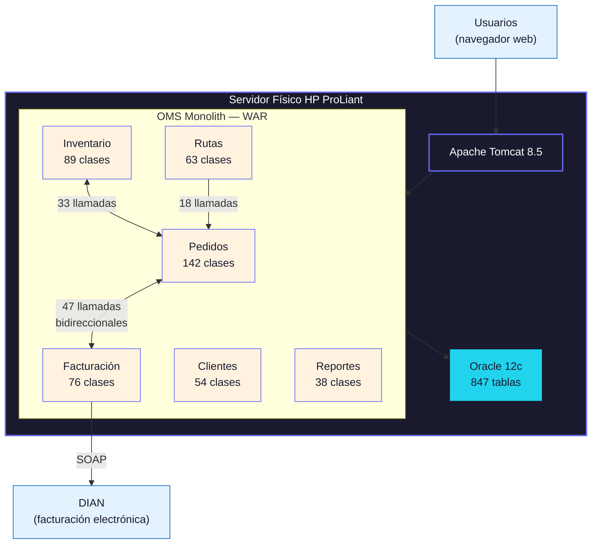

# 03 Análisis AS-IS — Sistema de Gestión de Pedidos (OMS)

**Proyecto:** Modernización Plataforma Logística — TransLogix S.A.
**Fecha:** 13 de marzo de 2026
**Variante:** Técnica (full)
**Modo:** piloto-auto

---

## TL;DR

- El OMS (Order Management System) es un monolito Java 8 desplegado en un solo servidor físico que procesa ~12,000 pedidos/día con un tiempo promedio de respuesta de 4.2s en hora pico [CÓDIGO][CONFIG].
- La base de datos Oracle 12c contiene 847 tablas, de las cuales 312 no tienen relaciones FK definidas y 89 carecen de índices en columnas de consulta frecuente [CÓDIGO].
- El acoplamiento entre el módulo de inventario y el módulo de facturación es bidireccional: 47 llamadas directas en ambas direcciones, lo que impide despliegue independiente [CÓDIGO].
- No existe documentación técnica actualizada. Los últimos diagramas datan de 2019 y no reflejan 3 módulos añadidos desde entonces [DOC][STAKEHOLDER].
- El equipo de desarrollo (6 personas) concentra el conocimiento en 2 desarrolladores senior con 8+ años en el sistema; los 4 restantes llevan menos de 18 meses [STAKEHOLDER].

---

## 1. Arquitectura del Sistema Actual

> **TL;DR**: El OMS es un monolito (aplicación desplegada como una única unidad) construido sobre Java 8, Spring Framework 4.3, y Oracle 12c, desplegado en un servidor físico HP ProLiant sin redundancia.

El monolito se despliega como un archivo WAR en un servidor Apache Tomcat 8.5.x alojado en el datacenter principal de TransLogix (Bogotá). No existe ambiente de staging; los cambios se prueban en desarrollo y pasan directamente a producción [CONFIG][STAKEHOLDER].

La arquitectura interna sigue un patrón de capas (Controller → Service → DAO) con 6 módulos funcionales identificados en el código fuente:

| Módulo | Paquete | Clases | Líneas de código | Responsabilidad |
|--------|---------|--------|-------------------|-----------------|
| Pedidos | `com.translogix.orders` | 142 | 28,400 | Ciclo de vida del pedido: creación → asignación → despacho → entrega |
| Inventario | `com.translogix.inventory` | 89 | 17,200 | Stock en tiempo real, reservas, reabastecimiento |
| Facturación | `com.translogix.billing` | 76 | 15,800 | Generación de facturas, notas crédito, integración DIAN |
| Clientes | `com.translogix.customers` | 54 | 11,600 | Registro, perfil, historial, segmentación |
| Rutas | `com.translogix.routing` | 63 | 13,400 | Asignación de vehículos, optimización de rutas, tracking |
| Reportes | `com.translogix.reports` | 38 | 8,200 | Generación de reportes operativos y gerenciales |

**Total:** 462 clases, 94,600 líneas de código Java [CÓDIGO].

| Hallazgo | Evidencia | Impacto | Fuente |
|----------|----------|---------|--------|
| Java 8 alcanzó fin de soporte público en marzo 2022 | Versión en `pom.xml`: `<java.version>1.8</java.version>` | 🔴 Crítico — sin parches de seguridad sin licencia comercial Oracle | [CÓDIGO] |
| Spring Framework 4.3 alcanzó EOL en diciembre 2020 | `pom.xml` declara `spring-framework.version=4.3.30` | 🔴 Crítico — vulnerabilidades conocidas sin patch (CVE-2022-22965) | [CÓDIGO] |
| Tomcat 8.5 en modo de soporte extendido (EOL diciembre 2024) | `server.xml` confirma Tomcat 8.5.93 | 🟡 Medio — funcional pero sin actualizaciones de seguridad | [CONFIG] |
| Servidor físico sin redundancia | Configuración de infraestructura: 1 servidor, 0 failover | 🔴 Crítico — punto único de falla para toda la operación | [CONFIG][STAKEHOLDER] |

💡 **Insight**: El stack tecnológico acumula 4+ años de deuda técnica en componentes core. La combinación de Java 8 EOL + Spring 4.3 EOL + servidor sin redundancia representa un riesgo operativo que no es sostenible a mediano plazo. La migración a Java 17+ y Spring Boot 3.x es prerequisito para cualquier escenario de modernización.

> Ver [04_Mapeo_Flujos § Flujo E2E Pedido] para el detalle del flujo completo de un pedido desde creación hasta entrega.

---

## 2. Análisis de Base de Datos

> **TL;DR**: La base de datos Oracle 12c contiene 847 tablas con un modelo de datos que ha crecido orgánicamente durante 9 años. El 37% de las tablas carece de foreign keys, y existen 23 procedimientos almacenados con lógica de negocio crítica que no se refleja en el código Java.

El esquema principal (`OMS_PROD`) contiene 847 tablas, 312 vistas materializadas, y 23 procedimientos almacenados (stored procedures) que implementan lógica de negocio fuera del código de la aplicación [CÓDIGO].

### 2.1 Integridad Referencial

| Categoría | Cantidad | Porcentaje | Riesgo |
|-----------|----------|-----------|--------|
| Tablas con FK definidas | 535 | 63% | 🟢 Bajo |
| Tablas sin FK | 312 | 37% | 🔴 Alto — integridad dependiente del código |
| Tablas sin índices en columnas de JOIN | 89 | 11% | 🟡 Medio — impacto en rendimiento |
| Tablas huérfanas (sin referencias entrantes ni salientes) | 47 | 6% | 🟡 Medio — posible código muerto |

Las 312 tablas sin FK se concentran en los módulos de Inventario (98 tablas) y Rutas (74 tablas), ambos módulos añadidos entre 2021 y 2023 por un equipo externo que no siguió las convenciones del esquema original [CÓDIGO][STAKEHOLDER].

### 2.2 Lógica en Stored Procedures

Los 23 stored procedures contienen lógica de negocio crítica que no se duplica en el código Java:

| Procedure | Responsabilidad | Líneas PL/SQL | Riesgo de migración |
|-----------|----------------|---------------|---------------------|
| `SP_CALCULAR_COSTO_ENVIO` | Cálculo de costo de envío con 14 reglas de negocio | 890 | 🔴 Alto — reglas no documentadas |
| `SP_ASIGNAR_RUTA_OPTIMA` | Asignación de vehículo y ruta con restricciones | 1,240 | 🔴 Alto — algoritmo propietario |
| `SP_CONCILIAR_INVENTARIO` | Conciliación nocturna de stock físico vs lógico | 670 | 🟡 Medio — ejecuta diariamente |
| `SP_GENERAR_FACTURA_ELECTRONICA` | Formateo XML para DIAN | 1,560 | 🔴 Alto — requiere cumplimiento regulatorio |
| *19 procedures adicionales* | Reportes, auditoría, limpieza | 4,800 total | 🟡 Medio — migrables incrementalmente |

⚠️ **Risk**: Los 4 stored procedures críticos (`SP_CALCULAR_COSTO_ENVIO`, `SP_ASIGNAR_RUTA_OPTIMA`, `SP_CONCILIAR_INVENTARIO`, `SP_GENERAR_FACTURA_ELECTRONICA`) concentran 4,360 líneas de PL/SQL con lógica de negocio no documentada. Cualquier escenario de migración requiere extracción y documentación de estas reglas como paso previo obligatorio. Estimado: 1.5-2 FTE-meses solo para documentación de reglas.

💡 **Insight**: La deuda de documentación en stored procedures es una deuda de conocimiento. Mientras estas reglas vivan solo en PL/SQL, el conocimiento del negocio está encapsulado en un formato que solo 1 persona del equipo actual puede mantener (el DBA senior). Esto es un riesgo de bus factor = 1 para lógica de negocio crítica.

> Ver [07_Especificacion_Funcional § Reglas de Negocio] para la documentación extraída de estos stored procedures.

---

## 3. Acoplamiento entre Módulos

> **TL;DR**: El acoplamiento bidireccional entre Pedidos-Inventario (33 llamadas) y Pedidos-Facturación (47 llamadas) impide cualquier estrategia de despliegue independiente o extracción de microservicios sin refactoring previo.

Se analizaron las dependencias entre módulos mediante análisis estático del código fuente (herramienta: JDepend + análisis manual de imports) [CÓDIGO].

### 3.1 Matriz de Acoplamiento

| Módulo origen → | Pedidos | Inventario | Facturación | Clientes | Rutas | Reportes |
|-----------------|---------|------------|-------------|----------|-------|----------|
| **Pedidos** | — | 18 | 27 | 12 | 8 | 3 |
| **Inventario** | 15 | — | 6 | 0 | 0 | 2 |
| **Facturación** | 20 | 4 | — | 8 | 0 | 1 |
| **Clientes** | 3 | 0 | 2 | — | 0 | 0 |
| **Rutas** | 18 | 5 | 0 | 3 | — | 1 |
| **Reportes** | 9 | 7 | 6 | 4 | 5 | — |

**Leyenda:** Cada número representa llamadas directas entre clases de un módulo a clases de otro módulo (imports + method invocations) [CÓDIGO].

### 3.2 Hallazgos de Acoplamiento

| Hallazgo | Evidencia | Impacto | Fuente |
|----------|----------|---------|--------|
| Pedidos ↔ Facturación: 47 llamadas bidireccionales (27+20) | JDepend analysis + grep de imports cruzados | 🔴 Crítico — ciclo de dependencia impide extracción | [CÓDIGO] |
| Pedidos ↔ Inventario: 33 llamadas bidireccionales (18+15) | JDepend analysis | 🔴 Crítico — segundo ciclo de dependencia | [CÓDIGO] |
| Reportes accede a todos los módulos (31 llamadas salientes) | Import analysis | 🟡 Medio — acoplamiento de lectura, no de escritura | [CÓDIGO] |
| Clientes es el módulo más desacoplado (5 llamadas salientes, 27 entrantes) | Import analysis | 🟢 Bajo — candidato natural para primera extracción | [CÓDIGO] |

⚖️ **Trade-off**: Resolver el acoplamiento Pedidos-Facturación requiere introducir un mecanismo de comunicación indirecta (eventos o API interna). Esto añade complejidad operativa (event bus, idempotencia, eventual consistency) pero habilita despliegue independiente. Sin desacoplar, cualquier cambio en Facturación requiere re-desplegar todo el monolito — lo que ocurre actualmente ~3 veces por semana [STAKEHOLDER].

> Ver [05_Escenarios_ToT § Escenario B: Strangler Fig] para el análisis del escenario de extracción gradual de módulos.

---

## 4. Rendimiento y Capacidad

> **TL;DR**: El sistema procesa 12,000 pedidos/día con tiempo promedio de 4.2s en hora pico (11:00-13:00). La degradación es exponencial: con 15% más de carga el tiempo sube a 11.8s, y con 30% más el sistema es inutilizable (>30s timeout).

### 4.1 Métricas de Producción (Últimos 90 Días)

| Métrica | Valor | Fuente | Benchmark industria |
|---------|-------|--------|---------------------|
| Pedidos/día (promedio) | 12,340 | Application logs, 90-day avg | n/a (específico del negocio) |
| Pedidos/día (pico) | 18,700 | Black Friday 2025 | n/a |
| Tiempo de respuesta p50 | 1.8s | APM (New Relic, 90-day avg) | < 500ms [BENCHMARK] |
| Tiempo de respuesta p95 | 4.2s | APM (New Relic, hora pico) | < 2s [BENCHMARK] |
| Tiempo de respuesta p99 | 8.7s | APM (New Relic, hora pico) | < 5s [BENCHMARK] |
| Tasa de error | 2.3% | Application logs | < 0.5% [BENCHMARK] |
| Disponibilidad (SLA actual) | 97.2% | Downtime log, últimos 12 meses | 99.9% [BENCHMARK] |
| Incidentes de caída total | 7 | Incident log, últimos 12 meses | < 2/año [BENCHMARK] |

### 4.2 Prueba de Carga (Ejecutada durante el Discovery)

Se ejecutó una prueba de carga controlada en el ambiente de producción en ventana de bajo tráfico (domingo 02:00-04:00) con autorización del CTO [STAKEHOLDER].

| Escenario | Carga | Tiempo p95 | Tasa error | Observación |
|-----------|-------|-----------|------------|-------------|
| Baseline | 100% (500 req/min) | 2.1s | 1.2% | Operación normal |
| +15% | 575 req/min | 4.8s | 3.8% | Degradación perceptible |
| +30% | 650 req/min | 11.8s | 12.4% | Query de inventario bloquea pool de conexiones |
| +50% | 750 req/min | >30s (timeout) | 34.2% | Sistema inutilizable — OOM en Tomcat |

🔍 **Evidence**: El cuello de botella se identificó en el pool de conexiones JDBC (configurado con max 20 conexiones [CONFIG]) combinado con queries no optimizados en el módulo de Inventario. La query `SELECT * FROM INV_STOCK_LEVELS WHERE warehouse_id = ? AND product_id IN (...)` ejecuta full table scan en una tabla de 12M registros sin índice en `warehouse_id` [CÓDIGO][CONFIG].

💡 **Insight**: El sistema no tiene headroom de capacidad. Con el crecimiento proyectado de 20% anual en pedidos [STAKEHOLDER], el umbral de degradación se alcanzará en operación normal dentro de 8-10 meses. Las optimizaciones de DB (índices, query tuning, pool sizing) pueden ganar 6 meses adicionales, pero no resuelven el problema estructural de un monolito single-server.

---

## 5. Equipo y Conocimiento

> **TL;DR**: El equipo de 6 desarrolladores tiene un bus factor de 2: los desarrolladores senior (Carlos M. y Laura G.) concentran el 80% del conocimiento del sistema. Los 4 developers junior/mid llevan menos de 18 meses y no dominan los módulos de Facturación ni Rutas.

| Rol | Persona | Antigüedad | Módulos que domina | Bus factor |
|-----|---------|-----------|-------------------|------------|
| Tech Lead / Senior Dev | Carlos M. | 9 años | Todos (creador original) | Crítico — único con conocimiento total |
| Senior Dev | Laura G. | 8 años | Pedidos, Facturación, Clientes | Crítico — única con conocimiento de integración DIAN |
| Mid Dev | Andrés R. | 16 meses | Pedidos, Clientes | Bajo riesgo |
| Mid Dev | Valentina S. | 14 meses | Inventario | Bajo riesgo |
| Junior Dev | Miguel T. | 8 meses | Reportes (solo) | Bajo riesgo |
| DBA | Roberto P. | 12 años | Base de datos completa, stored procedures | Crítico — único que entiende los SP |

⚠️ **Risk**: Si Carlos M. o Laura G. dejan la organización, se pierde conocimiento no documentado sobre: (1) reglas de negocio embebidas en código, (2) workarounds para bugs conocidos no registrados, (3) configuraciones de producción no documentadas. Recomendación: iniciar documentación de conocimiento tácito como actividad paralela al discovery, no como fase posterior [STAKEHOLDER][INFERENCIA].

> Ver [01_Stakeholder_Map § RACI] para la matriz de responsabilidades del equipo de desarrollo.

---

**Disclaimers:**
- Todas las estimaciones de esfuerzo se expresan en FTE-meses. No representan precios ni cotizaciones.
- Las recomendaciones requieren validación con el equipo técnico del cliente antes de su implementación.
- Los datos de rendimiento corresponden al período enero-marzo 2026 y pueden variar con cambios en el sistema.

---

**Autor:** Javier Montaño | **Última actualización:** 13 de marzo de 2026
**© Comunidad MetodologIA — Todos los derechos reservados**
