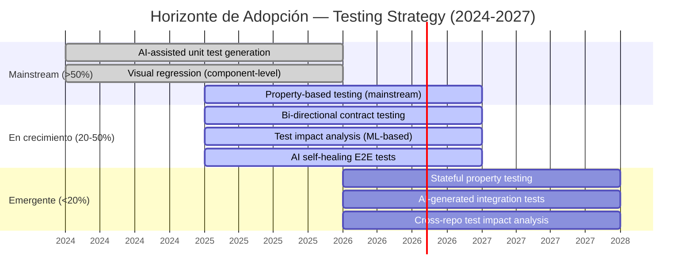

# State of the Art: Testing Strategy

## TL;DR

- **AI-generated tests** transforman la creación y mantenimiento de suites — de generación naive a tests con intención semántica.
- **Visual regression testing** madura con comparación perceptual AI-powered, reemplazando diff pixel-by-pixel.
- **Contract testing** evoluciona hacia schema-first bi-directional y event-driven contracts.
- **Property-based testing** se democratiza con integración en frameworks mainstream y generadores inteligentes.
- **Test impact analysis** reduce tiempos de CI 40-70% mediante mapeo de cambios a tests afectados.

---

## 1. AI-Generated Tests

### Estado actual (2025-2026)

La generación de tests con IA ha pasado de "novelty" a herramienta de productividad. Los modelos de lenguaje generan tests unitarios, de integración e incluso E2E con contexto del codebase.

### Herramientas y enfoques

| Herramienta | Enfoque | Fortaleza | Limitación |
|-------------|---------|-----------|------------|
| **Copilot / Claude** | Generación inline en IDE | Tests contextualmente relevantes al código editado | Calidad variable sin revisión humana |
| **Diffblue Cover** | Análisis estático + simbólico (Java) | Cobertura automatizada para legacy codebases | Solo Java, tests de regresión sin intención de negocio |
| **CodiumAI** | Análisis de comportamiento | Genera tests con edge cases y happy paths | Requiere validación de assertions |
| **Qodo (ex-CodiumAI)** | AI test generation con PR integration | Tests en contexto de PR diff, detecta regresiones potenciales | Adopción temprana, model-dependent |

### Patrones emergentes

- **Test generation from specs:** Generar tests BDD a partir de historias de usuario o especificaciones funcionales. El LLM traduce requisitos en Given-When-Then ejecutables.
- **Mutation-guided generation:** Usar mutation testing para identificar tests faltantes, luego generar tests que maten mutantes sobrevivientes.
- **Self-healing tests:** AI detecta selectores rotos en E2E y sugiere correcciones automáticas. Reduce mantenimiento de Playwright/Cypress suites.
- **Test maintenance assistant:** AI identifica tests obsoletos, duplicados o redundantes. Sugiere consolidación.

### Madurez y adopción

| Nivel | Práctica | Adopción estimada |
|-------|----------|-------------------|
| Mainstream | Generación de unit tests con Copilot en IDE | ~60% equipos con herramientas AI |
| En crecimiento | Generación de integration tests desde API specs | ~25% |
| Emergente | E2E test generation y self-healing | ~10% |
| Experimental | Tests semánticos con validación de intención | <5% |

### Impacto en la skill

La sección S2 (Test Automation Framework) debe considerar AI como asistente de generación, no reemplazo del diseño de test strategy. Los tests AI-generated requieren revisión humana de assertions y naming para mantener la documentación viviente.

---

## 2. Visual Regression Testing

### Evolución (2024-2026)

El visual testing ha evolucionado de comparación pixel-by-pixel (frágil, muchos falsos positivos) a comparación perceptual con AI que distingue cambios intencionales de regresiones reales.

### Tecnologías actuales

| Herramienta | Generación | Diferenciador |
|-------------|------------|---------------|
| **Chromatic** | Cloud, Storybook-native | Component-level isolation, interaction testing integrado |
| **Percy (BrowserStack)** | Cloud, cross-browser | Responsive snapshots, multi-browser baseline |
| **Applitools Eyes** | AI-powered | Visual AI distingue layout shifts de cambios cosméticos intencionales |
| **Playwright Screenshots** | Open source, CI-native | Gratuito, custom pipelines, comparación programática |
| **Lost Pixel** | Open source | Alternativa OSS a Percy, GitHub Actions native |

### Tendencias clave

- **AI-powered visual diff:** Applitools y competidores usan ML para clasificar diferencias como "cambio intencional" vs. "regresión". Reduce revisión manual en 80%.
- **Component-level testing:** Chromatic + Storybook permiten testing visual por componente, no por página. Faster, más estable, menos flaky.
- **Interaction + visual:** Tests que ejecutan interacciones (hover, click, scroll) antes de capturar screenshot. Valida estados dinámicos.
- **Design system validation:** Visual tests como contrato entre diseño y desarrollo. Figma tokens -> componentes -> visual tests.
- **Accessibility visual testing:** Detectar violaciones de contraste, tamaño de fuente y spacing directamente en screenshots.

### Impacto en la skill

La sección S6 (Advanced Techniques) debe recomendar visual testing con estrategia tiered: component-level para design system, page-level para critical journeys. Self-hosted (Playwright screenshots) para presupuestos limitados, cloud (Chromatic/Percy) para equipos con design systems maduros.

---

## 3. Contract Testing Evolution

### Estado actual

Contract testing ha madurado más allá de Pact consumer-driven hacia un ecosistema diverso que incluye bi-directional contracts, schema-first approaches y event-driven contracts.

### Evolución del ecosistema

| Generación | Enfoque | Herramienta | Caso de uso |
|------------|---------|-------------|-------------|
| 1a gen (2015+) | Consumer-driven | Pact | Microservicios internos, múltiples consumidores |
| 2a gen (2020+) | Bi-directional | Pact + OpenAPI | Provider tiene spec, consumer tiene expectations, se comparan |
| 3a gen (2023+) | Schema-first | Specmatic, Prism | API-first design, spec es el contrato |
| Event-driven | Schema registry | Confluent, AWS Glue, Buf | Async messaging, event-driven architectures |

### Tendencias emergentes

- **Bi-directional contract testing:** Combina la especificación del provider (OpenAPI) con las expectations del consumer. No requiere que ambos equipos usen Pact. Reduce barrera de adopción.
- **gRPC y Protobuf contracts:** Buf.build como "linter + breaking change detector" para Protobuf. Schema evolution rules integradas en CI.
- **GraphQL contract testing:** Apollo Studio, GraphQL Inspector detectan breaking changes en schema. Field-level usage tracking para safe deprecation.
- **Event schema evolution:** Avro/Protobuf schema registries con compatibility modes (backward, forward, full). can-i-deploy equivalente para eventos.
- **Contract testing as documentation:** Contratos generan documentación de API automáticamente. Single source of truth para spec + tests + docs.

### Impacto en la skill

La sección S3 (Contract & API Testing) debe incluir bi-directional contracts como opción para equipos donde el provider ya tiene OpenAPI spec, y event-driven contracts como requisito para arquitecturas event-driven.

---

## 4. Property-Based Testing

### Democratización (2024-2026)

Property-based testing ha pasado de nicho funcional (QuickCheck/Haskell) a mainstream con integraciones nativas en frameworks de testing populares.

### Ecosistema actual

| Framework | Lenguaje | Integración | Madurez |
|-----------|----------|-------------|---------|
| **fast-check** | JS/TS | Jest, Vitest native | Producción |
| **Hypothesis** | Python | pytest native | Producción |
| **jqwik** | Java/Kotlin | JUnit 5 native | Producción |
| **PropEr** | Erlang/Elixir | ExUnit | Producción |
| **ScalaCheck** | Scala | ScalaTest | Producción |
| **Rapid** | Go | testing native | En crecimiento |

### Tendencias emergentes

- **Stateful property testing:** No solo inputs/outputs — modelar secuencias de operaciones contra un estado mutable. fast-check model-based testing, Hypothesis stateful testing. Encuentra race conditions y estados inconsistentes.
- **AI-assisted property discovery:** LLMs sugieren propiedades candidatas dado un módulo de código. "encode/decode roundtrip", "sort is idempotent", "parse never crashes".
- **Shrinking improvements:** Mejores algoritmos de shrinking producen contraejemplos mínimos más rápido. Integración con CI para reportar el caso mínimo que falla.
- **Coverage-guided fuzzing + properties:** Combinar fuzzing (AFL, libFuzzer) con property assertions. El fuzzer busca inputs que violan propiedades. Efectivo para parsers y deserializers.
- **Database property testing:** Generar datos de test que cumplen constraints de schema (FK, unique, not null) automáticamente. Testcontainers + properties.

### Impacto en la skill

La sección S6 (Advanced Techniques) debe posicionar property-based testing como complemento — no reemplazo — de example-based testing. Empezar con propiedades obvias (roundtrips, invariants), luego avanzar a stateful properties para componentes críticos.

---

## 5. Test Impact Analysis

### Estado actual

Test impact analysis (TIA) mapea cambios de código a tests afectados usando datos de cobertura. Ejecuta solo los tests relevantes, reduciendo tiempos de CI significativamente.

### Herramientas y plataformas

| Herramienta | Enfoque | Reducción CI | Madurez |
|-------------|---------|-------------|---------|
| **Launchable** | ML-based test selection | 40-70% | Producción |
| **Gradle Enterprise** (ahora Develocity) | Predictive test selection | 50-80% | Producción |
| **Microsoft Test Impact** | Coverage-based (.NET) | 30-50% | Producción |
| **Jest --changedSince** | Git-based, basic | 20-40% | Producción (limitado) |
| **Nx affected** | Monorepo graph-based | 40-60% | Producción |

### Tendencias emergentes

- **ML-based test prioritization:** No solo seleccionar tests — ordenarlos por probabilidad de fallo. Los tests más propensos a fallar corren primero. Feedback más rápido.
- **Flaky test quarantine automático:** Detectar tests con resultados erráticos, moverlos a quarantine suite, ejecutar en paralelo sin bloquear CI.
- **Test suite health dashboards:** Métricas de health del suite (flaky rate, execution time trends, dead tests) con alertas proactivas.
- **Cross-repo impact analysis:** En microservicios, detectar qué tests de consumidores deben correr cuando cambia un provider. Combina con contract testing.
- **AI-powered test selection:** Modelos que aprenden patrones de fallo históricos para predecir qué tests son relevantes dado un diff. Más preciso que coverage-based.

### Impacto en la skill

La sección S6 debe recomendar TIA para codebases >10k tests donde el tiempo de CI supera 15 minutos. Empezar con graph-based (Nx, Gradle) y evolucionar a ML-based (Launchable) cuando se tenga suficiente historial.

---

## Horizonte de Adopción: Mapa Temporal

---

## Implicaciones para Discovery

Al evaluar la estrategia de testing de un cliente, considerar:

1. **Nivel de madurez AI en testing:** Si ya usan Copilot para tests, evaluar calidad de assertions y mantainability. Si no, incluir como quick win.
2. **Visual testing gap:** La mayoría de equipos no tienen visual regression testing. Es un win rápido para design systems.
3. **Contract testing readiness:** Requiere coordinación multi-equipo. Evaluar si la organización tiene la madurez para consumer-driven o si bi-directional es más pragmático.
4. **CI time budget:** Si el CI toma >15 minutos, TIA es una recomendación de alto impacto inmediato.
5. **Property-based testing adoption:** Equipo con experiencia funcional lo adopta rápido. Equipos OOP necesitan mentoría en el mindset de propiedades.

---

**Autor:** Javier Montaño | **Fecha:** 13 de marzo de 2026 | **© Comunidad MetodologIA**
