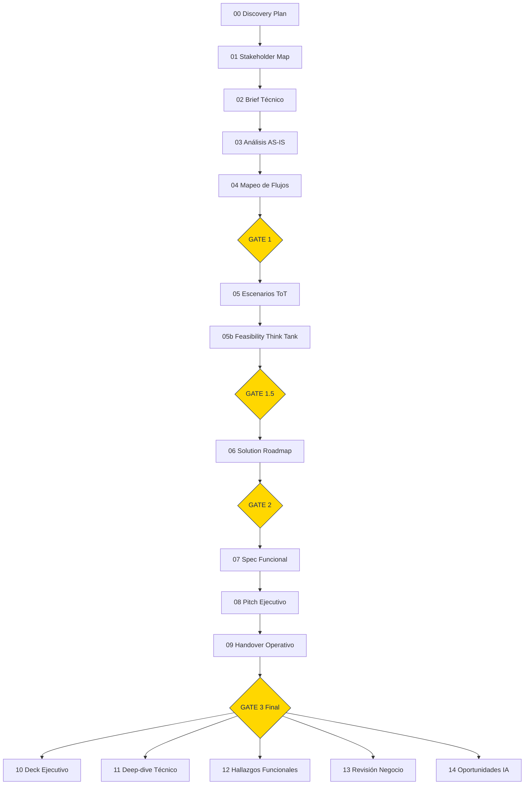

# Pipeline de Orchestration

> MAO Framework — Ontología viva
> Referencia canónica del pipeline de discovery: 10 fases, 4 quality gates, 16 entregables.

---

## Visión general

El pipeline de discovery de MAO Framework transforma un engagement de pre-venta en un conjunto de entregables técnicos y funcionales con evidencia trazable. Opera en 10 fases secuenciales (0-6 + reportes), controladas por 4 quality gates que actúan como hard stops.

---

## Diagrama del pipeline

---

## Fases del pipeline

### Fase 0 — Preparación
| Entregable | Skill | Comando |
|-----------|-------|---------|
| 00 Discovery Plan | `discovery-orchestrator` | `/mao:generate-plan` |
| 01 Stakeholder Map | `stakeholder-mapping` | `/mao:map-stakeholders` |

### Fase 1 — Contexto
| Entregable | Skill | Comando |
|-----------|-------|---------|
| 02 Brief Técnico | `input-analysis` | `/mao:generate-brief` |

### Fase 2 — Diagnóstico
| Entregable | Skill | Comando |
|-----------|-------|---------|
| 03 Análisis AS-IS | `asis-analysis` | `/mao:diagnose-asis` |
| 04 Mapeo de Flujos | `flow-mapping` | `/mao:trace-flows` |

### Fase 3 — Evaluación (GATE 1)
| Entregable | Skill | Comando |
|-----------|-------|---------|
| 05 Escenarios ToT | `scenario-analysis` | `/mao:evaluate-scenarios` |
| 05b Feasibility Think Tank | `multidimensional-feasibility` | `/mao:validate-feasibility` |

### Fase 4 — Diseño (GATE 1.5, GATE 2)
| Entregable | Skill | Comando |
|-----------|-------|---------|
| 06 Solution Roadmap | `solution-roadmap` | `/mao:chart-roadmap` |

### Fase 5 — Formalización
| Entregable | Skill | Comando |
|-----------|-------|---------|
| 07 Especificación Funcional | `functional-spec` | `/mao:write-spec` |
| 08 Pitch Ejecutivo | `executive-pitch` | `/mao:craft-pitch` |
| 09 Handover Operativo | `discovery-handover` | `/mao:deliver-handover` |

### Fase 6 — Reportes (GATE 3)
| Entregable | Skill | Comando |
|-----------|-------|---------|
| 10 Deck Ejecutivo | `executive-pitch` | `/mao:present-findings` |
| 11 Deep-dive Técnico | `output-engineering` | `/mao:report-tech` |
| 12 Hallazgos Funcionales | `output-engineering` | `/mao:report-func` |
| 13 Revisión Negocio (INTERNO) | `commercial-model` | `/mao:review-business` |
| 14 Oportunidades IA | `ai-center-discovery` | `/mao:discover-ai` |

---

## Modelo de checkpoints

| Checkpoint | Momento | Verificación |
|-----------|---------|-------------|
| CP-0 | Pre-Plan | Plugin activo, RAG priming cargado, sesión inicializada |
| CP-1 | Post-Plan | Plan aprobado, stakeholders identificados, alcance definido |
| CP-2 | Post-Brief | Brief técnico completo, adjuntos procesados |
| CP-3 | Post-ASIS | Diagnóstico completado con evidencia, flujos mapeados |
| CP-G1 | Gate 1 | Scoring 6D completo, escenario recomendado justificado |
| CP-4 | Post-Feasibility | 7 Sabios han emitido veredicto |
| CP-G15 | Gate 1.5 | Veredicto Go (≥5/7) o No-Go documentado |
| CP-5 | Post-Roadmap | FTE-meses validados, Monte Carlo ejecutado |
| CP-G2 | Gate 2 | Quick wins definidos, roadmap aprobado |
| CP-6 | Post-Spec | Spec funcional completa, pitch listo |
| CP-7 | Post-Handover | Handover operativo entregado |
| CP-G3 | Gate 3 | Consistencia cruzada verificada, excellence-loop pasado |
| CP-F | Final | Todos los reportes generados, paquete completo entregado |

---

## Lista de 16 entregables

| # | Entregable | Formato | Obligatorio |
|---|-----------|---------|-------------|
| 00 | Discovery Plan | MD | Sí |
| 01 | Stakeholder Map | MD + Mermaid | Sí |
| 02 | Brief Técnico | MD | Sí |
| 03 | Análisis AS-IS | MD + Mermaid | Sí |
| 04 | Mapeo de Flujos | MD + Mermaid | Sí |
| 05 | Escenarios ToT | MD | Sí |
| 05b | Feasibility Think Tank | MD | Sí |
| 06 | Solution Roadmap | MD + Mermaid + Gantt | Sí |
| 07 | Especificación Funcional | MD | Condicional |
| 08 | Pitch Ejecutivo | MD + HTML | Sí |
| 09 | Handover Operativo | MD | Sí |
| 10 | Deck Ejecutivo | HTML | Opcional |
| 11 | Deep-dive Técnico | MD | Opcional |
| 12 | Hallazgos Funcionales | MD | Opcional |
| 13 | Revisión Negocio | MD (INTERNO) | Opcional |
| 14 | Oportunidades IA | MD | Opcional |

---

## Modos de ejecución

| Modo | Comando | Entregables | Gates |
|------|---------|------------|-------|
| `run-guided` | `/mao:run-guided` | 16 (todos) | 4 con pausa humana |
| `run-auto` | `/mao:run-auto` | 16 (todos) | 4 con auto-aprobación |
| `run-express` | `/mao:run-express` | 3 (Plan + ASIS + Roadmap) | G1 simplificado |
| `run-deep` | `/mao:run-deep` | 7 (arquitectura profunda) | G1 + G2 |

---

*MAO Framework — La excelencia no se improvisa, se diseña.*
