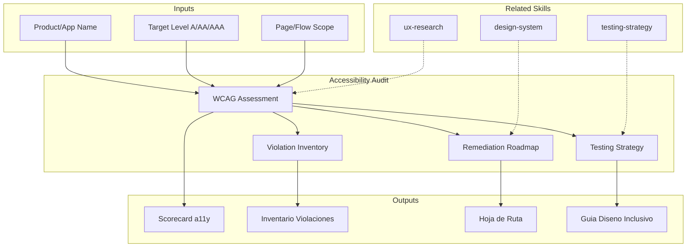

# Accessibility Audit: WCAG Compliance & Inclusive Design Assessment

Accessibility audit evaluates digital products against WCAG 2.1/2.2 standards and inclusive design principles. The skill produces accessibility scorecards, violation inventories, and remediation roadmaps that ensure digital experiences are usable by people with diverse abilities.

## TL;DR

- Evalua conformidad WCAG 2.1/2.2 en niveles A, AA y AAA con inventario detallado de violaciones
- Clasifica hallazgos por severidad, impacto en usuarios y esfuerzo de remediacion
- Produce scorecard de accesibilidad por componente, pagina y flujo critico
- Define estrategia de testing a11y (automatizado + manual + usuarios reales)
- Genera roadmap de remediacion priorizado con quick wins y mejoras estructurales

## Inputs

The user provides a product or application name as `$ARGUMENTS`. Parse `$1` as the **product/application name**.

**Parameters:**
- `{MODO}`: `piloto-auto` (default) | `desatendido` | `supervisado` | `paso-a-paso`
- `{FORMATO}`: `markdown` (default) | `html` | `dual`
- `{VARIANTE}`: `ejecutiva` (~40%) | `tecnica` (full, default)
- `{NIVEL}`: `A` | `AA` (default) | `AAA`

## Entregables

1. **Scorecard de accesibilidad** — Compliance score per WCAG principle (Perceivable, Operable, Understandable, Robust) and conformance level
2. **Inventario de violaciones** — Detailed catalog of violations with WCAG criterion, severity, location, and remediation guidance
3. **Hoja de ruta de remediacion** — Prioritized action plan: quick wins (CSS/ARIA fixes), medium-term (component redesign), strategic (architecture changes)
4. **Estrategia de testing a11y** — Automated tools, manual testing protocols, and assistive technology testing plan
5. **Guia de diseno inclusivo** — Design patterns and component guidelines for ongoing accessible development

## Proceso

1. **Definir alcance** — Identify pages, flows, and components in scope; determine target conformance level (A, AA, AAA)
2. **Ejecutar auditoria automatizada** — Run automated tools (axe-core, Lighthouse, WAVE) to identify programmatic violations
3. **Realizar testing manual** — Keyboard-only navigation, screen reader testing (NVDA, VoiceOver, JAWS), zoom/magnification testing
4. **Evaluar por principio WCAG** — Assess each POUR principle: Perceivable (alt text, contrast, captions), Operable (keyboard, timing, seizures), Understandable (readable, predictable, input assistance), Robust (parsing, name/role/value)
5. **Clasificar violaciones** — Rate each finding by severity (critical/major/minor/advisory) and user impact
6. **Priorizar remediacion** — Rank fixes by: critical user impact first, then legal exposure, then effort-to-impact ratio
7. **Disenar estrategia de testing** — Establish automated CI checks, manual testing cadence, and assistive technology testing protocol
8. **Producir guia de diseno** — Document accessible patterns for ongoing development (color, typography, forms, navigation, media)

## Criterios de Calidad

- [ ] All WCAG 2.1/2.2 success criteria evaluated at target conformance level
- [ ] Automated and manual testing combined (automated catches ~30-40% of issues)
- [ ] Violations include WCAG criterion reference, severity, and specific remediation
- [ ] Screen reader testing covers at least one major AT (NVDA, VoiceOver, or JAWS)
- [ ] Keyboard navigation tested for all interactive elements
- [ ] Color contrast ratios measured against WCAG thresholds (4.5:1 normal, 3:1 large text)
- [ ] Remediation roadmap includes effort estimates and ownership
- [ ] Design guidelines are actionable for development teams

## Supuestos y Limites

- Automated tools detect only 30-40% of accessibility issues — manual testing is essential
- Full WCAG AAA conformance is aspirational; AA is the standard legal/regulatory target
- Does not replace formal accessibility audit by certified professionals (IAAP)
- Assistive technology behavior varies across versions and platforms

## Casos Borde

1. **Aplicacion legacy sin semantica HTML** — Cuando el producto usa tablas para layout o divs sin roles ARIA, el skill genera un inventario de deuda semantica y prioriza remediacion por flujo critico en lugar de cobertura completa.
2. **SPA con contenido dinamico pesado** — Single Page Applications que actualizan el DOM sin notificar al screen reader requieren auditoria especifica de live regions, focus management y route announcements.
3. **Contenido multimedia sin captions** — Si el producto tiene video/audio extenso sin subtitulos ni transcripciones, el skill calcula esfuerzo de captioning y propone priorizacion por trafico y criticidad del contenido.
4. **Objetivo AAA solicitado** — Cuando se pide conformidad AAA, el skill advierte que es aspiracional, identifica criterios AAA alcanzables y separa los que requieren inversion desproporcionada.

## Decisiones y Trade-offs

1. **Auditoria automatizada + manual vs. solo automatizada** — Se requiere ambas porque las herramientas automaticas detectan solo 30-40% de issues; el costo adicional de testing manual se justifica por la cobertura critica que aporta.
2. **Nivel AA como default vs. A** — AA es el estandar legal en la mayoria de jurisdicciones (ADA, EN 301 549) y cubre issues de mayor impacto; A es insuficiente para usuarios reales.
3. **Priorizacion por impacto en usuario vs. por esfuerzo** — Se prioriza impacto en usuario primero (bloqueos de acceso antes que inconvenientes), aceptando que algunas correcciones de alto impacto son costosas.
4. **Testing con un AT vs. multiples** — Se requiere minimo un screen reader (VoiceOver o NVDA) como baseline; testing con multiples ATs es ideal pero se deja como recomendacion, no requisito.

## Knowledge Graph

## Output Templates

### Markdown (default)
- Filename: `quality_a11y-audit_{producto}_{WIP}.md`
- Structure: TL;DR -> Scorecard por principio POUR -> Inventario de violaciones (tabla) -> Roadmap priorizado -> Estrategia de testing

### HTML
- Filename: `quality_a11y-audit_{producto}_{WIP}.html`
- Estructura: dashboard interactivo con filtros por severidad, principio WCAG y componente; incluye enlaces directos a criterios WCAG

### DOCX (bajo demanda)
- Filename: `{fase}_{entregable}_{cliente}_{WIP}.docx`
- Via python-docx con Design System MetodologIA v5. Cover page, TOC auto, headers/footers branded, tablas zebra. Para circulacion formal y auditoria.

### XLSX (bajo demanda)
- Filename: `{fase}_{entregable}_{cliente}_{WIP}.xlsx`
- Via openpyxl con Design System MetodologIA v5. Headers branded (fondo navy, texto blanco, Poppins), formato condicional con colores semaforo, auto-filtros, valores sin formulas. Para scorecards de accesibilidad, inventario de violaciones y matrices de remediacion.

### PPTX (bajo demanda)
- Filename: `{fase}_{entregable}_{cliente}_{WIP}.pptx`
- Via python-pptx con MetodologIA Design System v5. Slide master con gradiente navy, titulos Poppins, cuerpo Montserrat, acentos gold. Max 20 slides (ejecutiva) / 30 slides (tecnica). Speaker notes con referencias de evidencia. Para comites directivos y presentaciones C-level.

## Evaluacion

| Dimension | Peso | Criterio |
|-----------|------|----------|
| Trigger Accuracy | 10% | Activa ante "audit accessibility", "WCAG", "a11y" sin confundir con testing general o UX review |
| Completeness | 25% | Cubre los 4 principios POUR, testing automatizado y manual, y roadmap de remediacion |
| Clarity | 20% | Cada violacion referencia criterio WCAG especifico con remediacion concreta |
| Robustness | 20% | Maneja SPAs, legacy sin semantica, contenido multimedia y objetivo AAA |
| Efficiency | 10% | 8 pasos sin redundancia; automatizado primero para filtrar antes de manual |
| Value Density | 15% | Scorecard y roadmap son directamente presentables a stakeholders |

**Umbral minimo**: 7/10 en cada dimension para considerar el skill production-ready.

## Cross-References

- **metodologia-testing-strategy:** Integration of a11y testing into overall test strategy
- **metodologia-ux-research:** User research with people with disabilities
- **metodologia-design-system:** Accessible component library and design tokens

---
**Autor:** Javier Montaño · Comunidad MetodologIA | **Version:** 1.0.0
