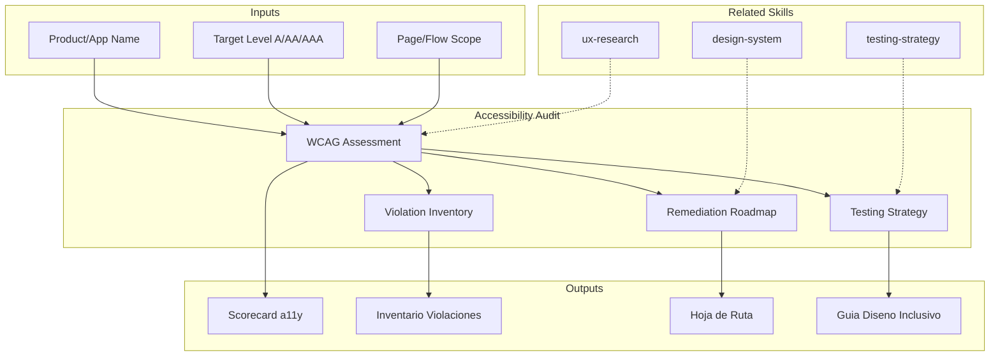

# Accessibility Audit: WCAG Compliance & Inclusive Design Assessment

Accessibility audit evaluates digital products against WCAG 2.1/2.2 standards and inclusive design principles. The skill produces accessibility scorecards, violation inventories, and remediation roadmaps that ensure digital experiences are usable by people with diverse abilities.

## Grounding Guideline

> *Accessibility is not compliance — it is the guarantee that 100% of users can use the product.*

1. **WCAG as floor, not ceiling.** AA is the minimum — accessibility excellence goes beyond checkpoints.
2. **Automate the automatable, test the human.** Tools detect 30% of problems — manual testing with real users detects the rest.
3. **Accessibility by design, not as a patch.** Retrofitting accessibility is 10x more expensive than designing it from the start.

## TL;DR

- Evaluates WCAG 2.1/2.2 conformance at A, AA, and AAA levels with detailed violation inventory
- Classifies findings by severity, user impact, and remediation effort
- Produces accessibility scorecard per component, page, and critical flow
- Defines a11y testing strategy (automated + manual + real users)
- Generates prioritized remediation roadmap with quick wins and structural improvements

## Inputs

The user provides a product or application name as `$ARGUMENTS`. Parse `$1` as the **product/application name**.

**Parameters:**
- `{MODO}`: `piloto-auto` (default) | `desatendido` | `supervisado` | `paso-a-paso`
- `{FORMATO}`: `markdown` (default) | `html` | `dual`
- `{VARIANTE}`: `ejecutiva` (~40%) | `tecnica` (full, default)
- `{NIVEL}`: `A` | `AA` (default) | `AAA`

## Deliverables

1. **Accessibility Scorecard** — Compliance score per WCAG principle (Perceivable, Operable, Understandable, Robust) and conformance level
2. **Violation Inventory** — Detailed catalog of violations with WCAG criterion, severity, location, and remediation guidance
3. **Remediation Roadmap** — Prioritized action plan: quick wins (CSS/ARIA fixes), medium-term (component redesign), strategic (architecture changes)
4. **a11y Testing Strategy** — Automated tools, manual testing protocols, and assistive technology testing plan
5. **Inclusive Design Guide** — Design patterns and component guidelines for ongoing accessible development

## Process

1. **Define scope** — Identify pages, flows, and components in scope; determine target conformance level (A, AA, AAA)
2. **Execute automated audit** — Run automated tools (axe-core, Lighthouse, WAVE) to identify programmatic violations
3. **Perform manual testing** — Keyboard-only navigation, screen reader testing (NVDA, VoiceOver, JAWS), zoom/magnification testing
4. **Evaluate per WCAG principle** — Assess each POUR principle: Perceivable (alt text, contrast, captions), Operable (keyboard, timing, seizures), Understandable (readable, predictable, input assistance), Robust (parsing, name/role/value)
5. **Classify violations** — Rate each finding by severity (critical/major/minor/advisory) and user impact
6. **Prioritize remediation** — Rank fixes by: critical user impact first, then legal exposure, then effort-to-impact ratio
7. **Design testing strategy** — Establish automated CI checks, manual testing cadence, and assistive technology testing protocol
8. **Produce design guide** — Document accessible patterns for ongoing development (color, typography, forms, navigation, media)

## Quality Criteria

- [ ] All WCAG 2.1/2.2 success criteria evaluated at target conformance level
- [ ] Automated and manual testing combined (automated catches ~30-40% of issues)
- [ ] Violations include WCAG criterion reference, severity, and specific remediation
- [ ] Screen reader testing covers at least one major AT (NVDA, VoiceOver, or JAWS)
- [ ] Keyboard navigation tested for all interactive elements
- [ ] Color contrast ratios measured against WCAG thresholds (4.5:1 normal, 3:1 large text)
- [ ] Remediation roadmap includes effort estimates and ownership
- [ ] Design guidelines are actionable for development teams

## Assumptions and Limits

- Automated tools detect only 30-40% of accessibility issues — manual testing is essential
- Full WCAG AAA conformance is aspirational; AA is the standard legal/regulatory target
- Does not replace formal accessibility audit by certified professionals (IAAP)
- Assistive technology behavior varies across versions and platforms

## Edge Cases

1. **Legacy application without semantic HTML** — When the product uses tables for layout or divs without ARIA roles, the skill generates a semantic debt inventory and prioritizes remediation by critical flow instead of full coverage.
2. **SPA with heavy dynamic content** — Single Page Applications that update the DOM without notifying the screen reader require specific auditing of live regions, focus management, and route announcements.
3. **Multimedia content without captions** — If the product has extensive video/audio without subtitles or transcriptions, the skill estimates captioning effort and proposes prioritization by traffic and content criticality.
4. **AAA target requested** — When AAA conformance is requested, the skill warns it is aspirational, identifies achievable AAA criteria, and separates those requiring disproportionate investment.

## Decisions and Trade-offs

1. **Automated + manual audit vs. automated only** — Both are required because automated tools detect only 30-40% of issues; the additional cost of manual testing is justified by the critical coverage it provides.
2. **AA level as default vs. A** — AA is the legal standard in most jurisdictions (ADA, EN 301 549) and covers higher-impact issues; A is insufficient for real users.
3. **Prioritization by user impact vs. by effort** — User impact is prioritized first (access blockers before inconveniences), accepting that some high-impact fixes are costly.
4. **Testing with one AT vs. multiple** — A minimum of one screen reader (VoiceOver or NVDA) is required as baseline; testing with multiple ATs is ideal but left as a recommendation, not a requirement.

## Knowledge Graph

## Output Templates

### Markdown (default)
- Filename: `quality_a11y-audit_{producto}_{WIP}.md`
- Structure: TL;DR -> Scorecard por principio POUR -> Inventario de violaciones (tabla) -> Roadmap priorizado -> Estrategia de testing

### HTML
- Filename: `quality_a11y-audit_{producto}_{WIP}.html`
- Estructura: dashboard interactivo con filtros por severidad, principio WCAG y componente; incluye enlaces directos a criterios WCAG

### DOCX (bajo demanda)
- Filename: `{fase}_{entregable}_{cliente}_{WIP}.docx`
- Via python-docx con Design System MetodologIA v5. Cover page, TOC auto, headers/footers branded, tablas zebra. Para circulacion formal y auditoria.

### XLSX (bajo demanda)
- Filename: `{fase}_{entregable}_{cliente}_{WIP}.xlsx`
- Via openpyxl con Design System MetodologIA v5. Headers branded (fondo navy, texto blanco, Poppins), formato condicional con colores semaforo, auto-filtros, valores sin formulas. Para scorecards de accesibilidad, inventario de violaciones y matrices de remediacion.

### PPTX (bajo demanda)
- Filename: `{fase}_{entregable}_{cliente}_{WIP}.pptx`
- Via python-pptx con MetodologIA Design System v5. Slide master con gradiente navy, titulos Poppins, cuerpo Trebuchet MS, acentos gold. Max 20 slides (ejecutiva) / 30 slides (tecnica). Speaker notes con referencias de evidencia. Para comites directivos y presentaciones C-level.

## Evaluacion

| Dimension | Peso | Criterio |
|-----------|------|----------|
| Trigger Accuracy | 10% | Activa ante "audit accessibility", "WCAG", "a11y" sin confundir con testing general o UX review |
| Completeness | 25% | Cubre los 4 principios POUR, testing automatizado y manual, y roadmap de remediacion |
| Clarity | 20% | Cada violacion referencia criterio WCAG especifico con remediacion concreta |
| Robustness | 20% | Maneja SPAs, legacy sin semantica, contenido multimedia y objetivo AAA |
| Efficiency | 10% | 8 pasos sin redundancia; automatizado primero para filtrar antes de manual |
| Value Density | 15% | Scorecard y roadmap son directamente presentables a stakeholders |

**Umbral minimo**: 7/10 en cada dimension para considerar el skill production-ready.

## Cross-References

- **metodologia-testing-strategy:** Integration of a11y testing into overall test strategy
- **metodologia-ux-research:** User research with people with disabilities
- **metodologia-design-system:** Accessible component library and design tokens

---
**Autor:** Javier Montaño · Comunidad MetodologIA | **Version:** 1.0.0
