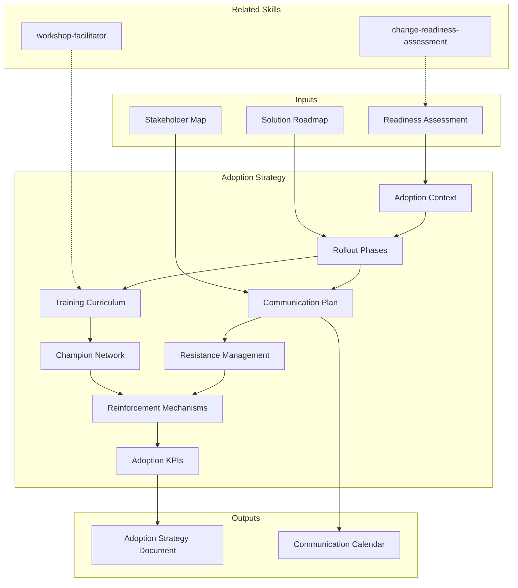

# Adoption Strategy

Designs a comprehensive adoption strategy: phased rollout plan, stakeholder communication strategy, training needs analysis and curriculum design, resistance management tactics, reinforcement mechanisms, and adoption KPIs with measurement cadence.

## Guiding Principle

> *Adoption is not an event, it is a process. It does not end at go-live — it begins there. Every user who does not adopt represents an investment that does not return.*

1. **Adoption is designed, not hoped for.** Each stakeholder group requires a deliberate strategy of awareness, enablement, and reinforcement. "Send an email and run a training" is not a strategy.
2. **Communication is 60% of adoption.** People adopt what they understand, value, and trust. The right message to the right group at the right time is more powerful than any training.
3. **Measuring adoption without acting on the metrics is theater.** Every KPI must have a threshold that triggers a concrete intervention.

## Inputs

- `$1` — Path to project context (change readiness assessment, solution roadmap, stakeholder map)
- `$2` — Strategy scope: `full` (default), `communication` (comms plan only), `training` (training plan only)

Parse from `$ARGUMENTS`.

**Parameters:**
- `{MODO}`: `piloto-auto` (default) | `desatendido` | `supervisado` | `paso-a-paso`
- `{FORMATO}`: `markdown` (default) | `html` | `dual` | `pptx` (sponsor presentation)
- `{MODO_OPERACIONAL}`: `estrategia` (default, full strategy) | `comunicacion` (communication plan focus) | `capacitacion` (training plan focus)
- `{VARIANTE}`: `ejecutiva` (~40% — rollout phases + KPIs) | `técnica` (full, default)

## Input Requirements

**Mandatory:**
- Defined change/transformation (what is being adopted)
- Stakeholder groups identified (who needs to adopt)

**Recommended:**
- Change readiness assessment (ADKAR scores, resistance map)
- Solution roadmap (phases, timeline)
- Current communication channels inventory
- Training infrastructure assessment (LMS, facilitators, budget)

## Assumptions & Limits

**Assumptions:**
- Change has executive sponsorship
- Timeline for adoption is defined (at least rough phases)
- Budget for communication and training exists (even if limited)

**Cannot do:**
- Execute communication campaigns (designs them)
- Deliver training (designs curriculum and materials spec)
- Resolve interpersonal conflicts or political dynamics
- Guarantee adoption rates (provides strategy to maximize them)

## Workarounds When Inputs Missing

| Missing Input | Impact | Workaround |
|---|---|---|
| No readiness assessment | Cannot target interventions | Use stakeholder map + assumptions; flag [SUPUESTO] |
| No solution roadmap | Cannot phase the rollout | Design generic 3-phase rollout; align when roadmap available |
| No training infrastructure | Cannot specify delivery | Recommend low-cost options (peer learning, documentation, recorded sessions) |
| No communication channels | Cannot design distribution | Audit available channels from project artifacts |

## Edge Cases

- **Global rollout (multi-timezone, multi-language):** Localization matrix per region. Cultural adaptation of messaging. Train-the-trainer cascade.
- **Mandatory adoption (compliance-driven):** Compliance deadlines as hard milestones. Legal language in communications. Audit trail for training completion.
- **Voluntary adoption (tools/practices):** Incentive design. Champion network. Gamification considerations.
- **Phased rollout with pilot:** Pilot selection criteria, feedback loop design, go/no-go criteria for scale.
- **Remote-only teams:** Digital-first communication strategy. Async training options. Virtual champion network.
- **Change fatigue present:** Lighter-touch strategy. Integrate into existing ceremonies. Avoid "another initiative" framing.

## Trade-off Matrix

| Decision | Enables | Constrains | When to Use |
|---|---|---|---|
| **Full strategy** | Comprehensive, all stakeholder groups covered | 3-5 days, multiple deliverables | Major transformations, >100 users affected |
| **Communication-only** | Fast, targeted messaging plan | No training or reinforcement design | When training is handled separately |
| **Training-only** | Detailed curriculum, materials spec | No communication or rollout strategy | When comms is handled by marketing/comms team |

## 8-Section Framework

### S1: Adoption Context & Goals
Change summary, affected stakeholder groups (from readiness assessment), adoption timeline, success definition (quantitative targets: adoption rate %, proficiency %, satisfaction score).

### S2: Rollout Strategy
Phased approach: Pilot → Early adopters → Majority → Laggards. Per phase: scope, duration, entry criteria, exit criteria, rollback plan. Wave planning for large organizations.

### S3: Communication Plan
Per stakeholder group: key messages (why, what, how, when), preferred channels, sender (who delivers the message matters), frequency, feedback mechanism. Communication calendar (Gantt).

Message framework by ADKAR stage:
- **Awareness:** Business case, urgency, vision
- **Desire:** WIIFM (What's In It For Me), success stories, sponsor endorsement
- **Knowledge:** How-to guides, FAQs, demos
- **Ability:** Practice opportunities, support channels
- **Reinforcement:** Success celebrations, metrics sharing, recognition

### S4: Training Needs Analysis & Curriculum
Per role: current skills, required skills, gap analysis, training method (classroom, e-learning, peer, on-the-job), duration, materials needed. Curriculum map with prerequisites and sequencing.

### S5: Resistance Management
Per resistance type identified in readiness assessment: tactic, responsible party, timeline. Tactics catalog: education, participation, facilitation, negotiation, co-optation. Escalation path for unresolved resistance.

### S6: Champion Network Design
Champion selection criteria, champion responsibilities, champion enablement plan (train-the-trainer), champion communication cadence, champion recognition/incentive structure.

### S7: Reinforcement Mechanisms
Post-go-live: coaching plan, help desk/support model, knowledge base maintenance, feedback loops, iteration cadence for process improvements. Sustainability plan (what happens when the project team leaves).

### S8: Adoption KPIs & Measurement
| KPI | Definition | Target | Measurement Method | Cadence | Intervention Threshold |
Per KPI: what triggers action, what action is triggered. Dashboard specification.

Core KPIs: adoption rate, proficiency rate, utilization rate, satisfaction (NPS/CSAT), time-to-competency, support ticket volume.

## Cross-Section Traceability

- S1 Goals → S8 KPIs (goals define success metrics)
- S2 Rollout → S3 Communication (phase drives message timing)
- S2 Rollout → S4 Training (phase drives training schedule)
- S3 Communication → S5 Resistance (messaging addresses resistance)
- S4 Training → S6 Champions (champions deliver peer training)
- S5 Resistance → S7 Reinforcement (unresolved resistance needs sustained attention)
- S7 Reinforcement → S8 KPIs (reinforcement sustains adoption metrics)

## Escalation to Human

- Adoption rate <30% after Phase 2 (majority rollout)
- Executive sponsor disengaged or actively resistant
- Training budget eliminated mid-execution
- Champion network cannot be established (no volunteers, no mandated participation)
- Cultural/language barriers require specialist localization

## Execution Workflow

1. **Context Review (1-2 hours):** Ingest readiness assessment, stakeholder map, solution roadmap
2. **Strategy Design (3-5 hours):** Rollout phases, communication plan, training curriculum
3. **Resistance & Champions (2-3 hours):** Resistance tactics, champion network design
4. **Measurement (1-2 hours):** KPIs, dashboard spec, intervention thresholds

**Typical engagement:** 3-4 days for transformations affecting <500 users.

## Output Configuration

- **Language**: Spanish (Latin American, business register — simple, clear, concise, direct)
- **Attribution**: Expert committee of the MetodologIA Discovery Framework
- **Tagline**: *"Construido por profesionales, potenciado por la red agéntica de MetodologIA."*

## Output Artifact

**Primary:** `Estrategia_Adopcion_{project}.md` (or `.html` if `{FORMATO}=html|dual`) — Full 8-section adoption strategy.

**Secondary:** `Plan_Comunicacion_{project}.md` — Communication calendar + message templates.

**Included diagrams:**
- Gantt chart: rollout phases and communication calendar
- Flowchart: escalation path for resistance management
- Mindmap: champion network structure

## Validation Gate

- [ ] All 8 sections populated with evidence-based content
- [ ] Communication plan covers all stakeholder groups from S1
- [ ] Training curriculum aligned with role-based gaps from S4
- [ ] Every resistance type from readiness assessment has a tactic in S5
- [ ] KPIs have concrete targets and intervention thresholds
- [ ] Champion network design is actionable (not aspirational)
- [ ] Cross-section traceability complete

## Output Format Protocol

| Format | Default | Description |
|--------|---------|-------------|
| `markdown` | ✅ | Rich Markdown + Mermaid diagrams. Token-efficient. |
| `html` | On demand | Branded HTML (Design System). Visual impact. |
| `dual` | On demand | Both formats. |
| `pptx` | On demand | Slide spec for sponsor presentation. |

## Operational Modes

| Mode | Focus | Best For |
|---|---|---|
| `estrategia` (default) | Full 8-section strategy | Major transformations, Phase 5b deliverable |
| `comunicacion` | S1 + S3 + S6 deep | When training is handled separately |
| `capacitacion` | S1 + S4 + S6 deep | When comms is handled by another team |

## Additional Resources

### References (Progressive Disclosure — Level 3)
- `Read ${CLAUDE_SKILL_DIR}/references/knowledge-graph.mmd` — Domain knowledge graph
- `Read ${CLAUDE_SKILL_DIR}/references/body-of-knowledge.md` — Academic and industry sources
- `Read ${CLAUDE_SKILL_DIR}/references/state-of-the-art.md` — Trends 2024-2026

### Examples
- `Read ${CLAUDE_SKILL_DIR}/examples/sample-output.md` — Golden reference output
- `Read ${CLAUDE_SKILL_DIR}/examples/sample-output.html` — Branded HTML

### Prompts
- `Read ${CLAUDE_SKILL_DIR}/prompts/use-case-prompts.md` — Ready-to-use prompts
- `Read ${CLAUDE_SKILL_DIR}/prompts/metaprompts.md` — Meta-strategies

## Casos Borde

| Caso | Estrategia de Manejo |
|------|---------------------|
| Adoption is mandatory (compliance-driven) with hard regulatory deadline | Replace incentive-based tactics with compliance deadline milestones; add legal language to communications; require training completion audit trail; build escalation path for non-compliance |
| Global rollout across 5+ time zones and 3+ languages | Create localization matrix per region; adapt messaging for cultural context; use train-the-trainer cascade model; stagger rollout waves by region to absorb lessons learned |
| Champion network cannot be established (no volunteers, no management mandate) | Fall back to "embedded support" model: assign super-users from existing team leads; reduce champion responsibilities to minimum viable (FAQ answering, issue escalation); escalate champion gap to sponsor |
| Change fatigue detected — organization has 3+ concurrent transformation initiatives | Design a lighter-touch strategy that integrates into existing ceremonies (stand-ups, town halls); avoid "another initiative" framing; position as enhancement to current work, not additional burden |

## Decisiones y Trade-offs

| Decision | Alternativa Descartada | Justificacion |
|----------|----------------------|---------------|
| Phase rollout as Pilot > Early Adopters > Majority > Laggards | Big-bang simultaneous rollout to all users | Phased rollout absorbs lessons from each wave, reduces blast radius of issues, and builds internal success stories that accelerate later waves |
| Communication plan aligned to ADKAR stages (Awareness > Desire > Knowledge > Ability > Reinforcement) | Generic "launch announcement + training" approach | ADKAR-aligned messaging addresses the psychological progression of adoption; generic approaches often skip Desire (motivation) and Reinforcement (sustainability) |
| Every KPI must have an intervention threshold that triggers concrete action | Track KPIs as informational dashboards only | Dashboards without intervention thresholds are measurement theater; the threshold-to-action link is what makes adoption strategy operational |

## Knowledge Graph

## Output Templates

### Markdown (default)
- Filename: `Estrategia_Adopcion_{cliente}_{WIP}.md`
- Structure: TL;DR > Adoption Context > Rollout Phases > Communication Plan with calendar > Training Curriculum > Resistance Tactics > Champion Network Design > Reinforcement Mechanisms > KPI Dashboard Spec > Mermaid Gantt + flowchart + mindmap > ghost menu

### PPTX
- Filename: `Estrategia_Adopcion_{cliente}_{WIP}.pptx`
- Structure: Sponsor-facing presentation; Adoption vision > Rollout timeline > Communication highlights > Training overview > KPI targets > Ask (resources, budget, sponsor actions); max 15 slides; speaker notes with full rationale

### HTML (bajo demanda)
- Filename: `Estrategia_Adopcion_{cliente}_{WIP}.html`
- Estructura: HTML self-contained branded (Design System MetodologIA v5). Dark-First Executive page con ADKAR progress bars interactivos, Gantt de rollout y calendario de comunicacion. WCAG AA, responsive, print-ready.

### DOCX (bajo demanda)
- Filename: `{fase}_{entregable}_{cliente}_{WIP}.docx`
- Via python-docx con Design System MetodologIA v5. Cover page, TOC auto, headers/footers branded, tablas zebra. Para circulacion formal y auditoria.

### XLSX (bajo demanda)
- Filename: `{fase}_{entregable}_{cliente}_{WIP}.xlsx`
- Via openpyxl con Design System MetodologIA v5. Headers branded (fondo navy, texto blanco, Poppins), formato condicional con colores semaforo, auto-filtros, valores sin formulas. Para matrices de KPIs de adopcion, planes de comunicacion y tracking de intervencion por grupo de stakeholders.

## Evaluacion

| Dimension | Peso | Criterio |
|-----------|------|----------|
| Trigger Accuracy | 10% | Descripcion activa triggers correctos sin falsos positivos |
| Completeness | 25% | Todos los entregables cubren el dominio sin huecos |
| Clarity | 20% | Instrucciones ejecutables sin ambiguedad |
| Robustness | 20% | Maneja edge cases y variantes de input |
| Efficiency | 10% | Proceso no tiene pasos redundantes |
| Value Density | 15% | Cada seccion aporta valor practico directo |

**Umbral minimo**: 7/10 en cada dimension para considerar el skill production-ready.

---
