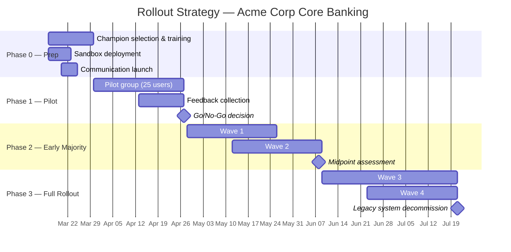
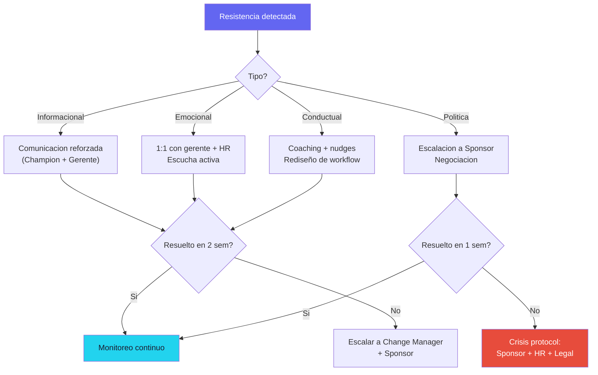

# Estrategia de Adopcion

**Proyecto:** Acme Corp — Modernizacion Core Bancario
**Fecha:** 13 de marzo de 2026
**Modo:** Estrategia (Full)
**Alcance:** 5 grupos de stakeholders, ~320 personas, 3 fases de rollout

---

## TL;DR

- Rollout en 3 fases: Piloto (Semana 1-4) → Early Majority (Semana 5-12) → Full (Semana 13-20)
- 24 mensajes planificados en calendario de comunicacion (6 canales, 5 grupos)
- Curriculum de training: 47 horas totales, 80% micro-learning + hands-on, 20% classroom
- Red de 15 champions (1 por cada 20 usuarios), train-the-trainer en Semana 1-2
- Target de adopcion: 85% active use a Semana 20, 70% proficiency a Semana 24

---

## S1: Adoption Context & Goals

### Resumen del Cambio

Acme Corp migra su core bancario de COBOL/mainframe a plataforma moderna (microservicios, cloud-native). El cambio afecta la totalidad de operaciones bancarias, interfaces de usuario, y flujos de integracion con 14 sistemas satelite.

### Grupos de Stakeholders

| Grupo | Personas | Readiness (ADKAR) | Barrier Point | Rol en Adopcion |
|---|---|---|---|---|
| Ejecutivos | 12 | 3.4 | Knowledge | Sponsors y comunicadores |
| Gerentes de Area | 28 | 2.0 | Reinforcement | Cascaders y coaches locales |
| Desarrolladores & QA | 85 | 2.6 | Knowledge | Constructores + early adopters naturales |
| Operaciones Back-Office | 145 | 1.6 | Desire | Usuarios principales — grupo critico |
| Atencion al Cliente | 50 | 2.8 | Reinforcement | Usuarios de interfaz front-end |

### Objetivos de Adopcion (Cuantitativos)

| Metrica | Target Semana 8 | Target Semana 16 | Target Semana 24 |
|---------|-----------------|-------------------|-------------------|
| Adoption Rate (active use) | 40% | 70% | 85% |
| Proficiency Rate | 20% | 50% | 70% |
| Satisfaction (CSAT) | ≥3.5/5 | ≥3.8/5 | ≥4.0/5 |
| Support Tickets (semanal) | <50 | <25 | <10 |
| Time-to-Competency | Baseline | -20% vs baseline | -40% vs baseline |

---

## S2: Rollout Strategy

### Fases de Rollout

### Phase 1: Piloto (Semana 1-4)

| Elemento | Detalle |
|----------|---------|
| **Grupo piloto** | 25 personas: 10 developers (tech-savvy), 10 back-office (voluntarios), 5 atencion al cliente |
| **Criterio de seleccion** | Voluntarios, ADKAR Desire ≥3, influencia social en su equipo |
| **Entry criteria** | Sandbox desplegado, training basico completado, champion asignado |
| **Exit criteria (Go/No-Go)** | ≥80% adoption en piloto, <5 bugs criticos, CSAT ≥3.5, feedback procesado |
| **Rollback plan** | Si Go/No-Go = No-Go: extender piloto 2 semanas, abordar issues, re-evaluar |

### Phase 2: Early Majority (Semana 5-12)

| Wave | Grupo | Razon del Orden |
|------|-------|-----------------|
| Wave 1 | Developers & QA (85) | Alta motivacion, bajo riesgo operativo, generan social proof tecnico |
| Wave 2 | Atencion al Cliente (50) | Readiness moderado (2.8), impacto visible al cliente externo |

### Phase 3: Full Rollout (Semana 13-20)

| Wave | Grupo | Razon del Orden |
|------|-------|-----------------|
| Wave 3 | Back-Office (145) | Grupo critico — requiere max intervenciones previas. Ultimo para acumular evidencia |
| Wave 4 | Gerentes + remanentes (28+) | Gerentes adoptan junto con sus equipos para poder hacer coaching |

> 💡 **Estrategia de Chasm Crossing:** Back-Office (el grupo mas resistente) se deja para Phase 3 deliberadamente. Para cuando lleguen, habra: testimonios del piloto, social proof de developers, champion network activa, y 12 semanas de datos de exito.

---

## S3: Communication Plan

### Matriz de Mensajes por Grupo y Etapa ADKAR

| Etapa ADKAR | Ejecutivos | Gerentes | Developers | Back-Office | Atencion al Cliente |
|---|---|---|---|---|---|
| **Awareness** | Business case ROI | Impacto en sus areas + timeline | Arquitectura + tech stack | Por que cambiamos + que pasa con mi rol | Que cambia en mi dia a dia |
| **Desire** | Progress dashboards | Enablement: "te preparamos" | Hands-on con tech moderna | Garantia de empleo + reskilling | Mejor herramienta = menos quejas |
| **Knowledge** | Executive briefings | Manager toolkit + FAQ | Bootcamp + documentacion | Paso-a-paso del nuevo flujo | Guia rapida de nueva interfaz |
| **Ability** | N/A (no operan sistema) | Coaching skills | Sandbox + pair programming | Practica supervisada + buddy | Practica en sandbox |
| **Reinforcement** | Adoption dashboard | Team metrics + coaching | Community of practice | Reconocimiento + quick wins | CSAT improvement data |

### Calendario de Comunicacion (Primeras 8 Semanas)

| Semana | Mensaje | Grupo Target | Canal | Sender | Formato |
|--------|---------|-------------|-------|--------|---------|
| 1 | "Por que modernizamos: la vision" | Todos | Town Hall + email | CEO + CTO | Presentacion + video 3min |
| 1 | "Que significa para tu area" | Gerentes | Workshop presencial | CTO + PM | Sesion interactiva 2h |
| 2 | "Tu rol en la transformacion" | Desarrolladores | Tech Talk | Tech Lead | Demo tecnica + Q&A |
| 2 | "Preguntas frecuentes + garantias" | Back-Office | Sesion por area (20 pers) | Gerente directo + HR | Sesion cara-a-cara |
| 3 | "Conoce el nuevo sistema (demo)" | Todos | Video + intranet | Champion + UX | Video 5min + FAQ |
| 4 | "Piloto lanzado: primeros resultados" | Todos | Email + Slack | PM | Infografia + datos |
| 5 | "Testimonios del piloto" | Developers + Back-Office | Slack + presentacion area | Piloto participants | Video testimonios 2min |
| 6 | "Wave 1 arranca: developers on board" | Developers | Kickoff presencial | Tech Lead + Champion | Workshop + sandbox access |
| 7 | "Progreso Wave 1: metricas" | Todos | Dashboard + email | PM | Dashboard link + resumen |
| 8 | "Tu turno: preparacion Wave 2" | Atencion al Cliente | Workshop por equipo | Gerente + Champion | Sesion practica 2h |

### Canales Prioritarios

| Canal | Grupos | Frecuencia | Tipo |
|-------|--------|-----------|------|
| Town Hall presencial | Todos | Mensual (inicio) → trimestral | Awareness, Desire |
| Sesiones por area (20 pers) | Back-Office | Quincenal (primeros 2 meses) | Awareness, Desire, Knowledge |
| Slack #transformacion | Developers, Gerentes | Diario (community-driven) | Knowledge, Ability, Reinforcement |
| Email ejecutivo | Ejecutivos, Gerentes | Quincenal | Awareness, Reinforcement |
| Intranet hub | Todos | Siempre disponible | Knowledge (recursos on-demand) |
| 1:1 con gerente | Back-Office | Mensual | Desire, Ability |

---

## S4: Training Needs Analysis & Curriculum

### Gap Analysis por Rol

| Rol | Skills Actuales | Skills Requeridas | Gap | Metodo Recomendado |
|-----|----------------|-------------------|-----|-------------------|
| Developers | COBOL, DB2, mainframe | Microservicios, Java/Kotlin, cloud, CI/CD | Alto | Bootcamp 2 sem + sandbox continuo |
| QA | Testing manual + scripts COBOL | Automation testing, API testing, cloud testing | Alto | Bootcamp 1 sem + pair testing |
| Back-Office ops | Terminal legacy, procedimientos manuales | Web UI, workflows automatizados, exception handling | Medio-Alto | Micro-learning + practica supervisada |
| Customer service | Terminal legacy + scripts telefonia | Nueva interfaz CRM integrada | Medio | E-learning + practica en sandbox |
| Gerentes | Reportes legacy | Dashboards nuevos, coaching skills | Bajo-Medio | Workshop 4h + self-service |

### Curriculum Design

| Modulo | Audiencia | Formato | Duracion | Prerequisito | Kirkpatrick L |
|--------|-----------|---------|----------|--------------|---------------|
| M01: Vision y contexto | Todos | Video + quiz | 30 min | Ninguno | L1 (Reaction) |
| M02: Tour del nuevo sistema | Todos | Demo interactiva | 45 min | M01 | L1 |
| M03: Navegacion basica | Back-Office, Customer Service | Micro-learning (5 modulos x 5 min) | 25 min | M02 | L2 (Learning) |
| M04: Flujos operativos nuevos | Back-Office | Practica guiada en sandbox | 4h | M03 | L2 + L3 |
| M05: Exception handling | Back-Office | Case studies + practica | 2h | M04 | L3 (Behavior) |
| M06: Arquitectura moderna | Developers | Bootcamp intensivo | 40h (2 sem) | M01 | L2 + L3 |
| M07: CI/CD & DevOps | Developers, QA | Workshop + lab | 8h | M06 | L3 |
| M08: API Testing | QA | Workshop + pair testing | 8h | M06 | L3 |
| M09: Nueva interfaz CRM | Customer Service | E-learning + sandbox | 3h | M02 | L2 |
| M10: Dashboards y reporting | Gerentes | Workshop | 4h | M02 | L2 |
| M11: Coaching para el cambio | Gerentes | Workshop + role-play | 4h | M10 | L3 |

### Metricas de Training (Kirkpatrick)

| Nivel | Metrica | Target | Metodo |
|-------|---------|--------|--------|
| L1 — Reaction | Satisfaction score post-training | ≥4.0/5 | Survey post-modulo |
| L2 — Learning | Assessment score | ≥80% pass rate | Quiz + practical test |
| L3 — Behavior | Feature usage rate (30 dias post-training) | ≥70% daily active use | DAP + system analytics |
| L4 — Results | Processing time reduction | -20% vs legacy baseline | Business metrics |

---

## S5: Resistance Management

### Tacticas por Tipo de Resistencia

| Tipo | Grupo Principal | Tactica | Detalle | Responsable |
|------|----------------|---------|---------|-------------|
| **Miedo a perdida de empleo** | Back-Office | Garantia explicita + reskilling | Comunicacion formal de HR: no hay plan de reduccion. Plan de reskilling individual. | HR + Sponsor |
| **Perdida de expertise** | Back-Office, Developers | Legacy Champion program | Reconocer expertise legacy como valiosa para la transicion. Documentar conocimiento tribal. | Change Manager |
| **Sobrecarga de trabajo** | Gerentes | Protected time | Asignar 20% del tiempo a actividades de cambio. Reducir carga operativa temporalmente. | Sponsor + PMO |
| **Escepticismo tecnico** | Developers | Hands-on proof | Sandbox desde Semana 1. Involucrar en decisiones tecnicas. Respetar feedback. | Tech Lead |
| **Inercia / habito** | Back-Office, Customer Service | Nudges + defaults | Nuevo sistema como default. Legacy accesible pero no en home screen. Quick wins visibles. | UX + Platform |
| **Falta de tiempo para training** | Todos | Micro-learning in flow | Modulos de 5 min, accesibles en el momento de necesidad. No sacar de su trabajo. | L&D + DAP |

### Escalation Path

---

## S6: Champion Network Design

### Estructura de la Red

| Atributo | Especificacion |
|----------|---------------|
| **Tamano** | 15 champions (ratio 1:20 usuarios) |
| **Distribucion** | 4 Developers, 6 Back-Office, 3 Customer Service, 2 Gerentes |
| **Criterios de seleccion** | Influencia social (no jerarquica), ADKAR Desire ≥3, voluntarios, respetados por pares |
| **Dedicacion** | 20% de su tiempo (1 dia/semana) durante rollout, 10% post-go-live |

### Enablement Plan (Train-the-Trainer)

| Semana | Actividad | Duracion |
|--------|-----------|----------|
| 1 | Champion kickoff: vision, rol, expectativas | 2h |
| 1-2 | Training avanzado en nuevo sistema (ahead of their group) | 8h |
| 2 | Communication skills: como responder preguntas, como reportar resistance | 4h |
| 3+ | Weekly sync: compartir experiencias, resolver issues, preparar siguiente wave | 1h/semana |

### Champion Communication Cadence

- **Diario:** Presencia en Slack #transformacion, responder preguntas
- **Semanal:** Sync con Change Manager (1h), reporte de pulse informal
- **Quincenal:** Mini-retro con su grupo de usuarios
- **Mensual:** Champion community meetup (cross-area)

### Reconocimiento e Incentivos

| Incentivo | Tipo | Timing |
|-----------|------|--------|
| Badge "Champion de Transformacion" | Reconocimiento | Al inicio del programa |
| Mencion en comunicaciones ejecutivas | Visibilidad | Mensual |
| Acceso prioritario a training avanzado | Desarrollo profesional | Continuo |
| Certificacion interna de Change Agent | Carrera | Al final del programa |
| Bonus por cumplimiento de KPIs de adopcion de su grupo | Financiero | Trimestral |

---

## S7: Reinforcement Mechanisms

### Post-Go-Live (Por Cada Wave)

| Mecanismo | Descripcion | Cadencia | Responsable |
|-----------|-------------|----------|-------------|
| **Office Hours** | Sesiones abiertas de Q&A con expertos | 2x/semana (primeras 4 semanas post-wave) | Champions + Tech Lead |
| **Help Desk L1** | Soporte basico via Slack + ticket | Continuo | Champion network |
| **Help Desk L2** | Soporte tecnico avanzado | Continuo | Equipo de producto |
| **Knowledge Base** | Wiki con guias, FAQ, videos, troubleshooting | Siempre disponible, actualizado semanalmente | Champions + documentadores |
| **Feedback Loop** | Canal para reportar issues, sugerencias, frustraciones | Continuo | Change Manager → equipo de producto |
| **Quick Win Showcases** | Presentar mejoras logradas con el nuevo sistema | Quincenal | Champions + usuarios |
| **Coaching 1:1** | Para usuarios con dificultad persistente | On-demand | Gerente + Champion |

### Sustainability Plan (Cuando el Proyecto Termina)

| Elemento | Pre-Proyecto Exit | Post-Proyecto Exit |
|----------|-------------------|---------------------|
| Soporte L1 | Champions | Transferido a Help Desk interno |
| Soporte L2 | Equipo de producto | Transferido a equipo de mantenimiento |
| Knowledge Base | Actualizada por proyecto | Ownership a equipo de producto |
| Champion Network | Activa con dedicacion 20% | Reducida a 10%, integrada en BAU |
| Feedback Loop | Change Manager procesa | Product Owner procesa |
| Metricas | Dashboard de proyecto | Integrado en dashboard operativo |

---

## S8: Adoption KPIs & Measurement

### Dashboard de Adopcion

| KPI | Definicion | Target S8 | Target S16 | Target S24 | Cadencia | Intervention Threshold |
|-----|-----------|-----------|------------|------------|----------|----------------------|
| **Adoption Rate** | % usuarios con ≥1 login/semana | 40% | 70% | 85% | Semanal | <50% en S12 → sponsor review |
| **Proficiency Rate** | % usuarios que completan core tasks sin soporte | 20% | 50% | 70% | Quincenal | <35% en S16 → training booster |
| **Utilization Rate** | % features target en uso activo | 30% | 55% | 75% | Quincenal | <40% en S16 → DAP review |
| **Satisfaction (CSAT)** | Survey 1-5 post-uso | ≥3.5 | ≥3.8 | ≥4.0 | Mensual | <3.0 → UX review |
| **Time-to-Competency** | Dias desde primer uso a proficiency | Baseline | -20% | -40% | Por wave | >baseline → training redesign |
| **Support Ticket Volume** | Tickets/semana (L1+L2) | <50 | <25 | <10 | Semanal | >2x target → soporte reforzado |
| **Champion NPS** | NPS de champions sobre el programa | ≥7 | ≥8 | ≥8 | Mensual | <6 → champion enablement review |
| **Training Completion** | % completado por modulo obligatorio | 90% | 95% | 98% | Semanal | <80% pre-wave → retrasar wave |

### Adoption Funnel

| Etapa | Definicion | Target Conversion | Intervencion si <Target |
|-------|-----------|-------------------|-------------------------|
| **Awareness** | Sabe que el cambio existe | 95% | Comunicacion adicional |
| **Interest** | Asistio a demo/info session | 80% | Sesion por area + WIIFM |
| **Trial** | Accedio al sandbox/piloto | 60% | Invitacion directa + champion nudge |
| **Active Use** | ≥3 logins/semana por ≥2 semanas | 50% | Coaching + micro-learning |
| **Proficiency** | Completa core tasks sin soporte | 40% | Training booster + pair work |
| **Advocacy** | Recomienda a pares, contribuye a KB | 15% | Reconocimiento + champion path |

---

## Conclusiones

1. **El rollout en 3 fases minimiza riesgo:** Back-Office (grupo critico) adopta ultimo, cuando hay maxima evidencia y soporte.
2. **Comunicacion es el 60% de la estrategia:** 24 mensajes planificados, 6 canales, mensajes adaptados por grupo y etapa ADKAR.
3. **Champion network es el multiplicador:** 15 champions habilitados reducen la carga sobre el equipo de proyecto y generan social proof.
4. **Training es micro-learning first:** 80% del curriculum es modular, on-demand, just-in-time. Solo el bootcamp de developers es inmersivo.
5. **Metricas con teeth:** Cada KPI tiene threshold que dispara intervencion. No se mide para reportar — se mide para actuar.

---

**Generado por:** MetodologIA Discovery Framework — adoption-strategy
**Agente:** change-catalyst
**Autor:** Javier Montano | **Fecha:** 13 de marzo de 2026
