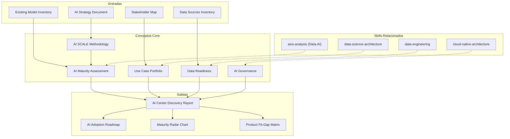

# AI Center Discovery — AI Readiness Assessment & Adoption Roadmap

Genera un assessment de 8 secciones para servicios del AI Center: evaluacion de readiness con metodologia AI SCALE de MetodologIA, portafolio de use cases, evaluacion de data readiness, inventario de modelos, governance de AI, infraestructura, integracion con productos AI de MetodologIA, y roadmap de adopcion. Diseñado para maximizar la probabilidad de que los pilotos de AI lleguen a produccion y generen valor sostenible.

## Principio Rector

> *La IA sin estrategia es un juguete caro. La IA con estrategia pero sin gobernanza es un riesgo empresarial. Solo la IA con estrategia, gobernanza y adopcion medida transforma organizaciones.*

1. **El 80% de los pilotos de AI nunca llegan a produccion.** Este assessment existe para que los pilotos del cliente esten en el 20% que si lo logran. Cada recomendacion incluye los factores que tipicamente causan fracaso y como mitigarlos.
2. **Los datos son el activo, no el modelo.** Un modelo excelente con datos mediocres produce resultados mediocres. El assessment evalua data readiness con la misma rigurosidad que la capacidad de modelado.
3. **AI responsable no es opcional — es prerequisito.** Bias, explicabilidad, privacidad y compliance no son consideraciones secundarias. Son criterios de go/no-go para cualquier use case de AI en produccion.

## Inputs

- `$1` — Path to AI/ML documentation or project workspace (default: current working directory)
- `$2` — Analysis depth: `full` (default), `executive` (S1, S2, S5, S8 only)

Parse from `$ARGUMENTS`.

**Parameters:**
- `{MODO}`: `piloto-auto` (default) | `desatendido` | `supervisado` | `paso-a-paso`
  - **piloto-auto**: Auto para inventario de modelos e infraestructura, HITL para evaluacion de governance y priorizacion de use cases.
  - **desatendido**: Cero interrupciones. Analisis completo automatizado. Supuestos documentados.
  - **supervisado**: Autonomo con reportes al completar cada seccion.
  - **paso-a-paso**: Confirma antes de cada seccion del analisis.
- `{FORMATO}`: `markdown` (default) | `html` | `dual`
- `{VARIANTE}`: `ejecutiva` (~40% — S1, S2, S5, S8 only) | `tecnica` (full, default)
- `{TIPO_SERVICIO}`: `Data-AI` (fixed for this skill)

## Input Requirements

**Mandatory:**
- Estrategia de datos y/o AI de la organizacion (o confirmacion de que no existe)
- Inventario de data sources principales
- Stakeholder map con sponsors de iniciativas de AI

**Recommended:**
- Inventario de modelos AI/ML existentes (si aplica)
- Data catalog o documentacion de data assets
- Infraestructura de compute actual (cloud accounts, GPU availability)
- Politicas de privacidad y compliance existentes
- Resultados de pilotos de AI previos (exitos y fracasos)
- MLOps pipeline documentation (si existe)

## Assumptions & Limits

**Assumptions:**
- Existe interes ejecutivo en adoptar AI (sponsor identificado)
- Hay datos disponibles (aunque no necesariamente listos para AI)
- La organizacion tiene capacidad tecnica basica (equipos de desarrollo o datos)
- No se asume madurez previa en AI/ML

**Cannot do:**
- Entrenar o evaluar modelos de ML (requiere engagement de implementacion)
- Auditar datasets por bias (requiere acceso a datos y analisis estadistico en vivo)
- Evaluar performance de modelos en produccion (requiere acceso a monitoring)
- Implementar pipelines de MLOps (requiere engagement tecnico)
- Asesorar legalmente sobre compliance (requiere equipo juridico)

## Workarounds When Inputs Missing

| Missing Input | Impact | Workaround |
|---|---|---|
| No AI strategy | Cannot assess alignment | Evaluar como greenfield; recomendar estrategia como prerequisito |
| No data catalog | Cannot assess data readiness | Identificar data sources principales via entrevistas; flag como [SUPUESTO] |
| No existing models | Cannot inventory models | Evaluar como organizacion pre-AI; enfocar en use case discovery |
| No MLOps pipeline | Cannot assess infrastructure maturity | Flag como gap; baseline en nivel 0 de madurez MLOps |
| No privacy policies | Cannot assess governance | Flag como riesgo critico; recomendar framework de governance como fase 0 |

## Edge Cases

- **Organizacion sin experiencia en AI:** Enfocar en educacion, use cases de bajo riesgo, y construccion de data foundations. No recomendar deep learning en dia 1.
- **Multiples pilotos fallidos:** Diagnosticar causas raiz (datos, expectativas, governance, talento). Recomendar enfoque diferente, no mas de lo mismo.
- **Datos sensibles (salud, finanzas):** Elevar requisitos de governance, privacy by design, y compliance. Evaluar federated learning o differential privacy si aplica.
- **Vendor lock-in con plataforma AI:** Evaluar portabilidad de modelos, costo de migracion, y estrategia multi-cloud.
- **Shadow AI (uso no gobernado de ChatGPT, etc.):** Inventariar uso informal de AI generativa. Evaluar riesgos (data leakage, compliance). Proponer framework de AI governance que incluya GenAI.
- **>50 use cases identificados:** Screening rapido con impacto x feasibilidad. Scoring detallado solo para top-10.

## Trade-off Matrix

| Decision | Enables | Constrains | When to Use |
|---|---|---|---|
| **Full 8-section analysis** | Maximum depth, complete AI strategy | 7-10 dias, alto consumo de tokens | AI transformation programs, AI CoE setup |
| **Executive variant** (S1+S2+S5+S8) | Quick readiness snapshot, decision-ready | No incluye data readiness, modelos ni infraestructura | AI business case, executive alignment |
| **Data-first** (S1+S3 deep) | Solid data foundation assessment | No llega a use case prioritization | Organizaciones con datos desordenados |
| **Governance-first** (S5+S1) | Compliance-ready AI framework | Menor profundidad en use cases y tech | Industrias reguladas (finanzas, salud) |

## 8-Section Framework

### S1: AI Readiness Assessment (AI SCALE)

Evaluacion usando la metodologia AI SCALE de MetodologIA.

**Etapas AI SCALE:**

| Etapa | Nombre | Descripcion | Indicadores |
|---|---|---|---|
| S | Selection | Identificacion y priorizacion de use cases | Use cases documentados, sponsors identificados, criterios de priorizacion |
| C | Co-creation | Diseno colaborativo de soluciones AI | Equipos cross-funcionales, prototipos, POCs en progreso |
| A | Adoption | Implementacion y adopcion por usuarios | Modelos en produccion, metricas de adopcion, change management |
| L | Launch | Operacionalizacion y escalamiento | MLOps maduro, monitoring, CI/CD para modelos |
| E | Expansion | Expansion y optimizacion continua | Portfolio de AI creciendo, ROI medido, AI-first culture |

**Assessment por dimension de madurez:**

| Dimension | Score (1-5) | Evidencia | Gap vs Target |
|---|---|---|---|
| Estrategia AI | ... | ... | ... |
| Datos | ... | ... | ... |
| Talento | ... | ... | ... |
| Infraestructura | ... | ... | ... |
| Governance | ... | ... | ... |

**Etapa actual en AI SCALE:** Identificar con evidencia.

### S2: AI Use Case Portfolio

Identificacion y priorizacion de use cases de AI.

**Categorizacion:**
- **Eficiencia operativa:** Automatizacion, optimizacion de procesos, predictive maintenance
- **Experiencia del cliente:** Personalizacion, chatbots, recommendation engines, sentiment analysis
- **Generacion de ingresos:** Dynamic pricing, cross-sell/up-sell, market intelligence
- **Reduccion de riesgo:** Fraud detection, credit scoring, compliance monitoring, anomaly detection

**Matriz de priorizacion:**

| Use Case | Impacto (1-5) | Feasibilidad (1-5) | Alineacion Estrategica (1-5) | Score Total | Ranking |
|---|---|---|---|---|---|
| ... | ... | ... | ... | ... | ... |

**Top-10 ranked** con justificacion por cada criterio. Factores de riesgo por use case (data availability, ethical concerns, technical complexity).

### S3: Data Readiness Evaluation

Evaluacion de preparacion de datos para los use cases priorizados.

**Dimensiones de data readiness:**

| Dimension | Score (1-5) | Evidencia |
|---|---|---|
| Disponibilidad | ... | Datos existen y son accesibles |
| Calidad | ... | Completeness, accuracy, consistency |
| Accesibilidad | ... | APIs, data pipelines, permissions |
| Governance | ... | Ownership, lineage, catalogo |

**Por use case priorizado:**
- Data sources requeridos vs disponibles
- Gap analysis de datos
- Labeling readiness (si aplica supervised learning)
- Feature engineering complexity assessment
- Volumen de datos vs requisitos minimos del modelo

**Data gap analysis:** Matriz de use case vs data readiness. Flag use cases en riesgo por datos insuficientes.

### S4: Model Inventory & Maturity

Inventario de modelos AI/ML existentes.

**Por modelo existente:**

| Modelo | Use Case | Tipo | Stage | Performance | Monitoring | Drift Detection | Retraining |
|---|---|---|---|---|---|---|---|
| ... | ... | Classification/Regression/NLP/CV/GenAI | Experimental/Staging/Production | Accuracy/F1/AUC | Si/No | Si/No | Cadencia |

**Clasificacion por lifecycle stage:**
- **Experimental:** En desarrollo, no validado
- **Staging:** Validado, en proceso de deployment
- **Production:** Operativo, sirviendo predicciones
- **Deprecated:** En fase de retiro

**Si no hay modelos existentes:** Documentar como organizacion pre-AI. Enfocar recomendaciones en foundations (data, infrastructure, talent).

### S5: AI Governance Assessment

Evaluacion del framework de gobernanza de AI.

**Dimensiones de governance:**

| Dimension | Madurez (1-5) | Evidencia | Gap |
|---|---|---|---|
| Ethics framework | ... | Principios eticos definidos, comite de etica | ... |
| Bias detection | ... | Procesos de fairness, metricas de bias | ... |
| Explainability (XAI) | ... | SHAP/LIME, model cards, interpretabilidad | ... |
| Compliance | ... | GDPR, AI Act, regulacion sectorial | ... |
| Model risk management | ... | Validation, testing, approval process | ... |
| Responsible AI practices | ... | Human-in-the-loop, override mechanisms | ... |

**Governance maturity level:**
- L0: Sin governance (shadow AI)
- L1: Principios declarados, sin enforcement
- L2: Procesos definidos, enforcement parcial
- L3: Governance operativa, compliance demostrado
- L4: Mejora continua, AI ethics embedded en cultura

### S6: AI Infrastructure Assessment

Evaluacion de infraestructura para AI/ML.

**Dimensiones:**

| Componente | Estado Actual | Madurez (1-5) | Gap |
|---|---|---|---|
| Compute (GPU/TPU) | ... | ... | ... |
| MLOps maturity | ... | ... | ... |
| Experiment tracking | ... | ... | ... |
| Model registry | ... | ... | ... |
| Feature store | ... | ... | ... |
| Serving infrastructure | ... | ... | ... |
| Monitoring & alerting | ... | ... | ... |

**MLOps maturity levels:**
- L0: No MLOps (manual everything)
- L1: Manual training, automated serving
- L2: Automated training pipeline, manual deployment
- L3: Full CI/CD for ML, automated retraining
- L4: Full automation with monitoring, drift detection, auto-retraining

### S7: MetodologIA AI Product Integration

Assessment de donde los productos AI de MetodologIA pueden acelerar.

**Productos AI de MetodologIA:**

| Producto | Descripcion | Fit (Alto/Medio/Bajo/N/A) | Gap que Cubre | Evidencia |
|---|---|---|---|---|
| SKAI | Workflow automation con AI | ... | ... | ... |
| IRIS | Requirements to prototypes | ... | ... | ... |
| ATLAS | Architecture analysis | ... | ... | ... |
| CRONOS | Estimation con AI | ... | ... | ... |
| SDK | IDE integration | ... | ... | ... |
| neXus | Knowledge management | ... | ... | ... |
| ModernAIzer | Legacy modernization | ... | ... | ... |

**Fit-gap analysis por producto:**
- Donde el producto resuelve un pain point identificado
- Donde se requiere customizacion
- Donde no aplica (y por que)
- Integracion con stack existente del cliente

### S8: AI Adoption Roadmap

Hoja de ruta de adopcion de AI en 3 fases.

**Fase 1 — Pilots (0-3 meses):**
- 2-3 use cases de alto impacto y baja complejidad
- POCs con metricas de exito definidas
- Data preparation para use cases seleccionados
- Equipo: data scientist(s) + domain expert(s) + ML engineer
- Governance basica (model cards, bias check, approval process)

**Fase 2 — Scale (3-9 meses):**
- Productionize pilotos exitosos
- MLOps pipeline basico (experiment tracking, model registry)
- Expand use case portfolio (3-5 adicionales)
- AI governance framework operativo
- Team scaling (hire/upskill)

**Fase 3 — Production (9-18 meses):**
- MLOps maduro (CI/CD for ML, monitoring, auto-retraining)
- AI embedded en procesos core del negocio
- Portfolio de 10+ modelos en produccion
- AI CoE establecido
- Continuous improvement cycle

**Mitigacion del "80% de pilotos que nunca llegan a produccion":**
- Success criteria definidos ANTES del piloto
- Sponsor ejecutivo comprometido
- Data readiness validada ANTES de modelar
- MLOps basico ANTES de produccion
- Change management desde dia 1
- Kill criteria claros (cuando pivotar o cancelar)

**Indicadores de magnitud (NOT prices):**
- FTE-meses por fase (data scientists, ML engineers, domain experts)
- Compute resources (GPU-hours estimados por fase)
- Data engineering effort (FTE-meses para data preparation)
- Training y upskilling (horas-persona)

> **Disclaimer obligatorio:** Las magnitudes presentadas son estimaciones basadas en drivers identificados. Los valores finales dependen de negociacion comercial, condiciones de mercado y contexto especifico del cliente. El "80% failure rate" es una estadistica de industria que varia por sector y madurez organizacional.

## Escalation to Human Architect

- Use cases con implicaciones eticas significativas (scoring de personas, vigilancia, decisiones autonomas)
- Requisitos regulatorios complejos (AI Act, regulacion sectorial especifica)
- Integracion con sistemas criticos de negocio (pagos, salud, seguridad)
- Conflictos entre capacidad tecnica y expectativas ejecutivas
- Shadow AI con riesgo de data leakage confirmado
- Decisiones de build vs buy para plataformas de AI

## Validation Gate

- [ ] AI SCALE stage actual identificado con evidencia por dimension
- [ ] Portfolio de use cases categorizado y priorizado (top-10 con scoring)
- [ ] Data readiness evaluada por use case priorizado con gap analysis
- [ ] Inventario de modelos existentes con lifecycle stage y performance
- [ ] AI governance evaluada con maturity level y gaps criticos
- [ ] Infraestructura AI evaluada con MLOps maturity level
- [ ] Fit-gap de productos MetodologIA AI completado por producto relevante
- [ ] Roadmap en 3 fases con mitigacion del "80% failure rate"
- [ ] Magnitudes de inversion documentadas (NUNCA precios) con disclaimer
- [ ] Evidencia tagueada con [CODIGO], [CONFIG], [DOC], [INFERENCIA], [SUPUESTO]
- [ ] Cross-references entre secciones (data readiness S3 informa feasibility en S2)

## Casos Borde

| Caso | Estrategia de Manejo |
|---|---|
| Organizacion sin experiencia en AI | Enfocar en educacion, use cases de bajo riesgo, y construccion de data foundations. No recomendar deep learning en dia 1. |
| Multiples pilotos fallidos | Diagnosticar causas raiz (datos, expectativas, governance, talento). Recomendar enfoque diferente, no repetir patron de fracaso. |
| Datos sensibles (salud, finanzas) | Elevar requisitos de governance, privacy by design, y compliance. Evaluar federated learning o differential privacy. |
| Vendor lock-in con plataforma AI | Evaluar portabilidad de modelos, costo de migracion, y estrategia multi-cloud. Documentar exit cost. |
| Shadow AI (uso no gobernado de GenAI) | Inventariar uso informal de AI generativa. Evaluar riesgos (data leakage, compliance). Proponer framework de AI governance que incluya GenAI. |
| >50 use cases identificados | Screening rapido con impacto x feasibilidad. Scoring detallado solo para top-10. Evitar paralisis por analisis. |

## Decisiones y Trade-offs

| Decision | Alternativa Descartada | Justificacion |
|---|---|---|
| AI SCALE como framework de madurez | CMMI for AI, Gartner AI Maturity | AI SCALE es nativo de MetodologIA, alineado con fases de adopcion (Selection-to-Expansion), y cubre governance como dimension explicita. |
| 8 secciones como estructura de assessment | Assessment monolitico unico, framework de 3 secciones rapidas | 8 secciones permiten modularidad (variante ejecutiva usa 4 de 8) y cubren el ciclo completo desde strategy hasta roadmap. |
| Priorizacion top-10 sobre portafolio completo | Evaluar todos los use cases con igual profundidad | Profundidad sobre amplitud. Scoring detallado de 50+ use cases diluye calidad. Top-10 permite analisis de data readiness y feasibility por caso. |

## Knowledge Graph



## Output Templates

**Formato Markdown (default):**

```
# AI Center Discovery: {project}
## S1: AI Readiness Assessment (AI SCALE)
### Etapa Actual: {etapa}
| Dimension | Score (1-5) | Evidencia | Gap vs Target |
...
## S2: AI Use Case Portfolio
### Top-10 Use Cases
| Use Case | Impacto | Feasibilidad | Alineacion | Score | Ranking |
...
## S3-S8: [secciones completas]
## Roadmap de Adopcion (3 fases)
> DISCLAIMER: Magnitudes, no precios.
```

**Formato PPTX (bajo demanda):**

```
Slide 1: Portada — AI Center Discovery: {project}
Slide 2: Executive Summary — AI SCALE stage + top-3 findings
Slide 3: Maturity Radar — 5 dimensiones scored 1-5
Slide 4: Use Case Portfolio — scatter plot impacto vs feasibilidad
Slide 5: Data Readiness Heatmap — use case vs data readiness
Slide 6-7: Governance Assessment — maturity level + gaps
Slide 8: Product Fit-Gap — MetodologIA AI products matrix
Slide 9: Roadmap — 3 fases (Pilots / Scale / Production)
Slide 10: Next Steps + Disclaimer
```

**Formato HTML (bajo demanda):**
- Filename: `AI_Center_Discovery_{project}_{WIP}.html`
- Estructura: HTML self-contained branded (Design System MetodologIA v5). Dark-First Executive page con radar chart interactivo de madurez AI SCALE, scatter plot de use cases, y roadmap faseado colapsable. WCAG AA, responsive, print-ready.

**Formato DOCX (bajo demanda):**
- Filename: `{fase}_{entregable}_{cliente}_{WIP}.docx`
- Via python-docx con Design System MetodologIA v5. Cover page, TOC auto, headers/footers branded, tablas zebra. Para circulacion formal y auditoria.

**Formato XLSX (bajo demanda):**
- Filename: `{fase}_{entregable}_{cliente}_{WIP}.xlsx`
- Via openpyxl con Design System MetodologIA v5. Headers branded (fondo navy, texto blanco, Poppins), formato condicional con colores semaforo, auto-filtros, valores sin formulas. Para matrices de madurez AI SCALE, portafolio de use cases y scorecard de governance.

## Evaluacion

| Dimension | Peso | Criterio |
|---|---|---|
| Trigger Accuracy | 10% | El skill se activa correctamente ante keywords de AI readiness, AI SCALE, MLOps, governance, adoption roadmap. |
| Completeness | 25% | Las 8 secciones cubren el ciclo completo: strategy, use cases, data, models, governance, infrastructure, products, roadmap. |
| Clarity | 20% | Scoring de madurez es interpretable por audiencia ejecutiva y tecnica. AI SCALE levels documentados con evidencia. |
| Robustness | 20% | Edge cases (shadow AI, pilotos fallidos, >50 use cases, datos sensibles) manejados con estrategias explicitas. |
| Efficiency | 10% | Variante ejecutiva reduce a 4 secciones sin perder decision-readiness. Screening rapido para portafolios grandes. |
| Value Density | 15% | Cada seccion produce artefactos accionables: scoring matrices, gap analysis, fit-gap, roadmap faseado con mitigacion del 80% failure rate. |

**Umbral minimo: 7/10.** Debajo de este umbral, revisar completeness de secciones y evidencia de scoring.

## Output Artifact

**Primary:** `AI_Center_Discovery_{project}.md` — Assessment completo de 8 secciones con evaluacion AI SCALE, portafolio de use cases, data readiness, inventario de modelos, governance, infraestructura, integracion de productos MetodologIA AI, y roadmap de adopcion.

**Diagramas incluidos:**
- Radar chart de madurez AI SCALE por dimension
- Scatter plot de use cases (impacto vs feasibilidad)
- Heatmap de data readiness por use case
- Roadmap de adopcion (gantt)
- Fit-gap de productos MetodologIA AI (matrix)

---
**Autor:** Javier Montaño · Comunidad MetodologIA | **Ultima actualizacion:** 14 de marzo de 2026
