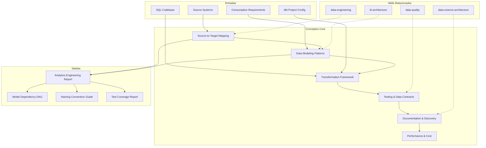

# Analytics Engineering: Transformation Pipeline Design & Data Modeling

Analytics engineering defines how raw data is transformed into reliable, documented, and tested analytical models — source-to-target mapping, modeling patterns, transformation frameworks, testing, and documentation. This skill produces analytics engineering documentation that enables teams to build maintainable, trustworthy data transformation pipelines.

## Grounding Guideline

**An analytical model without tests is an opinion formatted as a table.** Tests are first-class citizens — not an afterthought. Documentation is part of the model, not a separate artifact. Incremental over full-refresh whenever volume justifies it. Every model has explicit grain, identified owner, and contract enforced in CI.

## Inputs

The user provides a system or project name as `$ARGUMENTS`. Parse `$1` as the **system/project name** used throughout all output artifacts.

**Parameters:**
- `{MODO}`: `piloto-auto` (default) | `desatendido` | `supervisado` | `paso-a-paso`
  - **piloto-auto**: Auto para staging y naming conventions, HITL para modeling patterns y data contracts.
  - **desatendido**: Zero interruptions. Pipeline completo documentado automáticamente. Assumptions documented.
  - **supervisado**: Autónomo con checkpoint en modeling pattern selection y testing strategy.
  - **paso-a-paso**: Confirma cada modelo, materialization, test y exposure.
- `{FORMATO}`: `markdown` (default) | `html` | `dual`
- `{VARIANTE}`: `ejecutiva` (~40% — S1 source-to-target + S2 modeling patterns + S4 testing strategy) | `técnica` (full 6 sections, default)

Before generating architecture, detect the project context:

```
!find . -name "*.sql" -o -name "*.yml" -o -name "dbt_project.yml" -o -name "profiles.yml" -o -name "*.py" | head -30
```

Use detected tools (dbt, SQLMesh, Dataform, stored procedures, etc.) to tailor recommendations.

If reference materials exist, load them:

```
Read ${CLAUDE_SKILL_DIR}/references/analytics-patterns.md
```

---

## When to Use

- Designing source-to-target data transformation pipelines
- Selecting data modeling patterns (star schema, OBT, activity schema)
- Setting up dbt or similar transformation framework projects
- Defining testing strategies and data contracts for analytical models
- Planning documentation and data discovery infrastructure
- Optimizing warehouse performance and controlling compute costs

## When NOT to Use

- Data ingestion and orchestration pipelines → use data-engineering skill
- Dashboard design and KPI frameworks → use bi-architecture skill
- ML feature engineering and model serving → use data-science-architecture skill
- Data profiling and anomaly detection → use data-quality skill

---

## Delivery Structure: 6 Sections

### S1: Source-to-Target Mapping

Maps the journey from raw sources through staging to consumption-ready marts.

**dbt project structure conventions:**
```
models/
  staging/           # 1:1 source mappings — stg_{source}_{entity}.sql
    salesforce/
    stripe/
  intermediate/      # Business logic joins — int_{entity}_{verb}.sql
    finance/
    marketing/
  marts/             # Consumption models
    finance/         # fct_{event}.sql, dim_{entity}.sql
    marketing/
    core/            # Shared dimensions — dim_customer, dim_date
```

**Naming conventions (enforce via CI linting):**
- `stg_` — staging: rename, cast, deduplicate; one model per source table
- `int_` — intermediate: joins, pivots, aggregations that simplify mart logic
- `fct_` — fact: event/transaction grain, numeric measures, foreign keys
- `dim_` — dimension: descriptive attributes, surrogate keys, SCD tracking
- `mrt_` — mart-level aggregations when pre-aggregating for BI performance

**Includes:**
- Layer architecture (raw/landing → staging → intermediate → marts → metrics)
- Source inventory (systems, tables, extraction method, freshness SLA)
- Staging model design (1:1 source mapping, renaming, type casting, deduplication)
- Intermediate model patterns (joins, business logic aggregation, pivoting)
- Mart design (domain-specific consumption models, access patterns)

**Key decisions:**
- Layer count: 3 layers (stg/int/mart) for most teams; add metrics layer when semantic layer is needed
- Schema strategy: one schema per layer (staging, intermediate, marts) for simplicity; one per domain at mart level for access control
- Naming rigidity: enforce prefixes (stg_, int_, fct_, dim_) and source identifiers (stg_salesforce_, stg_stripe_) — enables automated lineage and CI rules

### S2: Data Modeling Patterns

Selects the modeling approach based on query patterns and data characteristics.

**Includes:**
- Star schema design (fact tables, dimension tables, grain definition, surrogate keys)
- Wide/denormalized tables (One Big Table pattern for simple analytics)
- Activity schema (event-centric modeling for behavioral analytics)
- Slowly changing dimensions (SCD Type 1: overwrite; Type 2: history tracking with effective dates; Type 3: previous + current columns — Type 2 is default for anything auditable)
- Bridge tables for many-to-many relationships

**Key decisions:**
- Star vs OBT: star for multiple consumption patterns and BI tools; OBT for single-use analytics — common mistake: over-normalizing for analytics creates 10-15 join queries that break easily
- Surrogate vs natural keys: surrogate preferred for SCDs and warehouse-internal joins; natural keys at staging layer
- Grain selection: too fine = expensive queries; too coarse = lost detail — always document grain explicitly in model YAML description
- Model complexity rule: keep individual model files to ~100 lines of SQL; models exceeding this need decomposition into intermediate steps

### S3: Transformation Framework

Documents tool configuration, model organization, and materialization strategies.

**Incremental strategy comparison:**

| Strategy | Mechanism | Best For | Watch Out |
|---|---|---|---|
| **append** | Insert new rows only | Immutable event streams (logs, clicks) | Cannot handle late-arriving updates |
| **merge** | Upsert on `unique_key` | Mutable entities (orders, users) | Requires stable unique key; expensive on large tables |
| **delete+insert** | Delete partition, re-insert | Late-arriving data in known partitions | Partition key must be deterministic |
| **insert_overwrite** | Overwrite entire partition | Cost-efficient on BigQuery/Hive | Not supported on all warehouses |
| **microbatch** | Process in time-windowed batches | Very large event tables (1B+ rows) | Newer dbt feature; requires `event_time` column |

Acceptance criteria for incremental models: test incremental runs against full refresh monthly to catch drift; always define `unique_key` and `updated_at`; set `on_schema_change: 'append_new_columns'` as default.

**ref() vs source() conventions:**
- `source()` only in staging models — never reference raw tables in intermediate or mart layers
- `ref()` everywhere else to maintain DAG integrity and enable state-aware builds
- Exposures for downstream consumers (BI dashboards, ML pipelines, reverse ETL)

**Includes:**
- Project structure (models/, tests/, macros/, seeds/, snapshots/, analyses/)
- Materialization strategy per layer (staging: view; intermediate: ephemeral or view; marts: table or incremental)
- Macro library (reusable SQL logic, cross-database compatibility)
- Snapshot strategy (SCD Type 2 tracking via timestamps or check columns)

**Key decisions:**
- Incremental vs full refresh: data volume and freshness drive this — incremental for >10M rows, full refresh for everything else
- Macro abstraction level: too many macros = unreadable SQL; too few = duplication — extract when logic is used in 3+ models
- Environment parity: dev/staging/prod must produce identical results on same data

### S4: Testing & Data Contracts

Defines testing strategy and contract enforcement for data reliability.

**Testing pyramid for data (invest effort bottom-up):**

| Level | What | Tools | Blocks Deploy? |
|---|---|---|---|
| **Source freshness** | Data arrived on time | `dbt source freshness` | Warn at 2x SLA, error at 4x |
| **Schema tests** | not_null, unique, accepted_values, relationships | dbt generic tests in YAML | Yes — mart layer always, staging for critical |
| **Custom data tests** | Business rule validation, cross-model consistency | dbt singular tests (.sql files) | Yes for mart layer |
| **Unit tests** | Macro logic, complex SQL transformations | dbt unit tests (v1.8+), SQLMesh audits | Yes — CI blocks merge |
| **Contract tests** | Column names, types, constraints between teams | dbt model contracts (`contract: {enforced: true}`) | Yes — breaking changes blocked |

**CI/CD for dbt:**
- Slim CI: `dbt build --select state:modified+` on PRs — test only changed models and downstream dependencies
- Deferred execution: `--defer --state prod-artifacts/` — reference production tables for unchanged models, avoiding full rebuilds
- Block merge on test failure for mart-layer models; warn-only for staging
- Run `dbt source freshness` as pre-build step; skip stale sources with `--exclude source:stale`
- PR comment bot: post model changes, test results, and warehouse cost estimate

**Includes:**
- Data contract specification (schema, types, constraints, SLAs between teams)
- Contract enforcement (breaking change detection, versioned interfaces)
- Test severity levels (warn vs error; which tests block deployment)

**Key decisions:**
- Test coverage target: mart models = 100% schema tests + custom tests; staging = not_null + unique on primary key minimum
- Breaking change policy: strict (block) for marts consumed by external teams; lenient (warn) for internal intermediate models
- Test execution: pre-merge CI + post-deploy monitoring — both, not either/or

### S5: Documentation & Discovery

Plans auto-generated and manually enriched documentation for data discovery.

**Exposure and metric definitions (connecting to BI):**
```yaml
exposures:
  - name: weekly_revenue_dashboard
    type: dashboard
    maturity: high
    url: https://bi-tool.company.com/dashboard/123
    depends_on:
      - ref('fct_orders')
      - ref('dim_customer')
    owner:
      name: Finance Analytics
      email: finance-analytics@company.com

metrics:
  - name: monthly_recurring_revenue
    label: MRR
    type: derived
    description: Sum of active subscription revenue, normalized to monthly
    calculation_method: derived
    expression: "sum(amount) where status = 'active'"
    time_grains: [day, week, month]
    dimensions: [plan_type, region, customer_segment]
```

Exposures create accountability: when a model breaks, the owner of every downstream exposure is notified. Define exposures for every L1-L2 dashboard and every ML pipeline consuming marts.

**Includes:**
- Auto-documentation setup (dbt docs generate, column descriptions, model descriptions)
- Column-level documentation (business meaning, calculation logic, example values)
- Lineage visualization (source-to-mart traceability, impact analysis)
- Data catalog integration (Atlan, DataHub, OpenMetadata — choose based on existing stack)
- Tagging and classification (PII, financial, experimental, certified)
- Ownership mapping (model owner, domain owner, SLA contact)

**Key decisions:**
- Documentation completeness: all columns described for mart models; business-critical columns for staging
- Catalog tool: dbt docs suffice for <50 models; invest in dedicated catalog at 100+ models
- Lineage depth: model-level default; column-level for regulated industries

### S6: Performance & Cost Optimization

Optimizes warehouse performance and controls transformation costs.

**Includes:**
- Query profiling (execution plans, scan volume, spill-to-disk analysis)
- Clustering and sort keys (most-filtered columns, cardinality-aware selection)
- Partition pruning (date-based partitioning covers 80% of use cases)
- Materialization tuning (when to materialize vs compute on read)
- Cost attribution (per-model cost tracking via query tags, budget alerts, chargeback)
- Warehouse sizing (auto-scaling, multi-cluster, dedicated vs shared)

**Key decisions:**
- Cluster key selection: choose columns with medium cardinality that appear in WHERE/JOIN clauses
- Cost visibility: tag every dbt model query (`query_tag` in profiles.yml) to enable per-model cost tracking
- Warehouse isolation: heavy transforms on dedicated warehouse; ad-hoc queries on separate warehouse with auto-suspend

---

## Trade-off Matrix

| Decision | Enables | Constrains | Threshold |
|---|---|---|---|
| **Star Schema** | Fast queries, intuitive for BI, clear grain | More joins, ETL complexity | Multiple consumption patterns, 3+ BI consumers |
| **One Big Table** | No joins, fast development | Redundancy, update complexity | Single-use analytics, <100M rows |
| **Incremental Models** | Fast builds, cost efficient | Harder debugging, late-arriving data risk | Fact tables >10M rows, frequent builds |
| **Full Refresh** | Simple, deterministic | Expensive at scale, slow | Dimension tables, prototyping, <10M rows |
| **Strict Data Contracts** | Reliability, breaking change prevention | Slower iteration | Production-critical marts, multi-team |
| **Column-Level Lineage** | Precise impact analysis | Tooling cost, maintenance | Regulated industries, 100+ models |

---

## Assumptions

- Data warehouse or lakehouse is provisioned and accessible
- Source data is being ingested (or ingestion is designed in parallel)
- Team has SQL proficiency and familiarity with transformation tools
- Version control (git) is used for transformation code
- CI/CD pipeline exists or is planned for automated deployment

## Limits

- Focuses on *transformation and modeling*, not data ingestion
- Does not design *BI consumption layer* (dashboards, KPIs)
- Does not address *data quality monitoring* beyond transformation tests
- Performance optimization is warehouse-specific; recommendations require knowing the platform

---

## Edge Cases

**Legacy Stored Procedures Migration:**
Map existing logic to dbt models, preserve business rules, run parallel validation. Expect 20-30% of stored procedure logic to be obsolete or duplicated.

**Multi-Warehouse Environment:**
Models consumed across Snowflake, BigQuery, and Redshift. Use cross-database macros, abstract warehouse-specific SQL, test on each target platform.

**Real-Time Transformation Needs:**
dbt is batch-oriented. For streaming transformations, consider Materialize, RisingWave, or SQLMesh with streaming support. Hybrid architecture: batch marts enriched by streaming aggregates.

**Massive Scale (10B+ Rows):**
Incremental models mandatory. Microbatch strategy, partition pruning, and clustering are critical. Profile query plans before and after optimization.

**Single Analytics Engineer:**
Skip intermediate layers initially. Start with staging + marts. Add layers as complexity grows. Documentation is critical for bus-factor mitigation.

---

## Validation Gate

Before finalizing delivery, verify:

- [ ] Layer architecture defined with enforced naming conventions (stg_, int_, fct_, dim_)
- [ ] Source-to-mart lineage traceable for every consumption model
- [ ] Modeling pattern matches query patterns and data characteristics
- [ ] Materialization strategy balances freshness, cost, and complexity
- [ ] Mart models have 100% schema tests (not_null, unique, relationships)
- [ ] Data contracts enforced for cross-team interfaces
- [ ] Exposures defined for every downstream dashboard and ML pipeline
- [ ] Slim CI configured (`state:modified+`, deferred execution)
- [ ] Cost per model measurable via query tagging
- [ ] Documentation covers column descriptions for all mart-layer models

---

## Edge Cases

| Case | Handling Strategy |
|---|---|
| Legacy Stored Procedures Migration | Map existing logic to dbt models, preserve business rules, parallel validation. Expect 20-30% of logic to be obsolete or duplicated. |
| Multi-Warehouse Environment | Models consumed across Snowflake, BigQuery, and Redshift. Use cross-database macros, abstract warehouse-specific SQL, test on each platform. |
| Real-Time Transformation Needs | dbt is batch-oriented. For streaming, consider Materialize, RisingWave, or SQLMesh with streaming. Hybrid architecture: batch marts enriched by streaming aggregates. |
| Massive Scale (10B+ Rows) | Incremental models mandatory. Microbatch strategy, partition pruning, and clustering critical. Profile query plans before and after. |
| Single Analytics Engineer | Skip intermediate layers initially. Staging + marts. Add layers as complexity grows. Documentation critical for bus-factor. |

## Decisions and Trade-offs

| Decision | Discarded Alternative | Justification |
|---|---|---|
| dbt as reference framework | SQLMesh, Dataform, stored procedures | dbt has the largest ecosystem (10K+ contributors), rich testing framework, and is the de facto standard for analytics engineering. The skill adapts to alternatives when detected. |
| Star schema as default pattern | One Big Table, Data Vault | Star schema balances query performance, intuitiveness for BI tools, and flexibility for multiple consumption patterns. OBT is recommended for single-use analytics. |
| Testing pyramid with contracts in CI | Tests only in production, manual validation | Contracts in CI prevent breaking changes before merge. Testing only in production detects problems late with larger blast radius. |
| Strict naming conventions (stg_, fct_, dim_) | Free naming per team | Standard prefixes enable automated CI rules, auto-detected lineage, and rapid onboarding. The cost is initial rigidity. |

## Knowledge Graph



## Output Templates

**Formato Markdown (default):**

```
# Analytics Engineering: {project}
## S1: Source-to-Target Mapping
### Layer Architecture
### Source Inventory
| Source | System | Tables | Extraction | Freshness SLA |
...
## S2: Data Modeling Patterns
### Selected Pattern: {star_schema|OBT|activity}
## S3: Transformation Framework
### Materialization Strategy
| Layer | Materialization | Rationale |
...
## S4: Testing & Data Contracts
### Test Coverage Summary
## S5: Documentation & Discovery
## S6: Performance & Cost Optimization
```

**Formato XLSX (bajo demanda):**

```
Sheet 1: Source Inventory — systems, tables, extraction method, freshness SLA
Sheet 2: Model Catalog — model name, layer, materialization, grain, owner, tests
Sheet 3: Test Coverage — model, not_null, unique, relationships, custom, contract
Sheet 4: Naming Conventions — prefix, pattern, examples, CI rule
Sheet 5: Cost Attribution — model, warehouse, avg duration, estimated cost/run
```

**Formato HTML (bajo demanda):**
- Filename: `{fase}_Analytics_Engineering_{cliente}_{WIP}.html`
- Estructura: HTML self-contained branded (Design System MetodologIA v5). Light-First Technical page con DAG interactivo de dependencias de modelos, test coverage heatmap, y tabla de naming conventions filtrable. WCAG AA, responsive, print-ready.

**Formato DOCX (bajo demanda):**
- Filename: `{fase}_{entregable}_{cliente}_{WIP}.docx`
- Via python-docx con Design System MetodologIA v5. Cover page, TOC auto, headers/footers branded, tablas zebra. Para circulacion formal y auditoria.

**Formato PPTX (bajo demanda):**
- Filename: `{fase}_{entregable}_{cliente}_{WIP}.pptx`
- Via python-pptx con MetodologIA Design System v5. Slide master con gradiente navy, titulos Poppins, cuerpo Trebuchet MS, acentos gold. Max 20 slides (ejecutiva) / 30 slides (tecnica). Speaker notes con referencias de evidencia. Para comites directivos y presentaciones C-level.

## Evaluacion

| Dimension | Peso | Criterio |
|---|---|---|
| Trigger Accuracy | 10% | Activacion correcta ante keywords de dbt, data modeling, star schema, staging models, materializations, data contracts. |
| Completeness | 25% | 6 secciones cubren source-to-target, modeling, framework, testing, docs, y performance. Naming conventions enforced. |
| Clarity | 20% | Decisiones de modeling pattern y materialization strategy justificadas con contexto. Tablas comparativas claras. |
| Robustness | 20% | Edge cases (legacy migration, multi-warehouse, streaming, massive scale, single engineer) manejados con estrategias practicas. |
| Efficiency | 10% | Variante ejecutiva reduce a 3 secciones clave. CI slim build evita rebuilds completos. |
| Value Density | 15% | Cada seccion produce artefactos operativos: DAG diagram, naming guide, test coverage report, cost attribution dashboard spec. |

**Umbral minimo: 7/10.** Debajo de este umbral, revisar completeness de modeling decisions y test coverage strategy.

## Output Format Protocol

| Format | Default | Description |
|--------|---------|-------------|
| `markdown` | Yes | Markdown con Mermaid embebido (DAG, star schema diagrams). |
| `html` | On demand | Branded HTML (Design System). Visual impact. |
| `dual` | On demand | Both formats. |

Default output is Markdown with embedded Mermaid diagrams. HTML generation requires explicit `{FORMATO}=html` parameter.

## Output Artifact

**Primary:** `A-01_Analytics_Engineering.html` — Source-to-target mapping, modeling patterns, transformation framework, testing strategy, documentation plan, performance optimization.

**Secondary:** Model dependency DAG, naming convention guide, test coverage report template, cost attribution dashboard spec.

---
**Autor:** Javier Montaño | **Última actualización:** 12 de marzo de 2026
