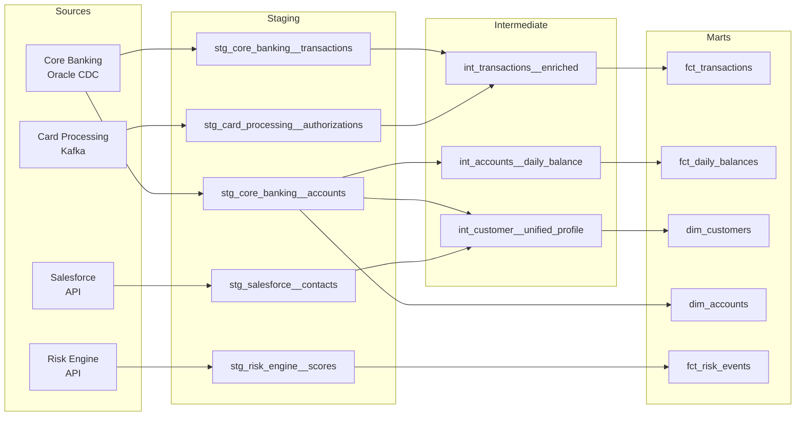
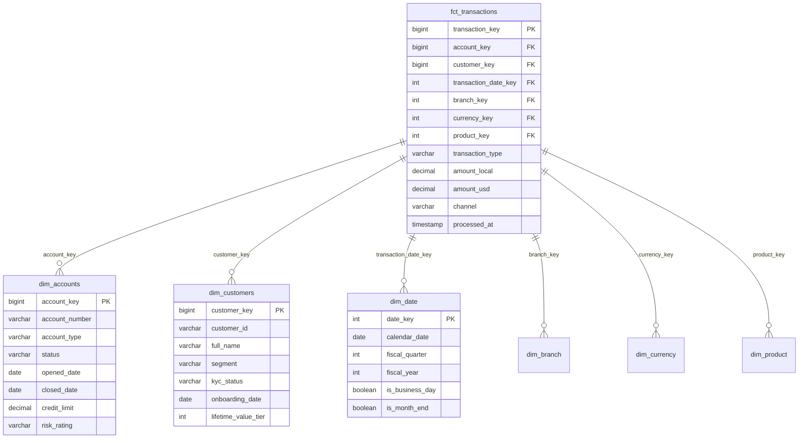

# A-01: Analytics Engineering — Acme Corp Banking Modernization

**Cliente:** Acme Corp | **Fecha:** 12 de marzo de 2026 | **Variante:** Técnica

## Resumen Ejecutivo

Acme Corp está modernizando su plataforma bancaria core, migrando de procedimientos almacenados en Oracle a un stack de transformación basado en dbt sobre Snowflake. Este documento define la arquitectura de transformación analítica: source-to-target mapping, patrones de modelado dimensional, framework de testing, documentación, y optimización de costos de warehouse.

### Decisiones Clave

| Decisión | Selección | Rationale |
|----------|-----------|-----------|
| Framework | dbt Core 1.9 + Snowflake | Equipo familiarizado con SQL, CI/CD maduro, costos controlados vs dbt Cloud |
| Modelado | Star Schema | 4 herramientas BI consumen marts, múltiples patrones de consulta |
| Incremental | Merge con `unique_key` | Tablas de transacciones mutan (reversals, adjustments) |
| Testing | Schema tests + unit tests + contracts | Mart layer regulado (SOX compliance) |
| Semantic Layer | dbt Metrics + MetricFlow | Integración nativa, API para Tableau y Looker |

---

## S1: Source-to-Target Mapping

### Inventario de Fuentes

| Sistema Fuente | Tablas | Método de Extracción | Freshness SLA | Volumen |
|---------------|--------|---------------------|---------------|---------|
| Core Banking (Oracle) | 47 | CDC via Fivetran | 15 min | 2.3 TB |
| CRM (Salesforce) | 12 | API via Fivetran | 1 hora | 180 GB |
| Card Processing (ISO 8583) | 8 | Kafka streaming | Real-time | 450 GB/día |
| Risk Engine (REST API) | 5 | Batch API pull | 6 horas | 12 GB |
| Regulatory Feeds (SWIFT) | 3 | SFTP file drop | Daily | 2 GB |

### Estructura del Proyecto dbt

```
models/
  staging/
    core_banking/       # stg_core_banking__accounts.sql, stg_core_banking__transactions.sql
    salesforce/          # stg_salesforce__contacts.sql, stg_salesforce__opportunities.sql
    card_processing/     # stg_card_processing__authorizations.sql
    risk_engine/         # stg_risk_engine__scores.sql
    regulatory/          # stg_regulatory__swift_messages.sql
  intermediate/
    finance/            # int_transactions__enriched.sql, int_accounts__daily_balance.sql
    risk/               # int_risk__account_risk_profile.sql
    customer/           # int_customer__unified_profile.sql
  marts/
    finance/            # fct_transactions.sql, fct_daily_balances.sql, dim_accounts.sql
    risk/               # fct_risk_events.sql, dim_risk_categories.sql
    customer/           # fct_customer_interactions.sql, dim_customers.sql
    core/               # dim_date.sql, dim_branch.sql, dim_currency.sql, dim_product.sql
    regulatory/         # fct_suspicious_activity.sql, fct_regulatory_reports.sql
```

### DAG de Transformación



### Convenciones de Naming (Enforced via CI)

| Prefijo | Capa | Materialización | Ejemplo |
|---------|------|-----------------|---------|
| `stg_` | Staging | View | `stg_core_banking__transactions` |
| `int_` | Intermediate | Ephemeral | `int_transactions__enriched` |
| `fct_` | Mart (fact) | Incremental | `fct_transactions` |
| `dim_` | Mart (dimension) | Table | `dim_customers` |
| `mrt_` | Mart (aggregated) | Table | `mrt_monthly_revenue` |

---

## S2: Data Modeling Patterns

### Star Schema — Finance Domain



### Grain Definitions

| Modelo | Grain | Justificación |
|--------|-------|---------------|
| `fct_transactions` | Una fila por transacción | Auditoría y regulación requieren detalle individual |
| `fct_daily_balances` | Una fila por cuenta por día | Balance de cierre para conciliación, no necesita intraday |
| `fct_risk_events` | Una fila por evento de riesgo | Trazabilidad de cada alerta y acción tomada |
| `mrt_monthly_revenue` | Una fila por producto por mes | Pre-agregado para dashboards ejecutivos (<2s render) |

### SCD Strategy

| Dimensión | SCD Type | Columnas Tracked | Rationale |
|-----------|----------|-----------------|-----------|
| `dim_customers` | Type 2 | segment, kyc_status | Regulación requiere historial de cambios KYC |
| `dim_accounts` | Type 2 | status, risk_rating, credit_limit | Auditoría SOX requiere trail de cambios |
| `dim_branch` | Type 1 | address, manager_name | No se requiere historial de ubicación |
| `dim_product` | Type 2 | interest_rate, fee_structure | Pricing changes must be traceable |

---

## S3: Transformation Framework

### Materialization Strategy

| Capa | Materialización | Rationale |
|------|-----------------|-----------|
| Staging | View | Datos siempre frescos, zero storage cost |
| Intermediate | Ephemeral | Lógica de joins inline, no tablas intermedias |
| Facts (>10M rows) | Incremental (merge) | `fct_transactions`: 850M rows, full refresh tomaría 45 min |
| Facts (<10M rows) | Table | `fct_risk_events`: 2M rows, full refresh en 90s |
| Dimensions | Table | SCD Type 2 via snapshots, refresh completo es simple |
| Pre-aggregates | Table | `mrt_monthly_revenue`: rebuild mensual |

### Incremental Model — fct_transactions

```sql
-- models/marts/finance/fct_transactions.sql
{{
  config(
    materialized='incremental',
    unique_key='transaction_key',
    incremental_strategy='merge',
    on_schema_change='append_new_columns',
    cluster_by=['transaction_date_key', 'account_key']
  )
}}

SELECT
    {{ dbt_utils.generate_surrogate_key(['txn.transaction_id', 'txn.source_system']) }} AS transaction_key,
    acct.account_key,
    cust.customer_key,
    dt.date_key AS transaction_date_key,
    br.branch_key,
    curr.currency_key,
    prod.product_key,
    txn.transaction_type,
    txn.amount AS amount_local,
    txn.amount * fx.exchange_rate AS amount_usd,
    txn.channel,
    txn.processed_at

FROM {{ ref('int_transactions__enriched') }} txn
LEFT JOIN {{ ref('dim_accounts') }} acct ON txn.account_id = acct.account_number
LEFT JOIN {{ ref('dim_customers') }} cust ON txn.customer_id = cust.customer_id
LEFT JOIN {{ ref('dim_date') }} dt ON txn.transaction_date = dt.calendar_date
LEFT JOIN {{ ref('dim_branch') }} br ON txn.branch_code = br.branch_code
LEFT JOIN {{ ref('dim_currency') }} curr ON txn.currency_code = curr.currency_code
LEFT JOIN {{ ref('dim_product') }} prod ON txn.product_code = prod.product_code
LEFT JOIN {{ ref('int_fx_rates__daily') }} fx ON txn.currency_code = fx.from_currency AND txn.transaction_date = fx.rate_date


WHERE txn.processed_at > (SELECT MAX(processed_at) FROM {{ this }})

```

---

## S4: Testing & Data Contracts

### Testing Pyramid

| Nivel | Qué Valida | Herramienta | Bloquea Deploy? |
|-------|-----------|-------------|-----------------|
| Source Freshness | CDC llega dentro de SLA | `dbt source freshness` | Warn 30 min, Error 2 horas |
| Schema Tests | not_null, unique, relationships, accepted_values | dbt YAML tests | Sí — mart layer siempre |
| Custom Data Tests | Balance reconciliation, regulatory thresholds | Singular tests (.sql) | Sí — fct_transactions, fct_daily_balances |
| Unit Tests | Lógica de conversión FX, SCD merge | dbt unit tests (v1.8+) | Sí — CI bloquea merge |
| Contract Tests | Column types, constraints entre equipos | `contract: {enforced: true}` | Sí — breaking changes bloqueados |

### Test Coverage — Mart Layer

| Modelo | not_null | unique | relationships | custom | coverage |
|--------|----------|--------|---------------|--------|----------|
| `fct_transactions` | 12/12 | transaction_key | 6 FKs validated | balance_reconciliation, duplicate_detection | 100% |
| `fct_daily_balances` | 8/8 | account_key + date_key | 2 FKs validated | opening_closing_match | 100% |
| `dim_customers` | 10/10 | customer_key | N/A | kyc_completeness | 100% |
| `dim_accounts` | 9/9 | account_key | 1 FK (customer) | credit_limit_range | 100% |
| `fct_risk_events` | 7/7 | event_key | 3 FKs validated | risk_score_bounds | 100% |

### CI/CD Pipeline

- **PR builds:** `dbt build --select state:modified+ --defer --state prod-artifacts/`
- **Merge to main:** Full `dbt build` on staging environment
- **Production deploy:** `dbt build` + `dbt source freshness` + post-deploy monitoring
- **PR bot comments:** Changed models, test results, estimated Snowflake cost delta

---

## S5: Documentation & Discovery

### Exposures

```yaml
exposures:
  - name: executive_financial_dashboard
    type: dashboard
    maturity: high
    url: https://tableau.acmecorp.com/views/ExecutiveFinance
    depends_on:
      - ref('fct_transactions')
      - ref('fct_daily_balances')
      - ref('dim_accounts')
      - ref('dim_date')
    owner:
      name: CFO Office Analytics
      email: finance-analytics@acmecorp.com

  - name: risk_monitoring_dashboard
    type: dashboard
    maturity: high
    url: https://tableau.acmecorp.com/views/RiskMonitoring
    depends_on:
      - ref('fct_risk_events')
      - ref('dim_customers')
      - ref('dim_accounts')
    owner:
      name: Risk Management
      email: risk-ops@acmecorp.com

  - name: ml_churn_prediction
    type: ml
    maturity: medium
    depends_on:
      - ref('fct_transactions')
      - ref('fct_customer_interactions')
      - ref('dim_customers')
    owner:
      name: Data Science Team
      email: data-science@acmecorp.com
```

### Metric Definitions (MetricFlow)

```yaml
metrics:
  - name: net_interest_income
    label: Net Interest Income (NII)
    type: derived
    description: Interest earned on loans minus interest paid on deposits
    expression: "sum(interest_earned) - sum(interest_paid)"
    time_grains: [day, week, month, quarter]
    dimensions: [product_type, branch, customer_segment]

  - name: cost_to_income_ratio
    label: Cost-to-Income Ratio
    type: ratio
    description: Operating expenses divided by operating income
    numerator: operating_expenses
    denominator: operating_income
    time_grains: [month, quarter, year]
```

### Data Catalog Integration

- **Tool:** Atlan (selected for enterprise governance + dbt native integration)
- **Auto-sync:** dbt metadata pushed on every production build
- **PII tagging:** Automated classification for SSN, account numbers, email, phone
- **Ownership:** Every mart model has named owner in YAML description

---

## S6: Performance & Cost Optimization

### Warehouse Sizing

| Warehouse | Size | Auto-Suspend | Uso |
|-----------|------|-------------|-----|
| `TRANSFORM_WH` | LARGE | 5 min | dbt production builds (daily, incremental) |
| `TRANSFORM_DEV_WH` | SMALL | 2 min | dbt development, CI/CD PR builds |
| `BI_WH` | MEDIUM | 5 min | Tableau, Looker queries |
| `ADHOC_WH` | X-SMALL | 1 min | Analyst ad-hoc queries, data exploration |

### Clustering Strategy

| Tabla | Cluster Keys | Rationale |
|-------|-------------|-----------|
| `fct_transactions` | `transaction_date_key, account_key` | 95% queries filter by date range + account |
| `fct_daily_balances` | `date_key` | Time-series queries dominate |
| `fct_risk_events` | `event_date_key, risk_category` | Risk dashboards filter by date + category |

### Cost Attribution

- **Query tagging:** `query_tag` set in `profiles.yml` per model — enables per-model cost tracking
- **Monthly budget:** $18,500 Snowflake credits (TRANSFORM: $12K, BI: $4.5K, ADHOC: $2K)
- **Anomaly alerting:** >20% daily cost spike triggers Slack notification to data-platform channel

---

## Conclusiones y Recomendaciones

1. **Priorizar migración de los 12 stored procedures más críticos** del Core Banking Oracle a modelos dbt intermedios durante Sprint 1-3, validando paridad de resultados contra Oracle.
2. **Implementar contratos de datos** en los 5 modelos de mart regulados antes de habilitar consumo por equipos de riesgo y compliance.
3. **Activar MetricFlow** como semantic layer para unificar definiciones de NII, Cost-to-Income, y NPL Ratio entre Tableau y Looker.
4. **Configurar Slim CI** desde el día uno — el build completo ya toma 22 minutos y crecerá con el volumen de transacciones.
5. **Establecer costos por modelo** via query tagging para identificar modelos costosos antes de que el gasto se descontrole.

---

**Autor:** Javier Montaño — MetodologIA Discovery Framework v6.0
