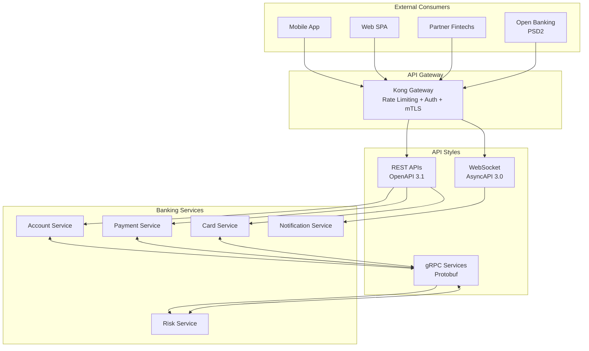
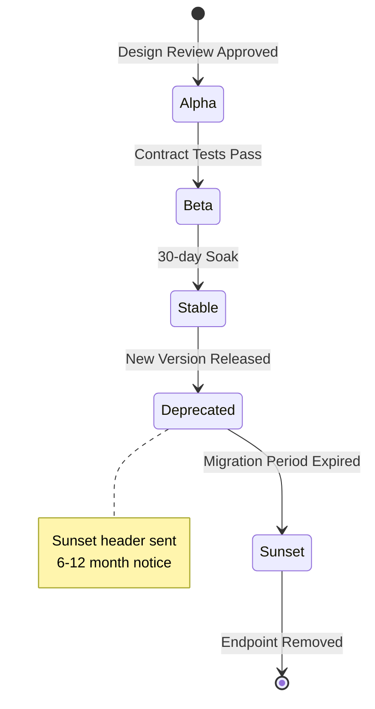
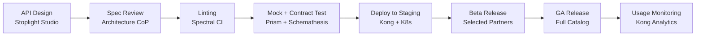

# A-01: API Architecture — Acme Corp Banking Modernization

**Cliente:** Acme Corp | **Fecha:** 12 de marzo de 2026 | **Variante:** Técnica

## Resumen Ejecutivo

Acme Corp requiere exponer servicios bancarios modernizados a través de APIs para consumidores internos (front-end web/mobile, backoffice), partners (fintech integrations), y terceros (Open Banking PSD2). Este documento define la estrategia de APIs: selección de estilos, diseño contract-first, versionamiento, seguridad, developer experience, y governance del portfolio.

### Decisiones Clave

| Decisión | Selección | Rationale |
|----------|-----------|-----------|
| Estilo principal | REST (OpenAPI 3.1) | Public-facing, cacheable, amplio tooling |
| Estilo interno | gRPC (Protobuf) | Alta performance entre microservicios, streaming bidireccional |
| Real-time | AsyncAPI 3.0 (WebSocket) | Notificaciones de transacciones, alertas de fraude |
| Versionamiento | URI path (`/v1/`) | Explícito para partners y Open Banking regulados |
| Gateway | Kong Gateway (Enterprise) | Plugin ecosystem, rate limiting avanzado, mTLS |
| DX Portal | Backstage + Redoc | Developer portal unificado con catálogo de APIs |

---

## S1: API Strategy & Style Selection

### API Landscape



### Style Selection per Domain

| Dominio | Estilo | Consumers | Justificación |
|---------|--------|-----------|---------------|
| Accounts | REST | Mobile, Web, Partners, Open Banking | CRUD operations, HTTP caching de balances, regulatory compliance |
| Payments | REST + gRPC | Mobile, Web (REST); Risk Engine (gRPC) | REST para initiation, gRPC para fraud scoring en <50ms |
| Cards | REST | Mobile, Web, Partners | Standard CRUD, card issuance workflows |
| Notifications | AsyncAPI (WebSocket) | Mobile, Web | Real-time transaction alerts, fraud warnings |
| Risk Scoring | gRPC | Internal services only | High-throughput (15K req/s), binary payload, latencia <20ms |
| Regulatory Reporting | REST (batch) | Regulatory bodies | Scheduled report generation, file-based delivery |

### Richardson Maturity Assessment

| API | Actual | Target | Gap |
|-----|--------|--------|-----|
| Account API | Level 1 | Level 3 (HATEOAS) | Add HTTP verbs, HATEOAS for Open Banking discoverability |
| Payment API | Level 0 (RPC-over-HTTP) | Level 2 | Redesign from `/processPayment` to resource-based `/v1/payments` |
| Card API | Level 2 | Level 2 | Already compliant — add HATEOAS for card lifecycle transitions |
| Legacy Loan API | Level 0 (SOAP) | Level 2 | Full redesign required — currently SOAP/XML |

---

## S2: Contract-First Design

### OpenAPI Spec Fragment — Payment Initiation

```yaml
openapi: 3.1.0
info:
  title: Acme Banking - Payment API
  version: 1.0.0
  description: Payment initiation and status tracking
  contact:
    name: Payments Team
    email: payments-api@acmecorp.com

paths:
  /v1/payments:
    post:
      operationId: initiatePayment
      summary: Initiate a domestic or international payment
      requestBody:
        required: true
        content:
          application/json:
            schema:
              $ref: '#/components/schemas/PaymentInitiation'
      responses:
        '201':
          description: Payment accepted for processing
        '422':
          description: Validation error (RFC 9457)
```

### Contract Tooling Pipeline

| Fase | Herramienta | Acción |
|------|------------|--------|
| Authoring | Stoplight Studio | Visual spec editor, team collaboration |
| Linting | Spectral + custom ruleset | Enforce naming conventions, security schemes, pagination |
| Mock Server | Prism | Auto-generated from OpenAPI, parallel dev |
| Code Gen | openapi-generator | Server stubs (Spring Boot), SDKs (TypeScript, Kotlin) |
| Contract Testing | Schemathesis | Property-based testing against live API |
| Diff Detection | oasdiff | PR comment with breaking/non-breaking changes |

---

## S3: Versioning & Evolution

### Lifecycle Management



### Deprecation Policy

| Tipo de API | Notice Period | Sunset Header | Migration Guide |
|------------|--------------|---------------|-----------------|
| Open Banking | 12 meses | RFC 8594 | Mandatory |
| Partner | 12 meses | RFC 8594 | Mandatory |
| Internal REST | 6 meses | Header + Slack | Recommended |
| gRPC Internal | 3 meses | Proto annotation | README update |

---

## S4: Security & Access Control

### Authentication Architecture

| Consumer Type | Auth Method | Token Lifetime | Justificación |
|--------------|-------------|---------------|---------------|
| Mobile App | OAuth 2.0 AuthZ Code + PKCE | Access: 15m, Refresh: 30d | PKCE prevents code interception |
| Web SPA | OAuth 2.0 AuthZ Code + PKCE | Access: 15m, Refresh: 7d | Same security, shorter refresh |
| Partner Fintech | OAuth 2.0 Client Credentials + mTLS | Access: 1h | Service-to-service, cert pinning |
| Open Banking | OAuth 2.0 FAPI 2.0 | Access: 5m | Regulatory mandated (PAR + JARM) |
| Internal gRPC | mTLS (Istio-managed) | Cert-based | Zero-trust, auto-rotated |

### Rate Limiting Tiers

| Tier | Límite | Algoritmo | Consumer Type |
|------|--------|-----------|---------------|
| Open Banking | 500 req/min | Sliding window counter | Regulated third parties |
| Partner Standard | 1,000 req/min | Token bucket | Fintech partners (basic) |
| Partner Premium | 5,000 req/min | Token bucket | Fintech partners (enterprise) |
| Internal | 10,000 req/min | Fixed window | Internal services |

### Error Response Format (RFC 9457)

```json
{
  "type": "https://api.acmecorp.com/errors/insufficient-funds",
  "title": "Insufficient Funds",
  "status": 422,
  "detail": "Account ES12-3456-7890 has insufficient balance for EUR 5,000.00. Available: EUR 3,247.85.",
  "instance": "/v1/payments/txn-abc123"
}
```

---

## S5: Developer Experience

### Developer Portal Structure

| Sección | Contenido | Audiencia |
|---------|-----------|-----------|
| Getting Started | Auth setup, first API call in <5 min | All developers |
| API Reference | Interactive OpenAPI docs (Redoc) | All developers |
| Guides | Payment flows, webhook integration, error handling | Partners |
| Sandbox | Isolated test environment, sample data, test accounts | Partners, Internal |
| SDKs | TypeScript, Kotlin, Python, Java (auto-generated) | All developers |
| Changelog | Version history, breaking changes, migration guides | All developers |
| Status Page | Uptime, latency p99, incident history | All consumers |

### Sandbox Environment

| Feature | Detalle |
|---------|---------|
| Base URL | `https://sandbox.api.acmecorp.com/v1/` |
| Authentication | Test API keys, no production credentials |
| Test Data | 50 pre-populated accounts, 10K transactions, test cards |
| Rate Limits | 100 req/min (lower than production) |
| Data Reset | Daily at 00:00 UTC |

---

## S6: API Governance & Lifecycle

### API Health Score

| API | Design (25) | Docs (20) | Adoption (20) | Reliability (20) | Security (15) | Total |
|-----|-------------|-----------|---------------|-------------------|---------------|-------|
| Account API v1 | 20 | 18 | 20 | 19 | 15 | **92** |
| Payment API v1 | 22 | 16 | 18 | 17 | 15 | **88** |
| Card API v1 | 18 | 14 | 12 | 18 | 13 | **75** |
| Legacy Loan API | 5 | 4 | 8 | 15 | 8 | **40** |

### API Catalog Summary

| API | Version | Status | Consumers | Monthly Calls | Error Rate |
|-----|---------|--------|-----------|---------------|------------|
| Account API | v1.3 | Stable | 14 | 45M | 0.12% |
| Payment API | v1.1 | Stable | 9 | 28M | 0.34% |
| Card API | v1.0 | Beta | 4 | 3.2M | 0.89% |
| Notification WS | v1.0 | Stable | 3 | 12M events | 0.05% |
| Risk Scoring gRPC | v2.0 | Stable | 3 | 180M | 0.02% |
| Legacy Loan API | v0.9 | Deprecated | 2 | 800K | 2.1% |

### Governance Pipeline



---

## Conclusiones y Recomendaciones

1. **Redesign urgente del Payment API** de Level 0 (RPC-over-HTTP) a Level 2 RESTful — es el API con mayor volumen de consumidores y el mayor potencial de Open Banking.
2. **Implementar contract-first workflow** con Spectral linting en CI para todos los equipos — la deuda actual de specs inconsistentes genera 15+ horas/mes de debugging.
3. **Migrar Legacy Loan API** a REST v1 con facade pattern, manteniendo backward compatibility durante 12 meses para los 2 consumidores actuales.
4. **Desplegar sandbox environment** para partners — actualmente la integración se hace contra staging, generando datos de test en ambientes compartidos.
5. **Establecer API Health Score** como gate de calidad: APIs con score <60 entran en plan de remediación obligatorio.

---

**Autor:** Javier Montaño — MetodologIA Discovery Framework v6.0
