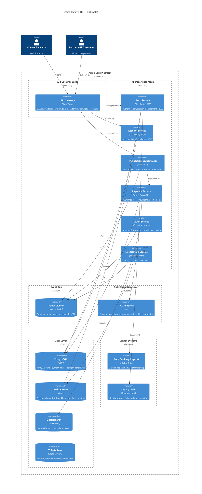

# Arquitectura TO-BE — Acme Corp Banking Platform

**Proyecto:** Acme Corp Legacy Modernization
**Escenario aprobado:** Moderado (Hybrid: 6 microservices + Legacy ACL)
**Fecha:** 12 de marzo de 2026

---

## 1. C4 Level 2 — Container Diagram



### Service Inventory

| # | Service | Tech Stack | Database | Key Patterns |
|---|---|---|---|---|
| 1 | Auth Service | Go | PostgreSQL + Redis | Circuit breaker, token caching, LDAP fallback |
| 2 | Account Service | Java (Spring) | PostgreSQL | CQRS read model, KYC workflow |
| 3 | Transaction Orchestrator | Go | Kafka (stateless) | Saga orchestration, idempotency keys |
| 4 | Payment Service | Java (Spring) | PostgreSQL | Outbox pattern, reconciliation |
| 5 | Audit Service | Go | Elasticsearch | Immutable append-only, compliance queries |
| 6 | Notification Service | Node.js | Redis | Template engine, delivery tracking, retry |

---

## 2. Trade-off Matrix

| Decision | TO-BE Choice | Alternative 1 | Alternative 2 | Trade-off |
|---|---|---|---|---|
| Service Communication | Event-Driven + gRPC | Pure REST | Pure Event-Driven | +Resilience, +Complexity |
| Consistency Model | Saga (Orchestration) | 2PC | Choreography | +Control, -Performance vs 2PC |
| Security | Zero Trust (mTLS + OAuth2) | Perimeter-only | API Keys | +Security, +Ops overhead |
| Legacy Integration | ACL + Sidecar + Strangler Fig | Big Bang rewrite | Freeze legacy | +Safety, +Duration |
| Data Storage | Event Sourcing (Audit) + CRUD (Core) | Full Event Sourcing | Pure CRUD | Balanced complexity vs audit trail |
| Deployment | Kubernetes + ArgoCD | VM + Ansible | ECS Fargate | +Control, +Ops learning curve |

---

## 3. Architecture Decision Records

### ADR-001: Saga Pattern (Orchestration) for Distributed Transactions

**Status:** Accepted
**Date:** 2026-03-12

**Context:** Acme Corp processes 50K+ daily transactions across Account, Payment, and legacy Core Banking. Distributed transactions must guarantee eventual consistency with compensation on failure.

**Decision:** Saga pattern with orchestration (Transaction Orchestrator service coordinates steps).

**Alternatives Considered:**

| Option | Pros | Cons | Verdict |
|---|---|---|---|
| 2PC (Two-Phase Commit) | Strong consistency | Blocking, single point of failure, poor at scale | Rejected — latency unacceptable at 50K/day |
| Choreography (event-driven) | Loose coupling, no orchestrator | Hard to debug, implicit flow, compensation complex | Rejected — team lacks event-driven experience |
| Orchestration (chosen) | Explicit flow, centralized monitoring, clear compensation | Orchestrator is coupling point | Accepted — debuggability outweighs coupling |

**Consequences:**
- (+) Clear transaction flow visible in orchestrator logs
- (+) Compensation logic centralized and testable
- (-) Orchestrator becomes critical path — requires HA (3+ replicas)
- (-) Adds ~15ms latency per saga step

**Assumptions:** Team can maintain orchestrator; Kafka available for reliable messaging.

---

### ADR-002: Zero Trust Security Model (mTLS + OAuth2)

**Status:** Accepted
**Date:** 2026-03-12

**Context:** Banking regulations require encryption in transit, audit of all access, and zero implicit trust between services.

**Decision:** Zero Trust architecture — every service-to-service call uses mTLS; every user-facing call validated via OAuth2 at gateway AND service boundary.

**Alternatives Considered:**

| Option | Pros | Cons | Verdict |
|---|---|---|---|
| Network perimeter only | Simple, low ops cost | Lateral movement risk, fails audit | Rejected — regulatory non-compliant |
| API Keys per service | Easy to implement | No rotation automation, no identity | Rejected — insufficient for banking |
| Zero Trust (chosen) | Defense in depth, audit-ready | Certificate management complexity | Accepted — compliance requirement |

**Consequences:**
- (+) Passes regulatory audit for encryption and access control
- (+) Lateral movement impossible without valid certificate
- (-) Certificate rotation adds operational complexity (automate via cert-manager)
- (-) Debugging mTLS failures requires tooling (mTLS debug sidecar)

**Assumptions:** Cert-manager deployed on K8s; SPIFFE/SPIRE for service identity.

---

### ADR-003: Event Sourcing for Audit Trail

**Status:** Accepted
**Date:** 2026-03-12

**Context:** Regulatory compliance requires immutable, queryable audit trail of all financial events. Traditional logging is insufficient — auditors need point-in-time reconstruction.

**Decision:** Event Sourcing for the Audit Service domain. Core services (Auth, Account, Payment) use standard CRUD with outbox pattern publishing events to Kafka. Audit Service consumes all events into an append-only Elasticsearch index.

**Alternatives Considered:**

| Option | Pros | Cons | Verdict |
|---|---|---|---|
| Full Event Sourcing (all services) | Complete history everywhere | Massive complexity, team unready | Rejected — overkill for Moderate scenario |
| Traditional CRUD + application logs | Simple | Logs are mutable, gaps in coverage | Rejected — fails audit requirements |
| Hybrid (chosen) | Audit-grade trail without full ES complexity | Two consistency models to manage | Accepted — pragmatic balance |

**Consequences:**
- (+) Immutable audit trail satisfies regulators
- (+) Point-in-time reconstruction via event replay
- (-) Eventual consistency between CRUD services and audit index (~2s lag)
- (-) Elasticsearch cluster sizing requires capacity planning

**Assumptions:** Kafka retention >= 30 days; Elasticsearch index lifecycle policy manages storage.

---

## 4. Nightmare Scenarios

### Nightmare 1: Ghost Transaction

**Problem:** Payment commits in Payment Service but Saga compensation fails in Account Service. Customer is charged but account balance unchanged.

**Trigger Conditions:**
- Network partition between Transaction Orchestrator and Account Service
- Kafka consumer lag > 30 seconds during peak load
- Account Service OOM crash mid-compensation

**Mitigations (Defense in Depth):**
1. **Idempotency keys** on every saga step — replay safe
2. **Outbox pattern** — payment event written to DB in same transaction as payment record
3. **Dead Letter Queue** — failed compensations routed to DLQ with alert
4. **Reconciliation service** — nightly batch compares Payment vs Account balances
5. **Immutable audit log** — every step recorded; forensic reconstruction possible
6. **Manual resolution runbook** — ops team can replay/compensate via admin API

**Monitoring:**
- Alert: Saga step pending > 60 seconds
- Alert: DLQ depth > 0
- Alert: Reconciliation delta > $0.01
- Dashboard: Saga completion rate (target: 99.9%)

**Acceptance Criteria:** Zero ghost transactions in production. DLQ items resolved within 4 hours.

---

### Nightmare 2: Auth Service Outage

**Problem:** Auth Service crashes or becomes unreachable. All API requests rejected at gateway — complete platform outage.

**Trigger Conditions:**
- PostgreSQL connection pool exhaustion
- Certificate expiry (mTLS failure)
- Memory leak under sustained load

**Mitigations (Defense in Depth):**
1. **Token caching (Redis)** — valid tokens served from cache during outage (grace period: 5 minutes)
2. **Multi-replica deployment** — minimum 3 replicas across availability zones
3. **Circuit breaker** — gateway falls back to cached token validation after 3 failures
4. **LDAP fallback** — legacy identity provider as emergency auth source
5. **Health check + auto-restart** — K8s liveness probe restarts unhealthy pods within 30 seconds
6. **Emergency bypass mode** — pre-shared emergency tokens for ops team (audit-logged, time-limited)

**Monitoring:**
- Alert: Auth Service error rate > 1% (5-minute window)
- Alert: Auth latency P99 > 200ms
- Alert: Redis cache hit ratio < 80%
- Alert: Certificate expiry < 7 days

**Acceptance Criteria:** Platform remains operational for 5 minutes during complete Auth Service failure via cached tokens.

---

### Nightmare 3: Cascade Failure

**Problem:** Payment Service crashes under load. Transaction Orchestrator retries flood Kafka. Account Service consumer falls behind. Notification Service overwhelmed. Full platform degradation.

**Trigger Conditions:**
- Payment Service memory leak + no memory limits
- Retry storm (exponential backoff not configured)
- No bulkhead isolation between service thread pools

**Mitigations (Defense in Depth):**
1. **Circuit breaker (Hystrix/Resilience4j)** — open circuit after 5 consecutive failures, half-open retry after 30 seconds
2. **Bulkhead pattern** — dedicated thread pools per downstream dependency
3. **Rate limiting + backpressure** — Kafka consumer pauses when lag > threshold
4. **Service mesh retry policy** — max 3 retries with exponential backoff (1s, 2s, 4s)
5. **Resource limits** — K8s memory/CPU limits prevent OOM cascade
6. **Load shedding** — gateway rejects lowest-priority requests when error rate > 5%

**Monitoring:**
- Alert: Circuit breaker open on any service
- Alert: Kafka consumer lag > 10,000 messages
- Alert: Service CPU > 80% sustained 5 minutes
- Alert: Gateway 5xx rate > 2%
- Dashboard: Per-service error rate, latency percentiles, circuit breaker state

**Acceptance Criteria:** Single service failure does not degrade other services. Recovery within 5 minutes of root cause resolution.

---

## 5. MVP Component — Auth Service

### Architecture

```
Client (Web/Mobile)
    |
    | HTTPS
    v
API Gateway (Kong)
    |
    | gRPC + mTLS
    v
Auth Service (Go)
    |--- PostgreSQL (users, roles, session_events)
    |--- Redis (session cache, rate limit)
    |--- Legacy LDAP (fallback identity provider)
    |--- Kafka (auth events -> Audit Service)
```

### API Contracts (OpenAPI Summary)

| Endpoint | Method | Description | SLA |
|---|---|---|---|
| `/auth/login` | POST | Authenticate user, issue JWT + refresh token | <100ms P99 |
| `/auth/refresh` | POST | Refresh expired access token | <50ms P99 |
| `/auth/logout` | POST | Invalidate session, revoke tokens | <50ms P99 |
| `/auth/verify` | GET | Validate token, return claims | <20ms P99 |

### Data Model (PostgreSQL)

```sql
CREATE TABLE users (
    id UUID PRIMARY KEY DEFAULT gen_random_uuid(),
    email VARCHAR(255) UNIQUE NOT NULL,
    password_hash VARCHAR(255) NOT NULL,
    status VARCHAR(20) DEFAULT 'active',
    created_at TIMESTAMPTZ DEFAULT now(),
    updated_at TIMESTAMPTZ DEFAULT now()
);

CREATE TABLE user_roles (
    user_id UUID REFERENCES users(id),
    role VARCHAR(50) NOT NULL,
    granted_at TIMESTAMPTZ DEFAULT now(),
    PRIMARY KEY (user_id, role)
);

CREATE TABLE session_events (
    id UUID PRIMARY KEY DEFAULT gen_random_uuid(),
    user_id UUID REFERENCES users(id),
    event_type VARCHAR(30) NOT NULL, -- login, refresh, logout, failed_attempt
    ip_address INET,
    user_agent TEXT,
    created_at TIMESTAMPTZ DEFAULT now()
);
```

### Resilience Patterns

| Pattern | Implementation | Trigger |
|---|---|---|
| Idempotency | Request ID header; deduplicate in Redis (TTL 5min) | Duplicate login requests |
| Circuit Breaker | LDAP fallback circuit; open after 3 failures | LDAP unreachable |
| Saga | Login event + session_event in same DB transaction | Audit consistency |
| Caching | Redis TTL 5min for active sessions | Reduce DB load |
| Rate Limiting | 10 login attempts per IP per minute | Brute force prevention |

---

## 6. Phased Migration — Strangler Fig

### Phase 1: Assessment & Wrapping (Months 1-2)

- Document legacy Core Banking integrations, data flows, implicit business rules
- Build ACL adapters for Core Banking (COBOL/AS400 protocol translation)
- Deploy sidecar pattern for legacy LDAP wrapping
- Establish observability baseline (Prometheus + Grafana + Jaeger)
- **Exit criteria:** All legacy touchpoints catalogued; ACL passing integration tests

### Phase 2: MVP Deployment (Months 3-5)

- Deploy Auth Service with canary (10% traffic)
- Maintain legacy LDAP as fallback; parallel processing with result comparison
- Shadow mode for 2 weeks: process all auth requests via both paths, compare results
- Promote to 100% after zero-delta shadow mode validation
- **Exit criteria:** Auth Service handling 100% of auth; LDAP in read-only fallback

### Phase 3: Core Service Migration (Months 6-10)

- Deploy Account Service, Payment Service, Transaction Orchestrator
- Implement Saga pattern for distributed transactions
- Deploy Kafka for event streaming; migrate from batch to real-time
- Reconciliation service validates consistency nightly
- **Exit criteria:** All 6 services operational; saga completion rate > 99.9%

### Phase 4: Legacy Sunset (Months 11-14)

- Core Banking set to read-only mode
- Archive historical data to S3 Data Lake
- Maintain ACL in compliance/audit-query mode only
- Decommission legacy infrastructure after 90-day observation period
- **Exit criteria:** Legacy decommissioned; all data accessible via modern services

### Migration Risk Matrix

| Phase | Risk | Probability | Impact | Mitigation |
|---|---|---|---|---|
| 1 | Incorrect legacy understanding | Medium | High | Technical archaeology + stakeholder interviews |
| 2 | Canary impacts production | Low | High | Shadow mode: compare but don't apply |
| 3 | Data inconsistency during migration | Medium | Critical | Reconciliation service + nightly batch validation |
| 4 | Legacy data inaccessibility | Low | Medium | Data lake backup + read-only ACL retained |

---

**Autor:** Javier Montano | **Proyecto:** Acme Corp Banking Platform | **Fecha:** 12 de marzo de 2026
