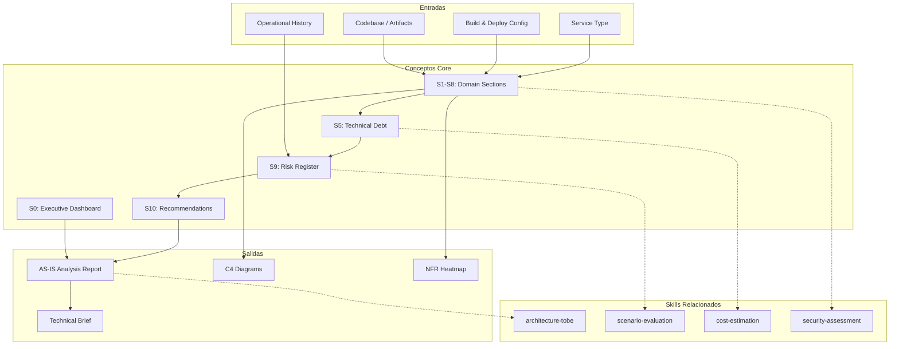

# AS-IS Analysis — Universal Current-State Assessment

Generates a 10-section current-state assessment for ANY MetodologIA service type (SDA, QA, Management, RPA, Data-AI, Cloud, SAS, UX-Design). For software codebases (SDA), produces: executive dashboard, technology inventory, code structure, C4 architecture, code quality metrics, technical debt inventory, NFR heatmap, security posture, operational model, and risk register with prioritized recommendations. For other service types, sections S1-S8 adapt to domain-specific dimensions while S0 (Executive Dashboard), S9 (Risk Register), and S10 (Recommendations) remain universal.

## Grounding Guideline

> *You cannot chart a path to the future without understanding with brutal honesty where you stand today.*

1. **Evidence-based diagnosis, not opinion.** Every finding must be backed by metrics extracted from code, configuration, or operational history. Intuition guides exploration; evidence supports the conclusion.
2. **The present contains the seeds of the future.** Inherited architectural decisions are not mistakes — they are context. Understanding *why* they were made reveals constraints that any transformation must respect or explicitly break.
3. **Technical debt is knowledge debt.** Every undocumented shortcut, every inconsistent pattern, every missing test represents knowledge the team chose not to capture. The AS-IS analysis restores that knowledge before it is lost.

## Inputs

- `$1` — Path to codebase root (default: current working directory)
- `$2` — Analysis depth: `full` (default), `executive` (sections 0,5,9,10 only)

Parse from `$ARGUMENTS`.

**Parameters:**
- `{MODO}`: `piloto-auto` (default) | `desatendido` | `supervisado` | `paso-a-paso`
  - **piloto-auto**: Auto para extracción de métricas y análisis de código, HITL para hallazgos de seguridad y decisiones de escalamiento.
  - **desatendido**: Zero interruptions. Análisis completo automatizado. Assumptions documented.
  - **supervisado**: Autónomo con reportes al completar cada sección del framework.
  - **paso-a-paso**: Confirms before cada sección del análisis.
- `{FORMATO}`: `markdown` (default) | `html` | `dual`
- `{VARIANTE}`: `ejecutiva` (~40% — sections S0, S5, S9, S10 only) | `técnica` (full, default)
- `{TIPO_SERVICIO}`: `SDA` (default) | `QA` | `Management` | `RPA` | `Data-AI` | `Cloud` | `SAS` | `UX-Design`
  - When omitted or when a codebase path is provided, defaults to SDA (backward compatible)
  - Determines which variant of sections S1-S8 to generate

## Service Type Detection

Before starting analysis, detect the service type from context:

1. If `{TIPO_SERVICIO}` explicitly provided → use it
2. If codebase path provided → default to SDA
3. If conversation mentions QA/testing/ISTQB → QA
4. If conversation mentions PMO/methodology/delivery → Management
5. If conversation mentions automation/bots/RPA/UiPath → RPA
6. If conversation mentions data/AI/ML/analytics/dashboards → Data-AI
7. If conversation mentions cloud/migration/DevOps/SRE → Cloud
8. If conversation mentions staffing/talent/augmentation → SAS
9. If conversation mentions design/UX/UI/usability → UX-Design

Confirm: "Tipo de servicio detectado: {X}. ¿Confirma o desea ajustar?"

## Dynamic Context Injection

### SDA Context Injection (when {TIPO_SERVICIO}=SDA)

Auto-detect codebase characteristics before starting analysis:

```bash
# Language detection
find . -name "*.ts" -o -name "*.py" -o -name "*.java" -o -name "*.go" -o -name "*.rs" | head -30

# Build system detection
ls -la package.json pom.xml build.gradle Cargo.toml go.mod setup.py pyproject.toml Makefile 2>/dev/null

# Infrastructure detection
find . -name "Dockerfile" -o -name "*.yaml" -path "*/k8s/*" -o -name "docker-compose*" | head -10

# API surface detection
find . -name "*.yaml" -path "*/swagger/*" -o -name "openapi*" -o -name "*.proto" | head -10
```

Use detected languages, build tools, and infrastructure to scope each section.

## Input Requirements

**Mandatory (varies by service type):**

| Service Type | Mandatory Inputs |
|---|---|
| SDA | Complete codebase with commit history, build configuration, deployment configuration |
| QA | Test suite documentation, QA processes, tool landscape inventory, defect metrics |
| Management | PMO artifacts, methodology documentation, team assessments, delivery metrics |
| RPA | Process documentation (BPMN), bot inventory, automation logs, process metrics |
| Data-AI | Data catalog, pipeline documentation, model registry, data quality reports |
| Cloud | Infrastructure inventory, cloud accounts, monitoring dashboards, cost reports |
| SAS | Team composition, skills matrix, project history, utilization reports |
| UX-Design | Design system, research repository, usability reports, accessibility audits |

**Recommended (all types):**
- Previous assessments or modernization reports
- Stakeholder interviews or survey results
- Operational metrics (last 12-24 months)
- Industry benchmarks for comparison

## Assumptions & Limits

**Assumptions:**
- Codebase is buildable (dependencies resolvable)
- System has operational history (incident/performance data available)
- Documentation in English or Spanish
- No production secrets embedded in source

**Cannot do:**
- Runtime profiling under production load (requires live monitoring)
- Live load testing or performance tuning
- Team interviews or org structure analysis (requires human interaction)
- Legal compliance review (requires legal expertise)

## Workarounds When Inputs Missing

| Missing Input | Impact | Workaround |
|---|---|---|
| No deployment config | Cannot assess infrastructure | Infer from Dockerfiles, K8s manifests, CI/CD scripts; flag as assumption |
| No API specs | Cannot fully document integrations | Reverse-engineer from code (HTTP clients, REST annotations, gRPC stubs) |
| No security audit | Cannot benchmark against standards | Lightweight SAST scan (SQL injection, hardcoded secrets, weak crypto patterns) |
| No performance data | Cannot assess NFR baseline | Code-level heuristics (complexity suggests bottlenecks) + recommend profiling |
| <1 year history | Cannot assess trends | Current snapshot only; flag as point-in-time analysis |
| Monorepo unclear | Cannot map boundaries | Infer from package naming, deployment units, team ownership patterns |

## Edge Cases

- **Monorepo:** Decompose per deployment unit. Analyze coupling between units.
- **No CI/CD:** Infer from Dockerfiles, cloud configs, README scripts. Flag inference risk.
- **No test suite:** Flag coverage as CRITICAL (0%). Extrapolate quality risk via complexity. Recommend test buildout.
- **Multiple languages:** Metrics per language separately. +1 risk per language for integration burden.
- **Microservices vs Monolith:** Check for multiple deployable units. Analyze per-service if microservices.
- **Legacy no docs:** Reverse-engineer from code structure + configuration. Flag confidence level.
- **System >500K LOC:** Phased analysis (Tier 1: core domains, Tier 2: supporting). Deliver executive summary + prioritized deep-dives.
- **Vendor lock-in detected:** Flag proprietary dependencies with migration cost estimates and open-source alternatives.
- **Outdated framework (EOL):** Escalate to CRITICAL risk. Document security exposure and upgrade path complexity.

## Trade-off Matrix

| Decision | Enables | Constrains | When to Use |
|---|---|---|---|
| **Full 10-section analysis** | Maximum depth, complete audit trail | 5-7 days, high token cost | High-stakes modernization, regulated environments |
| **Executive variant** (S0+S5+S9+S10) | Fast insights, decision-ready | Misses detailed architecture/quality data | Time-constrained, executive audience |
| **Security-focused** (S7 deep) | Compliance-ready, vulnerability inventory | Narrower scope | Pre-audit, compliance-driven engagements |
| **Quality-focused** (S4+S5 deep) | Actionable tech debt remediation plan | Less architecture context | Tech debt reduction initiatives |

## 10-Section Framework

### S0: Executive Dashboard
System snapshot: LOC, modules, integrations, team size, years in production, tech stack summary, development status, maintenance cost estimate. Health score (1-10) with color-coded indicators.

### S1: Technology Inventory
Per layer: Backend, Frontend, Data, Infrastructure, Development. Dependency tree table with EOL status. Flag deprecated dependencies. Version currency score per component.

### S2: Code Organization
Module decomposition, coupling analysis (afferent/efferent), layering assessment, cyclomatic complexity distribution, anti-patterns (god classes, circular dependencies, duplication). Package cohesion metrics.

### S3: Architecture (C4 Model)
Level 1 (Context): system as black box with external actors. Level 2 (Containers): major services, databases, data flows. Pattern catalog with quality assessment. Architecture fitness functions where applicable.

### S4: Code Quality Metrics
Complexity distribution (p50, p95), duplication %, test coverage by layer, dependency depth, code smells by type. Dashboard with severity-coded cards. Trend analysis if git history available.

### S5: Technical Debt Inventory
Per item: description, category (7 types: design, code, test, build, documentation, infrastructure, dependency), severity, technical impact, business impact, remediation pathway, prioritization score (impact x cost-to-fix).

**Conditional logic:**
- IF debt >30% of codebase OR average CC >15: flag CRITICAL, recommend refactoring before features
- IF test coverage <20%: CRITICAL quality risk
- IF dependency depth >5: recommend modularization
- IF >10 circular dependencies: architectural refactor required

### S6: NFR Heatmap
7x5 matrix: performance, security, maintainability, scalability, reliability, usability, interoperability. Scored 1-10 with evidence. Gap analysis against targets. Priority ranking by business impact.

### S7: Security Assessment
Authentication, authorization, encryption, data protection, known CVEs (SBOM analysis), compliance gaps. Severity-rated findings with remediation recommendations. OWASP Top 10 mapping where applicable.

### S8: Operational Model
Deployment model, monitoring/observability, incident response (MTTR), release management, capacity management. Operational readiness scorecard. DevOps maturity assessment (DORA metrics if available).

### S9: Risk Register
Top-10 risks: probability x impact matrix. Per risk: category, score, current mitigations, recommended improvements, owner, status. Risk velocity indicator (growing/stable/shrinking).

### S10: Recommendations
Top 5-10 findings with root cause + business impact. Quick wins (under 5 eng-days). Strategic roadmap (immediate/short/medium/long-term). Refactor vs rewrite vs replace decision tree per major component.

## Service-Type Variant Sections (S1-S8)

When `{TIPO_SERVICIO}` ≠ SDA, sections S0, S9, and S10 remain universal. Sections S1-S8 adapt to the service type:

### QA Variant (`{TIPO_SERVICIO}=QA`)
- **S1: QA Tool Landscape** — Testing tools inventory (automation frameworks, CI/CD integration, test management), license status, adoption maturity
- **S2: Test Coverage Assessment** — Coverage by type (unit, integration, E2E, performance, security), by layer, by risk level. Gap analysis
- **S3: Testing Maturity Model (TMMi)** — Assessment against TMMi levels 1-5. Current level with evidence. Improvement roadmap
- **S4: Process Quality** — Defect detection rate, escape rate, test execution efficiency, automation ratio. Trend analysis
- **S5: Quality Debt Inventory** — Untested critical paths, flaky tests, outdated test data, manual-only processes. Severity scoring
- **S6: QA NFR Heatmap** — Performance testing capability, security testing, accessibility testing, reliability testing. Scored 1-10
- **S7: Compliance & Standards** — ISTQB alignment, industry regulatory testing requirements, audit readiness
- **S8: QA Operations Model** — Team structure, shift-left maturity, CI/CD quality gates, release qualification process

### Management Variant (`{TIPO_SERVICIO}=Management`)
- **S1: PMO Maturity Assessment** — PMO maturity level (ad-hoc, defined, managed, optimized). Evidence-based assessment
- **S2: Methodology Fitness** — Current methodology (Agile, SAFe, Waterfall, Hybrid) fit to organizational context. Disciplined Agile assessment
- **S3: Governance Model** — Decision rights, escalation paths, ceremony effectiveness, reporting cadence. Governance health score
- **S4: Team Capability** — Certifications inventory (PMP, CSM, SAFe, etc.), experience distribution, skill gaps. Capability maturity
- **S5: Process Debt** — Manual processes that should be automated, ceremonias inefectivas, documentation gaps, governance overhead
- **S6: Management NFR Heatmap** — Predictability, transparency, stakeholder satisfaction, velocity stability, quality. Scored 1-10
- **S7: Change Readiness** — Organizational change capacity, resistance patterns, adoption barriers, training needs
- **S8: Delivery Operations** — Delivery cadence, deployment frequency, lead time, WIP management. DORA-lite for management

### RPA Variant (`{TIPO_SERVICIO}=RPA`)
- **S1: Process Landscape** — BPMN process inventory, volume, frequency, complexity classification, manual effort per process
- **S2: Automation Readiness** — Rule-based score per process (structured data, stable rules, high volume, repetitive). Automation candidate ranking
- **S3: Bot Inventory & Health** — Existing bots, platform (UiPath/AA/Power Automate/Blue Prism), success rate, exception rate, maintenance status
- **S4: Process Quality** — Error rates, rework rates, processing time, compliance violations per process
- **S5: Automation Debt** — Bots with high exception rates, unmaintained automations, undocumented processes, technical debt in bot code
- **S6: RPA NFR Heatmap** — Scalability (concurrent bots), reliability (uptime), security (credential management), auditability. Scored 1-10
- **S7: Security & Compliance** — Bot credential management, audit trails, data handling, regulatory compliance (SOX, GDPR)
- **S8: Bot Operations** — Orchestration model (attended/unattended), monitoring, incident response, change management for bots

### Data-AI Variant (`{TIPO_SERVICIO}=Data-AI`)
- **S1: Data Maturity (DCAM/DMM)** — Data management maturity assessment. Current level with evidence across 6 dimensions
- **S2: Data Architecture** — Data platform inventory, lakehouse/warehouse, ETL/ELT pipelines, streaming. Architecture patterns
- **S3: AI Readiness (AI SCALE)** — Assessment using MetodologIA AI SCALE methodology. Current stage (Selection/Co-creation/Adoption/Launch/Expansion)
- **S4: Data Quality Baseline** — Completeness, accuracy, consistency, timeliness, validity. Quality scores per critical dataset
- **S5: Data/AI Debt** — Undocumented pipelines, untested models, stale datasets, missing lineage, shadow IT data sources
- **S6: Data NFR Heatmap** — Latency, freshness, availability, security, governance, interoperability. Scored 1-10
- **S7: Data Privacy & Governance** — GDPR/CCPA compliance, data classification, access controls, retention policies, consent management
- **S8: DataOps/MLOps Model** — Pipeline orchestration, model deployment, A/B testing, monitoring, feature store maturity

### Cloud Variant (`{TIPO_SERVICIO}=Cloud`)
- **S1: Cloud Readiness** — Current infrastructure inventory, cloud adoption stage, migration assessment (7R per workload)
- **S2: Migration Assessment** — Workload classification, dependency mapping, migration complexity scoring, risk analysis
- **S3: DevOps Maturity (DORA)** — Deployment frequency, lead time, change failure rate, MTTR. DORA level assessment
- **S4: Infrastructure Quality** — IaC coverage, configuration drift, resource tagging, cost optimization. Quality score
- **S5: Cloud Debt** — Over-provisioned resources, untagged assets, legacy configurations, manual processes, security gaps
- **S6: Cloud NFR Heatmap** — Scalability, availability, disaster recovery, security, compliance, cost efficiency. Scored 1-10
- **S7: Cloud Security** — Shared responsibility model adherence, IAM hygiene, encryption, network segmentation, compliance
- **S8: FinOps & Operations** — Cost visibility, optimization opportunities, reserved/spot usage, showback/chargeback, operational runbooks

### SAS Variant (`{TIPO_SERVICIO}=SAS`)
- **S1: Talent Gap Analysis** — Current team capabilities vs required capabilities. Gap identification per role/skill
- **S2: Skills Inventory** — Technical and soft skills matrix. Certification status. Proficiency levels
- **S3: Team Topology** — Team structure, communication patterns, collaboration effectiveness. Conway's Law alignment
- **S4: Capability Maturity** — Team velocity, quality output, self-organization level, continuous improvement practices
- **S5: Knowledge Debt** — Single points of failure (key-person dependency), undocumented tribal knowledge, skill concentration risks
- **S6: SAS NFR Heatmap** — Retention, productivity, satisfaction, growth, adaptability, cultural fit. Scored 1-10
- **S7: Compliance** — Labor regulations, contractor vs employee classification, IP protection, NDA coverage
- **S8: Staffing Operations** — Recruiting pipeline, onboarding effectiveness, utilization rates, bench management

### UX-Design Variant (`{TIPO_SERVICIO}=UX-Design`)
- **S1: Design Maturity** — Design maturity level (ad-hoc, repeatable, managed, optimized, innovative). Evidence-based
- **S2: Design System Inventory** — Components, tokens, documentation coverage, adoption rate, governance model
- **S3: UX Research Capability** — Research methods used, frequency, integration with product decisions, research repository
- **S4: Usability Baseline** — Heuristic evaluation results, usability test scores, task success rates, error rates
- **S5: Design Debt** — Inconsistent patterns, accessibility violations, undocumented design decisions, outdated components
- **S6: UX NFR Heatmap** — Accessibility (WCAG), performance perception, consistency, learnability, satisfaction. Scored 1-10
- **S7: Accessibility Compliance** — WCAG 2.1/2.2 level assessment (A/AA/AAA), assistive technology compatibility, legal requirements
- **S8: Design Operations** — Design review process, handoff quality, tools ecosystem, design-dev collaboration maturity

## Cross-Section Traceability

Every recommendation in S10 must reference evidence from S0-S9:
- S2 Code Structure to S5 Debt (coupling = architectural debt)
- S4 Quality to S5 Debt (low coverage = quality debt)
- S5 Debt to S9 Risks (high debt with uncertain remediation = risk)
- S6 NFR Gaps to S5 Debt (NFR miss = technical work required)
- S7 Security to S9 Risks (CVEs = security risk)
- S8 Ops Gaps to S9 Risks (manual deployment = operational risk)
- S9 Risks to S10 Roadmap (top risks = immediate roadmap items)

## Escalation to Human Architect

- Codebase doesn't match business description
- Multiple competing architectural patterns (MVC + microservices mixed)
- Undocumented integration logic requiring team interviews
- Code contradicts comments (conflicting evidence)
- Regulatory compliance ambiguity (PCI, HIPAA, GDPR)
- Rare/uncommon tech stack beyond standard tooling

## Execution Workflow

1. **Input Validation (30 min):** Verify completeness, collect manifests, flag gaps
2. **Automated Extraction (2-4 hours):** Parse metrics (LOC, complexity, duplication), generate dependency tree, scan vulnerabilities
3. **Architectural Analysis (4-6 hours):** Map C4 L1/L2, identify patterns, assess coupling
4. **Synthesis (4-6 hours):** Consolidate into 10 sections, prioritize by business impact, cross-reference validation

**Typical engagement:** 5-7 days for systems under 500K LOC.

## Output Artifact

**Primary:** `03_Analisis_AS-IS_{TIPO_SERVICIO}_{project}.md` (o `.html` si `{FORMATO}=html|dual`) — Full 10-section current-state assessment with domain-specific analysis, debt inventory, risk register, and prioritized recommendations. When `{TIPO_SERVICIO}=SDA`, for backward compatibility also accept `03_Analisis_AS-IS_{project}.md`.

**Secondary:** `02_Brief_Tecnico_{project}.md` — Executive summary (S0 + key findings).

**Diagramas incluidos:**
- C4 Context diagram: system boundaries and external actors
- C4 Container diagram: internal components and relationships
- Mindmap: technology stack overview
- Quadrant chart: NFR heatmap positioning

## Validation Gate

- [ ] Service type correctly identified and confirmed with stakeholder
- [ ] Variant sections (S1-S8) match the declared service type
- [ ] All 10 sections populated with evidence-based content (no template placeholders)
- [ ] C4 L1 and L2 diagrams reflect actual system topology
- [ ] Every S10 recommendation linked to evidence source (S0-S9)
- [ ] Tech debt and risks scored quantitatively
- [ ] Security includes concrete vulnerability findings
- [ ] Technology inventory flags EOL versions with upgrade paths
- [ ] NFR scores cite metrics or estimation approach
- [ ] Recommendations sized in effort and sequenced by business criticality
- [ ] Cross-section traceability complete and verifiable

## Output Format Protocol

| Format | Default | Description |
|--------|---------|-------------|
| `markdown` | ✅ | Rich Markdown + Mermaid diagrams. Token-efficient. |
| `html` | On demand | Branded HTML (Design System). Visual impact. |
| `dual` | On demand | Both formats. |

Default output is Markdown with embedded Mermaid diagrams. HTML generation requires explicit `{FORMATO}=html` parameter.

### Diagrams (Mermaid)
- C4 Context diagram: system boundaries and external actors
- C4 Container diagram: internal components and their relationships
- Mindmap: technology stack overview

## Edge Cases

| Case | Handling Strategy |
|---|---|
| Monorepo with multiple deployment units | Decompose per deployment unit. Analyze coupling between units. Metrics per service separately. |
| No CI/CD configured | Infer from Dockerfiles, cloud configs, README scripts. Flag inference risk explicitly. |
| No existing test suite | Flag coverage as CRITICAL (0%). Extrapolate quality risk via complexity. Recommend priority test buildout. |
| Multiple languages in codebase | Metrics per language separately. +1 risk per additional language for integration burden. |
| System >500K LOC | Phased analysis: Tier 1 core domains, Tier 2 supporting. Executive summary + prioritized deep-dives. |
| EOL framework detected | Escalate to CRITICAL risk. Document security exposure and upgrade path complexity. |
| Vendor lock-in with proprietary dependencies | Flag proprietary dependencies with migration cost estimates and open-source alternatives. |

## Decisions and Trade-offs

| Decision | Discarded Alternative | Justification |
|---|---|---|
| 10 sections as universal framework | 5-section framework, free-form assessment | 10 sections cover the full spectrum (exec, tech, arch, quality, debt, NFR, security, ops, risk, recommendations). Sections S0, S9, S10 are universal cross-service-type. |
| Service-type variants for S1-S8 | Single framework for all service types | SDA, QA, Management, RPA, Data-AI, Cloud, SAS, UX-Design have fundamentally different evaluation dimensions. Adapting S1-S8 maximizes relevance. |
| Evidence-based diagnosis with tags | Opinion-based assessment | Tags [CODIGO], [CONFIG], [DOC], [INFERENCIA], [SUPUESTO] guarantee traceability. Every finding has verifiable backing. |
| Cross-section traceability (S10 to S0-S9) | Recommendations disconnected from findings | Every S10 recommendation references evidence from previous sections. Eliminates unfounded recommendations. |

## Knowledge Graph



## Output Templates

**Formato Markdown (default):**

```
# Analisis AS-IS: {project} ({TIPO_SERVICIO})
## S0: Executive Dashboard
| Indicador | Valor |
| LOC | ... |
| Health Score | .../10 |
## S1-S8: [Domain-Specific Sections]
## S5: Technical Debt Inventory
| Item | Category | Severity | Impact | Remediation | Priority Score |
...
## S9: Risk Register
| Risk | Probability | Impact | Score | Mitigations | Owner |
...
## S10: Recommendations
### Quick Wins (<5 eng-days)
### Strategic Roadmap
```

**Formato HTML (bajo demanda):**

```
HTML branded con Design System MetodologIA:
- Executive Dashboard con color-coded health indicators
- C4 Diagrams interactivos (Mermaid rendered)
- NFR Heatmap como quadrant chart visual
- Collapsible sections para S1-S8
- Risk Register con severity color coding
- Responsive layout para presentacion en pantalla
```
- Filename: `03_Analisis_AS-IS_{TIPO_SERVICIO}_{project}_{WIP}.html`
- Estructura: HTML self-contained branded (Design System MetodologIA v5). Light-First Technical page con health score dashboard, secciones S0-S10 colapsables, y risk register con color coding por severidad. WCAG AA, responsive, print-ready.

**Formato DOCX (bajo demanda):**
- Filename: `{fase}_{entregable}_{cliente}_{WIP}.docx`
- Via python-docx con Design System MetodologIA v5. Cover page, TOC auto, headers/footers branded, tablas zebra. Para circulacion formal y auditoria.

**Formato XLSX (bajo demanda):**
- Filename: `{fase}_{entregable}_{cliente}_{WIP}.xlsx`
- Via openpyxl con Design System MetodologIA v5. Headers branded (fondo navy, texto blanco, Poppins), formato condicional con colores semaforo, auto-filtros, valores sin formulas. Para inventario de deuda tecnica, registro de riesgos y heatmap NFR por servicio.

**Formato PPTX (bajo demanda):**
- Filename: `{fase}_{entregable}_{cliente}_{WIP}.pptx`
- Via python-pptx con MetodologIA Design System v5. Slide master con gradiente navy, titulos Poppins, cuerpo Trebuchet MS, acentos gold. Max 20 slides (ejecutiva) / 30 slides (tecnica). Speaker notes con referencias de evidencia. Para comites directivos y presentaciones C-level.

## Evaluacion

| Dimension | Peso | Criterio |
|---|---|---|
| Trigger Accuracy | 10% | Activacion correcta ante keywords de AS-IS, current state, tech debt, code quality, architecture assessment, y variantes por service type. |
| Completeness | 25% | 10 secciones completas con service-type adaptation. Cross-section traceability S10 a S0-S9 verificable. |
| Clarity | 20% | Health score 1-10 interpretable. Debt items con severity scoring cuantitativo. NFR heatmap con evidencia. |
| Robustness | 20% | 8 service types soportados. Edge cases (monorepo, no CI/CD, >500K LOC, multi-language, EOL frameworks) manejados. |
| Efficiency | 10% | Variante ejecutiva reduce a S0+S5+S9+S10 (~40%). Context injection automatica detecta lenguaje y build system. |
| Value Density | 15% | S10 produce quick wins (<5 dias) y strategic roadmap. Debt scored por impact x cost-to-fix. Risk register con velocity indicator. |

**Umbral minimo: 7/10.** Debajo de este umbral, revisar evidence backing de findings y cross-section traceability.

---
**Autor:** Javier Montano · Comunidad MetodologIA | **Ultima actualizacion:** 15 de marzo de 2026
