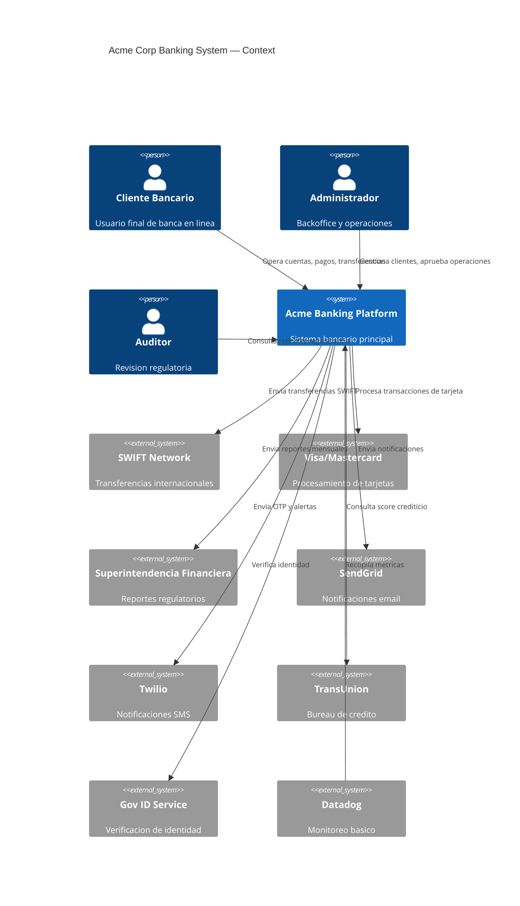
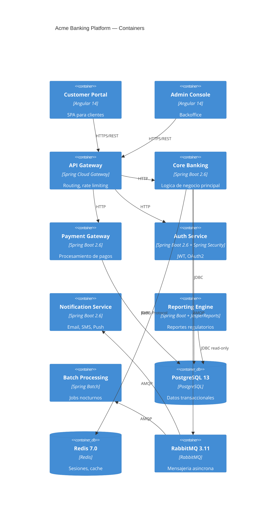
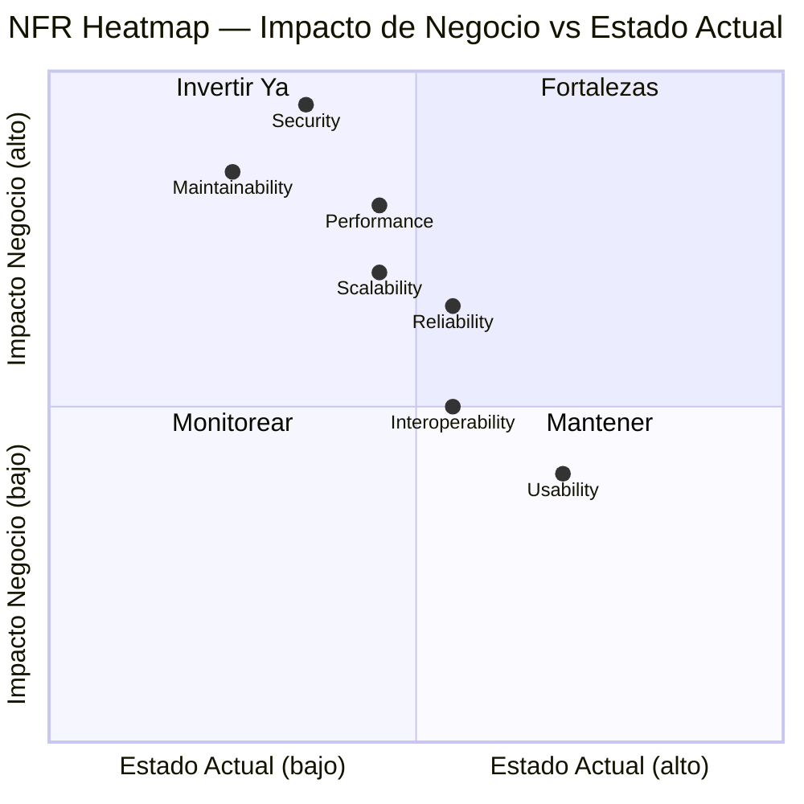
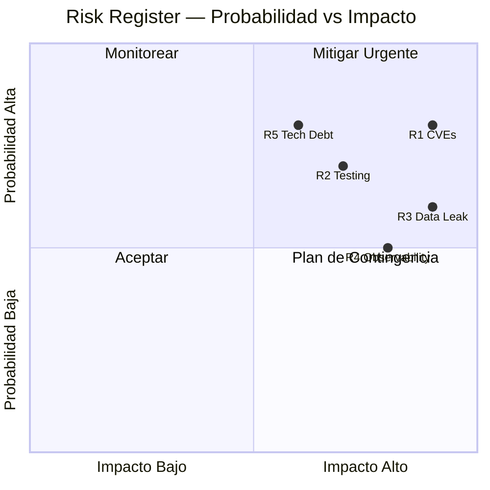

# 03 Analisis AS-IS — Acme Corp Banking Modernization

**Fecha:** 12 de marzo de 2026
**Analista:** Discovery Agent (asis-analysis v6.0)
**Variante:** Tecnica (full)
**Estado:** Completo

---

## S0: Executive Dashboard

| Metrica | Valor |
|---|---|
| **LOC totales** | 340,000 |
| **Modulos** | 12 |
| **Integraciones externas** | 8 |
| **Equipo** | 24 desarrolladores (4 squads) |
| **Anios en produccion** | 7 |
| **Health Score** | **5.2 / 10** |

### Resumen Ejecutivo

El sistema bancario de Acme Corp es una aplicacion monolitica en proceso de transicion parcial a microservicios. La base de codigo muestra signos de deuda tecnica acumulada durante 7 anios de desarrollo continuo. Las areas criticas incluyen cobertura de pruebas insuficiente (34%), complejidad ciclomatica elevada (promedio 18), y tres CVEs activos en dependencias. El sistema es funcional pero presenta riesgos crecientes de mantenibilidad y seguridad.

> **Veredicto:** El sistema requiere intervencion estrategica. No es candidato a rewrite completo, pero necesita refactorizacion arquitectonica progresiva con enfoque en deuda de testing y seguridad.

---

## S1: Technology Inventory

### Stack por Capa

| Capa | Tecnologia | Version | EOL Status | Currency Score |
|---|---|---|---|---|
| **Backend** | Java | 11 | LTS (sep 2026) | 6/10 |
| **Framework** | Spring Boot | 2.6.x | EOL (nov 2023) | 3/10 |
| **Frontend** | Angular | 14 | EOL (nov 2024) | 2/10 |
| **Base de datos** | PostgreSQL | 13 | Active (nov 2025) | 5/10 |
| **Cache** | Redis | 7.0 | Active | 8/10 |
| **Mensajeria** | RabbitMQ | 3.11 | Active | 7/10 |
| **Contenedores** | Docker | 24.0 | Active | 9/10 |
| **Cloud** | AWS (ECS) | N/A | Active | 8/10 |

### Dependencias Criticas

- **Spring Boot 2.6** — 2 versiones mayor detras de current (3.2). Bloquea adopcion de Java 21 features, virtual threads, y GraalVM native image.
- **Angular 14** — 3 versiones detras. Sin soporte de seguridad. Migrar a Angular 17+ requiere refactor de modulos standalone.
- **Jackson 2.13** — Vulnerable a CVE-2022-42003 (deserialization). Actualizar a 2.16+.

### Dependency Tree Summary

- Total dependencias directas: 87
- Dependencias transitivas: 342
- Dependencias con vulnerabilidades conocidas: 5
- Dependencias EOL: 3

---

## S2: Code Organization

### Estructura de Modulos

```
acme-banking/
  core-banking/          # 89K LOC — Logica de negocio principal
  payment-gateway/       # 42K LOC — Procesamiento de pagos
  customer-portal/       # 67K LOC — Frontend Angular
  auth-service/          # 18K LOC — Autenticacion y autorizacion
  notification-service/  # 12K LOC — Emails, SMS, push
  reporting/             # 34K LOC — Reportes regulatorios
  admin-console/         # 28K LOC — Backoffice
  shared-libs/           # 22K LOC — Librerias compartidas
  integration-hub/       # 15K LOC — Conectores externos
  batch-processing/      # 8K LOC  — Jobs nocturnos
  api-gateway/           # 3K LOC  — Routing y rate limiting
  infrastructure/        # 2K LOC  — IaC y configuracion
```

### Anti-Patrones Detectados

| Anti-Patron | Instancias | Severidad | Ubicacion |
|---|---|---|---|
| **God Classes** | 3 | CRITICO | `TransactionProcessor.java` (2,847 LOC), `CustomerService.java` (1,923 LOC), `PaymentOrchestrator.java` (1,456 LOC) |
| **Circular Dependencies** | 6 | ALTO | core-banking <-> payment-gateway, auth-service <-> shared-libs, reporting <-> core-banking |
| **Feature Envy** | 12 | MEDIO | Multiples servicios accediendo directamente a tablas de otros modulos |
| **Shotgun Surgery** | 8 | MEDIO | Cambios en modelo de cliente requieren modificaciones en 8+ archivos |

### Metricas de Acoplamiento

- **Acoplamiento aferente promedio (Ca):** 7.3 (alto — modulos altamente dependidos)
- **Acoplamiento eferente promedio (Ce):** 5.1 (moderado)
- **Inestabilidad promedio (I = Ce/(Ca+Ce)):** 0.41 (zona intermedia)

---

## S3: Architecture — C4 Model

### C4 Context Diagram



### C4 Container Diagram



### Patrones Arquitectonicos Identificados

| Patron | Estado | Evaluacion |
|---|---|---|
| Layered Architecture | Parcial | Capas presentes pero con fugas frecuentes (servicios acceden DAOs de otros modulos) |
| API Gateway | Implementado | Funcional pero sin circuit breaker |
| Event-Driven (parcial) | Implementado | Solo para notificaciones y batch. Core banking es sincrono |
| CQRS | No implementado | Reporting lee de la misma DB transaccional |

---

## S4: Code Quality Metrics

### Dashboard de Calidad

| Metrica | Valor | Umbral Aceptable | Estado |
|---|---|---|---|
| **Test Coverage** | 34% | >70% | CRITICO |
| **Complejidad Ciclomatica (avg)** | 18 | <10 | CRITICO |
| **Complejidad Ciclomatica (p95)** | 47 | <20 | CRITICO |
| **Duplicacion** | 12% | <5% | ALTO |
| **Code Smells** | 847 | <100 | CRITICO |
| **Profundidad de Dependencia (max)** | 7 | <5 | ALTO |
| **Metodos >50 LOC** | 134 | <20 | ALTO |

### Cobertura por Modulo

| Modulo | Cobertura | Tests Unitarios | Tests Integracion |
|---|---|---|---|
| core-banking | 28% | 312 | 18 |
| payment-gateway | 41% | 187 | 34 |
| auth-service | 62% | 89 | 12 |
| notification-service | 45% | 34 | 8 |
| reporting | 18% | 42 | 3 |
| customer-portal | 31% | 156 | 0 |
| admin-console | 12% | 28 | 0 |
| shared-libs | 67% | 145 | 0 |

### Tendencia (ultimos 12 meses)

- Cobertura: 38% -> 34% (descendente, -4pp)
- Complejidad promedio: 15 -> 18 (creciente)
- Code smells: 612 -> 847 (+38%)
- Duplicacion: 9% -> 12% (+3pp)

> **Tendencia negativa sostenida.** La calidad del codigo se degrada a un ritmo de ~3% por trimestre. Sin intervencion, el sistema alcanzara un punto de no retorno en 12-18 meses.

---

## S5: Technical Debt Inventory

### Resumen

- **Items totales:** 12
- **Criticos:** 3
- **Altos:** 5
- **Medios:** 4
- **Costo estimado de remediacion:** 847 dias-ingeniero

### Items Criticos

| ID | Categoria | Descripcion | Impacto Tecnico | Impacto Negocio | Remediacion | Esfuerzo |
|---|---|---|---|---|---|---|
| TD-01 | Test | Cobertura de pruebas al 34% | Regresiones frecuentes, deployments riesgosos | 2-3 incidentes/mes en produccion | Plan de testing: unit + integration por modulo critico | 120 dias |
| TD-02 | Design | 3 God Classes (>1,500 LOC cada una) | Imposible modificar sin efectos secundarios | Features retrasados 2-3x por miedo al cambio | Extract Class refactoring progresivo | 60 dias |
| TD-03 | Dependency | Spring Boot 2.6 (EOL) + Angular 14 (EOL) | Sin parches de seguridad, sin features modernos | Exposicion a vulnerabilidades, dificultad de contratacion | Upgrade path: Spring Boot 3.2 + Angular 17 | 90 dias |

### Items Altos

| ID | Categoria | Descripcion | Esfuerzo |
|---|---|---|---|
| TD-04 | Code | 12% duplicacion de codigo | 45 dias |
| TD-05 | Infrastructure | Deployments manuales sin CI/CD completo | 30 dias |
| TD-06 | Design | 6 dependencias circulares entre modulos | 40 dias |
| TD-07 | Documentation | 0 ADRs, README desactualizado, sin onboarding docs | 20 dias |
| TD-08 | Code | Complejidad ciclomatica promedio 18 (objetivo <10) | 80 dias |

### Logica Condicional Activada

- CRITICO: Test coverage 34% < 20% threshold NO, pero < 40% WARNING activado
- CRITICO: Average CC 18 > 15 threshold — **Recomendacion: refactorizar antes de nuevas features**
- ALTO: Dependency depth max 7 > 5 — **Recomendacion: modularizacion**
- ALTO: 6 circular dependencies < 10 threshold — Monitorear

---

## S6: NFR Heatmap

| Atributo de Calidad | Score | Evidencia | Gap vs Objetivo | Prioridad |
|---|---|---|---|---|
| **Performance** | 5/10 | P95 latency 2.3s (objetivo <500ms), no caching strategy | -5 | ALTA |
| **Security** | 4/10 | 3 CVEs activos, API key hardcoded, JWT sin rotacion | -5 | CRITICA |
| **Maintainability** | 3/10 | CC=18, coverage=34%, 3 god classes, 0 ADRs | -6 | CRITICA |
| **Scalability** | 5/10 | Monolito con DB compartida, no horizontal scaling | -4 | ALTA |
| **Reliability** | 6/10 | MTTR 4h, no circuit breakers, retry manual | -3 | MEDIA |
| **Usability** | 7/10 | Portal funcional, mobile-responsive, UX feedback positivo | -1 | BAJA |
| **Interoperability** | 6/10 | REST APIs documentadas parcialmente, 8 integraciones funcionales | -2 | MEDIA |



---

## S7: Security Assessment

### CVEs Activos

| CVE | Componente | Severidad | CVSS | Descripcion | Remediacion |
|---|---|---|---|---|---|
| CVE-2022-42003 | Jackson Databind 2.13 | ALTA | 7.5 | Deserialization vulnerability | Upgrade a 2.16+ |
| CVE-2023-20873 | Spring Boot 2.6 Actuator | ALTA | 7.3 | Endpoint exposure sin autenticacion | Upgrade a 2.7.11+ o aplicar configuracion |
| CVE-2023-34055 | Spring Boot 2.6 | MEDIA | 5.3 | DoS via crafted request | Upgrade a 3.x |

### Hallazgos Adicionales

| Hallazgo | Severidad | Ubicacion | Remediacion |
|---|---|---|---|
| **API Key hardcoded** | CRITICO | `integration-hub/src/config/ExternalServices.java:47` | Migrar a AWS Secrets Manager / Vault |
| JWT sin rotacion de claves | ALTO | `auth-service/src/security/JwtProvider.java` | Implementar key rotation cada 90 dias |
| SQL queries sin parametrizar | MEDIO | 3 instancias en `reporting/` | Usar PreparedStatement/JPA named params |
| CORS configurado como `*` | MEDIO | `api-gateway/src/config/CorsConfig.java` | Restringir a dominios conocidos |
| Logs con datos sensibles | MEDIO | `core-banking/` (PII en logs de transacciones) | Implementar log sanitization |

### OWASP Top 10 Mapping

| OWASP Category | Estado | Evidencia |
|---|---|---|
| A01 Broken Access Control | WARNING | CORS abierto, endpoints actuator expuestos |
| A02 Cryptographic Failures | WARNING | JWT sin rotacion |
| A03 Injection | WARNING | 3 SQL queries sin parametrizar |
| A06 Vulnerable Components | FAIL | 3 CVEs activos en dependencias |
| A09 Security Logging | FAIL | PII en logs, no hay SIEM |

---

## S8: Operational Model

### Deployment

| Aspecto | Estado | Evaluacion |
|---|---|---|
| **Estrategia de deploy** | Manual (scripts bash + ECS update) | CRITICO — No hay CI/CD end-to-end |
| **Frecuencia de release** | Quincenal | Limitada por falta de confianza en tests |
| **Rollback** | Manual (redeploy version anterior) | ALTO — MTTR de rollback: 45 min |
| **Ambientes** | Dev, Staging, Prod | OK — Falta ambiente de performance testing |
| **IaC** | Parcial (Terraform para infra base, manual para ECS tasks) | MEDIO |

### Observabilidad

| Aspecto | Herramienta | Cobertura | Evaluacion |
|---|---|---|---|
| **Metricas** | Datadog (basico) | CPU, memoria, disco | MEDIO — Sin metricas de negocio |
| **Logs** | CloudWatch | Centralizados pero sin estructura | MEDIO — No hay correlacion |
| **Traces** | Ninguno | 0% | CRITICO — Sin distributed tracing |
| **Alertas** | Datadog | Solo infraestructura | ALTO — Sin alertas de negocio |
| **APM** | Ninguno | 0% | CRITICO |

### DORA Metrics (estimados)

| Metrica | Valor | Benchmark Elite |
|---|---|---|
| Deployment Frequency | Quincenal | On-demand (multiple/dia) |
| Lead Time for Changes | 14 dias | <1 dia |
| Change Failure Rate | ~18% | <5% |
| MTTR | 4 horas | <1 hora |

> **Clasificacion DORA: Low performer.** El equipo opera en modo reactivo con ciclos largos y alta tasa de fallo. La ausencia de CI/CD y APM son los blockers principales.

---

## S9: Risk Register

| # | Riesgo | Categoria | Prob | Impacto | Score | Mitigacion Actual | Accion Recomendada | Velocidad |
|---|---|---|---|---|---|---|---|---|
| R1 | Brecha de seguridad por CVEs no parcheados | Security | 0.8 | 0.9 | **0.72** | Ninguna | Upgrade Spring Boot + Jackson inmediato | Creciente |
| R2 | Regresion en produccion por baja cobertura de tests | Quality | 0.7 | 0.7 | **0.49** | Test manual pre-release | Plan de testing automatizado: 70% coverage en 6 meses | Creciente |
| R3 | Fuga de datos sensibles (API key hardcoded + PII en logs) | Security | 0.6 | 0.9 | **0.54** | Ninguna | Secrets manager + log sanitization | Estable |
| R4 | Indisponibilidad prolongada por falta de observabilidad | Operations | 0.5 | 0.8 | **0.40** | Datadog basico | APM + distributed tracing + alertas de negocio | Creciente |
| R5 | Deuda tecnica bloquea delivery de features | Business | 0.8 | 0.6 | **0.48** | Ninguna sistematica | 20% del sprint dedicado a reduccion de deuda | Creciente |

### Matriz de Probabilidad x Impacto



---

## S10: Recommendations

### Quick Wins (< 5 dias-ingeniero cada uno)

| # | Accion | Esfuerzo | Impacto | Referencia |
|---|---|---|---|---|
| QW-1 | Rotar API key hardcoded a Secrets Manager | 2 dias | Elimina riesgo critico R3 | S7 |
| QW-2 | Restringir CORS a dominios conocidos | 0.5 dias | Cierra OWASP A01 | S7 |
| QW-3 | Configurar Actuator endpoints con autenticacion | 1 dia | Cierra CVE-2023-20873 | S7 |
| QW-4 | Parametrizar 3 SQL queries en reporting | 1 dia | Cierra OWASP A03 | S7 |
| QW-5 | Implementar log sanitization para PII | 3 dias | Reduce riesgo R3 | S7, S8 |

### Roadmap Estrategico

| Horizonte | Iniciativa | Esfuerzo | Impacto | Referencia |
|---|---|---|---|---|
| **Inmediato (0-30 dias)** | Quick wins de seguridad (QW-1 a QW-5) | 7.5 dias | Cierra 3 vulnerabilidades criticas | S7, R1, R3 |
| **Corto plazo (1-3 meses)** | Upgrade Spring Boot 2.6 -> 3.2 | 90 dias | Elimina CVEs, habilita Java 21 | S1, TD-03, R1 |
| **Corto plazo (1-3 meses)** | CI/CD pipeline completo | 30 dias | Deploy frequency: diario, CFR <10% | S8, TD-05, R4 |
| **Medio plazo (3-6 meses)** | Plan de testing (34% -> 70%) | 120 dias | Reduce regresiones 60% | S4, TD-01, R2 |
| **Medio plazo (3-6 meses)** | Refactoring god classes | 60 dias | Reduce CC promedio a <12 | S2, TD-02 |
| **Largo plazo (6-12 meses)** | APM + distributed tracing | 40 dias | MTTR <1h, visibilidad completa | S8, R4 |
| **Largo plazo (6-12 meses)** | Angular 14 -> 17 migration | 60 dias | Soporte LTS, performance, DX | S1, TD-03 |

### Decision Tree: Refactor vs Rewrite vs Replace

| Componente | Decision | Justificacion |
|---|---|---|
| core-banking | **Refactor** | Alto valor de negocio, logica compleja, riesgoso reescribir |
| payment-gateway | **Refactor** | Integraciones criticas, refactorizar incrementalmente |
| customer-portal (Angular) | **Rewrite parcial** | Angular 14 EOL, migrar a Angular 17 standalone components |
| reporting | **Replace** | JasperReports legacy, evaluar herramienta moderna (Metabase/Superset) |
| batch-processing | **Refactor** | Funcional, actualizar a Spring Batch 5 con upgrade de Boot |

---

## Trazabilidad Cruzada

| Recomendacion | Evidencia S0-S9 |
|---|---|
| Upgrade Spring Boot 3.2 | S1 (EOL), S7 (CVEs), R1 |
| Plan de testing 70% | S4 (34% coverage), S5 (TD-01), R2 |
| Secrets Manager | S7 (hardcoded key), R3 |
| CI/CD pipeline | S8 (manual deploy), S5 (TD-05), R4 |
| God class refactoring | S2 (3 god classes), S4 (CC=18), S5 (TD-02), R5 |
| APM + observabilidad | S8 (no APM), S6 (reliability 6/10), R4 |

---

**Generado por:** asis-analysis v6.0 | **Formato:** Markdown | **Variante:** Tecnica (full)
