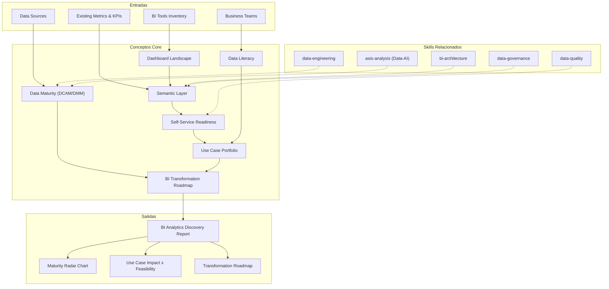

# BI & Analytics Discovery — Data Maturity Assessment & Transformation Roadmap

Generates a comprehensive BI & Analytics discovery covering data maturity assessment (DCAM/DMM), dashboard landscape inventory, semantic layer evaluation, self-service analytics readiness, data literacy assessment, analytics use case portfolio, and BI transformation roadmap. Distinct from bi-architecture (BI architecture design skill); this skill is the discovery/assessment for BI-as-a-service engagements.

## Grounding Guideline

> *Data without context is noise. Dashboards without adoption are decoration. Analytics only transforms when the entire organization knows how to read, question, and act based on data.*

1. **Adoption over technology.** The best dashboard in the world has no value if nobody consults it. The organization's data literacy determines the ROI of any BI investment. Measure adoption, not just deployment.
2. **A single source of truth.** Inconsistent metrics between departments erode trust in data. The semantic layer — shared definitions, standardized calculations, metric governance — is the foundation of reliable BI.
3. **Self-service with governance.** Democratizing data access does not mean anarchy. Self-service analytics works when there is governance (who can see what), quality (the data is reliable), and literacy (users know how to interpret).

## Inputs

The user provides a project or client name as `$ARGUMENTS`. Parse `$1` as the **project/client name** used throughout all output artifacts.

**Parameters:**
- `{MODO}`: `piloto-auto` (default) | `desatendido` | `supervisado` | `paso-a-paso`
  - **piloto-auto**: Auto para data maturity assessment y dashboard inventory, HITL para use case prioritization y roadmap decisions.
  - **desatendido**: Zero interruptions. Discovery completo automatizado. Assumptions documented.
  - **supervisado**: Autónomo con checkpoint al completar cada sección.
  - **paso-a-paso**: Confirms before cada sección del discovery.
- `{FORMATO}`: `markdown` (default) | `html` | `dual`
- `{VARIANTE}`: `ejecutiva` (~40% — S1 + S6 + S7 only) | `técnica` (full 7 sections, default)

If reference materials exist, load them:

```
Read ${CLAUDE_SKILL_DIR}/references/
```

---

## When to Use

- El cliente necesita evaluar su madurez en datos y analytics antes de iniciar un programa de BI
- Se requiere un inventario de dashboards y reportes existentes para consolidación
- El cliente busca implementar self-service analytics y necesita assessment de readiness
- Se necesita evaluar la data literacy de la organización para diseñar un plan de training
- El cliente quiere priorizar use cases de analytics (descriptivo, diagnóstico, predictivo, prescriptivo)
- Se busca un roadmap de transformación BI con consolidación, semantic layer, y advanced analytics

## When NOT to Use

- Diseño de arquitectura BI (data warehouse, data lakehouse, ETL/ELT) --> use bi-architecture
- Data engineering (pipelines, transformations, orchestration) --> use data-engineering
- Data governance (policies, cataloging, lineage) --> use data-governance
- Data quality assessment y remediation --> use data-quality
- Data science / ML model development --> use data-science-architecture
- Assessment general de Data-AI --> use asis-analysis con {TIPO_SERVICIO}=Data-AI

---

## Delivery Structure: 7 Sections

### S1: Data Maturity Assessment (DCAM/DMM)

Assessment de madurez de gestión de datos usando frameworks estándar de la industria.

**Frameworks de referencia:**
- **DCAM (Data Management Capability Assessment Model):** EDM Council. 8 capabilities, 37 sub-capabilities
- **DMM (Data Management Maturity):** CMMI Institute. 6 categories, 25 process areas

**Dimensiones de assessment:**

| Dimensión | Evalúa | Indicadores clave |
|---|---|---|
| **Strategy** | Estrategia de datos, alineación con negocio, inversión | Data strategy document, CDO role, budget dedicado |
| **Governance** | Políticas, roles (data owners/stewards), compliance | Data council, policies documented, steward network |
| **Quality** | Completeness, accuracy, consistency, timeliness | Quality scores per dataset, monitoring automatizado |
| **Architecture** | Data platform, integration, metadata management | Data catalog, lineage, integration patterns |
| **Operations** | Pipelines, SLAs de datos, incident management | Pipeline uptime, data freshness SLAs, incident process |

**Maturity levels (1-5):**

| Nivel | Nombre | Descripción |
|---|---|---|
| 1 | Initial | Datos en silos, sin governance, calidad desconocida |
| 2 | Managed | Alguna documentación, governance parcial, quality básico |
| 3 | Defined | Procesos estandarizados, governance formal, quality monitoreado |
| 4 | Quantitatively Managed | Métricas de performance, SLAs, continuous improvement |
| 5 | Optimizing | Data-driven culture, innovation, predictive quality management |

**Gap analysis:** Delta entre maturity level actual y target por dimensión. El target no siempre es nivel 5 — depende de las necesidades del negocio.

**Output:** Data maturity radar chart con score por dimensión, overall maturity level, y gap analysis to target.

### S2: Dashboard Landscape Inventory

Inventario completo del landscape de dashboards y reportes existentes.

**Inventory dimensions:**

| Campo | Descripción | Ejemplo |
|---|---|---|
| **Tool** | Herramienta de BI utilizada | Power BI, Tableau, Looker, Qlik, Google Data Studio, Excel |
| **Dashboard/Report name** | Nombre del artefacto | "Sales Monthly Dashboard", "HR Turnover Report" |
| **Owner** | Quién lo creó y mantiene | Finance team, IT, individual analyst |
| **Business area** | Departamento o función de negocio | Sales, Finance, Operations, HR, Marketing |
| **Refresh cadence** | Frecuencia de actualización | Real-time, daily, weekly, monthly, manual |
| **Data sources** | Fuentes de datos que alimentan | ERP, CRM, Data Warehouse, spreadsheets, APIs |
| **Adoption** | Nivel de uso real | High (daily use), Medium (weekly), Low (rarely opened), Abandoned |
| **Last modified** | Última actualización del artefacto | Date |

**Redundancy identification:**
- Dashboards que muestran las mismas métricas con diferentes definiciones
- Reportes duplicados entre departamentos
- Múltiples herramientas haciendo lo mismo (e.g., Power BI + Tableau + Excel para sales)

**Inconsistency identification:**
- Métricas con el mismo nombre pero diferente cálculo entre dashboards
- Datos de la misma fuente pero con diferentes transformaciones
- Discrepancias en números entre reportes que deberían coincidir

**Tool sprawl assessment:**
- Número de herramientas de BI en uso (incluyendo shadow IT / spreadsheets)
- Licenciamiento: utilizado vs adquirido
- Consolidation opportunities

**Output:** Dashboard inventory table con adoption metrics, redundancy map, y tool sprawl assessment.

### S3: Semantic Layer Assessment

Evaluación de la consistencia de definiciones de métricas y la existencia de una fuente única de verdad.

**Metrics definitions consistency:**
- ¿Existe un diccionario de métricas (metrics catalog)?
- ¿Las definiciones son consistentes entre departamentos? (e.g., "revenue" means the same thing everywhere?)
- ¿Hay un proceso formal para crear/modificar métricas?
- ¿Quién es el owner de cada métrica?

**Business glossary coverage:**
- ¿Existe un business glossary?
- ¿Qué % de términos de negocio están definidos formalmente?
- ¿Es accesible para todos los usuarios de datos?
- ¿Se mantiene actualizado?

**Single source of truth assessment:**
- ¿Existe un data warehouse/lakehouse centralizado?
- ¿Los dashboards consumen del warehouse o de fuentes primarias directamente?
- ¿Hay un semantic layer tool (dbt metrics, Looker LookML, Tableau Data Model, Power BI Semantic Model)?

**Metric conflicts and reconciliation needs:**
- Lista de métricas con definiciones conflictivas entre áreas
- Impacto de las inconsistencias (decisiones tomadas con datos incorrectos)
- Esfuerzo de reconciliación estimado

**Output:** Semantic layer assessment con metric conflicts inventory y single source of truth score.

### S4: Self-Service Analytics Readiness

Evaluación de readiness para analytics democratizado.

**Current self-service capabilities:**
- ¿Los usuarios de negocio pueden crear sus propios reportes/dashboards?
- ¿Tienen acceso a datos exploración (ad-hoc queries)?
- ¿Existe sandbox/playground para experimentación?

**Data access policies:**
- ¿El acceso a datos está gobernado (RBAC, row-level security)?
- ¿Los usuarios saben qué datos pueden/no pueden acceder?
- ¿Hay procesos de request/approval para nuevos accesos?

**Tool availability:**
- ¿Las herramientas de BI están disponibles para usuarios de negocio (no solo IT)?
- ¿Hay licencias suficientes?
- ¿La interfaz es accesible para usuarios no técnicos?

**Training programs:**
- ¿Existe training formal en herramientas de BI?
- ¿Hay power users / champions que soportan a sus equipos?
- ¿El training cubre solo la herramienta o también interpretación de datos?

**Readiness score:**

| Dimensión | Score 1-5 | Peso |
|---|---|---|
| Tool availability | - | 20% |
| Data access governance | - | 25% |
| Data quality trust | - | 25% |
| User training | - | 15% |
| Support structure | - | 15% |

**Self-service analytics readiness = weighted average.** Score >3.5 = ready para self-service. Score 2-3.5 = necesita preparación. Score <2 = riesgoso sin inversión significativa.

**Output:** Self-service readiness scorecard con dimensiones, scores, y recommendations.

### S5: Data Literacy Assessment

Evaluación del nivel de data literacy de la organización.

**Data literacy by department/role:**

| Nivel | Nombre | Descripción | Indicadores |
|---|---|---|---|
| 1 | Data-unaware | No usa datos para decisiones | Decisiones por intuición, no consulta reportes |
| 2 | Data-consumer | Consume reportes predefinidos | Lee dashboards, no cuestiona los datos |
| 3 | Data-conversant | Interpreta datos, hace preguntas | Identifica trends, pide drill-downs, cuestiona outliers |
| 4 | Data-literate | Analiza datos independientemente | Crea visualizaciones, hace análisis ad-hoc |
| 5 | Data-fluent | Influye decisiones con datos | Diseña KPIs, propone experimentos, comunica insights |

**Assessment por departamento:**
- Nivel promedio de data literacy
- Distribución de niveles dentro del departamento
- Roles clave que necesitan upskilling

**Training needs identification:**
- Gap entre nivel actual y nivel requerido por rol
- Tipos de training necesarios: tool training, statistical thinking, data storytelling, data ethics
- Formato preferido: workshops, e-learning, coaching, on-the-job

**Data champions network assessment:**
- ¿Existen data champions (power users que evangelizan datos)?
- ¿Están formalmente reconocidos o es informal?
- ¿Tienen tiempo dedicado para esta función?
- ¿Hay una comunidad de práctica de datos?

**Cultural barriers to data-driven decision making:**
- HiPPO (Highest Paid Person's Opinion) culture
- Fear of data transparency (datos que exponen ineficiencias)
- "We've always done it this way" resistance
- Lack of trust in data quality
- Siloed data ownership ("my data, my territory")

**Output:** Data literacy map por departamento con nivel actual, gaps, training needs, y cultural barriers.

### S6: Analytics Use Case Portfolio

Portfolio priorizado de oportunidades de analytics.

**Categorización de use cases:**

| Tipo | Pregunta que responde | Complejidad | Ejemplo |
|---|---|---|---|
| **Descriptive** | ¿Qué pasó? | Baja | Dashboards de ventas, reportes financieros |
| **Diagnostic** | ¿Por qué pasó? | Media | Root cause analysis, drill-down analysis |
| **Predictive** | ¿Qué va a pasar? | Alta | Forecasting de demanda, churn prediction |
| **Prescriptive** | ¿Qué debemos hacer? | Muy alta | Pricing optimization, resource allocation |

**Impact x Feasibility scoring:**

| Criterio | Score 1-5 | Descripción |
|---|---|---|
| **Business impact** | - | Revenue impact, cost savings, risk reduction, customer experience |
| **Data availability** | - | ¿Los datos necesarios existen, son accesibles, y tienen calidad suficiente? |
| **Technical feasibility** | - | ¿La infraestructura y skills actuales lo permiten? |
| **Organizational readiness** | - | ¿El área de negocio está lista para actuar sobre los insights? |
| **Time to value** | - | ¿Cuánto tarda en entregar valor? (shorter = higher score) |

**Composite score:** `(impact * 0.35) + (data_availability * 0.20) + (technical_feasibility * 0.20) + (org_readiness * 0.15) + (time_to_value * 0.10)`

**Top-10 use cases:**
Para cada use case del top-10:
- Nombre y descripción
- Tipo (descriptive/diagnostic/predictive/prescriptive)
- Business area y stakeholder
- Data requirements (fuentes, volumen, calidad mínima)
- Composite score con desglose
- Quick win vs strategic

**Output:** Use case portfolio con top-10 prioritized, scoring matrix, y clasificación quick-win vs strategic.

### S7: BI Transformation Roadmap

Roadmap de transformación BI faseado con maturity targets.

**Quick Wins (Meses 1-3):**
- **Dashboard consolidation:** Eliminar redundancia, consolidar herramientas, retirar dashboards abandonados
- **Metric alignment:** Resolver los top-5 metric conflicts del S3
- **Data literacy kickoff:** Identificar y empoderar data champions, lanzar primer training
- **Use case pilots:** Iniciar 2-3 use cases de tipo descriptive/diagnostic del S6

**Medium-Term (Meses 4-9):**
- **Semantic layer implementation:** Metrics store (dbt metrics, Looker LookML, Power BI Semantic Model)
- **Self-service enablement:** Tool deployment, training program, governance framework
- **Data quality improvement:** Monitoring automatizado para datasets críticos
- **Use case expansion:** Implementar 5+ use cases, iniciar primeros predictive

**Strategic (Meses 10-18):**
- **Advanced analytics:** Predictive y prescriptive use cases del portfolio
- **AI integration:** ML models integrados en BI workflows (anomaly detection, forecasting)
- **Data culture transformation:** Data literacy a nivel organizacional, data-driven decision making embebido
- **BI Center of Excellence:** Equipo centralizado o federated model para governance, standards, y enablement

**Per phase:**
- Maturity targets (S1 dimensions)
- Use cases activos (del S6)
- Team requirements (BI developers, data analysts, data engineers, trainers)
- Adoption metrics targets (dashboard views, self-service reports created, data literacy scores)
- Budget magnitude indicators (FTE-meses, NOT prices)

**Output:** Roadmap visual faseado con maturity targets, use case activation, y adoption metrics.

---

## Trade-off Matrix

| Decisión | Habilita | Restringe | Cuándo Usar |
|---|---|---|---|
| **Single BI tool** | Consistency, licensing simplicity | Less flexibility, migration cost | Organizaciones con <500 BI users |
| **Multi-tool strategy** | Best-of-breed per use case | Complexity, inconsistency risk | Enterprise con needs muy diversos |
| **Centralized BI team** | Quality, consistency, governance | Bottleneck, slower time-to-value | Data maturity <3, governance priority |
| **Federated model** | Speed, domain ownership | Inconsistency, duplication risk | Data maturity >3, strong governance |
| **Semantic layer first** | Single source of truth, trust | Investment before visible value | Metric conflicts causing business issues |
| **Self-service first** | User empowerment, speed | Quality risk without governance | High data literacy, strong governance |
| **Advanced analytics early** | Competitive advantage, innovation | Requires foundation (data quality, infra) | Only if descriptive/diagnostic is solid |

---

## Assumptions

- El cliente tiene datos en alguna forma (bases de datos, data warehouse, spreadsheets, SaaS tools)
- Existen dashboards o reportes en uso (no es un greenfield completo de BI)
- Los stakeholders de negocio están disponibles para entrevistas sobre uso de datos y necesidades
- Hay acceso a herramientas de BI existentes para inventario y adoption metrics
- El cliente busca mejorar sus capacidades de BI, no solo comprar una herramienta

## Limits

- No diseña la arquitectura técnica de BI (data warehouse, ETL, semantic layer) — use bi-architecture
- No implementa pipelines de datos — use data-engineering
- No ejecuta data governance (políticas, cataloging, lineage) — use data-governance
- No desarrolla modelos de ML/AI — use data-science-architecture
- No define precios — solo magnitudes de esfuerzo (FTE-meses)
- El data literacy assessment es basado en entrevistas y observación — no es una evaluación psicométrica formal

---

## Edge Cases

**Organización sin data warehouse (todo en spreadsheets):**
S1 maturity será nivel 1. El roadmap debe incluir data infrastructure foundation como prerequisito antes de BI. Referir a data-engineering y bi-architecture para el diseño técnico.

**Múltiples herramientas de BI con ownership político:**
El dashboard consolidation es técnicamente simple pero políticamente complejo. Mapear stakeholders y sus intereses. Proponer coexistencia temporal con semantic layer unificado como puente.

**Organización altamente regulada (banca, salud):**
Self-service analytics tiene restricciones de compliance (quién puede ver qué datos). Row-level security y data classification son pre-requisitos. Regulatory reporting tiene prioridad sobre self-service.

**Data literacy muy baja (nivel 1 organization-wide):**
No intentar self-service analytics. Enfocarse en data literacy training + dashboards curados por equipo centralizado. Self-service es meta a mediano plazo, no punto de partida.

**Analytics use cases que requieren datos que no existen:**
Documentar el gap de datos como pre-requisito. Algunos use cases requieren instrumentación (new data capture) antes de analytics. Incluir data collection como fase en el roadmap.

---

## Validation Gate

Before finalizing delivery, verify:

- [ ] Data maturity assessment cubre las 5 dimensiones con scoring 1-5
- [ ] Dashboard inventory incluye herramienta, owner, refresh cadence, adoption, y data sources
- [ ] Redundancy y inconsistency identificados con impacto de negocio
- [ ] Semantic layer assessment incluye metric conflicts inventory
- [ ] Self-service readiness score calculado con dimensiones ponderadas
- [ ] Data literacy evaluada por departamento con niveles 1-5
- [ ] Cultural barriers documentadas con estrategias de mitigación
- [ ] Analytics use case portfolio tiene top-10 con Impact x Feasibility scoring
- [ ] Use cases clasificados por tipo (descriptive/diagnostic/predictive/prescriptive)
- [ ] BI transformation roadmap faseado con maturity targets por dimensión
- [ ] Quick wins identificados para meses 1-3 (dashboard consolidation, metric alignment)
- [ ] Budget expresado en magnitudes (FTE-meses), NUNCA en precios

---

## Output Format Protocol

| Format | Default | Description |
|--------|---------|-------------|
| `markdown` | Yes | Rich Markdown + Mermaid diagrams. Token-efficient. |
| `html` | On demand | Branded HTML (Design System). Visual impact. |
| `dual` | On demand | Both formats. |

Default output is Markdown with embedded Mermaid diagrams. HTML generation requires explicit `{FORMATO}=html` parameter.

## Output Artifact

**Primary:** `BI_Analytics_Discovery_{project}.md` -- Data maturity assessment, dashboard landscape inventory, semantic layer evaluation, self-service readiness, data literacy assessment, analytics use case portfolio, and phased BI transformation roadmap with maturity targets.

**Diagramas incluidos:**
- Data maturity radar chart: 5 dimensions scored 1-5
- Dashboard landscape map: tools, areas, adoption heatmap
- Analytics use case portfolio: Impact x Feasibility scatter plot
- BI transformation roadmap: phased Gantt with maturity targets per phase
- Data literacy distribution: department-level bar chart

## Edge Cases

| Case | Handling Strategy |
|---|---|
| Organization without data warehouse (everything in spreadsheets) | S1 maturity level 1. Roadmap includes data infrastructure foundation as prerequisite. Refer to data-engineering and bi-architecture. |
| Multiple BI tools with political ownership | Consolidation is technically simple but politically complex. Map stakeholders. Propose temporary coexistence with unified semantic layer. |
| Highly regulated organization (banking, healthcare) | Self-service analytics with compliance restrictions. Row-level security and data classification are prerequisites. Regulatory reporting takes priority. |
| Very low data literacy (level 1 organization-wide) | Do not attempt self-service. Curated dashboards by centralized team. Self-service as a medium-term goal. |
| Analytics use cases requiring non-existent data | Document data gap as prerequisite. Include data collection as an explicit phase in roadmap. |

## Decisions and Trade-offs

| Decision | Discarded Alternative | Justification |
|---|---|---|
| DCAM/DMM as maturity frameworks | Proprietary frameworks, ad-hoc assessment | DCAM (EDM Council) and DMM (CMMI Institute) are recognized industry standards with available benchmarks. They enable comparability across organizations. |
| 7 discovery sections | 3-section rapid assessment, 12-section exhaustive assessment | 7 sections cover the complete cycle: maturity, landscape, semantic, self-service, literacy, use cases, roadmap. Executive variant reduces to 3 without losing decision-readiness. |
| Data literacy as dedicated section (S5) | Literacy as sub-section of self-service readiness | Organizational literacy is the strongest predictor of BI ROI. It deserves independent evaluation with levels 1-5 per department and a dedicated training plan. |
| Composite Impact x Feasibility scoring (5 criteria) | Simple 2-criteria scoring (impact and effort) | 5 criteria (impact, data availability, technical feasibility, org readiness, time-to-value) with differentiated weights produce more robust prioritization. |

## Knowledge Graph



## Output Templates

**Formato Markdown (default):**

```
# BI & Analytics Discovery: {project}
## S1: Data Maturity Assessment (DCAM/DMM)
### Overall Maturity Level: {level}/5
| Dimension | Score (1-5) | Evidencia | Gap to Target |
...
## S2: Dashboard Landscape Inventory
| Tool | Dashboard | Owner | Area | Refresh | Adoption |
...
### Redundancy Map
### Tool Sprawl Assessment
## S3-S5: [Semantic, Self-Service, Literacy]
## S6: Analytics Use Case Portfolio
### Top-10 Use Cases
| Use Case | Tipo | Impact | Feasibility | Score | Ranking |
...
## S7: BI Transformation Roadmap
### Quick Wins (Meses 1-3)
### Medium-Term (Meses 4-9)
### Strategic (Meses 10-18)
```

**Formato PPTX (bajo demanda):**

```
Slide 1: Portada — BI & Analytics Discovery: {project}
Slide 2: Executive Summary — maturity level + top-3 findings
Slide 3: Data Maturity Radar — 5 dimensiones scored 1-5
Slide 4: Dashboard Landscape — tool sprawl + adoption heatmap
Slide 5: Semantic Layer Assessment — metric conflicts count + single source of truth score
Slide 6: Data Literacy Distribution — department-level bar chart
Slide 7: Use Case Portfolio — Impact x Feasibility scatter plot
Slide 8-9: BI Transformation Roadmap — phased Gantt
Slide 10: Next Steps + Budget Magnitudes (FTE-meses)
```

**Formato HTML (bajo demanda):**
- Filename: `BI_Analytics_Discovery_{project}_{WIP}.html`
- Estructura: HTML self-contained branded (Design System MetodologIA v5). Light-First Technical page con radar chart de madurez interactivo, dashboard landscape como heatmap, scatter plot de use cases, y roadmap Gantt. WCAG AA, responsive, print-ready.

**Formato DOCX (bajo demanda):**
- Filename: `{fase}_{entregable}_{cliente}_{WIP}.docx`
- Via python-docx con Design System MetodologIA v5. Cover page, TOC auto, headers/footers branded, tablas zebra. Para circulacion formal y auditoria.

**Formato XLSX (bajo demanda):**
- Filename: `{fase}_{entregable}_{cliente}_{WIP}.xlsx`
- Via openpyxl con Design System MetodologIA v5. Headers branded (fondo navy, texto blanco, Poppins), formato condicional con colores semaforo, auto-filtros, valores sin formulas. Para inventario de dashboards, scorecard de madurez de datos y matriz de priorizacion de use cases.

## Evaluacion

| Dimension | Peso | Criterio |
|---|---|---|
| Trigger Accuracy | 10% | Activacion correcta ante keywords de BI maturity, dashboard inventory, data literacy, semantic layer, self-service analytics, analytics use cases. |
| Completeness | 25% | 7 secciones cubren maturity, landscape, semantic, self-service, literacy, portfolio, y roadmap. Maturity assessment con 5 dimensiones. |
| Clarity | 20% | Scoring 1-5 por dimension interpretable. Use cases clasificados por tipo (descriptive/diagnostic/predictive/prescriptive). Cultural barriers documentadas. |
| Robustness | 20% | Edge cases (no warehouse, BI politics, regulacion, low literacy, datos inexistentes) manejados con estrategias practicas. |
| Efficiency | 10% | Variante ejecutiva reduce a S1+S6+S7 (~40%). Composite scoring con formula explicita para priorizacion reproducible. |
| Value Density | 15% | Dashboard consolidation como quick win. Metric conflicts inventariados con impacto. Roadmap faseado con adoption metrics targets. |

**Umbral minimo: 7/10.** Debajo de este umbral, revisar maturity dimensions coverage y use case scoring rigor.

---
**Autor:** Javier Montano · Comunidad MetodologIA | **Ultima actualizacion:** 15 de marzo de 2026
