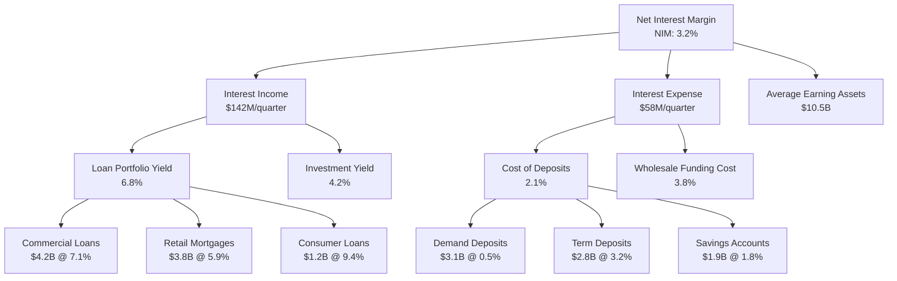
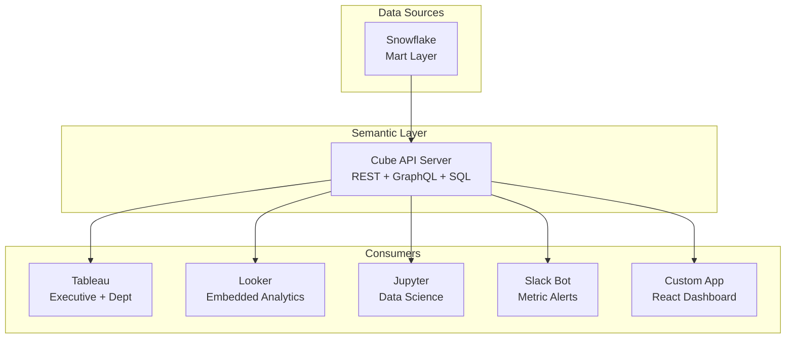

# A-01: BI Architecture — Acme Corp Banking Modernization

**Cliente:** Acme Corp | **Fecha:** 12 de marzo de 2026 | **Variante:** Técnica

## Resumen Ejecutivo

Acme Corp necesita una arquitectura de Business Intelligence que unifique las métricas financieras dispersas entre 4 departamentos, reemplace 87 dashboards no gobernados en Excel y Tableau, y habilite self-service analytics para 150+ analistas de negocio. Este documento define el framework de KPIs, diseño del semantic layer, jerarquía de dashboards, estrategia self-service, estándares de visualización, y governance de la plataforma BI.

### Decisiones Clave

| Decisión | Selección | Rationale |
|----------|-----------|-----------|
| North Star Metric | Net Interest Margin (NIM) | KPI principal del banco, refleja rentabilidad core |
| Semantic Layer | Cube (headless BI) | API REST/GraphQL multi-tool, Tableau + Looker + notebooks |
| BI Platform | Tableau (primary) + Looker (embedded) | Tableau para exploración, Looker para embedded analytics en portales |
| Self-Service | Governed sandbox en Snowflake | Analysts acceden marts certificados, sandbox para exploración |
| Dashboard Tiers | 4 niveles (L1-L4) | Executive, department, operational, ad-hoc |

---

## S1: KPI & Metric Framework

### Metric Tree — North Star Decomposition



### KPI Catalog — Top Level

| KPI | Definición | Fórmula | Owner | Frecuencia | Target |
|-----|-----------|---------|-------|-----------|--------|
| NIM | Net Interest Margin | (Interest Income - Interest Expense) / Avg Earning Assets | CFO | Daily | > 3.0% |
| ROE | Return on Equity | Net Income / Avg Shareholders' Equity | CFO | Monthly | > 12% |
| CIR | Cost-to-Income Ratio | Operating Expenses / Operating Income | COO | Monthly | < 55% |
| NPL Ratio | Non-Performing Loans | NPL Balance / Total Loan Portfolio | CRO | Weekly | < 2.5% |
| LCR | Liquidity Coverage Ratio | HQLA / Net Cash Outflows (30-day) | Treasurer | Daily | > 120% |
| CAR | Capital Adequacy Ratio | Total Capital / Risk-Weighted Assets | CRO | Monthly | > 12.5% |
| NPS | Net Promoter Score | % Promoters - % Detractors | CMO | Quarterly | > 45 |
| DAU/MAU | Digital Engagement | Daily Active / Monthly Active Users | CDO | Daily | > 35% |

### Leading vs Lagging Indicators

| Tipo | Métrica | Señal |
|------|---------|-------|
| Leading | New Account Applications | Predice crecimiento de depósitos en 30-60 días |
| Leading | Digital Channel Adoption Rate | Predice reducción de CIR por eficiencia operativa |
| Leading | Early-Stage Delinquency (30 DPD) | Predice NPL Ratio en 60-90 días |
| Lagging | NIM | Resultado de decisiones de pricing y mix de productos |
| Lagging | ROE | Resultado neto después de todas las variables |
| Lagging | NPS | Refleja experiencia acumulada del cliente |

---

## S2: Semantic Layer Design

### Cube Model — Core Banking Metrics

```yaml
cubes:
  - name: transactions
    sql_table: marts.fct_transactions
    measures:
      - name: total_amount
        type: sum
        sql: amount_usd
      - name: transaction_count
        type: count
      - name: avg_transaction_value
        type: avg
        sql: amount_usd
    dimensions:
      - name: transaction_date
        type: time
        sql: transaction_date
      - name: transaction_type
        sql: transaction_type
        type: string
      - name: channel
        sql: channel
        type: string
    joins:
      - name: accounts
        relationship: many_to_one
        sql: "{CUBE}.account_key = {accounts}.account_key"
```

### Semantic Layer Architecture



### Metric Drift Prevention

| Control | Implementación | Enforcement |
|---------|---------------|-------------|
| Single definition | Cada métrica definida una sola vez en Cube | CI blocks duplicate metric names |
| No dashboard formulas | Tableau calculated fields prohibidos para KPIs tier 1-2 | Quarterly audit + training |
| Version control | Cube schema en Git, PR review requerido | GitHub branch protection |
| Change log | Toda modificación de metric documented en CHANGELOG | PR template enforced |

---

## S3: Reporting Architecture

### Dashboard Hierarchy

| Tier | Audiencia | Refresh | Ejemplo | Métricas |
|------|-----------|---------|---------|----------|
| L1 Executive | Board, C-Suite | Daily 6:00 AM | CEO Dashboard | NIM, ROE, CIR, NPL, LCR, CAR |
| L2 Department | VPs, Directors | Hourly | Retail Banking | Deposits growth, loan origination, channel mix |
| L3 Operational | Managers, Team Leads | Near-real-time (15 min) | Branch Performance | Transactions/hour, queue time, SLA compliance |
| L4 Ad-Hoc | Analysts, Power Users | On-demand | Custom Analysis | Any certified metric via Cube API |

### Performance Budget

| Dashboard Tier | Initial Render | Query Execution | Data Freshness |
|---------------|---------------|----------------|----------------|
| L1 Executive | < 1.5s | < 3s | Daily by 6:00 AM |
| L2 Department | < 2s | < 5s | Hourly |
| L3 Operational | < 2s | < 5s | 15 min |
| L4 Ad-Hoc | < 3s | < 15s | On-demand |

### Embedded Analytics — Customer Portal

| Feature | Detalle |
|---------|---------|
| Platform | Looker Embed SDK (React) |
| Use Case | Account holders see spending analysis, budget tracking |
| Security | Row-level security via customer_id JWT claim |
| Theming | White-label with Acme Corp brand tokens |
| Load Time | < 2s (pre-aggregated via Cube) |
| Users | 180K monthly active customers |

---

## S4: Self-Service Analytics

### Access Zones

| Zone | Access | Data | Compute | Governance |
|------|--------|------|---------|-----------|
| Certified | All 150 analysts | Mart layer via Cube API | BI_WH (shared) | Metric definitions locked, RLS enforced |
| Exploratory | 35 power users | Staging + marts, Snowflake SQL | SANDBOX_WH (quotas: 5 min timeout, 1M rows) | Labeled "exploratory", no exec reporting |
| Raw | 8 data engineers | All sources | TRANSFORM_WH (isolated) | Full audit logging, no self-service |

### User Segmentation

| Persona | Count | Tools | Training |
|---------|-------|-------|----------|
| Consumer | 85 | Tableau viewer, Slack alerts | 2-hour dashboard literacy workshop |
| Explorer | 35 | Tableau Desktop, Cube Playground | 8-hour analytics fundamentals |
| Analyst | 22 | Tableau Desktop, SQL (Snowflake), Python notebooks | 16-hour advanced analytics |
| Data Engineer | 8 | dbt, Airflow, Snowflake admin | N/A (already skilled) |

### Feedback Loop

| Canal | SLA (Acknowledge) | SLA (Resolve) | Prioridad |
|-------|-------------------|---------------|-----------|
| Slack #data-requests | 4 horas | 5 business days | Normal |
| JIRA Data Request | 1 business day | 10 business days | Standard |
| PagerDuty (data outage) | 15 min | 4 horas | Critical |

---

## S5: Visualization Standards

### Chart Selection Guide

| Pregunta Analítica | Tipo de Chart | Ejemplo Banking |
|-------------------|--------------|-----------------|
| How has X changed over time? | Line chart | NIM trend over 12 months |
| How do categories compare? | Horizontal bar | Revenue by product line |
| What is the distribution? | Histogram | Transaction amount distribution |
| What is the composition? | Stacked bar | Deposit mix (demand, term, savings) |
| What is the correlation? | Scatter plot | Branch size vs profitability |
| What is the exact value? | Table / KPI card | Daily NIM, LCR, CAR |

### Anti-Patterns to Block

| Anti-Pattern | Problema | Alternativa |
|-------------|----------|-------------|
| Pie chart con 10+ categorías | Imposible comparar slices pequeños | Horizontal bar chart |
| Dual axis sin etiquetas claras | Confunde correlación con causalidad | Two separate charts |
| 3D charts | Distorsión visual | 2D equivalente |
| Axis truncado sin indicación | Exagera variaciones pequeñas | Start axis at 0 or annotate |
| Dashboard con 15+ KPIs | Sobrecarga cognitiva | Max 6-8 KPIs, drill-down para detalle |

### Color Palette

| Uso | Colores | Notas |
|-----|---------|-------|
| Brand primary | #1a365d (navy), #e53e3e (accent) | Headers, primary metrics |
| Sequential | Blues (#bee3f8 to #1a365d) | Volume, intensity metrics |
| Diverging | Red-White-Green | Positive/negative performance |
| Categorical | Max 6 distinct hues | WCAG 2.1 AA contrast >= 4.5:1 |
| Alertas | Green (#38a169), Yellow (#d69e2e), Red (#e53e3e) | Status indicators |

---

## S6: BI Platform & Governance

### Platform Architecture

| Component | Tool | Role | Cost Model |
|-----------|------|------|-----------|
| Primary BI | Tableau Server | Visualization, exploration, L1-L3 dashboards | $70/creator, $15/viewer per month |
| Embedded BI | Looker (Google) | Customer portal embedded analytics | Per-usage (API calls) |
| Semantic Layer | Cube Cloud | Headless BI API, metric consistency | $300/month (team plan) |
| SQL Editor | Snowflake Web UI + Hex | Ad-hoc analysis, notebook collaboration | Included in Snowflake |
| Alerting | Tableau + Slack integration | KPI threshold notifications | Included |

### Dashboard Governance

| Control | Regla | Enforcement |
|---------|-------|-------------|
| Naming convention | `{tier}_{domain}_{name}` (e.g., L1_Finance_NIM) | Tableau project structure |
| Certification | Only L1-L2 dashboards carry "certified" badge | Quarterly review by BI CoE |
| Archive policy | Dashboards with 0 views in 90 days → archived | Automated Tableau API scan |
| Change management | L1 changes require CFO/COO sign-off | Tableau content migration workflow |
| Access review | Quarterly permission audit | Automated user activity report |

### Usage Metrics (Current State)

| Métrica | Valor Actual | Target Q4 |
|---------|-------------|-----------|
| Total dashboards | 87 (ungoverned) | 35 (certified + governed) |
| Monthly active viewers | 92 | 150 |
| Avg dashboard load time | 4.8s | < 2s |
| Metric definitions (duplicated) | 23 definitions of "revenue" | 1 definition in Cube |
| License utilization | 62% | > 85% |

---

## Conclusiones y Recomendaciones

1. **Consolidar las 23 definiciones duplicadas de "revenue"** en una sola definición en Cube, eliminando calculated fields en Tableau — esto es la causa raíz del 40% de los tickets de "mis números no coinciden".
2. **Reducir de 87 a 35 dashboards** mediante auditoría de uso (dashboards con 0 views en 90 días se archivan), certificación de L1-L2, y training para migrar Excel reports a self-service.
3. **Implementar Cube como semantic layer** antes de expandir Looker embedded — sin semántica unificada, el portal de clientes mostrará métricas inconsistentes con los dashboards internos.
4. **Establecer performance budget** de <2s render para L1-L2 — el tiempo actual de 4.8s está causando abandono por parte de ejecutivos que vuelven a pedir reports en Excel.
5. **Lanzar programa de data literacy** para los 85 consumidores actuales — self-service sin capacitación genera tickets, no autonomía.

---

**Autor:** Javier Montaño — MetodologIA Discovery Framework v6.0
