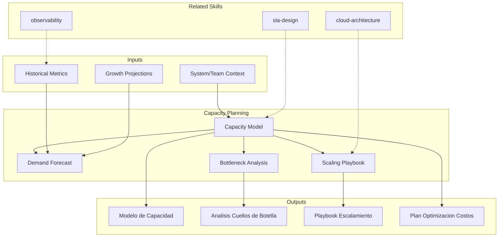

# Capacity Planning: Infrastructure & Team Forecasting

Capacity planning projects future resource needs for infrastructure and teams, defining scaling triggers and optimization strategies. The skill produces capacity models, scaling playbooks, and bottleneck analyses that prevent both under-provisioning (outages) and over-provisioning (waste).

## TL;DR

- Modela capacidad actual y proyecta demanda futura basada en metricas de crecimiento
- Define triggers de escalamiento automatico y manual con umbrales claros
- Identifica cuellos de botella en infraestructura, datos, y equipos humanos
- Produce playbook de escalamiento con procedimientos paso a paso
- Optimiza costos eliminando sobre-aprovisionamiento sin comprometer disponibilidad

## Inputs

The user provides a system or team context as `$ARGUMENTS`. Parse `$1` as the **system/team name**.

**Parameters:**
- `{MODO}`: `piloto-auto` (default) | `desatendido` | `supervisado` | `paso-a-paso`
- `{FORMATO}`: `markdown` (default) | `html` | `dual`
- `{VARIANTE}`: `ejecutiva` (~40%) | `tecnica` (full, default)
- `{HORIZONTE}`: `3m` | `6m` | `12m` (default) | `24m`

## Entregables

1. **Modelo de capacidad** — Current utilization baseline, growth projections, and headroom analysis per resource type
2. **Playbook de escalamiento** — Step-by-step scaling procedures for each resource tier with triggers and validation
3. **Analisis de cuellos de botella** — Identified bottlenecks with impact assessment and remediation options
4. **Plan de optimizacion de costos** — Right-sizing recommendations, reserved capacity strategy, spot/preemptible usage
5. **Dashboard de metricas** — Key capacity indicators, thresholds, and alerting rules

## Proceso

1. **Establecer baseline** — Measure current utilization across compute, storage, network, database, and team capacity
2. **Analizar patrones de demanda** — Identify peak/off-peak patterns, seasonal trends, and growth drivers
3. **Proyectar demanda** — Forecast future demand using historical trends, business growth plans, and planned feature launches
4. **Identificar cuellos de botella** — Find resources approaching limits; analyze cascading failure scenarios
5. **Definir triggers de escalamiento** — Set autoscaling thresholds (CPU, memory, queue depth, latency) with hysteresis to prevent flapping
6. **Disenar playbook** — Document scaling procedures: automated triggers, manual escalation, validation checks, rollback
7. **Optimizar costos** — Recommend right-sizing, reserved instances, spot usage, and resource consolidation
8. **Planificar capacidad de equipo** — Project team staffing needs based on delivery velocity and planned initiatives

## Criterios de Calidad

- [ ] Baseline utilization measured with real data, not estimates
- [ ] Growth projections documented with assumptions and confidence levels
- [ ] Bottleneck analysis covers compute, storage, network, database, and external dependencies
- [ ] Scaling triggers include hysteresis to prevent oscillation
- [ ] Playbook tested or validated against historical scaling events
- [ ] Cost optimization quantified with projected savings
- [ ] Team capacity considers hiring lead times and ramp-up periods
- [ ] Evidence tags applied: [DOC], [CONFIG], [INFERENCIA], [SUPUESTO]

## Supuestos y Limites

- Accuracy depends on quality of historical utilization data
- Growth projections are estimates based on stated business assumptions
- Does not implement autoscaling — produces configuration recommendations
- Team capacity models assume stable velocity (adjust for ramp-up, attrition)

## Casos Borde

1. **Ausencia de datos historicos de utilizacion** — Si no hay metricas historicas, el skill genera un modelo basado en benchmarks de industria y proyecciones de negocio, marcado con [SUPUESTO], y define un plan de instrumentacion para obtener datos reales en 30 dias.
2. **Patrones de demanda altamente estacionales** — Eventos como Black Friday o cierre fiscal crean picos de 10-50x sobre baseline; el modelo incluye proyecciones de pico con estrategia de pre-scaling y cooldown.
3. **Restricciones de presupuesto rigidas** — Cuando el presupuesto no permite headroom optimo, el skill genera escenarios de riesgo (que falla primero) y propone optimizaciones de costo como reserved instances o spot para cargas tolerantes.
4. **Equipos humanos con alta rotacion** — El modelo de capacidad de equipo ajusta velocity por curvas de ramp-up de nuevos miembros y factor de attrition historico.

## Decisiones y Trade-offs

1. **Horizonte 12 meses default vs. 6 meses** — 12 meses permite planificar presupuesto anual y ciclos de compra de infraestructura; horizontes mas largos pierden precision pero se ofrecen como opcion.
2. **Hysteresis en triggers vs. umbrales simples** — Se requiere hysteresis para evitar flapping (escalar/desescalar repetidamente), aceptando mayor latencia en la respuesta a cambios de carga.
3. **Modelo de capacidad unificado vs. por recurso** — Se modela por tipo de recurso (compute, storage, network, DB) porque cada uno tiene patrones de crecimiento y limites diferentes.
4. **Capacidad de equipo como entregable vs. opcional** — Se incluye porque la capacidad humana es frecuentemente el cuello de botella real, aunque requiere inputs mas subjetivos que la infra.

## Knowledge Graph

## Output Templates

### Markdown (default)
- Filename: `ops_capacity-plan_{sistema}_{WIP}.md`
- Structure: TL;DR -> Baseline actual (tablas) -> Proyeccion de demanda (Mermaid timeline) -> Cuellos de botella -> Playbook de escalamiento -> Plan de costos

### XLSX
- Filename: `ops_capacity-model_{sistema}_{WIP}.xlsx`
- Hojas: Baseline Metrics | Growth Projections | Scaling Triggers | Cost Optimization | Team Capacity

### HTML (bajo demanda)
- Filename: `ops_capacity-plan_{sistema}_{WIP}.html`
- Estructura: HTML self-contained branded (Design System MetodologIA v5). Light-First Technical page con modelo de capacidad como tablas interactivas, proyecciones de demanda como timeline, y playbook de escalamiento con pasos colapsables. WCAG AA, responsive, print-ready.

### DOCX (bajo demanda)
- Filename: `{fase}_{entregable}_{cliente}_{WIP}.docx`
- Via python-docx con Design System MetodologIA v5. Cover page, TOC auto, headers/footers branded, tablas zebra. Para circulacion formal y auditoria.

### PPTX (bajo demanda)
- Filename: `{fase}_{entregable}_{cliente}_{WIP}.pptx`
- Via python-pptx con MetodologIA Design System v5. Slide master con gradiente navy, titulos Poppins, cuerpo Montserrat, acentos gold. Max 20 slides (ejecutiva) / 30 slides (tecnica). Speaker notes con referencias de evidencia. Para comites directivos y presentaciones C-level.

## Evaluacion

| Dimension | Peso | Criterio |
|-----------|------|----------|
| Trigger Accuracy | 10% | Activa ante "capacity", "scaling", "forecast" sin confundir con sizing puntual o performance testing |
| Completeness | 25% | Cubre infra (compute, storage, network, DB) y capacidad humana sin huecos |
| Clarity | 20% | Triggers de escalamiento son numericos y accionables, no vagos |
| Robustness | 20% | Maneja ausencia de datos, estacionalidad extrema y restricciones de presupuesto |
| Efficiency | 10% | 8 pasos progresivos sin redundancia; cada uno alimenta al siguiente |
| Value Density | 15% | Modelo de capacidad y playbook son directamente operacionalizables |

**Umbral minimo**: 7/10 en cada dimension para considerar el skill production-ready.

## Cross-References

- **metodologia-cloud-architecture:** Cloud infrastructure that provides scaling capabilities
- **metodologia-observability:** Monitoring data that feeds capacity models
- **metodologia-sla-design:** SLO targets that define minimum acceptable capacity

---
**Autor:** Javier Montaño · Comunidad MetodologIA | **Version:** 1.0.0
