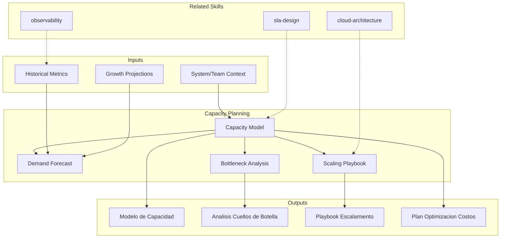

# Capacity Planning: Infrastructure & Team Forecasting

Capacity planning projects future resource needs for infrastructure and teams, defining scaling triggers and optimization strategies. The skill produces capacity models, scaling playbooks, and bottleneck analyses that prevent both under-provisioning (outages) and over-provisioning (waste).

## Grounding Guideline

> *You cannot scale what you cannot measure. You cannot plan what you cannot project.*

1. **Data before instinct.** Every capacity projection must start from real historical metrics, not optimistic estimates.
2. **Over-provisioning is waste. Under-provisioning is failure.** The art of capacity planning is finding the right margin between cost and availability.
3. **Capacity is not just infrastructure.** Teams, processes, and budget are capacity dimensions as critical as CPU and memory.

## TL;DR

- Models current capacity and projects future demand based on growth metrics
- Defines automatic and manual scaling triggers with clear thresholds
- Identifies bottlenecks in infrastructure, data, and human teams
- Produces scaling playbook with step-by-step procedures
- Optimizes costs by eliminating over-provisioning without compromising availability

## Inputs

The user provides a system or team context as `$ARGUMENTS`. Parse `$1` as the **system/team name**.

**Parameters:**
- `{MODO}`: `piloto-auto` (default) | `desatendido` | `supervisado` | `paso-a-paso`
- `{FORMATO}`: `markdown` (default) | `html` | `dual`
- `{VARIANTE}`: `ejecutiva` (~40%) | `tecnica` (full, default)
- `{HORIZONTE}`: `3m` | `6m` | `12m` (default) | `24m`

## Deliverables

1. **Capacity Model** — Current utilization baseline, growth projections, and headroom analysis per resource type
2. **Scaling Playbook** — Step-by-step scaling procedures for each resource tier with triggers and validation
3. **Bottleneck Analysis** — Identified bottlenecks with impact assessment and remediation options
4. **Cost Optimization Plan** — Right-sizing recommendations, reserved capacity strategy, spot/preemptible usage
5. **Metrics Dashboard** — Key capacity indicators, thresholds, and alerting rules

## Process

1. **Establish baseline** — Measure current utilization across compute, storage, network, database, and team capacity
2. **Analyze demand patterns** — Identify peak/off-peak patterns, seasonal trends, and growth drivers
3. **Project demand** — Forecast future demand using historical trends, business growth plans, and planned feature launches
4. **Identify bottlenecks** — Find resources approaching limits; analyze cascading failure scenarios
5. **Define scaling triggers** — Set autoscaling thresholds (CPU, memory, queue depth, latency) with hysteresis to prevent flapping
6. **Design playbook** — Document scaling procedures: automated triggers, manual escalation, validation checks, rollback
7. **Optimize costs** — Recommend right-sizing, reserved instances, spot usage, and resource consolidation
8. **Plan team capacity** — Project team staffing needs based on delivery velocity and planned initiatives

## Quality Criteria

- [ ] Baseline utilization measured with real data, not estimates
- [ ] Growth projections documented with assumptions and confidence levels
- [ ] Bottleneck analysis covers compute, storage, network, database, and external dependencies
- [ ] Scaling triggers include hysteresis to prevent oscillation
- [ ] Playbook tested or validated against historical scaling events
- [ ] Cost optimization quantified with projected savings
- [ ] Team capacity considers hiring lead times and ramp-up periods
- [ ] Evidence tags applied: [DOC], [CONFIG], [INFERENCIA], [SUPUESTO]

## Assumptions and Limits

- Accuracy depends on quality of historical utilization data
- Growth projections are estimates based on stated business assumptions
- Does not implement autoscaling — produces configuration recommendations
- Team capacity models assume stable velocity (adjust for ramp-up, attrition)

## Edge Cases

1. **Absence of historical utilization data** — If there are no historical metrics, the skill generates a model based on industry benchmarks and business projections, tagged with [SUPUESTO], and defines an instrumentation plan to obtain real data within 30 days.
2. **Highly seasonal demand patterns** — Events like Black Friday or fiscal year-end create 10-50x spikes over baseline; the model includes peak projections with pre-scaling and cooldown strategy.
3. **Rigid budget constraints** — When the budget does not allow optimal headroom, the skill generates risk scenarios (what fails first) and proposes cost optimizations like reserved instances or spot for tolerant workloads.
4. **Human teams with high turnover** — The team capacity model adjusts velocity for ramp-up curves of new members and historical attrition factor.

## Decisions and Trade-offs

1. **12-month default horizon vs. 6 months** — 12 months enables annual budget planning and infrastructure procurement cycles; longer horizons lose precision but are offered as an option.
2. **Hysteresis in triggers vs. simple thresholds** — Hysteresis is required to prevent flapping (scaling/descaling repeatedly), accepting higher latency in response to load changes.
3. **Unified capacity model vs. per resource** — Modeling per resource type (compute, storage, network, DB) because each has different growth patterns and limits.
4. **Team capacity as deliverable vs. optional** — Included because human capacity is frequently the real bottleneck, even though it requires more subjective inputs than infrastructure.

## Knowledge Graph

## Output Templates

### Markdown (default)
- Filename: `ops_capacity-plan_{sistema}_{WIP}.md`
- Structure: TL;DR -> Baseline actual (tablas) -> Proyeccion de demanda (Mermaid timeline) -> Cuellos de botella -> Playbook de escalamiento -> Plan de costos

### XLSX
- Filename: `ops_capacity-model_{sistema}_{WIP}.xlsx`
- Hojas: Baseline Metrics | Growth Projections | Scaling Triggers | Cost Optimization | Team Capacity

### HTML (bajo demanda)
- Filename: `ops_capacity-plan_{sistema}_{WIP}.html`
- Estructura: HTML self-contained branded (Design System MetodologIA v5). Light-First Technical page con modelo de capacidad como tablas interactivas, proyecciones de demanda como timeline, y playbook de escalamiento con pasos colapsables. WCAG AA, responsive, print-ready.

### DOCX (bajo demanda)
- Filename: `{fase}_{entregable}_{cliente}_{WIP}.docx`
- Via python-docx con Design System MetodologIA v5. Cover page, TOC auto, headers/footers branded, tablas zebra. Para circulacion formal y auditoria.

### PPTX (bajo demanda)
- Filename: `{fase}_{entregable}_{cliente}_{WIP}.pptx`
- Via python-pptx con MetodologIA Design System v5. Slide master con gradiente navy, titulos Poppins, cuerpo Trebuchet MS, acentos gold. Max 20 slides (ejecutiva) / 30 slides (tecnica). Speaker notes con referencias de evidencia. Para comites directivos y presentaciones C-level.

## Evaluacion

| Dimension | Peso | Criterio |
|-----------|------|----------|
| Trigger Accuracy | 10% | Activa ante "capacity", "scaling", "forecast" sin confundir con sizing puntual o performance testing |
| Completeness | 25% | Cubre infra (compute, storage, network, DB) y capacidad humana sin huecos |
| Clarity | 20% | Triggers de escalamiento son numericos y accionables, no vagos |
| Robustness | 20% | Maneja ausencia de datos, estacionalidad extrema y restricciones de presupuesto |
| Efficiency | 10% | 8 pasos progresivos sin redundancia; cada uno alimenta al siguiente |
| Value Density | 15% | Modelo de capacidad y playbook son directamente operacionalizables |

**Umbral minimo**: 7/10 en cada dimension para considerar el skill production-ready.

## Cross-References

- **metodologia-cloud-architecture:** Cloud infrastructure that provides scaling capabilities
- **metodologia-observability:** Monitoring data that feeds capacity models
- **metodologia-sla-design:** SLO targets that define minimum acceptable capacity

---
**Autor:** Javier Montaño · Comunidad MetodologIA | **Version:** 1.0.0
