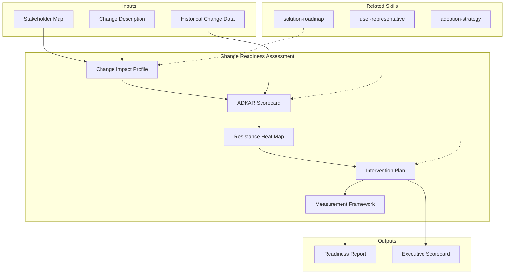

# Change Readiness Assessment

Generates a structured organizational readiness evaluation: stakeholder impact analysis, ADKAR-based readiness scoring, resistance heat map, change capacity assessment, and prioritized intervention plan.

## Grounding Guideline

> *You cannot adopt what you do not understand, and you cannot understand what you have not diagnosed. Resistance to change is not the enemy — it is information.*

1. **Resistance is data, not an obstacle.** Every point of resistance reveals an unmet need, an uncommunicated risk, or an absent capability. The diagnosis transforms resistance into intervention requirements.
2. **Readiness is measured, not assumed.** Intuitions about "the team is ready" are insufficient. Every dimension of preparedness has observable and measurable indicators.
3. **Technical change without organizational change is shelfware.** The best architecture fails if the organization cannot absorb it.

## Inputs

- `$1` — Path to project context (discovery artifacts, stakeholder maps, org charts)
- `$2` — Assessment scope: `full` (default), `pulse` (quick check), `continuous` (periodic)

Parse from `$ARGUMENTS`.

**Parameters:**
- `{MODO}`: `piloto-auto` (default) | `desatendido` | `supervisado` | `paso-a-paso`
- `{FORMATO}`: `markdown` (default) | `html` | `dual`
- `{MODO_OPERACIONAL}`: `diagnostico` (default, full assessment) | `rapido` (quick pulse check, 5 dimensions only) | `continuo` (periodic re-assessment with delta tracking)
- `{VARIANTE}`: `ejecutiva` (~40% — scorecard + top interventions) | `técnica` (full, default)

## Input Requirements

**Mandatory:**
- Stakeholder map or organizational chart (at minimum, key roles affected by the change)
- Description of the proposed change (technical transformation, new system, process change)

**Recommended:**
- Previous discovery artifacts (AS-IS analysis, scenario analysis, solution roadmap)
- Historical change data (previous transformation attempts, lessons learned)
- Team composition and tenure data
- Current communication channels and feedback mechanisms

## Assumptions & Limits

**Assumptions:**
- Change initiative has a defined scope (not "everything is changing")
- At least 3 stakeholder groups identifiable
- Organization has some formal communication structure

**Cannot do:**
- Replace human interviews for sentiment analysis (can structure interview guides)
- Predict individual behavior (works at group/role level)
- Assess political dynamics beyond observable indicators
- Provide therapy or conflict resolution

## Workarounds When Inputs Missing

| Missing Input | Impact | Workaround |
|---|---|---|
| No stakeholder map | Cannot segment readiness | Infer from org chart + project RACI; flag as [INFERENCIA] |
| No change description | Cannot assess impact | Use solution roadmap or AS-IS delta; flag scope |
| No historical data | Cannot benchmark | Use industry benchmarks (Prosci data); flag as [SUPUESTO] |
| No org chart | Cannot map cascade | Use project team structure as proxy |

## Edge Cases

- **Merger/acquisition context:** Dual-org assessment. Separate scorecards per entity + combined view.
- **Remote/distributed teams:** Add digital readiness dimension. Weight communication channels differently.
- **Regulated industry:** Add compliance change dimension. Regulatory training as mandatory intervention.
- **Startup/small org (<50):** Simplify to 3 dimensions (awareness, capability, willingness). Skip formal cascade.
- **Change fatigue detected:** Escalate. Recommend change moratorium assessment before adding new change.
- **Union/works council presence:** Add formal consultation dimension. Legal review of intervention plan.

## Trade-off Matrix

| Decision | Enables | Constrains | When to Use |
|---|---|---|---|
| **Full ADKAR assessment** | Granular dimension scoring, targeted interventions | 3-5 days, requires stakeholder access | High-impact transformation, regulated environments |
| **Quick pulse (rapido)** | Fast signal, trend tracking | Misses nuance, no intervention plan | Periodic check-ins, early project phases |
| **Continuous tracking** | Trend visibility, early warning | Ongoing effort, survey fatigue risk | Multi-phase transformations >6 months |

## 7-Section Framework

### S1: Change Impact Profile
Scope definition: what is changing (technology, process, roles, culture). Impact matrix by stakeholder group. Change magnitude assessment (incremental → transformational scale 1-5).

### S2: Stakeholder Readiness Scorecard (ADKAR)
Per stakeholder group, score 1-5 on each ADKAR dimension:
- **Awareness:** Do they understand WHY the change is needed?
- **Desire:** Do they WANT to participate and support?
- **Knowledge:** Do they know HOW to change?
- **Ability:** Can they IMPLEMENT the required skills/behaviors?
- **Reinforcement:** Are there mechanisms to SUSTAIN the change?

Barrier point = lowest-scoring dimension per group. Composite readiness score.

### S3: Resistance Heat Map
Per stakeholder group: resistance level (1-5), resistance type (cognitive, emotional, behavioral, political), root causes, observable indicators. Heat map visualization (group x dimension).

### S4: Change Capacity Assessment
Organization-level evaluation: concurrent change load, change history (success rate), leadership alignment, communication infrastructure, training capacity, budget for change management.

### S5: Risk Register (Change-specific)
Top risks to adoption: probability x impact. Per risk: category (people, process, technology, timing), current mitigations, recommended interventions.

### S6: Intervention Plan
Per barrier point identified in S2: targeted intervention, delivery mechanism, timeline, responsible party, success metric. Prioritized by: impact x feasibility.

### S7: Measurement Framework
KPIs for tracking readiness over time: adoption rate, proficiency rate, utilization rate, satisfaction score. Measurement cadence. Dashboard specification.

## Cross-Section Traceability

- S1 Impact Profile → S2 Readiness (impact determines which groups to assess)
- S2 ADKAR Scores → S3 Resistance (low scores = resistance indicators)
- S3 Resistance → S6 Interventions (resistance type determines intervention type)
- S4 Capacity → S6 Interventions (capacity constrains intervention feasibility)
- S5 Risks → S6 Interventions (risks drive mandatory interventions)
- S6 Interventions → S7 Measurement (each intervention has success metric)

## Escalation to Human

- ADKAR scores <2 across >50% of stakeholder groups (systemic unreadiness)
- Active resistance from executive sponsor
- Change fatigue score >4 (organization overwhelmed)
- Political dynamics require mediation beyond assessment scope
- Union/legal constraints on proposed interventions

## Execution Workflow

1. **Scoping (30 min):** Define change, identify stakeholder groups, select assessment depth
2. **Data Collection (2-4 hours):** Gather artifacts, analyze stakeholder map, review historical data
3. **ADKAR Scoring (2-3 hours):** Score each group on 5 dimensions with evidence
4. **Synthesis (2-3 hours):** Resistance map, risk register, intervention plan, measurement framework

**Typical engagement:** 2-3 days for organizations with <500 affected stakeholders.

## Output Configuration

- **Language**: Spanish (Latin American, business register — simple, clear, concise, direct)
- **Attribution**: Expert committee of the MetodologIA Discovery Framework
- **Tagline**: *"Construido por profesionales, potenciado por la red agéntica de MetodologIA."*

## Output Artifact

**Primary:** `Evaluacion_Readiness_{project}.md` (or `.html` if `{FORMATO}=html|dual`) — Full 7-section readiness assessment with ADKAR scorecards, resistance heat map, and intervention plan.

**Secondary:** `Readiness_Scorecard_{project}.md` — Executive summary (S2 composite scores + top 3 interventions).

**Included diagrams:**
- Quadrant chart: stakeholder readiness positioning (readiness x influence)
- Heatmap: resistance by group x dimension
- Flowchart: intervention cascade logic

## Validation Gate

- [ ] All 7 sections populated with evidence-based content (no placeholders)
- [ ] ADKAR scores backed by observable indicators, not assumptions
- [ ] Every intervention linked to specific barrier point from S2
- [ ] Resistance heat map covers all stakeholder groups from S1
- [ ] Risk register quantified (probability x impact)
- [ ] Measurement framework has concrete KPIs with targets
- [ ] Cross-section traceability complete

## Output Format Protocol

| Format | Default | Description |
|--------|---------|-------------|
| `markdown` | ✅ | Rich Markdown + Mermaid diagrams. Token-efficient. |
| `html` | On demand | Branded HTML (Design System). Visual impact. |
| `dual` | On demand | Both formats. |

## Operational Modes

| Mode | Focus | Best For |
|---|---|---|
| `diagnostico` (default) | Full 7-section assessment | Pre-transformation, Phase 5b |
| `rapido` | S1 + S2 + S3 only, simplified scoring | Pulse checks, early phases |
| `continuo` | Delta tracking vs. previous assessment, trend analysis | Multi-phase programs |

## Additional Resources

### References (Progressive Disclosure — Level 3)
- `Read ${CLAUDE_SKILL_DIR}/references/knowledge-graph.mmd` — Domain knowledge graph
- `Read ${CLAUDE_SKILL_DIR}/references/body-of-knowledge.md` — Academic and industry sources
- `Read ${CLAUDE_SKILL_DIR}/references/state-of-the-art.md` — Trends 2024-2026

### Examples
- `Read ${CLAUDE_SKILL_DIR}/examples/sample-output.md` — Golden reference output
- `Read ${CLAUDE_SKILL_DIR}/examples/sample-output.html` — Branded HTML

### Prompts
- `Read ${CLAUDE_SKILL_DIR}/prompts/use-case-prompts.md` — Ready-to-use prompts
- `Read ${CLAUDE_SKILL_DIR}/prompts/metaprompts.md` — Meta-strategies

## Edge Cases

| Case | Handling Strategy |
|------|---------------------|
| Organization undergoing simultaneous M&A and technology transformation | Produce dual-org ADKAR scorecards (acquiring + acquired entity); create a combined view with weighted averages; flag culture clash as a dedicated risk dimension |
| ADKAR scores are uniformly low (<2) across all stakeholder groups | Escalate to executive sponsor immediately; recommend a "readiness sprint" (4-6 weeks) before proceeding with transformation; the organization is not ready to absorb the change |
| Change readiness assessment requested but no stakeholder map exists | Infer stakeholder groups from org chart, project RACI, or solution roadmap team section; tag all groupings as [INFERENCIA]; recommend stakeholder mapping as a prerequisite |
| Assessment reveals executive sponsor is the primary source of resistance | Document the finding with observable indicators only (not personal judgments); escalate to the next governance level; recommend executive coaching or sponsor replacement as intervention options |

## Decisions and Trade-offs

| Decision | Discarded Alternative | Justification |
|----------|----------------------|---------------|
| Use ADKAR as the primary readiness framework | Kotter 8-Step or Lewin 3-Phase models | ADKAR provides per-dimension scoring at the individual/group level, enabling targeted interventions; Kotter and Lewin are organizational-level and harder to operationalize for specific barrier points |
| Measure readiness at stakeholder-group level, not individual level | Individual-level assessment for every affected person | Individual assessment does not scale beyond 50 people; group-level patterns are sufficient for intervention design and respect assessment effort constraints |
| Require observable indicators for every ADKAR score | Allow self-reported readiness surveys as primary evidence | Self-reported readiness suffers from social desirability bias; observable indicators (attendance, participation, skill demonstrations) provide more reliable data |

## Knowledge Graph

## Output Templates

### Markdown (default)
- Filename: `Evaluacion_Readiness_{cliente}_{WIP}.md`
- Structure: TL;DR > Change Impact Profile > ADKAR Scorecards per group > Resistance Heat Map > Change Capacity > Risk Register > Intervention Plan > Measurement KPIs > Mermaid quadrant + heatmap + flowchart > ghost menu

### PPTX
- Filename: `Evaluacion_Readiness_{cliente}_{WIP}.pptx`
- Structure: Executive summary slide > Impact profile visual > ADKAR radar chart per group > Heat map slide > Top 5 interventions > KPI dashboard spec; speaker notes with evidence and escalation triggers

### HTML (bajo demanda)
- Filename: `Evaluacion_Readiness_{cliente}_{WIP}.html`
- Estructura: HTML self-contained branded (Design System MetodologIA v5). Dark-First Executive page con ADKAR scorecards por grupo, resistance heatmap interactivo, y plan de intervenciones priorizado. WCAG AA, responsive, print-ready.

### DOCX (bajo demanda)
- Filename: `{fase}_{entregable}_{cliente}_{WIP}.docx`
- Via python-docx con Design System MetodologIA v5. Cover page, TOC auto, headers/footers branded, tablas zebra. Para circulacion formal y auditoria.

### XLSX (bajo demanda)
- Filename: `{fase}_{entregable}_{cliente}_{WIP}.xlsx`
- Via openpyxl con Design System MetodologIA v5. Headers branded (fondo navy, texto blanco, Poppins), formato condicional con colores semaforo, auto-filtros, valores sin formulas. Para scorecard ADKAR por grupo de stakeholders, registro de riesgos de cambio y tracking del plan de intervenciones.

## Evaluacion

| Dimension | Peso | Criterio |
|-----------|------|----------|
| Trigger Accuracy | 10% | Descripcion activa triggers correctos sin falsos positivos |
| Completeness | 25% | Todos los entregables cubren el dominio sin huecos |
| Clarity | 20% | Instrucciones ejecutables sin ambiguedad |
| Robustness | 20% | Maneja edge cases y variantes de input |
| Efficiency | 10% | Proceso no tiene pasos redundantes |
| Value Density | 15% | Cada seccion aporta valor practico directo |

**Umbral minimo**: 7/10 en cada dimension para considerar el skill production-ready.

---
