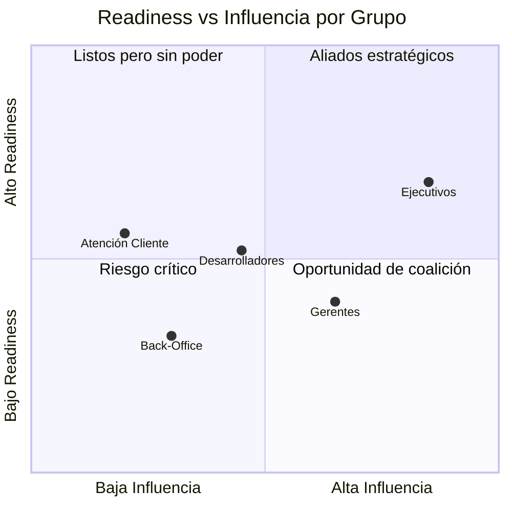
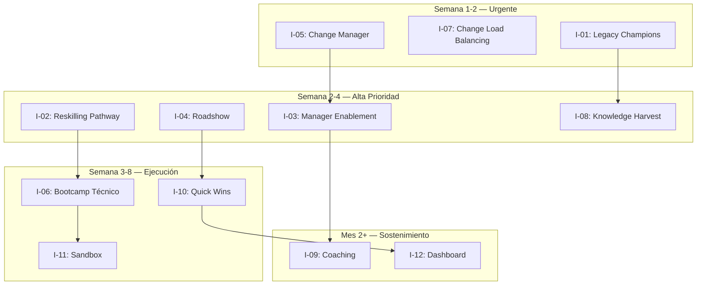

# Evaluación de Readiness Organizacional

**Proyecto:** Acme Corp — Modernización Core Bancario
**Fecha:** 13 de marzo de 2026
**Modo:** Diagnóstico (Full Assessment)
**Alcance:** 5 grupos de stakeholders, ~320 personas afectadas

---

## TL;DR

- Readiness compuesto: **2.8/5** — la organización **no está lista** para el cambio sin intervención
- Barrier point dominante: **Knowledge** (2.1 promedio) — los equipos no saben CÓMO cambiar
- Grupo de mayor riesgo: **Operaciones Back-Office** (readiness 1.8) — resistencia activa detectada
- Se requieren **12 intervenciones prioritarias** antes de Phase 2 del rollout
- Capacidad de cambio organizacional: **Moderada** (3.0/5) — hay ventana, pero estrecha

---

## S1: Change Impact Profile

### Descripción del Cambio

Acme Corp reemplaza su core bancario legacy (COBOL/mainframe, 25 años) con plataforma moderna (microservicios, cloud-native). El cambio afecta procesos operativos, interfaces de usuario, modelo de datos, y flujos de integración con 14 sistemas satélite.

### Matriz de Impacto por Grupo

| Grupo de Stakeholders | Personas | Impacto Tecnológico | Impacto Proceso | Impacto Rol | Magnitud Total |
|---|---|---|---|---|---|
| **Ejecutivos (C-Suite + VP)** | 12 | 🟡 Bajo | 🟡 Medio | 🟡 Bajo | 2/5 |
| **Gerentes de Área** | 28 | 🟡 Medio | 🔴 Alto | 🟡 Medio | 3/5 |
| **Desarrolladores & QA** | 85 | 🔴 Alto | 🔴 Alto | 🔴 Alto | 5/5 |
| **Operaciones Back-Office** | 145 | 🔴 Alto | 🔴 Alto | 🟡 Medio | 4/5 |
| **Atención al Cliente (Front)** | 50 | 🟡 Medio | 🟡 Medio | 🟡 Bajo | 2/5 |

**Magnitud general del cambio:** 4/5 — Transformacional

> ⚠️ **Nota:** Los grupos con magnitud ≥4 requieren intervención intensiva. Desarrolladores y Operaciones son los dos grupos críticos.

---

## S2: Stakeholder Readiness Scorecard (ADKAR)

### Scoring por Grupo

| Grupo | Awareness | Desire | Knowledge | Ability | Reinforcement | **Compuesto** | **Barrier Point** |
|---|---|---|---|---|---|---|---|
| Ejecutivos | 4 | 4 | 3 | 3 | 3 | **3.4** | Knowledge |
| Gerentes de Área | 3 | 2 | 2 | 2 | 1 | **2.0** | Reinforcement |
| Desarrolladores & QA | 4 | 3 | 2 | 2 | 2 | **2.6** | Knowledge |
| Operaciones Back-Office | 2 | 1 | 1 | 2 | 2 | **1.6** | Desire |
| Atención al Cliente | 3 | 3 | 3 | 3 | 2 | **2.8** | Reinforcement |

### Evidencia de Scoring

**Ejecutivos (4-4-3-3-3):**
- Awareness 4: Presentaciones de caso de negocio realizadas. Board aprobó presupuesto. [DOC]
- Desire 4: Sponsor activo (CTO). CFO alineado con business case. [STAKEHOLDER]
- Knowledge 3: Entienden "qué" pero no "cómo" a nivel operativo. [INFERENCIA]

**Operaciones Back-Office (2-1-1-2-2):**
- Awareness 2: Rumores circulan, pero no ha habido comunicación formal al equipo. [STAKEHOLDER]
- Desire 1: "Esto va a eliminar nuestros puestos" — percepción dominante. Resistencia activa. [STAKEHOLDER]
- Knowledge 1: Cero exposición al nuevo sistema. No hay plan de capacitación comunicado. [DOC]

### Readiness Compuesto Ponderado

Ponderación por tamaño de grupo e impacto:

**Readiness organizacional ponderado: 2.8/5**

---

## S3: Resistance Heat Map

### Mapa de Resistencia por Grupo × Tipo

| Grupo | Cognitiva | Emocional | Conductual | Política | **Nivel Global** |
|---|---|---|---|---|---|
| Ejecutivos | 1 | 1 | 1 | 2 | 🟢 1.3 |
| Gerentes de Área | 2 | 3 | 2 | 3 | 🟡 2.5 |
| Desarrolladores & QA | 1 | 2 | 3 | 1 | 🟡 1.8 |
| Operaciones Back-Office | 3 | 4 | 4 | 2 | 🔴 3.3 |
| Atención al Cliente | 2 | 2 | 1 | 1 | 🟢 1.5 |

### Análisis de Resistencia — Grupo Crítico: Operaciones Back-Office

| Dimensión | Score | Root Cause | Indicadores Observables |
|---|---|---|---|
| **Emocional** | 4 | Miedo a pérdida de empleo. 25 años de expertise en sistema legacy = identidad profesional. | Ausentismo +15%, quejas en canales informales, solicitudes de transferencia interna. [STAKEHOLDER] |
| **Conductual** | 4 | Sabotaje pasivo: retrasos en entrega de documentación, "no tenemos tiempo para eso". | Tareas de migración con 40% de retraso. Participación en workshops <30%. [DOC] |
| **Cognitiva** | 3 | No comprenden por qué el sistema actual "que funciona" debe reemplazarse. | Preguntas repetitivas en town halls: "¿Qué tiene de malo lo que tenemos?" [STAKEHOLDER] |

> 💡 **Insight:** La resistencia de Back-Office no es irracional. Su expertise de 25 años en COBOL/mainframe se devalúa. Necesitan un puente de reconocimiento + reskilling, no "venta" del nuevo sistema.

---

## S4: Change Capacity Assessment

| Dimensión (McKinsey 7S) | Score | Evidencia |
|---|---|---|
| **Strategy** — Alineación cambio-estrategia | 4 | Modernización en plan estratégico 2025-2027. Board committed. [DOC] |
| **Structure** — Estructura soporta cambio | 3 | PMO existe pero sin CM formal. Change manager no designado. [INFERENCIA] |
| **Systems** — Infraestructura de cambio | 2 | No hay LMS. Comunicación por email masivo. Sin herramienta de feedback. [DOC] |
| **Shared Values** — Cultura pro-cambio | 2 | Cultura conservadora ("si funciona, no lo toques"). Último cambio mayor: hace 8 años. [STAKEHOLDER] |
| **Skills** — Capacidad de CM | 2 | Sin equipo de change management. HR con experiencia limitada en transformación. [DOC] |
| **Style** — Liderazgo de cambio | 3 | CTO sponsor fuerte. Middle management ambivalente. [STAKEHOLDER] |
| **Staff** — Recursos dedicados | 2 | Sin presupuesto dedicado a CM. Equipo de proyecto absorbido por delivery técnico. [DOC] |

**Capacidad de cambio compuesta: 2.6/5 — Baja-Moderada**

**Cambios concurrentes:** 2 (migración cloud + reorganización de áreas). Riesgo de saturación: 🟡 Medio.

---

## S5: Risk Register (Change-specific)

| # | Riesgo | Categoría | Prob. | Impacto | Score | Mitigación Actual | Intervención Recomendada |
|---|---|---|---|---|---|---|---|
| R1 | Sabotaje pasivo de Back-Office retrasa migración >3 meses | People | 4 | 5 | 🔴 20 | Ninguna | Intervención I-01, I-02 |
| R2 | Middle management no cascada mensajes — empleados desinformados | People | 4 | 4 | 🔴 16 | Town halls trimestrales | Intervención I-03, I-04 |
| R3 | Sin CM formal, intervenciones se ejecutan ad-hoc y sin seguimiento | Process | 3 | 4 | 🟡 12 | PMO hace seguimiento parcial | Intervención I-05 |
| R4 | Training insuficiente → errores en producción post-go-live | Technology | 3 | 5 | 🔴 15 | Plan de training no definido | Intervención I-06 |
| R5 | Change fatigue por cambios concurrentes (cloud + core + reorg) | People | 3 | 3 | 🟡 9 | Ninguna | Intervención I-07 |
| R6 | Pérdida de conocimiento tribal (procesos COBOL no documentados) | Technology | 4 | 4 | 🔴 16 | Documentación parcial | Intervención I-08 |

---

## S6: Intervention Plan

| ID | Barrier Point | Grupo Target | Intervención | Mecanismo | Timeline | Responsable | KPI de Éxito |
|---|---|---|---|---|---|---|---|
| I-01 | Desire (Back-Office) | Operaciones | **Programa de Reconocimiento de Expertise Legacy** — Nombrar "Legacy Champions" que documentan y transfieren conocimiento. Su expertise es valiosa, no obsoleta. | Ceremonia + badge + compensación | Semana 1-2 | Change Manager + HR | 80% participación en programa |
| I-02 | Desire (Back-Office) | Operaciones | **Reskilling Pathway** — Plan de carrera visible: de experto COBOL a experto en nuevo sistema. Garantía de empleo durante transición. | Comunicación formal + plan individual | Semana 2-4 | HR + Sponsor | 100% planes individuales creados |
| I-03 | Knowledge (Gerentes) | Gerentes | **Manager Enablement Workshop** — Capacitar gerentes para que puedan responder preguntas de sus equipos y cascadear mensajes. | Workshop 4h + toolkit | Semana 1-3 | Change Manager | 90% asistencia, post-test >70% |
| I-04 | Awareness (Back-Office) | Operaciones | **Roadshow presencial** — Sesiones cara a cara por área explicando el porqué, el qué, y el impacto personal. No email. No town hall masivo. | Sesiones 20 personas máx. | Semana 2-4 | Sponsor + Gerentes | 95% asistencia |
| I-05 | Capacity (Org) | Organización | **Designar Change Manager dedicado** — Rol formal con presupuesto, reporte al sponsor, acceso a todos los grupos. | Contratación o asignación interna | Semana 1 | Sponsor | Change Manager en posición |
| I-06 | Knowledge (Devs) | Desarrolladores | **Bootcamp técnico** — 2 semanas inmersivo en nueva plataforma. Hands-on, no presentaciones. Pair programming con equipo de producto. | Bootcamp presencial | Semana 3-6 | Tech Lead + Vendor | 100% completado, certificación >80% |
| I-07 | Capacity (Org) | Organización | **Change Load Balancing** — Secuenciar cambios: completar migración cloud antes de iniciar reorganización. No superponer. | Decisión ejecutiva | Semana 1 | C-Suite | Cambios secuenciados |
| I-08 | Knowledge (Org) | Operaciones + Devs | **Knowledge Harvest** — Sesiones estructuradas de captura de conocimiento tribal antes de migración. | Workshops + documentación | Semana 2-8 | Legacy Champions + Analistas | 100% procesos críticos documentados |
| I-09 | Reinforcement (Gerentes) | Gerentes | **Coaching mensual** — Sesiones de coaching para gerentes sobre cómo sostener el cambio en sus equipos. | Sesiones 1:1 mensuales | Mes 2-6 | Change Manager | NPS gerentes >7 |
| I-10 | Desire (Back-Office) | Operaciones | **Quick wins visibles** — Demostrar en las primeras 2 semanas de piloto que el nuevo sistema resuelve irritantes del sistema legacy. | Demo + testimonios piloto | Semana 6-8 | Equipo piloto | 3+ quick wins documentados |
| I-11 | Ability (Devs) | Desarrolladores | **Sandbox de práctica** — Entorno de prueba individual donde cada dev puede experimentar sin riesgo. | Entorno cloud | Semana 4-ongoing | Infra + Vendor | 100% devs con acceso activo |
| I-12 | Reinforcement (All) | Todos | **Dashboard de adopción visible** — Métricas de adopción visibles para toda la organización. Celebrar hitos. | Dashboard Power BI | Mes 2-ongoing | Change Manager + BI | Dashboard live y actualizado |

### Priorización

---

## S7: Measurement Framework

### KPIs de Readiness

| KPI | Definición | Target | Cadencia | Método | Threshold de Alerta |
|---|---|---|---|---|---|
| **Readiness Score** | ADKAR compuesto ponderado | ≥3.5 pre-go-live | Quincenal | Survey ADKAR simplificado | <3.0 → escalar a sponsor |
| **Resistance Index** | Promedio ponderado del heat map | ≤2.0 pre-go-live | Quincenal | Observación + survey | >3.0 → intervención emergente |
| **Training Completion** | % personas que completaron capacitación requerida | 95% pre-go-live | Semanal | LMS / registro manual | <80% a 2 sem de go-live → retraso |
| **Communication Reach** | % personas que recibieron y confirmaron mensajes clave | 90% | Semanal | Confirmación de lectura + quiz | <70% → cambiar canal |
| **Intervention Effectiveness** | % intervenciones que alcanzaron su KPI individual | 80% | Mensual | Review de I-01 a I-12 | <60% → rediseñar intervención |
| **Change Fatigue Score** | Encuesta de bienestar y carga de cambio percibida | ≤3.0 | Mensual | Survey 5 preguntas | >4.0 → change moratorium |

### Cadencia de Medición

| Semana | Actividad |
|--------|-----------|
| Cada 2 semanas | Pulse survey ADKAR (5 preguntas, 2 min) |
| Mensual | Review completo de KPIs + ajuste de intervenciones |
| Pre-go-live (Semana -2) | Assessment completo: decisión go/no-go basada en readiness |
| Post-go-live (Semana +2, +4, +8) | Tracking de adopción y resistencia residual |

---

## Conclusiones y Recomendaciones

1. **La organización no está lista para el go-live en el timeline actual.** Readiness 2.8/5 requiere intervención antes de avanzar a Phase 2 del rollout.
2. **Back-Office es el grupo crítico.** Sin abordar su resistencia (miedo + desinformación), el riesgo de sabotaje pasivo es alto.
3. **Se necesita un Change Manager dedicado.** Sin este rol, las 12 intervenciones no se ejecutarán con la calidad requerida.
4. **Recomendación: retrasar go-live 4-6 semanas** para ejecutar intervenciones I-01 a I-08 y re-evaluar readiness.

---

**Generado por:** MetodologIA Discovery Framework — change-readiness-assessment
**Agente:** change-catalyst
**Autor:** Javier Montaño | **Fecha:** 13 de marzo de 2026
