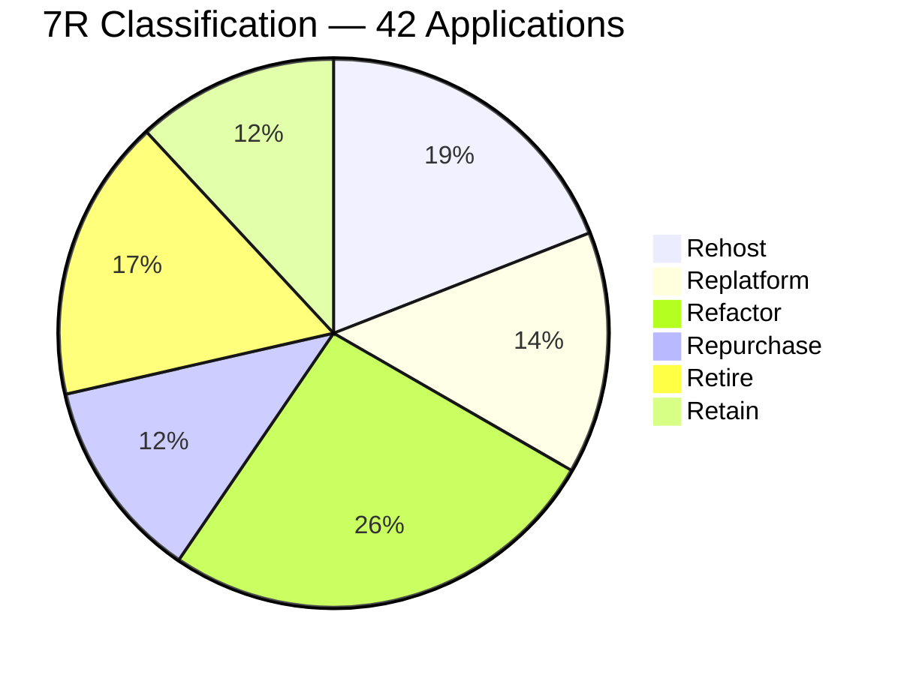
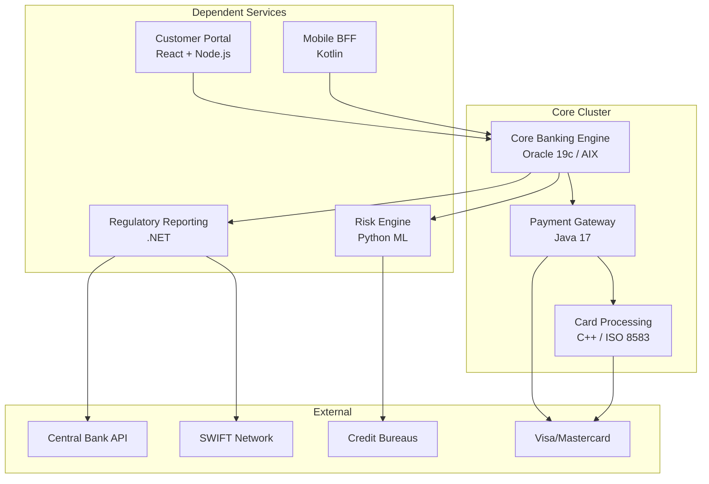

# A-01: Cloud Migration Plan — Acme Corp Banking Modernization

**Cliente:** Acme Corp | **Fecha:** 12 de marzo de 2026 | **Variante:** Técnica

## Resumen Ejecutivo

Acme Corp debe migrar 42 aplicaciones bancarias desde dos datacenters on-premises (Dallas, Miami) a AWS antes de la expiración del lease del datacenter de Dallas en octubre 2027. El portfolio incluye el core banking system (Oracle/AIX), 12 microservicios Java, 8 aplicaciones .NET, procesamiento de tarjetas (ISO 8583), y sistemas regulatorios. Este documento define la clasificación 7R, dependency mapping, wave planning, landing zone, patrones de ejecución, y validación post-migración.

### Decisiones Clave

| Decisión | Selección | Rationale |
|----------|-----------|-----------|
| Target Cloud | AWS (us-east-1) | Existing footprint, Financial Services competency |
| Migration Strategy | Wave-based (7 waves, 14 months) | Risk reduction, progressive learning |
| Core Banking | Replatform (Oracle on RDS) then Refactor (Year 2) | Lease deadline requires speed |
| Landing Zone | AWS Control Tower + AFT | Multi-account governance, SCPs |
| Connectivity | Direct Connect (10 Gbps) | 2.3 TB Oracle CDC, sub-15ms latency |
| Discovery | AWS Application Discovery + Cloudamize | Agent-based for T1-T2, agentless for T3-T4 |

---

## S1: Migration Assessment & 7R Classification

### Application Portfolio

| Application | Criticality | Stack | 7R Strategy | Effort | Risk | Wave |
|------------|-------------|-------|-------------|--------|------|------|
| Core Banking Engine | T1 | Oracle 19c / AIX | Replatform (RDS Oracle) | High | High | 5 |
| Payment Gateway | T1 | Java 17 / Spring Boot | Rehost (EC2) then Containers | Medium | Medium | 4 |
| Card Processing | T1 | C++ / ISO 8583 | Rehost (EC2 bare metal) | Medium | High | 5 |
| Customer Portal | T2 | React + Node.js | Refactor (ECS Fargate) | Medium | Low | 2 |
| Mobile BFF | T2 | Kotlin / Spring Boot | Refactor (EKS) | Medium | Low | 2 |
| Risk Engine | T2 | Python / ML models | Refactor (SageMaker + EKS) | High | Medium | 4 |
| Email Notifications | T3 | Legacy Java 8 | Repurchase (SES + SNS) | Low | Low | 1 |
| Internal Wiki | T3 | Confluence (self-hosted) | Repurchase (Cloud) | Low | Low | 1 |
| HR System | T3 | Oracle PeopleSoft | Retain (Miami DC) | N/A | N/A | N/A |
| Legacy CRM (Siebel) | T4 | Siebel on Oracle | Retire | N/A | N/A | N/A |
| Backup Tape Manager | T4 | Custom Perl scripts | Retire | N/A | N/A | N/A |
| Fax Processing | T4 | Windows Server 2012 | Retire | N/A | N/A | N/A |

### 7R Distribution

---

## S2: Workload Analysis & Dependency Mapping

### Dependency Graph — Core Banking Cluster

### Data Gravity Analysis

| Application | Volume | Access | Compliance | Gravity Score | Transfer Est. |
|------------|--------|--------|-----------|---------------|---------------|
| Core Banking DB | 2.3 TB | Continuous CDC | SOX, PCI-DSS | 9.2 / 10 | 48 hrs + verify |
| Card Processing DB | 450 GB | Continuous | PCI-DSS | 7.8 / 10 | 12 hrs |
| Risk Model Store | 180 GB | Batch daily | Basel III | 4.2 / 10 | 5 hrs |
| Customer Documents | 1.1 TB | On-demand | KYC/AML | 5.5 / 10 | 24 hrs |
| Regulatory Archive | 3.8 TB | Very low | SOX, 7-year | 3.1 / 10 | Snowball Edge |

### Application Difficulty Scoring

| Application | Technical (0.3) | Dependencies (0.25) | Data Gravity (0.25) | Compliance (0.2) | Composite |
|------------|-----------------|---------------------|---------------------|-------------------|-----------|
| Core Banking | 4.5 | 4.0 | 4.6 | 5.0 | **4.52** |
| Card Processing | 4.0 | 3.5 | 3.9 | 5.0 | **4.08** |
| Payment Gateway | 3.0 | 3.0 | 2.5 | 4.0 | **3.08** |
| Customer Portal | 2.0 | 2.0 | 1.5 | 2.0 | **1.88** |

---

## S3: Wave Planning & Sequencing

### Wave Calendar

| Wave | Duration | Applications | Strategy | Go/No-Go |
|------|----------|-------------|----------|----------|
| Wave 0 — Foundation | 6 weeks | Landing zone, Direct Connect, monitoring | Infrastructure | Apr 2026 |
| Wave 1 — Pilot | 3 weeks | Email (SES), Wiki (Cloud), 2 internal tools | Repurchase + Rehost | May 2026 |
| Wave 2 — Quick Wins | 4 weeks | Customer Portal, Mobile BFF, 3 web apps | Refactor (ECS/EKS) | Jul 2026 |
| Wave 3 — Data Layer | 4 weeks | Data warehouse, ETL pipelines, reporting | Replatform (Redshift) | Sep 2026 |
| Wave 4 — Mid-Tier | 5 weeks | Payment Gateway, Risk Engine, 4 microservices | Rehost + Refactor | Nov 2026 |
| Wave 5 — Core | 6 weeks | Core Banking, Card Processing, regulatory | Replatform | Feb 2027 |
| Wave 6 — Cleanup | 4 weeks | Remaining apps, DR validation, optimization | Mixed | Apr 2027 |

### Migration Factory Staffing

| Role | Count | Allocation |
|------|-------|-----------|
| Factory Manager | 1 | Full program |
| Migration Architects | 3 | 1 dedicated Core, 2 shared |
| Migration Engineers | 6 | 2 per active wave |
| Test Leads | 2 | 1 per active wave |
| DBA Specialists | 2 | Oracle migration, CDC validation |
| Security Engineer | 1 | Landing zone, compliance |
| App Owners (business) | 42 | 1 per application (part-time) |

---

## S4: Landing Zone Design

### Account Structure

| Account | Purpose | Environment |
|---------|---------|-------------|
| Management | Billing, SCPs, org policies | N/A |
| Security | GuardDuty, Security Hub, CloudTrail | N/A |
| Network Hub | Transit Gateway, Direct Connect, Route 53 | N/A |
| Shared Services | CI/CD, monitoring, logging | N/A |
| Banking-Dev | Development workloads | Dev |
| Banking-Staging | Pre-production, cutover rehearsals | Staging |
| Banking-Prod | Production workloads | Prod |
| Banking-DR | Disaster recovery (us-west-2) | DR |

### Governance Guardrails (SCPs)

| Guardrail | Type | Scope |
|-----------|------|-------|
| Deny public S3 buckets | Preventive | All accounts |
| Deny root user access | Preventive | All workload accounts |
| Require encryption at rest | Preventive | All accounts |
| Restrict regions to us-east-1, us-west-2 | Preventive | All accounts |
| Require mandatory tags (owner, env, cost-center, wave) | Detective | All workload accounts |
| Budget alert at 80% | Detective | Per-account |

---

## S5: Migration Execution Patterns

### Cutover Strategy — Core Banking (Wave 5)

| Step | Duration | Action | Rollback Point |
|------|----------|--------|---------------|
| T-14 days | — | Dress rehearsal in staging | N/A |
| T-7 days | — | Go/no-go gate, app owner sign-off | Cancel wave |
| T-0 Fri 22:00 | 30 min | Freeze transactions, final CDC sync | Unfreeze source |
| T-0 + 30m | 45 min | Data checksum validation (100% critical) | Revert to source |
| T-0 + 1h15m | 30 min | DNS switch to AWS | Revert DNS |
| T-0 + 1h45m | 1 hour | Smoke tests (200+ auto, 15 manual) | Full rollback |
| T-0 + 2h45m | 15 min | Open to internal canary | Full rollback |
| Sat 06:00 | — | Open to all users | Rollback until Sun 22:00 |
| T+14 days | — | Parallel-run complete, decommission | N/A |

### TCO Comparison (3-Year)

| Category | On-Premises | AWS | Savings |
|----------|-------------|-----|---------|
| Compute | $4.2M | $2.8M (RI + spot) | 33% |
| Storage | $1.8M | $0.9M (S3 + EBS tiered) | 50% |
| Facilities | $2.1M | $0 (included) | 100% |
| Staff (infra ops) | $3.6M | $2.4M (managed services) | 33% |
| Licenses | $1.9M | $1.4M (BYOL + cloud-native) | 26% |
| Network | $0.8M | $0.6M (DX + egress) | 25% |
| **Migration (one-time)** | $0 | $1.8M | — |
| **Total** | **$14.4M** | **$9.9M** | **31%** |

**Break-even:** Month 22 post-migration start.

---

## S6: Validation & Optimization

### Post-Migration Validation

| Check | Method | Threshold | Owner |
|-------|--------|-----------|-------|
| Data integrity | Row count + checksum | 100% match T1 tables | DBA |
| Performance | Latency p99 comparison | < 1.2x on-prem baseline | Migration architect |
| Functionality | 1,200 automated tests | 100% pass | Test lead |
| Integration | End-to-end payment flow | All 8 critical flows | App owner |
| Security | Pentest + compliance scan | Zero critical findings | Security engineer |
| Monitoring | CloudWatch + PagerDuty | Alert within 2 min | SRE |

### Cost Optimization Roadmap

| Action | Timeline | Estimated Savings |
|--------|----------|-------------------|
| Right-size EC2 instances | Month 1-2 | 15-25% compute |
| Convert to Reserved Instances (1yr) | Month 3 | 30-40% compute |
| S3 Intelligent Tiering | Month 1 | 20-30% storage |
| Spot for batch processing | Month 2 | 60-70% batch |
| Delete orphaned EBS volumes | Month 1 | $8K-12K/month |
| Graviton migration (Java) | Month 4-6 | 20% compute |

---

## Conclusiones y Recomendaciones

1. **Iniciar Wave 0 inmediatamente** — Direct Connect tiene 4-8 semanas de lead time y es prerequisite para todas las waves.
2. **No refactorear el Core Banking durante la migración** — replatform a RDS Oracle primero para cumplir el deadline del lease; refactor en Year 2.
3. **Ejecutar discovery con Cloudamize por 30+ días** antes de Wave 2 para capturar patrones mensuales (batch cierre de mes, reportes regulatorios).
4. **Retirar las 7 aplicaciones Retire antes de Wave 3** — cada app migrada innecesariamente cuesta $15K-40K.
5. **Presupuestar $1.8M para dual-run** — operar on-prem y cloud simultáneamente durante 14 meses es el item más subestimado.

---

**Autor:** Javier Montaño — MetodologIA Discovery Framework v6.0
