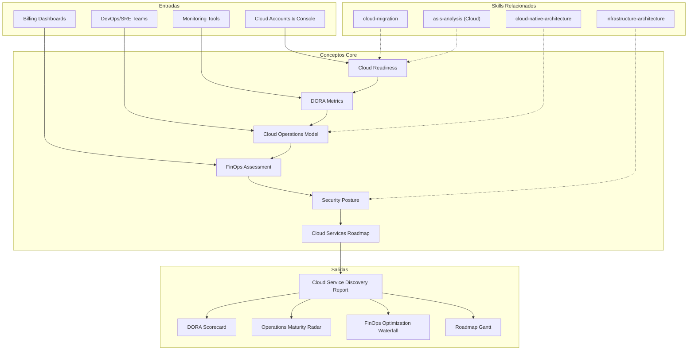

# Cloud Service Discovery — Cloud Operations Assessment & Roadmap

Generates a comprehensive Cloud-as-a-Service discovery covering cloud readiness assessment, DevOps maturity (DORA), cloud operations model, FinOps assessment, cloud security posture, and cloud services roadmap. Distinct from cloud-migration (which covers migration strategy); this skill covers Cloud as a continuous service offering — operations, optimization, and cloud platform maturity.

## Grounding Guideline

> *The cloud is not a destination — it is an operating model. Migrating without transforming operations is moving the same problems to a more expensive monthly bill.*

1. **Cloud-native operations, not process lift-and-shift.** Moving workloads to the cloud without adopting cloud-native practices (IaC, CI/CD, observability, SRE) is paying more for the same thing. Operational transformation is as important as technical migration.
2. **DORA metrics as compass.** Deployment frequency, lead time, change failure rate, and MTTR are the most reliable indicators of DevOps maturity. Without measuring them, improvement is anecdotal.
3. **FinOps is a discipline, not a dashboard.** Cloud cost optimization requires culture (accountability), process (showback/chargeback), and tools (tagging, right-sizing). Without all three, costs grow without control.

## Inputs

The user provides a project or client name as `$ARGUMENTS`. Parse `$1` as the **project/client name** used throughout all output artifacts.

**Parameters:**
- `{MODO}`: `piloto-auto` (default) | `desatendido` | `supervisado` | `paso-a-paso`
  - **piloto-auto**: Auto para cloud readiness y DORA assessment, HITL para FinOps findings y security posture decisions.
  - **desatendido**: Zero interruptions. Discovery completo automatizado. Assumptions documented.
  - **supervisado**: Autónomo con checkpoint al completar cada sección.
  - **paso-a-paso**: Confirms before cada sección del discovery.
- `{FORMATO}`: `markdown` (default) | `html` | `dual`
- `{VARIANTE}`: `ejecutiva` (~40% — S1 + S2 + S6 only) | `técnica` (full 6 sections, default)

Before generating discovery, detect existing cloud context:

```
!find . -name "*.tf" -o -name "*.yaml" -path "*/k8s/*" -o -name "Dockerfile" -o -name "*.helmfile*" | head -20
```

If reference materials exist, load them:

```
Read ${CLAUDE_SKILL_DIR}/references/
```

---

## When to Use

- El cliente ya está en la nube (parcial o totalmente) y necesita evaluar su madurez operativa
- Se requiere un assessment de DevOps/DORA para establecer baseline y definir mejoras
- El cliente necesita optimizar costos cloud (FinOps)
- Se busca establecer o mejorar el modelo de operaciones cloud (SRE, incident management, platform engineering)
- Se requiere evaluar la postura de seguridad cloud
- El cliente busca un servicio continuo de cloud operations (no un proyecto de migración puntual)

## When NOT to Use

- Planificación de migración a cloud (workloads on-prem → cloud) --> use cloud-migration
- Diseño de arquitectura cloud-native para aplicaciones nuevas --> use cloud-native-architecture
- Diseño de infraestructura (VPC, compute, storage) --> use infrastructure-architecture
- Assessment general de estado actual --> use asis-analysis con {TIPO_SERVICIO}=Cloud

---

## Delivery Structure: 6 Sections

### S1: Cloud Readiness Assessment

Evaluación del estado actual de adopción cloud y readiness para servicios cloud avanzados.

**Infrastructure current state:**
- Cloud provider(s): AWS, Azure, GCP, multi-cloud, hybrid
- Workloads en cloud vs on-premises (% distribution)
- IaC coverage: Terraform, CloudFormation, Pulumi, ARM templates, manual
- Container adoption: Docker, Kubernetes, ECS/EKS/AKS/GKE, serverless

**Cloud adoption stage:**

| Stage | Descripción | Indicadores |
|---|---|---|
| No cloud | 100% on-premises | Sin cuentas cloud, sin skills cloud |
| Lift-and-shift | VMs en cloud sin modernización | EC2/VM instances, misma arquitectura |
| Cloud-optimized | Uso de managed services, algunos patterns cloud-native | RDS, S3, managed K8s, some IaC |
| Cloud-native | Arquitectura diseñada para cloud, microservices, serverless | Containers, serverless, event-driven, full IaC |
| Multi-cloud | Estrategia multi-cloud deliberada | Workloads distribuidos, abstraction layers |

**Team cloud skills assessment:**
- Certificaciones cloud del equipo (AWS SA, Azure Admin, GCP Pro, CKA/CKAD)
- Experiencia práctica vs teórica
- Gaps de skills por dominio (networking, security, data, DevOps)

**Process readiness:**
- Change management para infraestructura (¿se usa IaC o se hacen cambios manuales?)
- Incident response: ¿Existe un proceso formal? ¿On-call rotation?
- Release management: ¿CI/CD? ¿Manual deployments?

**Output:** Cloud readiness scorecard con stage assessment y gap analysis.

### S2: DevOps Maturity Model (DORA)

Assessment de madurez DevOps usando las 4 métricas DORA.

**4 DORA Metrics:**

| Métrica | Elite | High | Medium | Low |
|---|---|---|---|---|
| **Deployment Frequency** | On-demand (multiple/day) | Daily to weekly | Weekly to monthly | Monthly to semi-annually |
| **Lead Time for Changes** | < 1 hour | 1 day to 1 week | 1 week to 1 month | 1 to 6 months |
| **Change Failure Rate** | 0-15% | 16-30% | 31-45% | 46-60% |
| **MTTR** | < 1 hour | < 1 day | < 1 week | > 1 week |

**DORA Level Classification:**
- **Elite:** Las 4 métricas en rango elite
- **High:** Mayoría en high, ninguna en low
- **Medium:** Mix de medium y high
- **Low:** Alguna métrica en low

**Practices assessment:**

| Práctica | Nivel 1 (Ad-hoc) | Nivel 2 (Defined) | Nivel 3 (Managed) | Nivel 4 (Optimized) |
|---|---|---|---|---|
| **IaC** | Manual infra changes | Some scripts | Terraform/Pulumi managed | GitOps, drift detection |
| **CI/CD** | Manual builds/deploys | CI pipeline exists | CD to staging | CD to production, canary/blue-green |
| **Monitoring** | No monitoring | Basic metrics | APM + logs + traces | Full observability, SLOs, error budgets |
| **Incident Management** | Ad-hoc response | Runbooks exist | On-call rotation, PagerDuty | Blameless postmortems, chaos engineering |

**Output:** DORA scorecard con nivel actual, benchmark contra industria, y improvement targets.

### S3: Cloud Operations Model

Evaluación del modelo de operaciones cloud actual y diseño del target.

**SRE practices:**
- SLIs/SLOs/SLAs definidos por servicio
- Error budgets implementados y respetados
- Blameless postmortems con action items tracked
- Chaos engineering (GameDays, Chaos Monkey, Litmus)

**Incident management:**
- Proceso de incident response (detect → triage → mitigate → resolve → learn)
- Severities definidas (SEV1-SEV4) con SLAs de respuesta
- On-call rotation: cobertura, compensación, burnout prevention
- Escalation paths claros y documentados

**Capacity planning:**
- Auto-scaling configurado y validado
- Capacity forecasting basado en trends
- Performance testing regular (load, stress, soak)

**Cost management:**
- Budget alerts por cuenta/proyecto
- Resource tagging discipline
- Regular right-sizing reviews

**Security operations (SecOps):**
- Vulnerability scanning automatizado
- Patch management cadence
- Security incident response integrado con incident management general

**Toil measurement and reduction strategy:**
- Definición de toil (manual, repetitive, automatable, no value-adding)
- Toil budget: máximo 50% del tiempo de un SRE debe ser toil (Google SRE book)
- Top-5 toil tasks con plan de automatización

**Output:** Cloud operations model assessment con current state vs target state por práctica.

### S4: FinOps Assessment

Evaluación de la madurez FinOps y oportunidades de optimización de costos cloud.

**FinOps Maturity Levels:**

| Nivel | Nombre | Descripción |
|---|---|---|
| Crawl | Reactivo | Facturas llegan, sorprenden, nadie es accountable |
| Walk | Proactivo | Visibilidad de costos, tagging parcial, alertas básicas |
| Run | Optimizado | Showback/chargeback, forecasting, continuous optimization |

**Assessment dimensions:**

**Cost visibility:**
- ¿Se puede ver el costo por servicio, equipo, proyecto, ambiente?
- ¿Los dashboards de costos existen y son consultados?
- ¿Quién recibe las facturas y quién es accountable?

**Tagging compliance:**
- ¿Existe una tagging policy definida?
- ¿Qué % de recursos están correctamente taggeados?
- Tags mínimos: owner, environment, project, cost-center

**Showback/chargeback model:**
- ¿Los equipos conocen cuánto cuesta lo que consumen?
- ¿Existe chargeback formal (costos asignados a P&L del equipo)?
- ¿O al menos showback (visibilidad sin impacto en P&L)?

**Optimization opportunities:**
- **Reserved Instances / Savings Plans:** Workloads estables sin RI/SP comprometidos
- **Spot instances:** Workloads tolerantes a interrupciones sin uso de spot
- **Right-sizing:** Instancias sobre-provisionadas (CPU/memory utilization <30%)
- **Storage optimization:** Datos en tiers incorrectos, snapshots obsoletos, EBS sin attach
- **Idle resources:** Load balancers sin targets, IPs elásticas sin uso, databases de staging 24/7

**Waste identification:**
- Recursos sin tag de owner (huérfanos)
- Ambientes non-prod encendidos 24/7 (deberían tener schedule)
- Recursos de tests/PoC abandonados

**Output:** FinOps assessment con maturity level, optimization opportunities cuantificadas (% savings potencial), y waste inventory.

### S5: Cloud Security Posture

Evaluación de la postura de seguridad cloud.

**Shared responsibility model adherence:**
- ¿El equipo entiende qué es responsabilidad del provider vs del cliente?
- ¿Hay gaps en la cobertura del cliente? (e.g., encryption at rest, IAM, patching de OS)

**IAM hygiene:**
- Principio de least privilege: ¿Se otorgan permisos mínimos?
- Root/admin accounts: ¿Están protegidas con MFA? ¿Se usan para operaciones diarias? (red flag)
- Service accounts: ¿Rotación de keys? ¿Permisos acotados?
- Federation: ¿SSO via SAML/OIDC? ¿O credenciales locales?

**Network segmentation:**
- VPC/VNET design: ¿Separación por ambiente (dev/staging/prod)?
- Security groups / NSGs: ¿Reglas acotadas o overly permissive (0.0.0.0/0)?
- Private endpoints para servicios managed
- WAF y DDoS protection en workloads públicos

**Encryption coverage:**
- At rest: ¿KMS managed keys? ¿Customer managed keys?
- In transit: TLS 1.2+ enforced
- Key rotation: ¿Automática? ¿Cadencia?

**Compliance alignment:**
- SOC2: Controles relevantes cubiertos
- ISO 27001: Controles de Annex A aplicables
- PCI-DSS: Si aplica (procesamiento de pagos)
- GDPR/regulaciones locales de datos personales

**Security tools assessment:**
- CSPM (Cloud Security Posture Management): AWS Security Hub, Azure Defender, GCP SCC
- CWPP (Cloud Workload Protection): Runtime protection, vulnerability scanning
- SIEM: Integración de logs cloud con SIEM corporativo
- SOAR: Automatización de respuesta a incidentes de seguridad

**Output:** Security posture assessment con findings por categoría, severity scoring, y remediation priorities.

### S6: Cloud Services Roadmap

Roadmap de servicios cloud faseado con capability milestones.

**Quick Wins (Meses 1-3):**
- Cost optimization: Right-sizing, RI/SP procurement, idle resource cleanup
- Tagging enforcement: Policy + automation para compliance
- Security quick fixes: MFA enforcement, overly permissive rules, encryption gaps
- Monitoring basics: Dashboards, alertas, log centralization

**Medium-Term (Meses 4-9):**
- Platform engineering: Internal developer platform, golden paths, self-service
- SRE maturity: SLIs/SLOs, error budgets, incident management formalization
- IaC coverage: Migrate manual infra to Terraform/Pulumi, drift detection
- CI/CD maturity: CD to production, canary/blue-green deployments
- FinOps operationalization: Showback dashboards, regular optimization reviews

**Strategic (Meses 10-18):**
- Multi-cloud strategy: Si aplica, abstraction layers, policy-as-code cross-cloud
- FinOps excellence: Chargeback model, forecasting, unit economics
- Advanced SRE: Chaos engineering, performance engineering, capacity planning
- Security automation: Shift-left security, policy-as-code, automated remediation
- Platform maturity: Full self-service, compliance-as-code, developer experience optimization

**Per phase:**
- Capability milestones con acceptance criteria
- Team requirements (roles, skills, headcount)
- DORA targets por fase
- Budget magnitude indicators (FTE-meses, NOT prices)

**Output:** Roadmap visual faseado con capability milestones, DORA targets, y team evolution.

---

## Trade-off Matrix

| Decisión | Habilita | Restringe | Cuándo Usar |
|---|---|---|---|
| **SRE model** | Reliability, operability | Investment in practices, cultural shift | Workloads críticos, SLAs contractuales |
| **Platform engineering** | Developer productivity, consistency | Team and tooling investment | >10 dev teams, repetitive infra requests |
| **Multi-cloud** | Vendor independence, best-of-breed | Complexity, skill dilution | Regulatory requirement, strategic diversification |
| **FinOps dedicated team** | Cost discipline, savings | Headcount, organizational buy-in | Cloud spend >$100K/month |
| **Managed services over self-managed** | Lower ops burden | Less control, potential lock-in | Team < 3 SREs, operational simplicity priority |
| **GitOps** | Auditability, consistency, rollback | Learning curve, tooling (ArgoCD/Flux) | Kubernetes environments, compliance requirements |

---

## Assumptions

- El cliente tiene workloads en cloud (parcial o totalmente) — no es un assessment pre-migración
- Hay acceso a consolas cloud, billing dashboards, y monitoring tools para el assessment
- El equipo del cliente puede proporcionar información sobre procesos operativos actuales
- Existen stakeholders técnicos disponibles para validar findings (SRE, DevOps, Security)
- El cloud provider principal está definido (AWS, Azure, o GCP) — multi-cloud se evalúa si aplica

## Limits

- No cubre migración de workloads on-prem a cloud (use cloud-migration)
- No diseña arquitectura cloud-native para aplicaciones nuevas (use cloud-native-architecture)
- No ejecuta optimizaciones — produce el assessment y roadmap para aprobación
- Penetration testing y vulnerability assessment profundo están fuera del scope (requieren herramientas especializadas y autorización)
- El assessment de FinOps es basado en información disponible — no reemplaza un análisis de billing detallado con acceso a Cost Explorer/Cost Management

---

## Edge Cases

**Multi-cloud con diferentes niveles de madurez por provider:**
Evaluar cada cloud por separado en S1-S5. El roadmap (S6) debe considerar dónde invertir en madurez y dónde consolidar workloads.

**Startup con infraestructura 100% serverless:**
DORA metrics siguen siendo relevantes pero las métricas de infra cambian. El foco se desplaza a observability, cost per invocation, y cold start optimization. SRE practices se simplifican.

**Organización regulada (banca, salud):**
S5 (Security Posture) se convierte en la sección más crítica. Compliance frameworks (SOC2, PCI-DSS, HIPAA) dictan el roadmap. Security gates son pre-requisito para avanzar en otras áreas.

**Cloud spend fuera de control (>50% growth YoY sin growth de negocio):**
S4 (FinOps) es la prioridad inmediata. Quick wins de cost optimization primero. Establecer governance de costos antes de invertir en otras capabilities.

**Equipo sin experiencia cloud (todo outsourced):**
El roadmap debe incluir knowledge transfer y upskilling como workstream explícito. Dependency en vendor externo es un riesgo que se documenta en el assessment.

---

## Validation Gate

Before finalizing delivery, verify:

- [ ] Cloud readiness assessment identifica stage de adopción con evidencia
- [ ] DORA metrics medidas o estimadas con nivel de confianza documentado
- [ ] Las 4 prácticas DevOps (IaC, CI/CD, Monitoring, Incident Management) evaluadas con nivel 1-4
- [ ] Cloud operations model cubre SRE, incident management, capacity planning, y toil measurement
- [ ] FinOps assessment incluye maturity level, optimization opportunities, y waste identification
- [ ] Cloud security posture cubre IAM, networking, encryption, y compliance alignment
- [ ] Roadmap faseado con quick wins (meses 1-3), medium-term (4-9), y strategic (10-18)
- [ ] DORA targets definidos por fase del roadmap
- [ ] Budget expresado en magnitudes (FTE-meses), NUNCA en precios
- [ ] Findings de security tienen severity scoring y remediation priorities
- [ ] Toil top-5 identificado con plan de automatización

---

## Output Format Protocol

| Format | Default | Description |
|--------|---------|-------------|
| `markdown` | Yes | Rich Markdown + Mermaid diagrams. Token-efficient. |
| `html` | On demand | Branded HTML (Design System). Visual impact. |
| `dual` | On demand | Both formats. |

Default output is Markdown with embedded Mermaid diagrams. HTML generation requires explicit `{FORMATO}=html` parameter.

## Output Artifact

**Primary:** `Cloud_Service_Discovery_{project}.md` -- Cloud readiness assessment, DORA metrics baseline, cloud operations model, FinOps assessment with optimization opportunities, cloud security posture, and phased cloud services roadmap with capability milestones.

**Diagramas incluidos:**
- DORA metrics dashboard: 4 metrics with current level vs target
- Cloud operations maturity radar: SRE, IaC, CI/CD, Monitoring, Incident Management, FinOps
- FinOps optimization waterfall: current spend → savings opportunities → optimized spend
- Cloud services roadmap: phased Gantt with capability milestones

## Edge Cases

| Case | Handling Strategy |
|---|---|
| Multi-cloud with different maturity levels | Evaluate each cloud separately in S1-S5. Roadmap (S6) considers where to invest in maturity and where to consolidate workloads. |
| Startup with 100% serverless infrastructure | DORA metrics relevant but infra metrics change. Focus on observability, cost per invocation, cold start optimization. Simplified SRE practices. |
| Regulated organization (banking, healthcare) | S5 (Security Posture) is the most critical section. Compliance frameworks dictate the roadmap. Security gates are prerequisite. |
| Cloud spend out of control (>50% growth YoY) | S4 (FinOps) is immediate priority. Cost optimization quick wins first. Cost governance before investing in other capabilities. |
| Team with no cloud experience (fully outsourced) | Roadmap includes knowledge transfer and upskilling as explicit workstream. External vendor dependency is a documented risk. |

## Decisions and Trade-offs

| Decision | Discarded Alternative | Justification |
|---|---|---|
| DORA metrics as DevOps maturity compass | Ad-hoc internal metrics, generic maturity frameworks | DORA (Deployment Frequency, Lead Time, CFR, MTTR) has research backing (Accelerate/DORA State of DevOps). Measurable, comparable, and predictive of organizational performance. |
| 6 cloud discovery sections | Single technical assessment, 10-section assessment | 6 sections cover readiness, DevOps, operations, FinOps, security, and roadmap. Balance depth and actionability. |
| FinOps as dedicated section (S4) | Costs as sub-section of operations | Cloud spend is the #1 pain point for most organizations. Dedicated section with maturity levels, optimization opportunities, and waste identification. |
| Toil measurement in operations model (S3) | SRE practices only without quantifying toil | The toil budget (max 50% SRE time) is a concrete framework from the Google SRE book. Measuring toil identifies where to automate. |

## Knowledge Graph



## Output Templates

**Formato Markdown (default):**

```
# Cloud Service Discovery: {project}
## S1: Cloud Readiness Assessment
### Cloud Adoption Stage: {stage}
### Team Skills Assessment
### Process Readiness
## S2: DevOps Maturity Model (DORA)
| Metrica | Valor Actual | Nivel | Target |
...
### Practices Assessment
| Practica | Nivel (1-4) | Evidencia | Gap |
...
## S3: Cloud Operations Model
### SRE Practices
### Toil Top-5
## S4: FinOps Assessment
### Maturity Level: {crawl|walk|run}
### Optimization Opportunities
### Waste Inventory
## S5: Cloud Security Posture
## S6: Cloud Services Roadmap
### Quick Wins (Meses 1-3)
### Medium-Term (Meses 4-9)
### Strategic (Meses 10-18)
```

**Formato HTML (bajo demanda):**

```
{fase}_Cloud_Service_Discovery_{project}_{WIP}.html
```
HTML self-contained branded (Design System MetodologIA v5). Light-First Technical. Incluye DORA metrics dashboard interactivo, FinOps optimization waterfall, y cloud services roadmap faseado. WCAG AA, responsive, print-ready.

**Formato PPTX (bajo demanda):**

```
Slide 1: Portada — Cloud Service Discovery: {project}
Slide 2: Executive Summary — adoption stage + DORA level + FinOps maturity
Slide 3: DORA Metrics Dashboard — 4 metrics current vs target
Slide 4: Operations Maturity Radar — 6 dimensions
Slide 5: FinOps Waterfall — current spend to optimized spend
Slide 6: Security Posture Summary — findings by severity
Slide 7-8: Cloud Services Roadmap — phased Gantt
Slide 9: Team Evolution & DORA Targets per Phase
Slide 10: Next Steps + Budget Magnitudes (FTE-meses)
```

**Formato DOCX (bajo demanda):**
- Filename: `{fase}_Cloud_Service_Discovery_{project}_{WIP}.docx`
- Via python-docx con Design System MetodologIA v5. Cover page, TOC auto, headers/footers branded, tablas zebra. Poppins headings (navy), Trebuchet MS body, gold accents.

**Formato XLSX (bajo demanda):**
- Filename: `{fase}_Cloud_Service_Discovery_{cliente}_{WIP}.xlsx`
- Via openpyxl con MetodologIA Design System v5. Headers con fondo navy y tipografía Poppins en blanco, conditional formatting por severidad, auto-filters en todas las columnas, valores directos sin fórmulas.

## Evaluacion

| Dimension | Peso | Criterio |
|---|---|---|
| Trigger Accuracy | 10% | Activacion correcta ante keywords de cloud operations, DORA, DevOps maturity, FinOps, SRE, cloud security posture, platform engineering. |
| Completeness | 25% | 6 secciones cubren readiness, DORA, operations, FinOps, security, y roadmap. DORA con 4 metricas + practices con 4 niveles. |
| Clarity | 20% | DORA levels con rangos numericos (Elite/High/Medium/Low). FinOps maturity con 3 niveles claros (Crawl/Walk/Run). |
| Robustness | 20% | Edge cases (multi-cloud, serverless, regulated, cost explosion, outsourced) manejados con adaptaciones especificas. |
| Efficiency | 10% | Variante ejecutiva reduce a S1+S2+S6 (~40%). Cloud context detection automatica desde archivos de infra. |
| Value Density | 15% | FinOps optimization cuantifica % savings potencial. Toil top-5 con plan de automatizacion. DORA targets por fase del roadmap. |

**Umbral minimo: 7/10.** Debajo de este umbral, revisar DORA measurement rigor y FinOps optimization quantification.

---
**Autor:** Javier Montano · Comunidad MetodologIA | **Ultima actualizacion:** 15 de marzo de 2026
