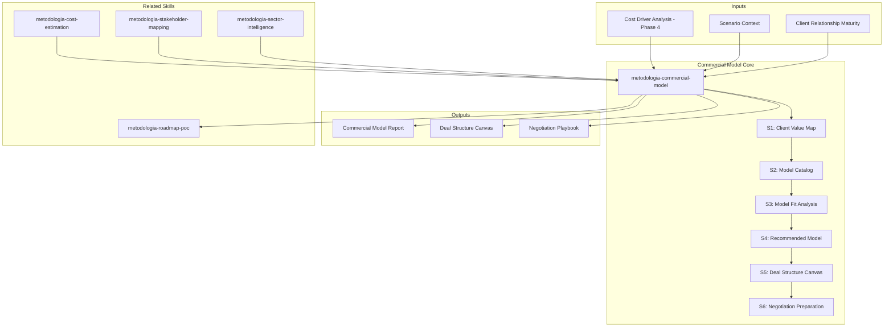

# Commercial Model: Value Capture & Deal Structure Strategy

Identifies the optimal commercial model for a technology transformation engagement. Goes beyond
time-and-materials to explore value-based, outcome-based, and hybrid structures that align
incentives between delivery team and client. Produces model recommendations with trade-offs,
NOT pricing — pricing is a separate commercial decision.

## Grounding Guideline

**This skill identifies BUSINESS MODELS and COMMERCIAL STRUCTURES — it does not produce prices,
rates, or margins.** The final pricing decision belongs to the commercial team with inputs from this analysis.

### Commercial Philosophy

1. **Model before price.** The commercial structure defines the relationship — the price is a subsequent detail. This skill designs the structure, not the rate.
2. **Aligned incentives = sustainable relationship.** Pure T&M misaligns: the provider profits when the project extends. Hybrid models create skin-in-the-game.
3. **Radical transparency.** The client must understand the structure — not just accept it. Trust is built with clarity, not contractual complexity.

## Inputs

Parse `$1` as **project name**. Requires cost driver analysis (Phase 4) and scenario context.

**Parameters:**
- `{MODO}`: `piloto-auto` (default) | `desatendido` | `supervisado` | `paso-a-paso`
  - **piloto-auto**: Auto para catálogo de modelos y análisis de fit, HITL para recomendación de modelo y deal canvas.
  - **desatendido**: Zero interruptions. Modelo recomendado automáticamente. Assumptions documented.
  - **supervisado**: Autónomo con checkpoint en recomendación antes de deal canvas.
  - **paso-a-paso**: Confirma value map, cada modelo evaluado, y la estructura final.
- `{FORMATO}`: `markdown` (default) | `html` | `dual`
- `{VARIANTE}`: `ejecutiva` (~40% — S1 value map + S4 recommendation + S5 canvas) | `técnica` (full 6 sections, default)

## Delivery Structure: 6 Sections

### S1: Client Value Map

Identifica las fuentes de valor que la transformación genera para el cliente:

| Tipo de Valor | Descripción | Medible | Horizonte |
|---|---|---|---|
| **Ahorro directo** | Reducción de costos operativos | Sí — $/año | 6-12 meses |
| **Revenue enablement** | Nuevas capacidades → nuevos ingresos | Parcial — revenue pipeline | 12-24 meses |
| **Risk reduction** | Mitigación de riesgos operacionales/regulatorios | Sí — valor en riesgo | Inmediato |
| **Time-to-market** | Velocidad de entrega de features | Sí — lead time | 6-18 meses |
| **Compliance** | Cumplimiento regulatorio evita multas/sanctions | Sí — valor de multa evitada | Inmediato |
| **Scalability** | Capacidad de crecimiento sin rediseño | Parcial — capacidad × pricing | 18-36 meses |

Para cada fuente: cuantificar en rango de magnitud, identificar cómo se mediría.

### S2: Commercial Model Catalog

Evalúa cada modelo aplicable al contexto:

**M1: Time & Materials (T&M)**
- Estructura: horas × tarifa por rol
- Riesgo: 100% cliente (paga por tiempo, no por resultado)
- Ventaja: flexibilidad de scope, transparencia
- Cuándo: scope incierto, engagement exploratorio, equipo dedicado
- Desventaja: no alinea incentivos con resultados

**M2: Fixed Price por Fase**
- Estructura: precio fijo por cada fase del roadmap con gates
- Riesgo: repartido (fijo por fase, renegociable en gate)
- Ventaja: predictibilidad para el cliente, gates de salida
- Cuándo: scope definido por fase, confianza en estimaciones
- Desventaja: requiere scope congelado por fase

**M3: Outcome-Based / Valor Ganado (Earned Value)**
- Estructura: compensación vinculada a KPIs medibles
- Riesgo: repartido (delivery team tiene skin in the game)
- Ventaja: alinea incentivos, cliente paga por resultados
- Cuándo: KPIs claros y medibles, baseline existente
- Desventaja: requiere acuerdo en métricas y medición
- Ejemplo: "X% del ahorro demostrado en Year 1-3"

**M4: Joint Venture / Co-inversión**
- Estructura: ambas partes invierten, comparten propiedad y retorno
- Riesgo: compartido (ambos ganan o pierden)
- Ventaja: máximo alineamiento, compromiso largo plazo
- Cuándo: oportunidad de negocio nueva, no solo modernización
- Desventaja: complejidad legal, governance compartida

**M5: Usage-Based / Comisión por Uso**
- Estructura: pago basado en transacciones, usuarios, o throughput
- Riesgo: delivery team (invierte upfront, cobra en uso)
- Ventaja: barrera de entrada baja para el cliente
- Cuándo: plataformas, APIs, SaaS, marketplaces
- Desventaja: revenue incierto, requiere escala

**M6: Licensing / Producto**
- Estructura: licencia por el software o IP creada
- Riesgo: delivery team (invierte en producto, vende licencia)
- Ventaja: recurrencia, escalabilidad
- Cuándo: componente reutilizable, IP diferenciada
- Desventaja: requiere inversión en producto, no solo consultoría

**M7: Hybrid / Modelo Combinado**
- Estructura: base T&M + variable por resultado
- Riesgo: balanceado (base cubre costos, variable alinea incentivos)
- Ventaja: protección mutua, incentivo compartido
- Cuándo: la mayoría de los engagements reales
- Ejemplo: "T&M base + bonus del 15% si deployment time se reduce >50%"

### S3: Model Fit Analysis

Evalúa cada modelo contra el contexto del proyecto:

| Criterio | M1 T&M | M2 Fixed | M3 Earned | M4 JV | M5 Usage | M6 License | M7 Hybrid |
|---|---|---|---|---|---|---|---|
| Scope clarity | ★★ | ★★★★ | ★★★ | ★★ | ★★★ | ★★★★ | ★★★ |
| Client risk appetite | ★★★★★ | ★★★ | ★★ | ★ | ★★ | ★★★ | ★★★ |
| Value measurability | ★ | ★★ | ★★★★★ | ★★★ | ★★★★ | ★★ | ★★★★ |
| Relationship maturity | ★★★★★ | ★★★ | ★★ | ★ | ★★ | ★★★ | ★★★ |
| **FIT SCORE** | ? | ? | ? | ? | ? | ? | ? |

Score per dimension (1-5), weighted by project context.

### S4: Recommended Model & Structure

Propone el modelo recomendado (generalmente M7 Hybrid) con:

- Estructura propuesta: componentes fijos y variables
- KPIs para componente variable (si aplica)
- Phased gates: cómo el modelo evoluciona por fase
- Exit clauses: cómo sale cada parte en cada gate
- Governance del modelo: quién mide, cuándo se revisa
- Escalation path: qué pasa si los KPIs no se cumplen

### S5: Deal Structure Canvas

```
DEAL STRUCTURE CANVAS
═════════════════════
Modelo base: [M1-M7 o combinación]

COMPONENTE FIJO (si aplica):
  Cobertura: [qué cubre el fijo]
  Estructura: [por fase / mensual / milestone]
  Gate de salida: [condiciones]

COMPONENTE VARIABLE (si aplica):
  KPIs vinculados: [lista de métricas]
  Baseline: [punto de partida medible]
  Target: [meta a alcanzar]
  Mecanismo: [% del ahorro / bonus / revenue share]
  Medición: [quién mide, cada cuánto]
  Cap: [máximo de variable]

PROTECCIONES:
  Cliente: [gates, exit clauses, SLAs]
  Delivery: [floor mínimo, scope freeze por fase, change management]

IP:
  Owner: [cliente / delivery / compartida]
  Licensing: [si aplica]
```

### S6: Negotiation Preparation

- Fortalezas de la propuesta (para el cliente)
- Objeciones anticipadas y respuestas
- Walk-away conditions (para ambas partes)
- Secuencia de negociación recomendada
- Approval path por rol del cliente (CFO → CTO → Legal → Board)

## Trade-off Matrix

| Decision | Enables | Constrains | When to Use |
|---|---|---|---|
| Pure T&M | Simplicity, flexibility | No value alignment | New relationship, unclear scope |
| Outcome-based | Value alignment | Metric agreement complexity | Clear KPIs, baseline data |
| Hybrid | Balanced risk | More complex contract | Most real engagements |
| JV | Deep alignment | Legal complexity, shared control | New product/business line |

## Assumptions & Limits

- No produce precios, tarifas ni márgenes — produce estructura y modelo
- Value quantification uses magnitude ranges, not precise numbers
- Legal/contractual details require legal review — this is strategic framing
- Model recommendation is input to commercial negotiation, not the final deal

## Edge Cases

| Scenario | Response |
|---|---|
| Client insists on pure T&M | Document risks of misaligned incentives. Propose hybrid with minimal variable component as alternative |
| No measurable KPIs for outcome-based | Fall back to milestone-based (M2). Add KPI definition as Sprint 0 deliverable |
| Multi-vendor engagement | Recommend independent model per vendor. Add coordination overhead to base |
| Startup client (limited budget) | Explore M5 usage-based or M4 JV with equity component. Lower barrier to entry |
| Regulatory constraints on pricing | Flag legal review required. Document compliant model options |
| Client has bad vendor experience | Increase transparency mechanisms. Shorter gate intervals. More exit options |

## Edge Cases

| Case | Handling Strategy |
|------|---------------------|
| Client insists on pure T&M without variable component | Document risks of misaligned incentives; propose hybrid with minimum variable component as alternative; respect decision if they persist |
| No measurable KPIs exist for outcome-based model | Fall back to milestone-based (M2); add KPI definition as Sprint 0 deliverable to migrate to outcome-based in later phases |
| Multi-vendor engagement where each vendor has different model | Recommend independent model per vendor; add coordination overhead to base component; define inter-vendor governance |
| Startup client with limited budget and high potential | Explore M5 usage-based or M4 JV with equity component; lower entry barrier by prioritizing models that scale with client success |

## Decisions and Trade-offs

| Decision | Discarded Alternative | Justification |
|----------|----------------------|---------------|
| Produce structure and model, never prices or rates | Include recommended pricing in the analysis | Pricing is a commercial decision requiring market context, margin, and negotiation; including it in an analysis skill creates premature commitments |
| Evaluate all 7 models against context before recommending | Always recommend hybrid (M7) as default | Each context has a different optimal model; assuming hybrid always sub-optimizes for cases where pure T&M or outcome-based is superior |
| Include negotiation preparation (S6) as deliverable section | Limit to model recommendation without negotiation preparation | The model without negotiation preparation leaves the commercial team without tools to defend the proposed structure against objections |

## Knowledge Graph



## Output Templates

**Formato MD (default):**

```
# Commercial Model — {proyecto}
## Resumen Ejecutivo
> Modelo recomendado: M7 Hibrido (T&M base + variable por resultado). Valor identificado: N fuentes.
## S1: Client Value Map
| Tipo de Valor | Descripcion | Medible | Horizonte |
## S2: Commercial Model Catalog
[7 modelos evaluados con ventajas/desventajas]
## S3: Model Fit Analysis
| Criterio | M1 | M2 | M3 | M4 | M5 | M6 | M7 |
## S4-S6: [secciones completas]
## Deal Structure Canvas
```
DEAL STRUCTURE CANVAS
...
```
```

**Formato HTML (bajo demanda):**

```
{fase}_Commercial_Model_{project}_{WIP}.html
```
HTML self-contained branded (Design System MetodologIA v5). Commercial page type. Incluye Deal Structure Canvas visual, model fit heatmap interactivo, y value map con comparativa de escenarios. WCAG AA, responsive.

**Formato PPTX (para presentacion comercial):**

```
Slide 1: Titulo + contexto del engagement
Slide 2: Client Value Map (tabla visual de fuentes de valor)
Slide 3: Modelos Evaluados (resumen comparativo 7 modelos)
Slide 4: Model Fit Analysis (radar chart o heatmap)
Slide 5: Modelo Recomendado (estructura con componentes fijo + variable)
Slide 6: Deal Structure Canvas (one-page visual)
Slide 7: Protecciones Mutuas (gates, exit clauses, SLAs)
Slide 8: Proximos Pasos (secuencia de negociacion)
```

**Formato DOCX (bajo demanda):**
- Filename: `{fase}_Commercial_Model_{project}_{WIP}.docx`
- Via python-docx con Design System MetodologIA v5. Cover page, TOC auto, headers/footers branded, tablas zebra. Poppins headings (navy), Trebuchet MS body, gold accents.

**Formato XLSX (bajo demanda):**
- Filename: `{fase}_Commercial_Model_{cliente}_{WIP}.xlsx`
- Via openpyxl con MetodologIA Design System v5. Headers con fondo navy y tipografía Poppins en blanco, conditional formatting por fit score y modelo, auto-filters en todas las columnas, valores directos sin fórmulas.

## Evaluacion

| Dimension | Peso | Criterio | Umbral Minimo |
|-----------|------|----------|---------------|
| Trigger Accuracy | 10% | El skill se activa ante prompts de modelo comercial, deal structure, value capture, pricing strategy | 7/10 |
| Completeness | 25% | Las 6 secciones pobladas; value map con 3+ fuentes cuantificables; los 7 modelos evaluados; deal canvas completo | 7/10 |
| Clarity | 20% | Modelo recomendado es claro con estructura, KPIs, gates y exit clauses; zero ambiguedad en componentes fijo vs variable | 7/10 |
| Robustness | 20% | Edge cases cubiertos (T&M forzado, sin KPIs, multi-vendor, startup); objeciones anticipadas con respuestas | 7/10 |
| Efficiency | 10% | Variante ejecutiva vs tecnica correctamente aplicada; no se genera catalog completo cuando solo se necesita recomendacion | 7/10 |
| Value Density | 15% | Zero precios/tarifas/margenes en output; cada modelo tiene fit score contextualizado; negotiation prep incluye secuencia y approval path | 7/10 |

**Umbral minimo global: 7/10.** Si alguna dimension cae por debajo, el entregable requiere revision antes de entrega.

## Validation Gate

- [ ] Client value map with 3+ quantifiable value sources
- [ ] All 7 models evaluated against project context
- [ ] Model fit analysis with scores
- [ ] Recommended model with structure, KPIs, gates, exit clauses
- [ ] Deal Structure Canvas completed
- [ ] Negotiation preparation with objection handling
- [ ] Zero prices, rates, or margins in output

## Output Format Protocol

| Format | Default | Description |
|--------|---------|-------------|
| `markdown` | ✅ | Rich Markdown + Mermaid diagrams. Token-efficient. |
| `html` | On demand | Branded HTML (Design System). Visual impact. |
| `dual` | On demand | Both formats. |

Default output is Markdown with embedded Mermaid diagrams. HTML generation requires explicit `{FORMATO}=html` parameter.

## Output Artifact

**Primary:** `A-03_Commercial_Model_{project}.html` — Value map, model catalog, fit analysis, recommended structure, deal canvas, negotiation prep.

### Diagrams (Mermaid)
- Flowchart: value flow from delivery to value capture
- Quadrant chart: model fit analysis (alignment × risk)

---
**Autor:** Javier Montaño | **Última actualización:** 12 de marzo de 2026
