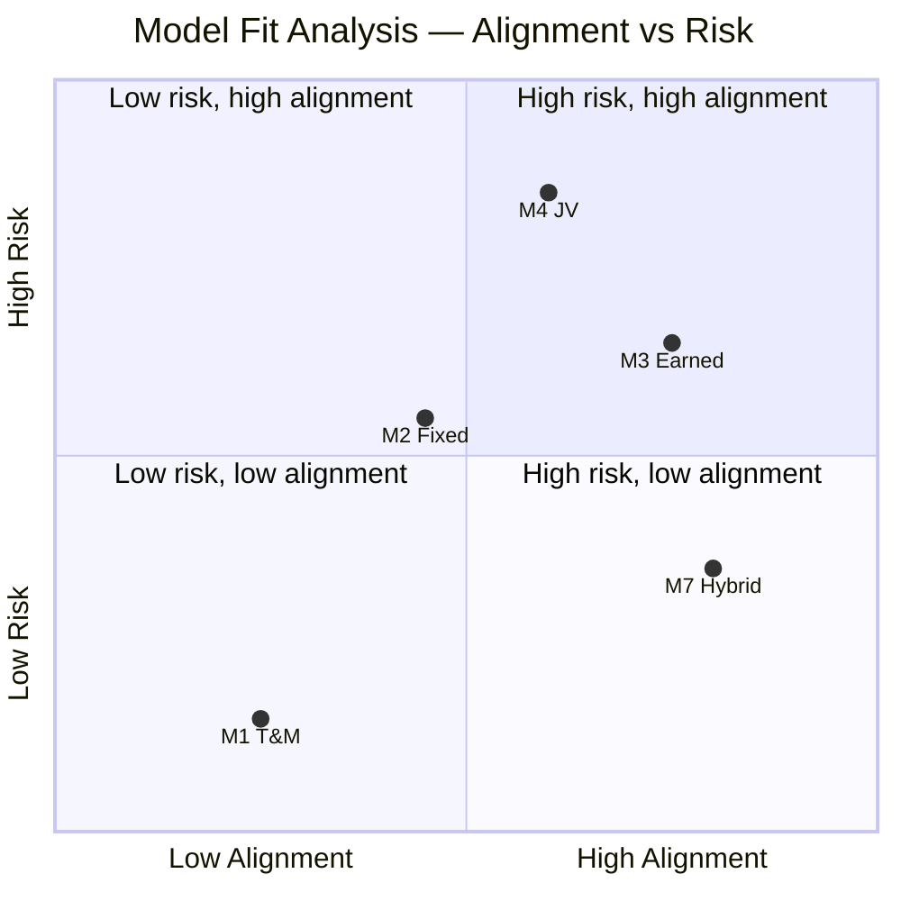
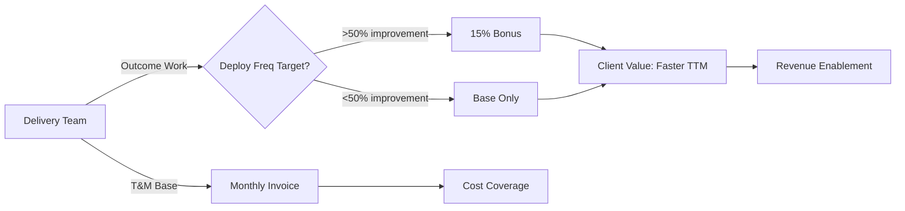

# Commercial Model: Acme Corp Banking Modernization

**Proyecto:** Acme Corp — Core Banking Platform Modernization
**Fecha:** 12 de marzo de 2026
**Modelo recomendado:** M7 Hybrid (T&M base + outcome bonus)

---

## S1: Client Value Map

| Tipo de Valor | Descripción | Medible | Magnitud Estimada | Horizonte |
|---|---|---|---|---|
| **Ahorro directo** | Reducción de costos de infraestructura legacy (mainframe → cloud) | Si — $/ano | $2M-4M/ano | 12-18 meses |
| **Revenue enablement** | API banking habilita nuevos canales digitales | Parcial — pipeline | $5M-10M potencial | 18-24 meses |
| **Risk reduction** | Eliminacion de single points of failure en core transaccional | Si — downtime cost | $1M-3M en riesgo/ano | Inmediato |
| **Time-to-market** | Lead time de features de 6 meses a 2 semanas | Si — deployment frequency | 10x mejora | 6-12 meses |
| **Compliance** | SOX y PCI-DSS compliance automatizado | Si — multa evitada | $500K-2M | Inmediato |

**Valor total estimado:** $8.5M-19M en horizonte de 24 meses.

## S2: Commercial Model Catalog

Se evaluaron los 7 modelos del catalogo contra el contexto de Acme Corp:

- **M1 T&M:** Viable pero no alinea incentivos con la transformacion.
- **M2 Fixed Price:** Riesgoso — scope de modernizacion es evolutivo.
- **M3 Outcome-Based:** Parcialmente viable — deployment frequency es medible, pero no cubre toda la transformacion.
- **M4 JV:** Desproporcionado — Acme no busca co-propiedad.
- **M5 Usage-Based:** No aplica — no es plataforma SaaS.
- **M6 Licensing:** No aplica — no hay IP reutilizable.
- **M7 Hybrid:** Optimo — T&M base para cobertura + variable por deployment frequency.

## S3: Model Fit Analysis

| Criterio | Peso | M1 T&M | M2 Fixed | M3 Earned | M4 JV | M5 Usage | M6 License | M7 Hybrid |
|---|---|---|---|---|---|---|---|---|
| Scope clarity | 25% | 2 | 4 | 3 | 2 | 1 | 1 | 4 |
| Client risk appetite | 25% | 5 | 3 | 2 | 1 | 1 | 1 | 4 |
| Value measurability | 30% | 1 | 2 | 5 | 3 | 2 | 1 | 4 |
| Relationship maturity | 20% | 5 | 3 | 2 | 1 | 2 | 2 | 3 |
| **FIT SCORE** | | **3.05** | **2.95** | **3.15** | **1.80** | **1.50** | **1.20** | **3.80** |



**M7 Hybrid obtiene el score mas alto (3.80/5)** — combina la proteccion de T&M con el alineamiento de outcome-based.

## S4: Recommended Model & Structure

**Modelo recomendado: M7 Hybrid — T&M Base + Outcome Bonus**

- **Componente fijo (T&M):** Cubre el equipo dedicado (8-12 personas) por fase. Facturacion mensual por rol.
- **Componente variable (Outcome Bonus):** 15% bonus si deployment frequency mejora >50% vs baseline en cada fase.
- **KPI principal:** Deployment frequency (deploys/semana). Baseline actual: 2 deploys/mes.
- **Target:** 8+ deploys/mes al final de Fase 2 (6 meses).

**Phased gates:**
1. **Fase 0 (Sprint 0):** Setup, baseline measurement. Gate: equipo onboarded, metricas instrumentadas.
2. **Fase 1 (3 meses):** Foundation — CI/CD, cloud infra. Gate: pipeline funcional, primeros deploys automatizados.
3. **Fase 2 (3 meses):** Migration — primeros 3 dominios. Gate: deployment frequency target alcanzado.
4. **Fase 3 (6 meses):** Remaining domains + API banking. Gate: full migration, API live.

**Exit clauses:** Cualquier parte puede salir en gate con 30 dias de aviso. IP entregada hasta ese punto.

**Governance:** Medicion quincenal de deployment frequency via plataforma DORA metrics. Review mensual con steering committee.

## S5: Deal Structure Canvas

```
DEAL STRUCTURE CANVAS
=====================
Modelo base: M7 Hybrid (T&M + Outcome Bonus)

COMPONENTE FIJO:
  Cobertura: Equipo dedicado (Tech Lead, 4 Senior Devs, 2 DevOps, 1 QA, 1 Architect)
  Estructura: Mensual por rol, por fase
  Gate de salida: Al final de cada fase (0, 1, 2, 3) con 30 dias de aviso

COMPONENTE VARIABLE:
  KPIs vinculados: Deployment frequency (deploys/semana)
  Baseline: 2 deploys/mes (medido en Sprint 0)
  Target: 8+ deploys/mes
  Mecanismo: 15% bonus sobre facturacion de la fase si target alcanzado
  Medicion: DORA metrics dashboard, quincenal, validado por ambas partes
  Cap: 20% maximo de bonus (para mejoras >100% sobre baseline)

PROTECCIONES:
  Cliente: Gates de salida por fase, SLA de respuesta 4h, code ownership desde dia 1
  Delivery: Floor minimo de 3 meses por fase, scope freeze por sprint, change request process formal

IP:
  Owner: Cliente (todo el codigo y documentacion)
  Licensing: N/A
```



## S6: Negotiation Preparation

**Fortalezas de la propuesta:**
- Modelo alinea incentivos sin transferir todo el riesgo al delivery team
- Gates de salida protegen al cliente en cada fase
- KPI concreto y medible (deployment frequency) — no ambiguo
- Bonus motivado pero con cap — predecible para el CFO

**Objeciones anticipadas:**
| Objecion | Respuesta |
|---|---|
| "Queremos fixed price" | "Fixed price transfiere riesgo de scope a precio. El hybrid protege a ambos — ustedes pagan por equipo con garantia de resultado." |
| "15% bonus es mucho" | "El bonus se activa solo cuando el valor se materializa. Si deployment frequency no mejora, no hay bonus. Es skin-in-the-game." |
| "No confiamos en metricas auto-reportadas" | "DORA metrics dashboard es transparente y auditado por ambas partes. Propuesta: auditor externo trimestral." |

**Walk-away conditions:**
- Cliente: si delivery no alcanza 50% del target en 2 fases consecutivas
- Delivery: si scope cambia >30% sin renegociacion de estructura

**Secuencia de negociacion:**
1. CTO: alineamiento tecnico del KPI y equipo
2. CFO: estructura de costos y cap del bonus
3. Legal: clausulas de salida y IP
4. Board: aprobacion final

---
**Autor:** Javier Montano | **Generado por:** commercial-model skill v6.0
