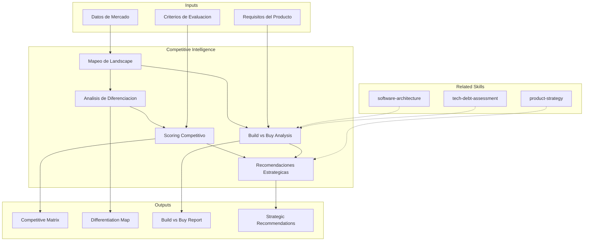

# Inteligencia Competitiva Tecnologica

Analisis de landscape competitivo tecnico, evaluacion de diferenciacion tecnologica,
analisis build-vs-buy y posicionamiento de mercado.

## TL;DR

- Mapea landscape competitivo tecnico con jugadores, soluciones y posicionamiento
- Evalua diferenciacion tecnologica real vs percibida de cada opcion
- Ejecuta analisis build-vs-buy estructurado con TCO a 3-5 anos
- Identifica oportunidades de posicionamiento y ventaja competitiva
- Genera matriz competitiva y recomendaciones estrategicas accionables

## Inputs

Parse `$1` como **nombre del proyecto/producto**, `$2` como **mercado o categoria a analizar**.

**Parameters:**
- `{MODO}`: `piloto-auto` (default) | `desatendido` | `supervisado` | `paso-a-paso`
- `{FORMATO}`: `markdown` (default) | `html` | `dual`
- `{VARIANTE}`: `ejecutiva` (~40%) | `tecnica` (full, default)

## Entregables

1. **Competitive Matrix** — Comparacion multi-dimensional de competidores/opciones
2. **Differentiation Map** — Mapa de diferenciacion tecnologica real por dimension
3. **Build vs Buy Analysis** — Analisis estructurado con TCO, time-to-market, riesgo
4. **Strategic Recommendations** — Recomendaciones accionables con justificacion
5. **Market Landscape Report** — Vision panoramica del mercado con tendencias

## Proceso

1. **Mapeo de Landscape** — Identificar jugadores relevantes por categoria:
   | Categoria | Jugadores | Posicionamiento |
   |---|---|---|
   | Lideres | Incumbents con market share | Premium, enterprise |
   | Challengers | Disruptores con traccion | Value, innovacion |
   | Nicho | Especialistas en segmento | Deep expertise |
   | Open Source | Alternativas abiertas | Flexibilidad, costo |
2. **Analisis de Diferenciacion** — Para cada opcion evaluar:
   - Capacidades tecnicas (features, performance, scalability)
   - Madurez (production readiness, ecosystem, community)
   - Modelo de negocio (pricing, lock-in, portabilidad)
   - Roadmap y vision (inversion en R&D, tendencia)
3. **Build vs Buy Framework** — Evaluar con criterios estructurados:
   | Factor | Build | Buy | Peso |
   |---|---|---|---|
   | Time to market | Lento (6-18 meses) | Rapido (1-3 meses) | Alto |
   | TCO 3 anos | Dev + maintenance | Licencia + integracion | Alto |
   | Diferenciacion | Maxima si es core | Limitada | Medio |
   | Riesgo tecnico | Alto (ejecucion) | Medio (vendor) | Alto |
   | Flexibilidad | Total | Limitada por vendor | Medio |
4. **Scoring Competitivo** — Puntuar cada opcion en dimensiones clave con pesos
5. **Analisis de Tendencias** — Identificar hacia donde se mueve el mercado
6. **Recomendaciones Estrategicas** — Decision justificada con plan de accion

## Criterios de Calidad

- [ ] Landscape completo con al menos 5 opciones evaluadas
- [ ] Diferenciacion evaluada con evidencia tecnica, no marketing
- [ ] Build vs buy con TCO estimado a 3+ anos
- [ ] Scoring con criterios y pesos explicitos y justificados
- [ ] Tendencias de mercado identificadas con fuentes
- [ ] Recomendacion clara con justificacion multi-dimensional
- [ ] Diagrama Mermaid de positioning map

## Supuestos y Limites

- Informacion competitiva se basa en datos publicos, documentacion y conocimiento del equipo
- No incluye ingenieria inversa ni acceso a informacion confidencial de competidores
- TCO en analisis build-vs-buy son estimaciones direccionales, no cotizaciones formales
- Tendencias de mercado reflejan el momento del analisis; requieren actualizacion periodica

## Casos Borde

| Escenario | Estrategia de Manejo |
|---|---|
| Mercado emergente sin competidores directos claros | Analizar competidores indirectos y sustitutos; mapear jobs-to-be-done que el usuario resuelve hoy sin solucion dedicada |
| Competidor dominante con +80% market share | Evaluar estrategias de nicho y diferenciacion; analisis de disruption potential por flancos desatendidos |
| Build vs buy con componente open source viable | Agregar tercera opcion "adopt + customize" al framework; evaluar TCO incluyendo costo de comunidad y contribucion |
| Informacion publica insuficiente sobre competidores | Documentar gaps como [SUPUESTO]; triangular con job postings, GitHub activity, y conferencias del competidor |

## Decisiones y Trade-offs

| Decision | Habilita | Restringe | Justificacion |
|---|---|---|---|
| Matriz multi-dimensional con pesos explicitos | Comparacion objetiva y reproducible | Seleccion de criterios y pesos introduce sesgo | Transparencia de pesos permite que stakeholders ajusten segun su contexto |
| TCO a 3 anos como horizonte default | Captura costos de mantenimiento y evolucion | Proyecciones a largo plazo tienen alta incertidumbre | 3 anos es el horizonte tipico de amortizacion de decisiones tecnologicas |
| Separacion de capacidad tecnica vs madurez de mercado | Evita confundir feature completeness con viabilidad | Requiere dos evaluaciones independientes | Un producto con features superiores puede ser riesgoso si el vendor es inestable |

## Knowledge Graph

## Output Templates

**Formato 1 — Markdown (default)**
- Filename: `Competitive_Intelligence_{project}_{WIP|Aprobado}.md`
- Estructura: Landscape > Diferenciacion > Competitive Matrix > Build vs Buy > Tendencias > Recomendaciones
- Incluye diagramas Mermaid de positioning map y decision tree

**Formato 3 — HTML (bajo demanda)**
- Filename: `Competitive_Intelligence_{project}_{WIP|Aprobado}.html`
- Estructura: HTML self-contained branded (Design System MetodologIA v5). Dark-First Executive. Incluye competitive matrix visual interactiva, positioning map y build-vs-buy decision tree. WCAG AA, responsive, print-ready.

**Formato 2 — PPTX (presentacion ejecutiva)**
- Filename: `Competitive_Analysis_{project}_{WIP|Aprobado}.pptx`
- Estructura: Slide 1 (Landscape overview) > Slide 2-3 (Competitive matrix visual) > Slide 4 (Build vs Buy summary) > Slide 5 (Recomendacion y next steps)
- Optimizado para decision meetings con C-level y product leadership

**Formato 4 — DOCX (bajo demanda)**
- Filename: `{fase}_Competitive_Intelligence_{project}_{WIP}.docx`
- Via python-docx con Design System MetodologIA v5. Cover page, TOC auto, headers/footers branded, tablas zebra. Poppins headings (navy), Montserrat body, gold accents.

**Formato 5 — XLSX (bajo demanda)**
- Filename: `{fase}_Competitive_Intelligence_{cliente}_{WIP}.xlsx`
- Via openpyxl con MetodologIA Design System v5. Headers con fondo navy y tipografía Poppins en blanco, conditional formatting por fit score y posición competitiva, auto-filters en todas las columnas, valores directos sin fórmulas.

## Evaluacion

| Dimension | Peso | Criterio |
|-----------|------|----------|
| Trigger Accuracy | 10% | Activa triggers correctos ante keywords de competencia, build-vs-buy, posicionamiento |
| Completeness | 25% | Cubre landscape, diferenciacion, scoring, build-vs-buy y tendencias |
| Clarity | 20% | Criterios de scoring son explicitos y reproducibles; recomendacion es inequivoca |
| Robustness | 20% | Maneja mercados emergentes, monopolios, opciones open source, informacion limitada |
| Efficiency | 10% | Proceso no duplica analisis entre diferenciacion y scoring |
| Value Density | 15% | Recomendacion estrategica es accionable con plan de implementacion |

**Umbral minimo**: 7/10 en cada dimension para considerar el skill production-ready.

## Cross-References

- **metodologia-product-strategy:** Inteligencia competitiva alimenta decisiones de roadmap y posicionamiento
- **metodologia-software-architecture:** Feasibility tecnica como restriccion en analisis build-vs-buy
- **metodologia-tech-debt-assessment:** Build propio genera deuda tecnica que debe considerarse en TCO

---
**Autor:** Javier Montaño · Comunidad MetodologIA | **Version:** 1.0.0
