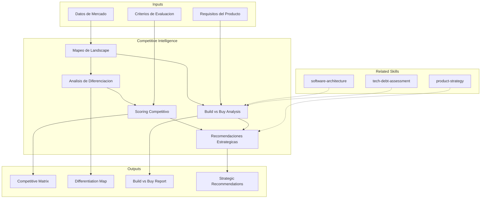

# Inteligencia Competitiva Tecnologica

Analisis de landscape competitivo tecnico, evaluacion de diferenciacion tecnologica,
analisis build-vs-buy y posicionamiento de mercado.

## Grounding Guideline

> *Competing without intelligence is reacting. Competing with intelligence is anticipating.*

1. **Public data, private analysis.** The advantage is not in the information — it is in the interpretation and decision speed.
2. **Benchmarking is not imitation.** Understanding the competitor serves to differentiate, not to copy.
3. **Continuous surveillance, not a point-in-time snapshot.** The competitive landscape changes — a static evaluation expires in months.

## TL;DR

- Maps technical competitive landscape with players, solutions, and positioning
- Evaluates real vs perceived technological differentiation of each option
- Executes structured build-vs-buy analysis with 3-5 year TCO
- Identifies positioning opportunities and competitive advantage
- Generates competitive matrix and actionable strategic recommendations

## Inputs

Parse `$1` como **nombre del proyecto/producto**, `$2` como **mercado o categoria a analizar**.

**Parameters:**
- `{MODO}`: `piloto-auto` (default) | `desatendido` | `supervisado` | `paso-a-paso`
- `{FORMATO}`: `markdown` (default) | `html` | `dual`
- `{VARIANTE}`: `ejecutiva` (~40%) | `tecnica` (full, default)

## Deliverables

1. **Competitive Matrix** — Multi-dimensional comparison of competitors/options
2. **Differentiation Map** — Real technological differentiation map by dimension
3. **Build vs Buy Analysis** — Structured analysis with TCO, time-to-market, risk
4. **Strategic Recommendations** — Actionable recommendations with justification
5. **Market Landscape Report** — Panoramic market vision with trends

## Process

1. **Landscape Mapping** — Identify relevant players by category:
   | Category | Players | Positioning |
   |---|---|---|
   | Leaders | Incumbents with market share | Premium, enterprise |
   | Challengers | Disruptors with traction | Value, innovation |
   | Niche | Segment specialists | Deep expertise |
   | Open Source | Open alternatives | Flexibility, cost |
2. **Differentiation Analysis** — For each option evaluate:
   - Technical capabilities (features, performance, scalability)
   - Maturity (production readiness, ecosystem, community)
   - Business model (pricing, lock-in, portability)
   - Roadmap and vision (R&D investment, trends)
3. **Build vs Buy Framework** — Evaluate with structured criteria:
   | Factor | Build | Buy | Weight |
   |---|---|---|---|
   | Time to market | Slow (6-18 months) | Fast (1-3 months) | High |
   | TCO 3 years | Dev + maintenance | License + integration | High |
   | Differentiation | Maximum if core | Limited | Medium |
   | Technical risk | High (execution) | Medium (vendor) | High |
   | Flexibility | Total | Limited by vendor | Medium |
4. **Competitive Scoring** — Score each option on key dimensions with weights
5. **Trend Analysis** — Identify where the market is moving
6. **Strategic Recommendations** — Justified decision with action plan

## Quality Criteria

- [ ] Complete landscape with at least 5 options evaluated
- [ ] Differentiation evaluated with technical evidence, not marketing
- [ ] Build vs buy with estimated TCO at 3+ years
- [ ] Scoring with explicit and justified criteria and weights
- [ ] Market trends identified with sources
- [ ] Clear recommendation with multi-dimensional justification
- [ ] Mermaid diagram of positioning map

## Assumptions and Limits

- Competitive information is based on public data, documentation, and team knowledge
- Does not include reverse engineering or access to competitor confidential information
- TCO in build-vs-buy analysis are directional estimates, not formal quotes
- Market trends reflect the moment of analysis; require periodic updates

## Edge Cases

| Scenario | Handling Strategy |
|---|---|
| Emerging market without clear direct competitors | Analyze indirect competitors and substitutes; map jobs-to-be-done that the user solves today without a dedicated solution |
| Dominant competitor with +80% market share | Evaluate niche and differentiation strategies; disruption potential analysis through unattended flanks |
| Build vs buy with viable open source component | Add third option "adopt + customize" to the framework; evaluate TCO including community and contribution cost |
| Insufficient public information about competitors | Document gaps as [SUPUESTO]; triangulate with job postings, GitHub activity, and competitor conferences |

## Decisions and Trade-offs

| Decision | Enables | Constrains | Justification |
|---|---|---|---|
| Multi-dimensional matrix with explicit weights | Objective and reproducible comparison | Selection of criteria and weights introduces bias | Weight transparency allows stakeholders to adjust according to their context |
| 3-year TCO as default horizon | Captures maintenance and evolution costs | Long-term projections have high uncertainty | 3 years is the typical amortization horizon for technology decisions |
| Separation of technical capability vs market maturity | Avoids confusing feature completeness with viability | Requires two independent evaluations | A product with superior features can be risky if the vendor is unstable |

## Knowledge Graph

## Output Templates

**Formato 1 — Markdown (default)**
- Filename: `Competitive_Intelligence_{project}_{WIP|Aprobado}.md`
- Estructura: Landscape > Diferenciacion > Competitive Matrix > Build vs Buy > Tendencias > Recomendaciones
- Incluye diagramas Mermaid de positioning map y decision tree

**Formato 3 — HTML (bajo demanda)**
- Filename: `Competitive_Intelligence_{project}_{WIP|Aprobado}.html`
- Estructura: HTML self-contained branded (Design System MetodologIA v5). Dark-First Executive. Incluye competitive matrix visual interactiva, positioning map y build-vs-buy decision tree. WCAG AA, responsive, print-ready.

**Formato 2 — PPTX (presentacion ejecutiva)**
- Filename: `Competitive_Analysis_{project}_{WIP|Aprobado}.pptx`
- Estructura: Slide 1 (Landscape overview) > Slide 2-3 (Competitive matrix visual) > Slide 4 (Build vs Buy summary) > Slide 5 (Recomendacion y next steps)
- Optimizado para decision meetings con C-level y product leadership

**Formato 4 — DOCX (bajo demanda)**
- Filename: `{fase}_Competitive_Intelligence_{project}_{WIP}.docx`
- Via python-docx con Design System MetodologIA v5. Cover page, TOC auto, headers/footers branded, tablas zebra. Poppins headings (navy), Trebuchet MS body, gold accents.

**Formato 5 — XLSX (bajo demanda)**
- Filename: `{fase}_Competitive_Intelligence_{cliente}_{WIP}.xlsx`
- Via openpyxl con MetodologIA Design System v5. Headers con fondo navy y tipografía Poppins en blanco, conditional formatting por fit score y posición competitiva, auto-filters en todas las columnas, valores directos sin fórmulas.

## Evaluacion

| Dimension | Peso | Criterio |
|-----------|------|----------|
| Trigger Accuracy | 10% | Activa triggers correctos ante keywords de competencia, build-vs-buy, posicionamiento |
| Completeness | 25% | Cubre landscape, diferenciacion, scoring, build-vs-buy y tendencias |
| Clarity | 20% | Criterios de scoring son explicitos y reproducibles; recomendacion es inequivoca |
| Robustness | 20% | Maneja mercados emergentes, monopolios, opciones open source, informacion limitada |
| Efficiency | 10% | Proceso no duplica analisis entre diferenciacion y scoring |
| Value Density | 15% | Recomendacion estrategica es accionable con plan de implementacion |

**Umbral minimo**: 7/10 en cada dimension para considerar el skill production-ready.

## Cross-References

- **metodologia-product-strategy:** Inteligencia competitiva alimenta decisiones de roadmap y posicionamiento
- **metodologia-software-architecture:** Feasibility tecnica como restriccion en analisis build-vs-buy
- **metodologia-tech-debt-assessment:** Build propio genera deuda tecnica que debe considerarse en TCO

---
**Autor:** Javier Montaño · Comunidad MetodologIA | **Version:** 1.0.0
